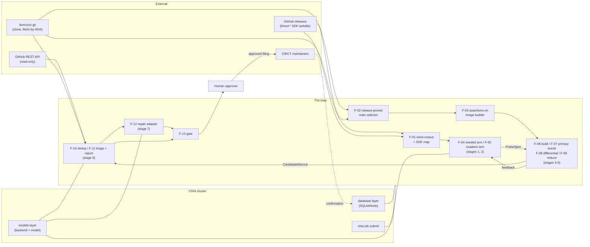

# 01 Functional Requirements Document: the closed CIRCT bug loop

**Status: Draft.** Date: 2026-09-13. Deadline for the campaign this specifies: 2026-09-24 AoE.

Revised 2026-09-13 in answer to `design/reviews/red-team-FRD.md`. All 47 of its findings are
dispositioned in `design/reviews/red-team-FRD-disposition.md`, which names every requirement this
revision added, rewrote or withdrew.

---

## 1. Purpose, scope, audience, sources

### 1.1 Purpose

Specify, testably, a CHIA loop that manufactures its own supply of CIRCT bug reports from past CIRCT
fix commits, and withholds all but the ones that survive a four-part gate and a human approval.

### 1.2 Scope

In scope: stages 1 to 7 and the human gate as named in `paper/main.tex` §2; both experimental arms;
the two preconditions (an assertions-on image, a buildable commit); the evaluation protocol; the
artefact store; the upstream packaging.

Out of scope, and stated here so no downstream document reintroduces them: a repair benchmark or
leaderboard; a second compiler target; `circt-lec` as an oracle (evaluated and dropped, HANDOFF
"Decisions taken" 5 and the `analysis/lec/` probes); repair of wrong-output bugs (FINAL §2 makes the
differential report-only); filing at volume (FINAL "Non-goals").

### 1.3 Audience

The two implementers of `05-Work-Plan.md`; the reviewer who approves this document; the A³ programme
committee reading `paper/main.tex`; a CHIA maintainer reading the upstream pull request.

### 1.4 Source documents

| Ref | Document | Identity used here |
|---|---|---|
| FINAL | `problem-statement-FINAL.md` | The thesis. Appendix A is the claim-to-source table, Appendix B the not-built list. |
| PAPER | `paper/main.tex` | v3, 2026-09-13. Fixes stage names and numbers. |
| PIN | `analysis/pin-window-analysis.md` | Dated 2026-09-11. All corpus and build measurements. |
| RT3 | `archive/reviews/red-team-v3.md` | Hostile review, 2026-09-11. Its kills are answered, not reopened. |
| RT4 | `design/reviews/red-team-FRD.md` | Hostile review of this document, 2026-09-13, 13 kills, 23 wounds, 11 nits. Disposed of finding by finding in `design/reviews/red-team-FRD-disposition.md`. It is cited below only where a number is its own measurement, and such a number is labelled as RT4's. |
| HANDOFF | `HANDOFF.md` | State as of 2026-09-12, plus decisions not to relitigate. |
| CHIA | `~/.cache/chia-src` | `ucb-bar/chia` at commit `16c35e92aaaf9511c6453bf94cd5cf589698f4e3`, 2026-09-04. |
| CIRCT | `~/.cache/chia-pin-smoke/circt` | Blobless `llvm/circt` clone at `b792c772819df723628d1fe6073269b85a8ade5d`, 2026-09-11. |
| SDK | `~/.cache/chia-pin-smoke/circt-sdk` | Extracted `firtool-1.157.0` `circt-full-shared-linux-x64.tar.gz`. |

**Citation form.** `chia:<path>:<lines>` means a path under CHIA, `circt:<path>:<lines>` a path under
CIRCT. Tool behaviour cited as `SDK --help` was executed against SDK binaries on 2026-09-13 with
`LD_LIBRARY_PATH=~/.cache/chia-pin-smoke/circt-sdk/lib:~/.cache/chia-pin-smoke/shim`.

**Number discipline.** Every number in this document comes from FINAL Appendix A or PIN, or
carries one of two markers.

- `[DEFAULT]` marks a value chosen by design rather than measured. Every `[DEFAULT]` has exactly one
  home, and the requirement that carries it names which: a parameter of the **campaign** lives in
  `budget.yaml` and is fixed by the pre-registration commit (F-14) before any data exists, and
  FR-14.1 is the complete list of those; an implementation **constant** lives in `03-LLD.md`; a
  **fixture** size, which parameterises a test rather than a run, lives in `04-Test-Plan.md`. A
  `[DEFAULT]` is never presented as a measurement and never appears in the paper as one.
- `[UNVERIFIED]` marks a number this document cannot source, and carries the measurement that would
  settle it.

A number carrying neither marker and neither source is a defect in this document.

**PIN §2 is normative for the corpus filter.** PIN is otherwise cited for numbers only. FR-01.1
quotes PIN §2 lines 74-79 verbatim; that quoted rule is the requirement, PIN §2 is its source of
record, and a change to PIN §2 is a change to FR-01.1.

### 1.5 Errata from the HLD review

Dated **2026-09-13**. `design/reviews/red-team-HLD.md` reviewed `02-HLD.md` and found twenty-one
items in **this** document that no faithful structure could satisfy: seventeen requirements, two
glossary terms, the list of data objects in §2.5, and one of the requirements §10.1 places on the
HLD. They are corrected at
their own IDs, with the withdrawn text struck through in place, which is this document's own erratum
convention (see FR-13.2, FR-19.1, NFR-07 for the precedent set by the FRD review). IDs are permanent
and none is renumbered; new requirements take the next free number in their feature.
`design/reviews/red-team-HLD-disposition.md` maps every finding to what it changed.

| ID | Change | Finding |
|---|---|---|
| G-47 | Contract package widened to seven schemas plus the `generate` interface | K1, K7 |
| G-48 | Primary budget unit is the arm's fixed window `W`, arms sequential | W1 |
| §2.5 | `ProbeResult` added; `CandidateRecord` is apparatus-internal | K1 |
| FR-03.16 | **New.** `ImageSpec` records the SHA-256 of every tool binary | K2 |
| FR-06.1 | Binary check is the recorded hash, not `--version`; that criterion withdrawn | K2 |
| FR-06.2 | Address-space limit (`RLIMIT_AS`) replaces the resident-memory limit; `prlimit` route withdrawn | K6, W25 |
| FR-06.7 | `oom` recognised by evidence, and never classified `crash` | K6 |
| FR-07.2 | `oom` evidence takes precedence over the three firing classes | K6 |
| FR-10.9 | Issue cap replaces the page cap; `fetch_comments=False` required; comments not mirrored | W21, W22, W28 |
| FR-12.11 | **New.** Repair runs on its own worker type and restores the tree after every attempt | K2 |
| FR-13.2 | A different worker where the scheduler can grant it, soft pin, recorded either way; hard-pin wording withdrawn | K5 |
| FR-14.1 | Arm window, arm order and mirror issue cap added to `budget.yaml`; page cap withdrawn | W1, W22 |
| FR-14.4 | `arm` takes three values; per-arm sums exclude `shared`; entries declare their scope | K4 |
| FR-14.5 | The manifest names the unit as a field of its own, plus the window and the arm order | W12 |
| FR-16.1 | The bundle is built from `ProbeResult`s, one per probing input | K1 |
| FR-17.9 | **New.** One identical artefact path on the head and every producing worker | K3 |
| FR-18.1 | `arm` may be carried as data; only branching on it is confined; name-search criterion withdrawn | W27 |
| FR-18.10 | Each arm stops at its own window or cap; simultaneous-stop rule withdrawn; both windows reported | W1 |
| FR-19.5 | Core additions tested under `chia/chipyard/test/`, distinct from the example's tests | W31 |
| FR-20.5 | The licence confirmation is a recorded `FilingRecord` field | W13 |
| §10.1 item 2 | Seam membership restated at seven schemas plus the interface | K7 |

### 1.6 Errata from the 2026-09-13 measurements

Dated **2026-09-13**, and separate from §1.5 because the driver is different: these four come from
`analysis/measurements/2026-09-13-frd-followups.md`, which measured things this document had asserted
or left open, and from the architect's ruling on the one `[ARCHITECT-CHECK]` item
(`design/reviews/red-team-HLD-disposition.md` §5 item 4) that a measurement settled against the
choice `02-HLD.md` had made. The same convention applies: corrected at their own IDs, withdrawn text
struck through in place, no ID renumbered, new requirements taking the next free number in their
feature.

| ID | Change | Driver |
|---|---|---|
| FR-03.17 | **New.** The image's configure sets `MLIR_SOURCE_DIR`, and the image is accepted only when `lit` **discovers** the whole `test/` tree with zero discovery errors | E1, measurement M3 |
| FR-12.8 | The lit gate's baseline is green only where discovery succeeds; a lit exit of 2 with zero tests is not a red gate but an unusable one, and FR-03.17 is what excludes it | E1, measurement M3 |
| FR-03.14 | The fallback exclusion names **36** seeds, not 46, and removes `circt-translate --import-verilog` as well as `circt-verilog` | E2, measurement M1 |
| FR-09.9 | Its rationale's "all 46 `.sv`-region seeds" corrected to 36 | E2, measurement M1 |
| C-16 | The gap is 36 seeds, and it covers both slang entry points, both gated by `CIRCT_SLANG_FRONTEND_ENABLED` | E2, measurement M1 |
| D-13 | Its 46, and its `circt-verilog`-only framing, corrected | E2, measurement M1 |
| FR-06.2 | The three per-probe limits are applied by `prlimit(1)` wrapping the probe's own argv; the `resource.setrlimit`-in-a-`preexec_fn` route is withdrawn | E3, architect's ruling |
| C-02 | The SDK needs `libz3.so.4` at **build** time as well as at run time, because the SDK's `mlir-tblgen` generates CIRCT's `.inc` files | E4, measurement M2 |

**One finding is upstream-worthy and is recorded here rather than acted on.** CHIA's own
`circt_issue_solver` inherits E1's defect at any CIRCT commit after 2026-07-16. Its regression gate
is `circt_run_lit(circt_lit_gate_paths(), filter_out="circt-tblgen")`
(`chia:examples/circt_issue_solver/issue_task.py:220-227`;
`chia:examples/circt_issue_solver/circt_util.py:158-174`;
`chia:chia/chipyard/circt.py:698-762`), and `circt_lit_gate_paths()` yields `test/Tools`, under which
`test/Tools/circt-tblgen/lit.local.cfg` raises at **discovery** time in an SDK-based build, before
`--filter-out` is applied. The gate works today only because
`chia:dockerfiles/ChiaCirctBaseDockerfile:69` pins `CIRCT_VER=firtool-1.148.0`, whose tree is commit
`5dc7f103d714` of 2026-05-24, which predates the offending commit `4de8f9882ca1` of 2026-07-16
(verified inside the published image, M5). Any bump of that pin past 2026-07-16 makes every
`circt_issue_solver` repair record `lit_ok=false`. FR-19.2's pull request is the natural place to
offer the one-line configure fix, and `05-Work-Plan.md` owns whether it is offered.

### 1.7 Errata from the LLD review

Dated **2026-09-14**. `design/reviews/red-team-LLD.md` reviewed `03-LLD.md` and found eight items in
**this** document that no faithful low-level design could satisfy: six acceptance criteria, two
requirement texts and one reuse row, across eight IDs. They are corrected at their own IDs, with the
withdrawn text struck through in place,
which is this document's own erratum convention. IDs are permanent and none is renumbered.
`design/reviews/red-team-LLD-disposition.md` maps every finding to what it changed.

| ID | Change | Finding |
|---|---|---|
| FR-01.1 | The `SeedRecord` also carries the seed commit's **diff** of its `lib/`/`include/` paths and the **full text** of each changed test file at that commit | K6 |
| FR-04.2 | The wrong-tool rejection is the emitter's named error, not the contract validator's | K10 |
| FR-04.3 | "The input file contents" is satisfied by the inline copy **or** the always-populated path | W9 |
| FR-04.4 | The read-only source tool is a purpose-built `SourceReadTool`, not `BashTool`; reuse row corrected | W10 |
| FR-05.1 | The arm's input record is the `SeedRecord`'s `test_files` and `run_lines` | K6 |
| FR-07.4 | The file-and-line criterion is satisfiable only for frames inside CIRCT's own objects | K2 |
| FR-10.1 | The crash and fatal-error fingerprint is taken after the crash-handler prologue is stripped, and is the signal plus the first CIRCT frame | K3 |
| FR-16.2 | The criterion is a check on the mutation arm's **body**, not on its signature | K11 |

**FR-01.1**, at the end of its field list, now reads: "and shall emit one `SeedRecord` per mined
commit carrying: commit SHA, first-parent SHA, commit subject, committed date, the changed paths under
`lib/` or `include/`, the changed paths under `test/` or `integration_test/`, **the commit's diff of
those `lib/` and `include/` paths**, **the full text of each changed test file at the commit**, the
parent's `llvm` pin, and the matching `firtool-*` tag or null." The two added fields are what let both
generator arms run without a repository: they run on worker containers whose only CIRCT tree is a
one-commit checkout of the run's commit, so the seeded arm's diff and the mutation arm's starting
inputs had no source at all. It is a MAJOR contract bump, to 2.0.

**FR-04.2**'s criterion now reads: "for every `ProbeSpec`, `tool` equals the seed's classified tool; a
spec naming a different tool is ~~rejected by the contract validator with a named error~~ **rejected
by the emitter's validation with a named error**." The validator is handed one object and has no
access to the `SeedRecord` the comparison needs, under any annotation; the emitter holds both.
`03-LLD.md` §3.5 names the error `E010_TOOL_MISMATCH` and keeps it in the same closed code vocabulary.

**FR-04.3**'s criterion now reads: "the contract validator accepts only specs with every field
populated, **the input file contents counted as populated when either the inline copy or the input
path is present**." `02-HLD.md` §2.12's cap rule makes the inline copy conditional on size, the path
field is always populated, and nothing is lost; without this erratum the requirement and the accepted
cap rule contradicted each other and, under `00-README.md`, this document won and the design was
wrong.

**FR-04.4**'s reuse row is corrected: ~~"`BashTool` for read-only source access"~~ **"a purpose-built
read-only source tool over `git show`, `git grep` and `git ls-tree`"**. `BashTool` has no read-only
mode, and on a worker whose `PATH` puts the CIRCT build first it can run the compiler, run `ninja` and
write anywhere in the tree, so this requirement's own text, "shall not be given, and **shall not be
able to reach**, any tool that computes a measured result", was violated in fact while its tool-list
criterion passed. The criterion is unchanged and now bites.

**FR-05.1**'s criterion now reads: "the arm's input record contains only the test files **, carried as
their full text in the `SeedRecord`,** and their `RUN:` lines". Paths are not contents, and the arm
must mutate bytes.

**FR-07.4**'s criterion now reads: "frames are non-empty and name a CIRCT source file and line for a
crash inside CIRCT, **which is satisfiable only for frames lying in CIRCT's own source-built objects:
the SDK's prebuilt shared libraries carry no debug information and resolve to a function name and no
file and no line, whatever the symboliser is asked**." Measured: the corrected symboliser recipe
against `libMLIRAsmParser.so` returns `FunctionName` populated and `FileName:"" Line:0`. The
requirement is unchanged; what changes is that a reader no longer expects a file and a line from an
SDK frame and no implementer treats their absence as a defect.

**FR-10.1**'s criterion gains a sentence: "**the crash and fatal-error fingerprint is computed after
the crash-handler prologue is removed, and is the signal name together with the first remaining frame
that lies in a CIRCT object, recorded with its function name and its file and without its line
number; where no such frame exists the top-N tuple is used, and every candidate records whether the
gate's re-run reproduced the same fingerprint.**" Without the strip, three of five frame slots are
`llvm::sys::PrintStackTrace`, `llvm::sys::RunSignalHandlers` and `SignalHandler` for every crash in
the campaign, and for a `fatal_error` all five are, so every fatal error would fingerprint identically
and G-44's "distinct" would collapse. Measured over ten runs of one input: nine distinct top-5 tuples,
three distinct fingerprint frames. The stability flag is what keeps the remaining instability visible
rather than silently merged.

**FR-16.2**'s criterion now reads: "~~the mutation arm's call signature has no feedback parameter,
asserted by a test~~ **the mutation arm's implementation does not read the feedback argument, asserted
by a test on its body**." One signature serves both arms because FR-05.4 requires the contract
validator to accept both arms' output through **the same code path**, and two signatures for one
`Generator` protocol is a second code path at the one place this design exists to keep single. The
behaviour FR-16.2 protects, an unadaptive mutation arm, is protected as well by a body check and
against a wider class of defect, since a second signature would not stop a body reaching the bundle by
another route. The requirement text, "Feedback shall be returned to the seeded arm only. The mutation
arm shall receive none", is unchanged and is what the test asserts.

### 1.8 Errata from the backend decision, 2026-09-14

Dated **2026-09-14**, and separate from §1.5, §1.6 and §1.7 because the driver is different again:
these five come from the **superseding section** of `ADR/ADR-D-03-model-backend.md`, which the
architect wrote on the user's delegation after the user supplied a Google Cloud API key that Vertex
AI express mode accepts. The same convention applies: corrected at their own IDs, withdrawn text
struck through in place, no ID renumbered. `02-HLD.md` §0.2 and `03-LLD.md` §0 carry the same fold-in
on their side, and `04-Test-Plan.md` §16.5 lists every test it added.

| ID | Change | Driver |
|---|---|---|
| D-03 | The status line points at the ADR's **superseding section**, not at its original decision | the key, and the user's instruction to use `gemini-3.8-flash` |
| FR-14.1 | Four keys added to `budget.yaml`: `model_id`, `campaign_spend_cap_usd`, `price_usd_per_m_input_tokens` and `price_usd_per_m_output_tokens` | the USD 300 credit and the user's spend-cap rule |
| FR-14.6 | Tokens and money are **observable on the campaign backend**; the criterion's claim that only `antigravity` and `opencode` report usage is corrected, and the `opencode` default it named is withdrawn | `chia:chia/models/vertex.py:479-482` |
| FR-18.10 | A **third** stop condition: both arms stop when the campaign's cumulative USD spend reaches `campaign_spend_cap_usd`, and the results state the spend | the same spend-cap rule |
| NFR-08 | The acceptance criterion names the **USD cap** beside the primary unit and the two safety caps | the same |

**D-03**'s resolution line now reads: "**Resolved: see `ADR/ADR-D-03-model-backend.md`, and in
particular its `Superseding decision, 2026-09-14` section, which is the decision in force.**" The
original decision, the `claude` backend for development and a deferred campaign choice, is
superseded in full. In force: **one backend for development, tests and the campaign, CHIA's
`vertex` backend in Vertex AI express mode**, and **one model id for every agent stage,
`gemini-3.8-flash`** (the user's instruction, 2026-09-14). The `claude` backend remains a named
fallback for a Vertex outage. `gemini-3.1-pro-preview` is not used. The option table above is left
standing as the reasoning that produced (d), which the superseding decision keeps: one backend and
one model per run, set by the cluster YAML, and per-stage configurability still dropped. One
consequence the option table did not foresee is recorded at FR-14.8 rather than hidden: CHIA's repair
chain implements three backends and `vertex` is not among them
(`chia:examples/circt_issue_solver/issue_task.py:81-123`), ~~and FR-12.1 forbids changing that file, so
stage 7 runs on a backend the manifest names separately and is declared unmetered when it differs~~
**is overtaken the same day by §1.9**: FR-12.1's byte comparison is withdrawn, one additive branch
puts stage 7 on `vertex` with the rest, and `stages_metered["stage_7"]` is true. What survives from
this sentence is that the chain implements three backends at `16c35e92` and that the fourth is the
loop's own nineteen-line addition, offered upstream.

**FR-14.1** gains four keys, listed at the requirement. They are campaign parameters and not
implementation constants for the reason FR-14.1 itself gives: `model_id` fixes the model before the
data exists, the spend cap bounds damage exactly as the per-day input cap does, and a **price** that
could be edited afterwards would put a free parameter inside a reported number. The two prices are
`[UNVERIFIED]` against Google's own pricing page and must be re-read before the pre-registration
commit.

**FR-14.6**'s criterion is corrected rather than its requirement text, which was already right.
CHIA's `vertex` backend accumulates `usage_metadata.prompt_token_count` and `candidates_token_count`
per turn (`chia:chia/models/vertex.py:479-482`), so the campaign backend reports usage and the
ledger is populated; what it does **not** report is a price, so the money is the ledger's own
arithmetic over `budget.yaml`'s two prices. The old sentence naming `antigravity` and `opencode` as
the only reporting backends described CHIA's **example driver**, which reads `cli.usage`
(`issue_task.py:134`), and not CHIA's backends; the correction is that this loop reads the counts off
the LLM object in the same process instead.

**FR-18.10** gains a third stop condition and loses none. **NFR-08**'s criterion names the USD cap.
Both are written out at their own IDs.

---

### 1.9 Errata from the image build and the repair-backend decision, 2026-09-14

Dated **2026-09-14**, later the same day than §1.8, and separate from it because the drivers are two
and both are new.

The first driver is `analysis/measurements/2026-09-14-image-build.md`, the **W-04** build of the
assertions-on image. It executed F-03 end to end and returned measured numbers where this document
carried predictions or reference figures from a different commit and a different target set.

The second driver is the architect's ruling that **stage 7 runs on the same backend as every other
stage**, which overrules the fold-in's `--repair-backend claude` default. The mechanism is one
**additive** `elif backend == "vertex":` branch in `chia:examples/circt_issue_solver/issue_task.py`'s
`_turn`, nineteen lines, every other line of that file untouched, carried in `upstream/` as
`issue_task-vertex-branch.patch` and proposed to CHIA as part of the pull request of F-19. The
addendum to `design/ADR/ADR-D-03-model-backend.md` records the decision and its reasons.

The convention is §1.5's: corrected at their own IDs, withdrawn text struck through in place, no ID
renumbered. `02-HLD.md` §0.3 and `03-LLD.md` §3.8 carry the same errata on their side, and
`04-Test-Plan.md` §16.6 lists every test they changed.

| ID | Change | Driver |
|---|---|---|
| FR-03.5 | The assertion baseline is **re-measured on the image and re-based**: 555 `obj.CIRCT` objects, **536 referencing** `__assert_fail` and **19 not**, those 19 named in the report. The `5056ff04` 18-object list is superseded rather than drifted from, being a different commit **and** a different target set | W-04 §4 |
| FR-03.7 | A dated note: the commit and tag this campaign's image is pinned at are **`eade0de61bc5`** and **`firtool-1.159.0`**, chosen by F-02's own selector with ADR-D-10's rule applied | W-04 §1 |
| D-03 | The status line points at the ADR's **addendum** as well as at its superseding section, both being in force; `gemini-3.8-flash` now covers **every** agent stage, stage 7 included | the repair-backend decision |
| FR-12.1 | ~~byte-identical~~ becomes **unchanged except for one additive backend branch**, and the acceptance becomes a `git diff` hunk equality against CHIA `16c35e92` | the repair-backend decision |
| FR-14.6 | Stage 7's per-turn token counts are **not** observable even now that stage 7 runs on the campaign backend, and the ledger records that rather than reporting zero | the same |
| FR-14.8 | `stages_metered["stage_7"]` is **true** by default, the two backends no longer differing. The rule is unchanged; its outcome flips | the same |
| A-03 | **Measured at image level** for size and time. Only the flag's own delta and a per-probe slowdown are still open, and both fall out of W-04b | W-04 §2 |
| A-11 | **Settled** by reading both sides: `/opt/circt-sdk/lib/cmake/llvm/LLVMConfig.cmake:173` is the override | W-04 §4 |
| A-16 | **Exercised**: `circt-bmc` runs against the image's `libz3.so.4` and returns rc 0 | W-04 §4 |
| A-20 | **Half closed**: zero failures over CHIA's whole gate scope under `-UNDEBUG`, with the 62 slang tests running for the first time. The set equality still needs the second image, W-04b | W-04 §5, §7 |

**The measured facts, once, here, and cited from the IDs above.** All are from inside the built image
at `eade0de61bc5` unless stated.

- **The flag reaches every compile command.** `len(json.load(compile_commands.json))` is **778**,
  `grep -c -- -UNDEBUG` over it is **778**, and `grep -c -- -DNDEBUG` is **0**.
- **Assertions are in the binaries.** `nm -u | grep -c __assert_fail` is 1 for all six targets;
  555 `obj.CIRCT` objects, 536 referencing, **19** not, and the 19 are named in the report. They are
  interface, registration and pipeline translation units plus `Support/{APInt,Debug,Passes,
  ProceduralRegionTrait,Version}` and `Tools/arcilator/pipelines`, the same shape as the recorded 18.
- **lit, the five-directory slice FR-03.6 names:** 523 discovered, **519 passed**, 4 XFAIL,
  **0** Failed, UNRESOLVED, TIMEOUT or XPASS, exit 0.
- **lit, CHIA's own gate scope verbatim:** 1380 discovered, **253 excluded** by
  `--filter-out=circt-tblgen`, 1127 considered, **1119 passed**, 1 Unsupported, 7 XFAIL, **0** failed,
  exit 0, and zero `unable to parse config file` lines. **61 `REQUIRES: slang` tests moved from
  Unsupported to Passed** and one to XFAIL, so the whole SystemVerilog front-end surface is exercised
  for the first time and is green. On the host at `5056ff04` the same rule discovered nothing at all
  and exited 2, which is what FR-03.17 was added to fix.
- **The image.** `docker image inspect --format '{{.Size}}'` is **1,912,742,097 B**, **23** layers
  against the base's 17, the six tool binaries **703,211,208 B (670.6 MiB)**, the build tree 1.7 GB,
  and the build **972 s** wall at `-j8` over 1371 ninja edges from a cold cache.

**FR-12.1's correction, stated plainly.** The requirement's *intent* was that CHIA's phase chain runs
as CHIA wrote it, with no change to its behaviour for any backend CHIA already implements, and that
intent survives intact. What is withdrawn is the *mechanism* by which it was checked. A byte
comparison forbids the one addition that lets stage 7 run on the campaign's own backend, and the cost
of that prohibition was a second backend, a second credential, a second model id, a stage the ledger
could not price and a dependence on the user's Claude subscription. The addition is nineteen lines
that no existing caller can reach, because `_turn` selects on a string and no CHIA caller passes
`"vertex"`; the new acceptance is a `git diff` against `16c35e92` showing **exactly** that hunk and
nothing else, which is a stricter statement than "sha256 differs" and a weaker one than "sha256
matches", and is the true one. FR-12.9 is **not** touched: all six prompts stay byte-identical.

**FR-14.6 and FR-14.8, and the one thing that does not follow.** Stage 7 now runs on `vertex`, so its
spend is charged to the campaign's own key and `stages_metered["stage_7"]` is true. Its **token
counts are still not observable**, and the reason is structural rather than a matter of backend
choice: `_turn` dispatches the turn with
`get(llm.prompt.options(resources={"llm": 1.0}).chia_remote(llm, prompt, tools))`
(`chia:examples/circt_issue_solver/issue_task.py:124`), `chia_remote` serialises the LLM object, and
`VertexGeminiLLM` accumulates its counts into `self._last_metadata` on that object rather than onto
the returned `QueryResult` (`chia:chia/models/vertex.py:479-482`, `579`, `586-591`;
`chia:chia/base/llm_call.py:15-35`). The copy that learns the counts is the worker's and dies with
the task, exactly as §1.8 recorded for the loop's own stages, and the loop's fix for its own stages,
`llm_turn` (`03-LLD.md` §3.5.1), is a **call-site** change that line 124 would have to take. Line 124
is not in the additive branch, and changing it would make the hunk-equality acceptance above false.
CHIA's own driver reads `getattr(cli, "usage", None)` (`issue_task.py:134`) and writes `llm_usage`
only where it is truthy (`circt_issue_loop.py:132-136`), so the field is simply absent for `vertex`;
and the backend's `stream_result` records no token line either, so it cannot be recovered by parsing.
**The honest consequence, recorded rather than papered over:** every stage-7 `LedgerEntry` carries
`observed.tokens_in`, `observed.tokens_out` and `observed.cost_usd` **null** with `metered` true, the
reason `unavailable_remote_dispatch` is carried on `RepairResult.token_capture` rather than inside
`observed`, whose four declared keys are frozen by the contract's own MAJOR-bump rule, and the results
artefact prints
the campaign's USD figure as a **lower bound that excludes stage 7**. `campaign_spend_cap_usd`
therefore bounds the observed stages only; the operator's own project-level budget alert is what
bounds the rest, and `--no-repair` remains the way to run a campaign whose reported spend is complete.

---

## 2. Glossary

Every term below is used verbatim, in this sense, throughout the set. Terms whose definition is
CHIA's carry the CHIA path that defines them.

### 2.1 Compiler and tools

- **G-01 CIRCT.** The open-source hardware compiler at `llvm/circt`. Licensed Apache-2.0 with LLVM
  exceptions (`circt:LICENSE:1-5`).
- **G-02 MLIR.** The LLVM sub-project whose dialect framework CIRCT is built on. In this system MLIR
  and LLVM arrive **prebuilt** inside the release SDK (G-14) and are never compiled.
- **G-03 FIRRTL.** The intermediate hardware language Chisel emits and CIRCT consumes; also the name
  of CIRCT's dialect for it. A file in it has extension `.fir`.
- **G-04 firtool.** CIRCT's end-to-end driver from FIRRTL to Verilog. Output mode is selected by one
  of nine options: `--parse-only`, `--ir-fir`, `--ir-hw`, `--ir-sv`, `--ir-verilog`, `--verilog`,
  `--btor2`, `--split-verilog`, `--disable-output` (`SDK firtool --help`, executed 2026-09-13;
  `circt:tools/firtool/firtool.cpp:185-202`, where the option itself begins). Two of them emit MLIR
  text from a `.fir` input and are therefore the lift FR-09.9 uses: `--ir-fir` is documented
  "Emit FIR dialect after pipeline" and `--parse-only` "Emit FIR dialect after parsing, verification,
  and annotation lowering".
- **G-05 circt-opt.** CIRCT's pass driver over an MLIR file. Relevant options: `--pass-pipeline=`,
  `--split-input-file`, `--verify-diagnostics`, `--allow-unregistered-dialect`
  (`SDK circt-opt --help`).
- **G-06 circt-verilog.** CIRCT's SystemVerilog front end. Output mode is one of `--lint-only`,
  `--parse-only`, `--import-only`, `--ir-moore`, `--ir-llhd`, `--ir-hw`; include and macro paths are
  `-I`, `-y`, `-D` (`SDK circt-verilog --help`).
- **G-07 arcilator.** CIRCT's simulator. Its own first source line calls it "An experimental circuit
  simulator" (`circt:tools/arcilator/arcilator.cpp:1`). Run mode is `--run` with `--jit-entry=`;
  `--args=` passes arguments to the entry function (`SDK arcilator --help`).
- **G-08 circt-reduce.** CIRCT's test-case reducer. It requires `--test=<command>` and refuses to
  start without one; `--test-arg=` adds arguments; `--test-must-fail` inverts the interestingness
  sense to "non-zero exit is interesting"; `-o` names the output; `--keep-best` overwrites the output
  as it improves (`SDK circt-reduce --help`, executed; FINAL Appendix A). It parses MLIR generic or
  textual syntax and nothing else: given a `.fir` or a `.sv` file it stops at
  `error: expected '{' to begin a region` before reduction starts (executed, C-17). It also imposes
  no time or memory limit on the interestingness script it runs (C-18).
- **G-09 lit.** LLVM's test runner. Each test file carries its own `RUN:` command line. The SDK does
  **not** ship `lit` or `llvm-lit` (PIN §5.2); CHIA installs it with pip at warm-up
  (`chia:chia/chipyard/circt.py:680-686`).
- **G-10 Assertion.** A C++ `assert()` in CIRCT's own source. It aborts the process when its
  condition is false, and it is compiled away when `NDEBUG` is defined.
- **G-11 NDEBUG.** The C macro that deletes assertions. Under CHIA's cmake flags all 620 of 620 CIRCT
  object compile commands define it and the built `circt-opt` holds zero references to the assertion
  handler (FINAL Appendix A). `-UNDEBUG` in `CMAKE_CXX_FLAGS_RELEASE` undefines it again.
- **G-12 Release SDK.** One `circt-full-shared-linux-x64.tar.gz` asset of a `firtool-*` GitHub
  release: prebuilt LLVM, MLIR and CIRCT installs. It records the `llvm` commit it was built against.
- **G-13 Pin.** The `llvm` submodule commit that a CIRCT commit expects
  (`circt:.gitmodules`, quoted at PIN §1).
- **G-14 Pin window.** A maximal contiguous range of first-parent `main` commits sharing one pin
  (PIN §2). Window indices are ordered oldest to newest, so a difference of indices is a count of
  LLVM bumps.
- **G-15 Release-pinned main.** The newest first-parent `main` commit whose pin has a release SDK
  (FINAL §3). Not `main`'s head: head's pin has no release today (FINAL Appendix A).
- **G-16 Lag.** The distance, in commits and in days, from `main`'s head back to release-pinned main.
- **G-17 Sibling site.** A place in CIRCT other than the one a seed's fix touched, where the same
  root-cause class plausibly still applies.
- **G-18 Root-cause class.** One sentence naming the kind of mistake a seed's fix corrected, stated
  by the generator at stage 1 (PAPER §2).

### 2.2 Loop vocabulary

- **G-19 Seed.** One mined CIRCT commit that looks like a bug fix, with its diff, its test, its
  parent SHA, its parent's pin, and the `firtool-*` tag matching that pin if one exists. The corpus
  is 187 seeds over 24 months, of which 171 have an exact-pin release SDK (PIN §4).
- **G-20 Probing input.** One generated input file plus the exact tool invocation that consumes it.
- **G-21 Arm.** One of the two generators under comparison: the **seeded arm** (stages 1 and 2 run by
  an agent that has read the seed's diff) and the **mutation arm** (syntactic mutation of the same
  seed tests, never shown the diff or the root-cause class) (PAPER §4).
- **G-22 Oracle.** The rule that decides whether a probing input found a defect. **Primary oracle**:
  the tool crashed, a CIRCT assertion fired, or the tool aborted through `report_fatal_error`
  (G-45), which FR-07.2 classifies as its own third class. **Secondary oracle**: arcilator and Verilator
  disagree; report-only (FINAL §2).
- **G-23 Candidate.** A probing input for which an oracle fired: the primary oracle reported a crash
  or an assertion, or the secondary oracle reported a divergence. A candidate has passed no other
  check. Oracle agreement with itself produces a candidate, never a bug (PAPER §4).
  **Resolved by D-06.**
- **G-24 Reduced case.** The output of stage 5: the smallest input the reducer chosen by FR-09.9
  reached that still satisfies the same interestingness test. The reducer is `circt-reduce` for an
  MLIR-text probe and the textual reducer (G-46) otherwise; the `ReducedCase` names which one ran
  and whether it ran to a fixpoint (FR-09.11).
- **G-25 Report.** A written, issue-shaped artefact for one candidate: the reduced case, the exact
  command, the observed behaviour, the build identity including the `-UNDEBUG` flag, and the dedup
  evidence. A report exists on local disk whether or not it is ever filed. **Resolved by D-06.**
- **G-26 Filing.** The act of creating a GitHub issue on `llvm/circt` from a report, after a named
  human has approved that specific report. A report is not a filing. **Resolved by D-06.**
- **G-27 Confirmed bug.** A filing that a CIRCT maintainer has labelled, commented on, or fixed
  upstream. Maintainer action only; no self-grading (FINAL §4). **Resolved by D-06.**
- **G-28 Dedup fingerprint.** The primary fingerprint of G-43, and nothing else. The word
  "fingerprint" unqualified always means that one. The structural hash of the reduced case is
  recorded as evidence beside it and never merges two candidates (FR-10.1, FR-10.2). FINAL §3 lists
  all three keys; this set keeps all three but gives only the first the power to merge.
- **G-29 Gate.** The four mechanical questions asked of every candidate before a human sees it:
  does it reproduce at the run's commit, is it minimal, is the input valid, is it new (FINAL §2).
  Each of the four is answered by a tool. The triage agent's classification is advisory, is shown to
  the human, and is never a gate input (FR-13.4, FR-13.15, NFR-03).
- **G-30 Gate precision.** Confirmed filings (G-27) divided by filings (G-26). FINAL §4 words the
  numerator "maintainer-accepted reports"; accepted and confirmed are the same thing, and this set
  uses confirmed throughout.
- **G-31 Budget file.** `budget.yaml` in the public loop repository, fixing before the campaign
  starts (FINAL §4) the primary budget unit and its per-arm allowance (G-48), the safety caps on
  generated inputs and filings, and every `[DEFAULT]` this document declares. FR-14.1 is the
  complete list, and every `[DEFAULT]` marker in this document resolves to exactly one of its keys.
- **G-32 Pre-registration.** The commit that lands the budget file. That commit, not a promise, is
  the registration (FINAL §4).
- **G-33 Contamination.** A candidate that reproduces a CIRCT fix made after its seed, and therefore
  may be memorised rather than discovered (PAPER §4).

### 2.3 CHIA vocabulary

CHIA's own terms, used as CHIA defines them.

- **G-34 Loop.** An orchestration script defining a pipeline of tasks; the *what to do*
  (`chia:docs/concepts/overview.rst:4-9`).
- **G-35 Cluster.** The collection of machines those tasks are scheduled onto; the *where and how*,
  specified in one YAML and brought up with `chia up` (`chia:docs/concepts/overview.rst:89-97`).
- **G-36 Node.** A Python function tagged with the resources it needs, held until its inputs are
  ready and a logical worker with those resources is free
  (`chia:docs/concepts/overview.rst:19-26`).
- **G-37 ChiaFunction.** The decorator that makes a function a node:
  `@ChiaFunction(resources={...})`, dispatched with `.chia_remote(...)`, collected with `get(...)`
  (`chia:chia/base/ChiaFunction.py:66-96`; `chia:docs/concepts/overview.rst:28-37`).
- **G-38 ChiaTool.** An MCP tool server on a worker; functions registered with
  `ChiaTool.mcp.add_tool(...)` become the agentic edges an LLM can call
  (`chia:chia/base/tools/ChiaTool.py:20-40`; `chia:docs/concepts/overview.rst:39-50`).
- **G-39 Logical worker.** A resource-bearing container or host process a node can land on
  (`chia:docs/concepts/overview.rst:59-70`).
- **G-40 Backend.** Which agent CLI runs a prompt. The issue solver's `--backend` takes `claude`,
  `antigravity` or `opencode`; `--model <id>` overrides the model of whichever is selected
  (`chia:examples/circt_issue_solver/circt_issue_loop.py:176-184`;
  `chia:examples/circt_issue_solver/README.md:63-88`).
- **G-41 Phase.** One prompted turn in the issue solver's chain: assess, reproduce, fix, verify,
  regression repair, writeup (`chia:examples/circt_issue_solver/README.md:33-50`). `verify` is
  deterministic and uses no LLM.
- **G-42 Block.** **Not a CHIA term.** PAPER §6 called the unit of composition a "block" until
  2026-09-13, when the abstract and §6 were changed to say nodes and tools. CHIA has no "block"
  concept: its units are the loop, the node, the ChiaTool and the logical worker
  (`chia:docs/concepts/overview.rst:1-50`). See C-11; this set uses G-36 and G-38 and never "block".

### 2.4 Terms added by the red-team disposition

Added 2026-09-13 in answer to `design/reviews/red-team-FRD.md`. They take the next free `G-nn`
numbers and are used verbatim, in these senses, from here on.

- **G-43 Primary fingerprint.** For an `assertion` firing: the normalised assertion expression text
  together with its source `file:line`. For a `crash` or a `fatal_error` (G-45): the ordered tuple of
  the top N symbolised frame **function names**, N a `[DEFAULT]` recorded in `budget.yaml`
  (FR-14.1). `03-LLD.md` fixes the normalisation. Equality of primary fingerprints is the only
  duplicate rule (FR-10.2); string equality is reflexive, symmetric and transitive, so the partition
  it induces does not depend on the order candidates arrive in.
- **G-44 Distinct.** One per primary fingerprint (G-43). Two filings whose candidates share a primary
  fingerprint count once. This is the sense FR-18.3's headline and D-06 use, and the only sense.
- **G-45 Fatal error.** An abort raised by LLVM's `report_fatal_error`, recognised by the
  `LLVM ERROR:` line it prints before aborting. It is a deliberate refusal path written into CIRCT's
  own source, 20 occurrences across 10 files under `circt/lib` at `b792c772` (counted 2026-09-13),
  so it is neither an assertion nor a defect by construction. F-07 gives it its own class.
- **G-46 Textual reducer.** The line-level delta-debugging reducer this loop implements for probe
  languages `circt-reduce` cannot parse: ddmin over the input's lines, Python standard library only,
  no added dependency (FR-19.8), driven by the same interestingness test `circt-reduce` would have
  been given (FR-09.10).
- **G-47 Contract package.** The one versioned seam artefact of `00-README.md`: exactly **seven
  schemas**, `SeedRecord`, `BudgetFile`, `ProbeSpec`, `ProbeResult`, `FeedbackBundle`, `LedgerEntry`
  and `RunManifest`, **plus one interface**, `generate(seed, feedback, remaining) -> list[ProbeSpec]`
  with its read-only `LedgerSnapshot` argument view, all carrying one version number for the package.
  A change to any member or to the interface bumps the package version and both halves adopt the bump
  in one commit. ~~The previous membership, "exactly five schemas, `ProbeSpec`, `CandidateRecord`,
  `FeedbackBundle`, `LedgerEntry` and `RunManifest`",~~ is **WITHDRAWN** 2026-09-13 (HLD review K1,
  K7). `SeedRecord` and `BudgetFile` were already read on both sides of the seam and were therefore
  uncontracted; the driver's call into the generator crossed with no declared arguments at all; and
  `CandidateRecord` could not be the up-flowing member, because a candidate is a probing input for
  which an oracle fired (G-23) while FR-16.1 needs a record per probing input. `ProbeResult` is that
  record; `CandidateRecord` stays, apparatus-internal, and crosses nothing.
- **G-48 Primary budget unit.** **One elapsed wall-clock second of an arm's fixed window `W`**, as
  metered by the campaign driver on the head. The two arms run **sequentially**, each for the same
  `W` recorded in `budget.yaml`, in an order also recorded there, on the same fixed-size cluster from
  the same cluster YAML at the same apparatus concurrency (D-04). It is the unit FR-14.5 equalises
  and FR-18.10 stops on. Per-stage occupancy, CPU seconds, tokens and cost are observations, and
  safety caps are caps; none of them is the budget. ~~The previous wording, "wall-clock seconds per
  arm on a declared worker type", which left open whether the arms overlap and what one second
  measures,~~ is **WITHDRAWN** 2026-09-13 (HLD review W1). Concurrent arms would have measured each
  arm's wall clock under the other's interference, which is the variable D-04 chose wall clock to
  avoid; and summing per-node time per arm double-counts whenever two of one arm's stages overlap.
- **G-49 `parse_error`.** The `BuildResult` status for a probing input the tool rejects with a
  diagnostic and a clean non-zero exit (FR-06.6). Called `invalid_input` before this revision, and
  renamed because three distinct objects carried that one name.
- **G-50 `invalid_input`.** Two objects, never conflated. As a **triage class** (FR-11.1) it is the
  agent's advisory opinion, shown to the human and never read by the gate. As a **failure-taxonomy
  bucket** (FR-18.6) it is entered when, and only when, the mechanical validity check of FR-13.15
  fails. The `BuildResult` status that once shared the name is now G-49.

### 2.5 Data objects

Named here so `03-LLD.md` can schema them, and so §5 can reference them without redefining them.

`SeedRecord`, `SdkMap`, `ImageSpec`, `RunManifest`, `ProbeSpec`, `BuildResult`, `OracleVerdict`,
`DifferentialVerdict`, `ReducedCase`, `Fingerprint`, `DedupVerdict`, `CandidateRecord`,
**`ProbeResult`**, `Report`, `RepairResult`, `GateDecision`, `FilingRecord`, `BudgetFile`,
`BudgetLedger`, `LedgerEntry`, `FeedbackBundle`.

**`ProbeResult`** was added 2026-09-13 (HLD review K1): one per probing input, always produced,
carrying what the apparatus made of that probe and nothing the generator may not see. Seven of the
twenty-one are the seam, and they travel together as one versioned **contract package** (G-47,
`00-README.md`): `SeedRecord`, `BudgetFile`, `ProbeSpec`, `ProbeResult`, `FeedbackBundle`,
`LedgerEntry` and `RunManifest`, with the `generate` interface. One version number covers the
package; a change to any member bumps it. ~~The previous sentence, "Five of them are the two-person
seam ... `ProbeSpec`, `CandidateRecord`, `FeedbackBundle`, `LedgerEntry` and `RunManifest`",~~ is
**WITHDRAWN** 2026-09-13; see G-47. Every other object above, `CandidateRecord` included, is internal
to one half and crosses nothing.

---

## 3. System context

### 3.1 Actors and external systems

| Actor or system | Kind | Interacts with | Direction | Authority |
|---|---|---|---|---|
| Generator agent | LLM via CHIA models layer | stages 1, 2 | reads seed, writes `ProbeSpec` | proposes only; produces no measured number (NFR-03) |
| Triage agent | LLM via CHIA models layer | stage 6 | reads `CandidateRecord`, writes `Report` | writes prose; its classification is advisory, is shown to the human and is never a gate input (FR-13.4); every verdict and number it reports is computed by tools |
| Repair agent | CHIA's existing phase chain | stage 7 | reads `Report`, writes diff | unchanged from `chia:examples/circt_issue_solver/issue_task.py` |
| Human approver | named team member | the gate | reads `Report` + `GateDecision`, approves or rejects | the only actor that may authorise a filing |
| CIRCT maintainers | external people | filings | read filings, may label, comment or fix | sole source of "confirmed" (G-27) |
| GitHub REST API | external service | stage 6 dedup, contamination screen | read-only through `chia:chia/github/github_client.py:130-185` | GET only (C-04) |
| GitHub issue creation | external service | filing | write | **not reachable from CHIA today**; see D-02 |
| CHIA cluster | CHIA | every stage | `chia up`, `chia job submit` | `chia:chia/cli/main.py:99-213`, `chia:examples/circt_issue_solver/fix_issues_submit.sh:46-50` |
| Artefact store | CHIA database layer | every stage | writes rows and file paths | `SQLiteNode`, pinned to one machine (`chia:chia/database/sqlite_node.py:13-19`) |
| Model endpoints | CHIA models layer | agent stages | prompts and completions | backends per G-40; per-stage choice is D-03 |
| GitHub releases | external service | image builder | downloads one SDK tarball per pin | already how CHIA builds its CIRCT image (`chia:dockerfiles/ChiaCirctBaseDockerfile:69-75`) |
| `llvm/circt` git | external service | seed corpus, pin selector, contamination screen | clone and fetch-by-SHA, read-only | PIN §1, PIN §5.3 |

### 3.2 Context diagram

The single arrow from the human to the maintainers is the only write in the system. Everything else
that touches GitHub reads.

---

## 4. Existing-capability inventory

Reuse before build. This section is the authority on what already exists; §5 may only add what is
absent here.

### 4.1 `examples/circt_issue_solver`, by phase

| Phase | What exists today | Path | Loop's disposition |
|---|---|---|---|
| Supply / triage | Read-only `GithubIssuesNode` sampling **open** issues with a fenced code block plus a tool name or a failure word, excluding feature-request titles, already-attempted numbers, and issues with an open PR; random draw | `chia:examples/circt_issue_solver/triage.py:20-85` | **Replaced** for the loop's own supply. The generator replaces the queue. The node itself is reused unchanged for dedup and contamination reads (F-10, F-15). |
| Skip-triage entry | Four entries, not two: `--issue <N>` fetches one issue and skips triage; `triage.select` draws randomly; `--assess-only <N>` assesses one issue and persists nothing; `--replay-regression <N>` restores a saved `fix.diff` plus `repro_files` from the artefact directory and re-enters at a later phase | `chia:examples/circt_issue_solver/circt_issue_loop.py:209-221`, `228-245` | **Extended**: `--issue`'s shape becomes the local-report entry (F-12), and `--replay-regression`'s shape (restore files, re-enter mid-chain) is the nearer model for FR-12.3's pre-written repro, so F-12 follows it. |
| assess | LLM turn deciding bug-ness and whether both the bug and the correct behaviour are clear; footer parsed for `DECISION: CLEAR\|UNCLEAR\|NOT_A_BUG` | `chia:examples/circt_issue_solver/prompts/assess.md:1-75`; parser `issue_task.py:19-35` | **Reused unchanged.** Its `UNCLEAR` branch is exactly why repair is scoped to crashes and assertions (FINAL §2). |
| reproduce | LLM writes `/workspace/circt/.circtissues/repro.sh` under the contract "exit 0 iff fixed" | `chia:examples/circt_issue_solver/prompts/reproduce.md:6-9`; runner `chia:examples/circt_issue_solver/circt_util.py:126-148` | **Reused unchanged**, and the loop supplies a pre-written `repro.sh` so the phase confirms rather than invents (F-12). The contract is about the *bug*, not about the tool's exit status; FR-12.3 spells out what that means for a crash whose correct fix is a diagnostic. |
| fix | LLM edits, rebuilds, reruns repro, adds a lit test | `chia:examples/circt_issue_solver/issue_task.py:208-214` | **Reused unchanged.** |
| verify | Deterministic, no LLM: capture diff, ninja rebuild, rerun repro, run the lit gate | `chia:examples/circt_issue_solver/issue_task.py:216-230` | **Reused unchanged.** |
| regression repair | One extra turn when the repro is green and the suite is red | `chia:examples/circt_issue_solver/issue_task.py:232-249` | **Reused unchanged.** |
| writeup | LLM writes the pull-request description it *would* submit | `chia:examples/circt_issue_solver/prompts/writeup.md:1-37` | **Extended**: a second prompt writes an issue-shaped report, which is a different artefact (F-11). |
| Persistence | `issue_logs/issue_<N>/` with `issue.md`, `fix.diff`, `pr_writeup.md`, `verdict.json`, per-phase `llm_<phase>.md`, `llm_<phase>.stderr`, the raw session transcript, the repro directory, and three verify logs; plus one row in `issues.db`. The key is an integer throughout: `run_issue_remote(issue_md, number: int, ...)` (`issue_task.py:39`), `ARTIFACT_DIR / f"issue_{issue.number}"` (`circt_issue_loop.py:121`), `issue_number INTEGER NOT NULL` (`db.py:24`), `attempted_numbers() -> set[int]` (`db.py:93-96`), and `db.record` reads `issue.number`, `issue.title`, `issue.url` off a `GithubIssue` dataclass with eleven required fields (`chia:chia/github/state_def.py:11-24`) | `chia:examples/circt_issue_solver/circt_issue_loop.py:120-163`; schema `chia:examples/circt_issue_solver/db.py:21-49` | **Not extended.** `issues.db` stays byte-identical and `issue_task.py` gains only the one additive `vertex` arm in `_turn` (FR-12.1 as amended 2026-09-14, §1.9; D-11(b)); the loop's own rows live in its own database and join by the local identifier of FR-12.2. The adapter therefore constructs a full `GithubIssue`-shaped object, not a string and an integer (FR-12.2). |
| Submission | `chia job submit` wrapper injecting `GITHUB_TOKEN` through the job's runtime env | `chia:examples/circt_issue_solver/fix_issues_submit.sh:36-50` | **Reused unchanged**, plus one wrapper of the same shape per loop entry point. |
| Backends | `--backend claude\|antigravity\|opencode`, `--model <id>`; defaults `claude-opus-4-6`, `gemini-3.1-pro-high`, `google-vertex/gemini-3.1-pro-preview` | `chia:examples/circt_issue_solver/circt_issue_loop.py:55-75`, `176-199` | **Reused unchanged**; per-stage selection is D-03. |
| Stuck-task retry | `chia_wait` with `pending_timeout` and `retry=True` | `chia:examples/circt_issue_solver/circt_issue_loop.py:263-273`; `chia:chia/base/chia_wait.py:1-16` | **Reused unchanged.** |
| Per-phase timeouts | `{"assess": 1800, "repro": 1800, "fix": 7200, "regression": 3600, "writeup": 1200}` seconds | `chia:examples/circt_issue_solver/circt_issue_loop.py:77` | **Extended**: new stages need their own entries. |

### 4.2 CHIA core, by layer

| Layer | What exists today | Path | Loop's disposition |
|---|---|---|---|
| Node dispatch | `@ChiaFunction(resources=...)`, `.chia_remote()`, `get()`, `.options(resources=...)` | `chia:chia/base/ChiaFunction.py:66-107`, `228-231` (the `options` entry point; `482-494` is `ChiaCallRemote`, cited in error before this revision) | **Reused unchanged**; every added stage is a `@ChiaFunction`. |
| Agentic edges | `ChiaTool` MCP server; `AsyncJobTool` start-then-poll for long jobs | `chia:chia/base/tools/ChiaTool.py:20-50`; `chia:chia/base/tools/AsyncJobTool.py:9-44` | **Reused unchanged**; every new agent-facing tool subclasses one of these. |
| Shell tool | `BashTool`, own process group, killed by group on timeout, default 120 s | `chia:chia/base/tools/BashTool.py:19-64` | **Reused unchanged.** |
| CIRCT build | `circt_ninja_build`, own process group, SIGKILL on timeout | `chia:chia/chipyard/circt.py:616-658` | **Reused unchanged.** |
| CIRCT warm-up | `circt_warm_build`: pip-install `lit` if missing, build the target set, drop a sentinel. The target set is already six: `TOOL_TARGETS = ("circt-opt", "firtool", "circt-translate", "arcilator", "circt-lec", "circt-bmc")` (`chia:examples/circt_issue_solver/circt_issue_loop.py:44-45`), and the docstring calls warming them "cheap (shared dialect libs are already built)" (`chia:chia/chipyard/circt.py:670`) | `chia:chia/chipyard/circt.py:661-695` | **Reused unchanged.** It is also the answer to the SDK shipping no `lit` (C-02). It fixes the true baseline for F-03: the marginal new target is `circt-reduce` alone, and the real multiplier is the flag string, not the target list (C-21, D-08). |
| CIRCT lit | `circt_run_lit` with `--filter-out`, parsed pass/fail counts and failure names | `chia:chia/chipyard/circt.py:698-762` | **Reused unchanged.** |
| Agent build/lit tools | `BuildTool`, `LitTool` | `chia:chia/chipyard/circt.py:778-834` | **Reused unchanged.** |
| CIRCT invocation | `firtool_lower_chirrtl_to_hw`, `circt_opt_run`, `circt_opt_lower_hw_to_verilog`, `list_circt_passes` | `chia:chia/chipyard/circt.py:63`, `143`, `199`, `443` | **Reused where they fit**; the loop's tool invocations that these do not cover are added (F-06). |
| Git operations | `circt_trust_source`, `circt_git_reset`, `circt_apply_diff`, `circt_write_files`, `circt_capture_diff`, `circt_run_script` | `chia:examples/circt_issue_solver/circt_util.py:36-210` | **Reused unchanged.** `circt_write_files` is how a local report's repro reaches the worker. |
| GitHub reads | `GithubIssuesNode.recent/get_issue/linked_pull_requests` with `state` in `open`/`closed`/`all`; `GithubPullsNode`; generic `_request`/`_paginate`, which pages at 100 per request (`chia:chia/github/github_client.py:113-128`) | `chia:chia/github/github_issues_node.py:28-133`; `chia:chia/github/github_client.py:62-128` | **Reused, with `state="all"`.** RT3 W2 says CHIA's triage "searches neither" open nor closed; the *node* supports both, only `triage.py:59` hard-codes `state="open"`. What CHIA genuinely lacks is a **search** call: there is no `/search/issues` method, only listing by recency, so screening against the tracker is a mirror-then-query, not a query (FR-10.3, FR-10.9). CHIA's own example already sets `TRIAGE_POOL = 2000` for the open backlog alone (`circt_issue_loop.py:50`). |
| GitHub writes | None. Every method is a GET (`_request` docstring: "GET `{API_ROOT}{path}`") | `chia:chia/github/github_client.py:130-134` | **Absent.** See C-04 and D-02. |
| Persistence | `SQLiteNode` with `init_schema`, `execute`, `executemany`, `transaction`, `query`, `query_one`, `query_value`, `add_column_if_missing`, `spawn_query_tool`; WAL, 30 s busy timeout, `BEGIN IMMEDIATE`, writes at `max_retries=0` | `chia:chia/database/sqlite_node.py:1-44`; `chia:chia/database/base.py:258-334` | **Reused unchanged.** |
| Caching and bypass | Tag-keyed head-node cache written automatically for functions marked `cache: true`; read served by a registered bypass provider. Bypass **replaces** the computation: "a function is still dispatched through Ray ... but the real computation is replaced with pre-recorded data" (`chia:chia/base/bypass.py:3-5`), and "The cache does *not* auto-serve ... Cache = write-through populate; bypass = read path" (`chia:chia/base/cache.py:13-24`) | `chia:chia/base/cache.py:1-46`; `chia:chia/base/bypass.py:1-45` | **Reused for the agent turns only.** Because bypass returns a stored value instead of recomputing, it can replay a *transcript* deterministically but it can never evidence that a *tool* stage still produces its verdict. NFR-01 and FR-18.11 therefore re-execute every tool stage and bypass only the agent turns. |
| Job submission | `chia job submit` and the rest of `chia job` proxy to `ray job`; `chia job stop` is augmented with `--kill-tracked-pids` | `chia:chia/cli/main.py:204-210`; `chia:chia/cli/job.py:1-3`, `42-50` | **Reused unchanged.** |
| Cluster | `chia up` / `chia down` over one YAML; node types with resources, images, `run_options`; on-prem plus `aws_nodes` and `gcp_nodes` | `chia:docs/concepts/overview.rst:89-97`; `chia:docs/user_guides/cluster_config_reference.rst:326-328`, `445-460`; `chia:chia/cluster/gcp_nodes.py:1-30` | **Reused unchanged**; the loop ships its own YAMLs. |
| Image contract | A CHIA-compatible image needs Ray 2.54.0 on Python 3.10.19, the chia package, a bash login shell, `openssh-client` and `rsync` "for file transport"; Ray is started by CHIA, not the image | `chia:docs/user_guides/docker_images.rst:17-40`, the transport requirement verbatim at line 35 | **Reused unchanged**; F-03 extends CHIA's own CIRCT base image. Note the gap this exposes: `ChiaCirctBaseDockerfile:45-52` installs neither `openssh-client` nor `rsync`, so CHIA's own CIRCT image does not meet CHIA's own documented contract. The documented contract wins (FR-03.9); the loop's image installs both and records the deviation it is correcting. |
| CIRCT image | `ChiaCirctBaseDockerfile`: `CIRCT_VER=firtool-1.148.0`, SDK download, strip of `include/circt` and `lib/cmake/circt`, shallow clone `--branch ${CIRCT_VER}`, cmake with `-DCMAKE_BUILD_TYPE=Release -DLLVM_ENABLE_ASSERTIONS=ON`, `ninja -C build circt-opt`, `libz3-4` in the apt set, `clang-format` last | `chia:dockerfiles/ChiaCirctBaseDockerfile:45-52`, `69-113`, `163-165` | **Extended** by F-03: parameterised version, fetch-by-SHA instead of `--branch`, `-UNDEBUG`, a wider target set, Verilator. |
| Observability | `MetricsLogger` with TensorBoard and W&B backends, head-node only, not serialisable | `chia:chia/trace/metrics.py:1-35` | **Reused unchanged** for per-stage counters (NFR-09). |
| Profiling | `chia viz-profile`, per-call profiling in the ChiaFunction trampoline | `chia:chia/cli/main.py:213`; `chia:chia/base/ChiaFunction.py:406` | **Reused unchanged.** |

### 4.3 What does not exist anywhere in CHIA

Each of these is a genuine addition, and each is the subject of a feature in §5.

| Absent capability | Evidence of absence | Feature |
|---|---|---|
| Any supply of work other than a GitHub issue | All four entries of `chia:examples/circt_issue_solver/circt_issue_loop.py:209-245` (`--assess-only`, `--replay-regression`, `--issue`, `triage.select`) begin at a `GithubIssue` fetched from the tracker | F-04, F-05, F-12 |
| An assertions-on CIRCT image | `chia:dockerfiles/ChiaCirctBaseDockerfile:92-98` passes `-DLLVM_ENABLE_ASSERTIONS=ON` but no `-UNDEBUG`, and FINAL Appendix A measures 620/620 `-DNDEBUG` and zero `__assert_fail` under exactly those flags | F-03 |
| A CIRCT source tree at any commit other than a release tag | `chia:dockerfiles/ChiaCirctBaseDockerfile:85-86` clones `--branch "${CIRCT_VER}"`; PIN §5.1 states the gap plainly | F-02, F-03 |
| Test-case reduction | No `circt-reduce` reference anywhere in CHIA | F-09 |
| Any differential between two simulators | `chia:chia/chipyard/verilator_run_node.py:27-29` runs one prebuilt chipyard Verilator simulator; nothing compares two | F-08 |
| A Verilator binary in any image | No CHIA dockerfile installs Verilator; `chia:dockerfiles/VerilatorRunDockerfile:7-8` installs the *runtime dependencies of already-compiled* simulator binaries | F-03, F-08, D-09 |
| Deduplication of any kind | No fingerprinting, hashing or issue-similarity code in `chia/` or the example | F-10 |
| A GitHub search or write | `chia:chia/github/github_client.py:130-134` is GET-only and there is no `/search/` caller | F-10, F-13, D-02 |
| A budget or a spend ledger | `verdict.json` records `llm_usage` per phase when the backend reports it (`chia:examples/circt_issue_solver/circt_issue_loop.py:132-136`), but nothing caps or accrues it | F-14 |
| A human approval step | `chia:examples/circt_issue_solver/README.md:8-9`: "No GitHub writes, both flows only read" | F-13 |
| A two-arm experiment harness | Every example runs one configuration | F-18 |

---

## 5. Features

Every requirement is a "shall" with an acceptance criterion a tester can execute. Where a criterion
names a number, the number is measured, not judged. Priority is **Must** for everything FINAL §2 and
§3 specify; no feature below is optional.

Per-feature template: description, actors, preconditions, inputs and outputs, requirements with
acceptance criteria, error and edge requirements, feature acceptance criterion, dependencies, a
reuse-versus-added table, and trace links.

---

### F-01 Seed corpus builder and SDK map

**Stage:** input to 1. **Priority:** Must.

The corpus is the instrument. It mines `llvm/circt` for commits that look like bug fixes, pairs each
with the `firtool-*` release whose LLVM pin is byte-identical to the pin at the commit's first
parent, and emits a machine-readable record per seed. `analysis/pin_window.py` already computes the
pairing; this feature turns its raw output into the loop's own `SeedRecord` set and adds the fields
the generator needs (the changed test's `RUN:` lines, and the tool that line names).

**Actors:** none at run time; the builder is a tool stage. **Preconditions:** a blobless
`llvm/circt` clone; no network needed beyond the clone (PIN §1).

**Inputs:** a clone path, a `--since` date. **Outputs:** `SeedRecord[]`, `SdkMap`.

- **FR-01.1** The builder shall mine `llvm/circt` by exactly the rule PIN §2 lines 74-79 states, reproduced here and normative in this form (PIN's two em-dash separators are written as colons and nothing else is changed):
  - **Candidate (shape filter):** a first-parent commit touching **1-2** files under `lib/` or `include/` **and** adding or modifying **at least 1** file under `test/` or `integration_test/`.
  - **Candidate (filtered):** the above, plus the subject matching `fix|fixes|fixed|bug|crash|assert|assertion|segfault|regression|ice|infinite loop|null|uaf|use-after-free`, case-insensitive, on word boundaries.

  and shall emit one `SeedRecord` per mined commit carrying: commit SHA, first-parent SHA, commit subject, committed date, the changed paths under `lib/` or `include/`, the changed paths under `test/` or `integration_test/`, **the commit's diff of those `lib/` and `include/` paths**, **the full text of each changed test file at the commit**, the parent's `llvm` pin, and the matching `firtool-*` tag or null. The two emboldened fields were added 2026-09-14 (§1.7, LLD review K6) and make this a contract MAJOR bump to 2.0.
  *AC:* run against a blobless clone reset to the corpus HEAD SHA recorded in `budget.yaml` (FR-14.1), with `--since 2024-09-11`; the output has exactly 187 records, exactly 171 with a non-null tag, and the SHA set equals the filtered candidate set in `analysis/pin_window_raw.json`. Those two counts hold at HEAD `d7e94049bde30f2cf95f81bf7cc4b6cf26dd18a2`, which is where `pin_window_raw.json` was computed (PIN §1); at any other HEAD the counts are recorded rather than asserted, and FR-01.11 governs. Re-derived from `analysis/pin_window_raw.json` on 2026-09-13 with the regex above: 187 filtered, 171 exact-pin.
- **FR-01.2** The builder shall extract, for each seed, every `RUN:` line of each changed test file, verbatim, and the first CIRCT tool name each line invokes. The verbatim line is kept; FR-01.10 normalises a copy of it into the argument vector a `ProbeSpec` carries.
  *AC:* for seed `f2b15a44ec70` the extracted line is `circt-opt %s --split-input-file --convert-hw-to-llvm=spill-arrays-early=false | FileCheck %s` and the tool is `circt-opt` (PIN §5.3). That is the cleanest shape in the corpus; FR-01.10's acceptance exercises the rest.
- **FR-01.3** The builder shall classify each seed's entry tool as one of `circt-opt`, `firtool`, `circt-verilog`, `circt-translate`, `arcilator`, `other`, taken from FR-01.2's tool name, never inferred from the source path.
  *AC:* every one of the 187 records has a classification; the count of `other` is reported and the records carrying it are listed by SHA.
- **FR-01.4** The builder shall record, per seed, the first `lib/` or `include/` path the commit touches, and shall bucket it **by dialect**: a path under `include/circt/Dialect/<X>` buckets as `<X>`, never as `include/circt/Dialect`. The dialect-level rule is the normative one and is what every downstream count means. The builder shall also emit the unmerged bucketing, which keeps `include/circt/Dialect` as its own bucket, because that is the rule FINAL Appendix A's printed list follows.
  *AC:* the dialect-level counts are FIRRTL 42, ImportVerilog 31, MooreToCore 12, LLHD 12, Synth 9, Comb 8, Moore 5, ExportVerilog 5, CoreToFSM 5, ESI 5, OM 4, HWToBTOR2 4, RTG 4, HW 3, Arc 3, plus the tail; the unmerged counts are FINAL Appendix A's printed list exactly, FIRRTL 37, ImportVerilog 31, `include/circt/Dialect` 16, MooreToCore 12, LLHD 11, Comb 7, Synth 7, ExportVerilog 5, CoreToFSM 5, ESI 5, HWToBTOR2 4, RTG 4, OM 3, Moore 3, plus the tail; and the 16 split as FIRRTL 5, Moore 2, Synth 2, Comb 1, HW 1, Arc 1, SV 1, LLHD 1, DC 1, OM 1. Both tables were re-derived from `analysis/pin_window_raw.json` on 2026-09-13 and agree with RT4's §1 K10 table. There is one dataset and two bucketing rules; nothing disagrees (A-18, resolved).
- **FR-01.5** The builder shall emit an `SdkMap` grouping the exact-pin seeds by their `firtool-*` tag.
  *AC:* the map has exactly 38 groups, median group size 3, maximum group size 27 (PIN §4).
- **FR-01.6** The builder shall be re-runnable offline from the clone alone, and shall write its inputs' identities (clone HEAD SHA, `--since` value, tool version) into the output.
  *AC:* two runs on the same clone produce byte-identical output; the output names the clone HEAD.
- **FR-01.7** The builder shall mark a seed `sdk_exact=false` when no tag matches, and shall record the nearest tag by date and the number of LLVM bumps away.
  *AC:* 16 seeds carry `sdk_exact=false`, all with bumps-away equal to 1, and none greater (PIN §4).

**Error and edge requirements**

- **FR-01.8** When the clone lacks the tags (for example because a shell glob ate the refspec), the builder shall fail with a message naming the refspec `refs/tags/firtool-*` and the need to quote it, not emit an empty corpus.
  *AC:* run under `fish` with the refspec unquoted; the builder exits non-zero with that message (PIN §1, reproduction note).
- **FR-01.9** A seed whose changed test files contain no `RUN:` line shall be emitted with an empty `run_lines` list and excluded from the seeded arm's draw, with the exclusion counted and reported.
  *AC:* the count of such seeds is printed and the seeded arm's eligible set equals 187 minus that count.
- **FR-01.10** The builder shall normalise every extracted `RUN:` line into a tool plus an argument vector by exactly these steps, in this order, recording what each step did: (1) strip a leading `not` wrapper and record `polarity=expect_nonzero`, otherwise `polarity=expect_zero`; (2) strip a leading `env` wrapper, recording the environment assignments it carried; (3) strip a leading `split-file` wrapper and record the seed as `shape=split_file`; (4) drop everything from the first unquoted `|` onwards, which removes the `| FileCheck %s` tail and any other downstream filter; (5) resolve lit's substitutions as lit resolves them, `%s` to the input path, `%t` to a per-probe temporary path, `%S` to the test file's directory; (6) mark any line still carrying a shell construct after steps 1 to 5, that is a `;`, a `&&`, a backtick, a `$(`, or a `%{...}` substitution, as `shape=unsupported`. A seed whose line is `shape=unsupported` shall be excluded from both arms and counted.
  *AC:* the builder reports, over the corpus, the count of each `polarity`, the count of each `shape`, and the count of excluded seeds; and a unit test covers one line of each shape, including one `not`-wrapped line and one `split-file` line. RT4 §2 W2 measured over CIRCT `test/` at `b792c772`: 1,714 `RUN:` lines, 81 beginning with `not`, 1,302 containing a pipe, 218 using `%t`, `%S` or `%{...}`, 11 using `split-file`; those are RT4's measurements and this requirement is what makes them actionable.
- **FR-01.11** The builder shall read the corpus HEAD SHA from `budget.yaml`, shall reset the clone to it before mining, and shall record it in the output and in the `RunManifest`. A run whose clone HEAD differs from the recorded SHA shall exit non-zero rather than mine a different corpus.
  *AC:* mining at the recorded SHA reproduces FR-01.1's counts; mining after a `git fetch` that moves HEAD exits non-zero naming both SHAs. Rationale: the corpus grows. RT4 §2 W14 measured 0.32 filtered candidates per day over the window's last 60 days, so "exactly 187" is a property of a commit, not of the repository, and only the pin makes FR-01.1's acceptance criterion executable more than once.
- **FR-01.12** The builder shall emit the changed test paths as an ordered list and shall never collapse it to one path.
  *AC:* the list is ordered as `git` reports it and its length is recorded per seed. Re-derived from `analysis/pin_window_raw.json` on 2026-09-13: of the 187 seeds, 162 changed one test file, 18 changed two, 5 changed three, 1 changed six and 1 changed nine. FR-05.1 says what the mutation arm does with the list.

**Feature acceptance:** the corpus reproduces every corpus number in FINAL Appendix A and PIN §4 from
a fresh clone reset to the recorded corpus HEAD SHA, offline, twice, and emits both bucketings of
FR-01.4 and every count of FR-01.10.

**Depends on:** nothing. **Depended on by:** F-02, F-04, F-05, F-15, F-18.

| Reuse | Added |
|---|---|
| `analysis/pin_window.py` and `pin_window_raw.json`, already written and re-runnable (PIN §7) | `RUN:`-line extraction, tool classification, the `SeedRecord` and `SdkMap` serialisations, the offline re-run guarantee |

**Trace:** FINAL §2 "Generator", FINAL §3 "The 171 exact-SDK tasks"; PAPER §2 "Read the seed (1)";
PIN §4.

---

### F-02 Release-pinned-main selector

**Stage:** input to 3. **Priority:** Must.

The loop does not build at `main`'s head, whose pin has no release SDK today, and one LLVM bump off
is a hard build failure at target 2 of 1030, not a degradation (FINAL Appendix A, PIN §5.5). The
selector walks `main` backwards to the newest first-parent commit whose pin has a matching
`firtool-*` release, and reports the lag.

**Actors:** none. **Preconditions:** network access to the `llvm/circt` git remote and the GitHub
releases API.

**Inputs:** a clone or remote, a date. **Outputs:** one `RunManifest` field set: chosen commit SHA,
its pin, the matching tag, the lag in commits and days, and the resolution timestamp.

- **FR-02.1** The selector shall walk `main` in first-parent order from its head towards the past and shall return the **first** commit it meets whose `llvm` pin equals the pin of at least one published `firtool-*` release, together with the newest such release by tag date. "Newest" means first-parent position, not commit date.
  *AC:* run on the clone at `b792c772`; the returned commit's pin equals the returned tag's pin, compared as full 40-character SHAs.
- **FR-02.2** The selector shall report the lag as (number of first-parent commits from `main` head to the chosen commit, wall-clock days between their commit dates).
  *AC:* both figures appear in the `RunManifest`; the commit count is reproducible by `git rev-list --first-parent --count <chosen>..<head>`.
- **FR-02.3** The selector shall refuse any commit whose pin differs from the chosen release's pin, with no tolerance, no nearest-match and no version-string comparison.
  *AC:* a unit test feeding it a one-bump-off pair returns "no match", never a match. Rationale: cmake configure passes on a one-bump-off pairing and therefore is not a safety net (PIN §5.5).
- **FR-02.4** The selector shall record in the `RunManifest` whether the *current* pin window contains a release, so a run inside a lag window is visibly distinguishable from a run at head.
  *AC:* the manifest field is a boolean and is set on every run.

**Error and edge requirements**

- **FR-02.5** When no first-parent commit within the last 24 months has a matching release, the selector shall exit non-zero and name the last window it examined, rather than widening its search.
  *AC:* a unit test with an empty tag list exits non-zero with that message.
- **FR-02.6** When several releases share the chosen pin, the selector shall take the newest by tag date and record all of them.
  *AC:* on a pin known to carry multiple tags, the manifest lists every tag and the chosen one is the newest. (PIN §3 records 11 windows with 2 tags, 8 with 3, up to 7 tags on one pin.)
- **FR-02.7** The `RunManifest` shall carry a single field named `run_commit`, defined per mode and used by every requirement that says "the run's commit": in **discovery** mode it is the release-pinned-main commit FR-02.1 selected, one value for the whole campaign; in **calibration** mode it is the seed's own first-parent commit, one value per seed, and the manifest carries one entry per calibrated seed. FR-10.4, FR-12.6, FR-13.2 and FR-15.5 all read this field and no other.
  *AC:* a discovery run's manifest has exactly one `run_commit`; a calibration run's has one per seed in its sample; no requirement anywhere resolves "the run's commit" by any other means, asserted by a search of the specification text. See D-01.

**Feature acceptance:** on the clone at `b792c772`, the selector returns a commit whose pin has a
release, reports a non-zero lag, and refuses head (whose pin `e297b52ec9d8` has no release, FINAL
Appendix A).

**Depends on:** F-01 (shares the pin-window computation). **Depended on by:** F-03, F-06, F-10, F-15.

| Reuse | Added |
|---|---|
| The pin-window walk in `analysis/pin_window.py` (PIN §1) | The "newest commit with a release" selection, the lag report, the exact-pin refusal, the `RunManifest` fields |

**Trace:** FINAL §3 "release-pinned main", "Lag"; PAPER §3.1 and Fig. 2; PIN §3, §5.5.

---

### F-03 Assertions-on image builder

**Stage:** 3. **Priority:** Must.

CHIA's CIRCT image compiles CIRCT's assertions out, so the loop's primary oracle would have nothing
to detect (FINAL Appendix A: 620 of 620 compile commands carry `-DNDEBUG`; zero `__assert_fail`
references in the built `circt-opt`). This feature parameterises CHIA's own base Dockerfile so the
image carries a caller-chosen CIRCT commit, restored assertions, the tools the oracles need, and
`lit`.

**Actors:** none at run time. **Preconditions:** a resolved commit and tag from F-02 or a seed from
F-01; Docker; network.

**Inputs:** `ImageSpec` (CIRCT commit SHA, `firtool-*` tag, target list, mode). **Outputs:** a tagged
image, plus the `ImageSpec` recorded in the `RunManifest`.

- **FR-03.1** The image builder shall accept a CIRCT source commit **by SHA** and fetch it shallowly, replacing CHIA's `git clone --depth 1 --branch "${CIRCT_VER}"`.
  *AC:* build an image at `5056ff04450b` against `firtool-1.157.0`; `git -C /workspace/circt rev-parse HEAD` inside the image prints `5056ff04450bc9f27a9ff0460702aee1f1afdd3f` (PIN §5.3).
- **FR-03.2** The image builder shall accept the SDK release tag independently of the source commit, and shall fail the build if the SDK's `llvm` pin differs from the source commit's pin. The SDK's pin is read as the `llvm` gitlink of the release tag in the CIRCT repository (`git ls-tree <tag> llvm`), and the source commit's pin as the `llvm` gitlink at that commit; the comparison is of full 40-character SHAs.
  *AC:* a build requesting a one-bump-off pair exits non-zero **before** `ninja` starts. Without this check the failure surfaces at build target 2 of 1030 with `error: Variable not defined: 'SymbolName'` (PIN §5.5).
- **FR-03.3** The image builder shall retain CHIA's strip of `/opt/circt-sdk/include/circt` and `/opt/circt-sdk/lib/cmake/circt`.
  *AC:* both paths are absent inside the built image. Omitting the strip fails the build at target 514 of 1027 with `use of undeclared identifier 'RegistryType'` (PIN §5.4).
- **FR-03.4** The image builder shall configure with `-DCMAKE_CXX_FLAGS_RELEASE="-O3 -UNDEBUG -gline-tables-only"` in addition to CHIA's existing flags. `-gline-tables-only` is present because FR-07.4 requires a symbolised frame to name a source file and a line, and a build without line tables can name neither.
  *AC:* inside the image, `CMakeCache.txt` contains `CMAKE_CXX_FLAGS_RELEASE:STRING=-O3 -UNDEBUG -gline-tables-only`; `grep -c -- -DNDEBUG compile_commands.json` returns 0; and `readelf -S /workspace/circt/build/bin/circt-opt` lists a `.debug_line` section. RT4 §1 K2 measured the existing `-UNDEBUG` build at `~/.cache/chia-pin-smoke/bassert/bin/circt-opt`: 73 MB and zero `.debug_info` sections, so under the flag string this requirement carried before this revision `llvm-symbolizer` could return demangled names from `.symtab` and nothing else. The binary-size and build-time cost of the added flag is a required measurement; see A-03 and D-08.
- **FR-03.5** The built binaries shall carry CIRCT's assertions, and the builder shall emit, by name, the list of `obj.CIRCT` objects that do **not** reference `__assert_fail`.
  *AC:* `nm -u` over the linked `circt-opt` shows it referencing `__assert_fail`, and the emitted list of non-referencing objects is compared **as a set** against the list recorded for the previous build of the same target set at the same commit; every difference is named object by object and blocks publication until explained. ~~The previous criterion, "at least 96% of objects", is WITHDRAWN:~~ 495/513 is 96.49% against a 96% floor, which leaves about two objects of margin, so the floor could not distinguish a drift to 20 from a broken build, and the 18 were never named.
  **The baseline is re-based on the image, 2026-09-14 (§1.9, W-04 §4).** The measured figure is **555 `obj.CIRCT` objects, 536 referencing `__assert_fail` and 19 not**, a ratio of 96.58%, with all six targets showing `nm -u | grep -c __assert_fail` of 1. The 19 are named in `analysis/measurements/2026-09-14-image-build.md` and are what `image/baseline_objects.txt` now holds. ~~The reference measurement at `5056ff04450b` is 495 of 513 referencing, so 18 objects not referencing (FINAL Appendix A), and those 18 are the baseline list~~ is **superseded, not drifted from**: that build is a different commit **and** a different target set, five targets with no slang against six with it, so the two lists were never comparable as a set and comparing them would have raised nineteen false differences on the first run. The 19 are the same **shape** as the recorded 18, interface, registration and pipeline translation units plus `Support/{APInt,Debug,Passes,ProceduralRegionTrait,Version}` and `Tools/arcilator/pipelines`, which is why the re-base is recorded as a re-base and not as a finding.
- **FR-03.6** The image shall leave CIRCT's test suite no redder under the restored assertions than without them, measured over the **whole** suite rather than a sample of it.
  *AC:* run `lit` over the entire `test/` tree at the image's commit twice, against two builds of the same source tree differing only in the flag string of FR-03.4, using CHIA's own exclusions both times: `test/CAPI` dropped wholesale and `--filter-out=circt-tblgen`, which CHIA records as the two baseline-red categories of an SDK-only image (`chia:examples/circt_issue_solver/circt_util.py:151-159`). The criterion is that **the set of failing test names under `-UNDEBUG` equals the set under `-DNDEBUG`**, compared name by name; any test in one set and not the other is named in the build report and blocks publication of the image. ~~The previous criterion, "at least 99% ... and every failure is attributable to a cause other than the flag", is WITHDRAWN:~~ 520/523 is 99.43% against a 99% floor, about two tests of margin, and "attributable" is a judgement, which §5's preamble forbids. The reference measurement over `test/Dialect/{FIRRTL,HW,Comb,Seq}` plus `test/Conversion` at `5056ff04450b` is 520 of 523 under `-UNDEBUG`, the three failures tracing to a stale SDK `circt-translate` (FINAL Appendix A); those three appear in both sets and therefore pass the set-equality rule, which is the point of stating it that way. The full-suite baseline under either flag **has never been run**; see A-20. F-12's whole verify gate depends on it, because `circt_run_lit` over `circt_lit_gate_paths()` is what decides `lit_ok` (`chia:examples/circt_issue_solver/issue_task.py:216-227`), and a test that reddens only under `-UNDEBUG` would make every repair record `lit_ok=false`.
- **FR-03.7** The image shall build the tool targets the oracles and the reducer need: `circt-opt`, `firtool`, `circt-translate`, `arcilator`, `circt-reduce`. The list shall be a parameter, not a constant.
  *AC:* each named binary exists under `/workspace/circt/build/bin` and runs `--version`. CHIA already warm-builds six targets from source, `circt-opt`, `firtool`, `circt-translate`, `arcilator`, `circt-lec` and `circt-bmc` (`chia:examples/circt_issue_solver/circt_issue_loop.py:44-45`), and its own docstring calls warming the five beyond `circt-opt` cheap because the shared dialect libraries are already built (`chia:chia/chipyard/circt.py:670`). The genuinely new target is therefore `circt-reduce` alone, and what this requirement adds on top of CHIA is FR-03.4's flag string applied to a set CHIA already builds, not a wider set (C-21). ~~**That cost is unmeasured**~~; measured at image level 2026-09-14, see A-03 and D-08.
  **Note, 2026-09-14 (§1.9, W-04 §1): the pin this campaign's image is built at.** The list is six targets, `circt-verilog` included under ADR-D-13 branch (a), and the commit and tag the selector of F-02 returned with ADR-D-10's rule applied are **`CIRCT_SHA = eade0de61bc5a0d2ba1b9da951b69efcab19f8ce`** (2026-09-07) and **`CIRCT_VER = firtool-1.159.0`**, the newest of the three tags sharing that commit's `llvm` pin `6279700538792da0c5a08e17babfe9b6e824c69f`. `origin/main`'s own HEAD at selection time, `eab8d182`, sat in an untagged pin window, which is ADR-D-10's case and why the chosen commit is 8 first-parent commits and 4.807 days behind it. The figures of FR-03.1's own AC, `5056ff04450b` against `firtool-1.157.0`, stay as the acceptance **procedure**; they are not this campaign's pin.
- **FR-03.8** The image shall provide `lit`, a `libz3.so.4` satisfying the SDK binaries, and Verilator, and `lit` shall be installed exactly once, in the image. The loop's cluster YAML shall not repeat CHIA's example's `run_setup_commands` pip install (`chia:examples/circt_issue_solver/cluster.yaml:65`), and `circt_warm_build`'s conditional install shall find `lit` already present and do nothing (`chia:chia/chipyard/circt.py:680-686`). Three installers for one binary is the situation this removes.
  *AC:* `lit --version`, `verilator --version` and `arcilator --version` all succeed inside the image; `ldd /opt/circt-sdk/bin/circt-opt` resolves `libz3.so.4`; and `pip install lit` inside the image reports the requirement already satisfied. The SDK ships no `lit` and needs `libz3.so.4` (PIN §5.2); CHIA already installs `libz3-4` (`chia:dockerfiles/ChiaCirctBaseDockerfile:49`) and pip-installs `lit` at warm-up (`chia:chia/chipyard/circt.py:680-686`); **no CHIA image ships Verilator** (§4.3), so it is added here. See D-09.
- **FR-03.9** The image shall remain CHIA-compatible: Ray 2.54.0 importable on Python 3.10.19 on the login-shell PATH, the chia package installed, a bash login shell, and `openssh-client` and `rsync` for file transport.
  *AC:* a `chia up` against a cluster YAML naming the image brings the worker to Ready and a trivial `@ChiaFunction` runs on it (`chia:docs/user_guides/docker_images.rst:28-40`); and `ssh -V` and `rsync --version` both succeed inside the image. The two transport packages stay in this requirement because CHIA's documented image contract states them verbatim: "ship **``openssh-client``** and **``rsync``** for file transport" (`chia:docs/user_guides/docker_images.rst:35`). CHIA's own CIRCT base image installs neither (`chia:dockerfiles/ChiaCirctBaseDockerfile:45-52`), which is a non-conformance in that image rather than a licence to drop them; the loop's image installs both and the `ImageSpec` records that it is correcting the base.
- **FR-03.10** The image builder shall emit the `ImageSpec` it built, including the CIRCT SHA, the SDK tag, the target list, the flag string, and the resulting image digest.
  *AC:* the `ImageSpec` is present in the `RunManifest` of any run using that image.

**Error and edge requirements**

- **FR-03.11** Every report produced from an image built under FR-03.4 shall state the flag, because `circt-opt --version` still prints "Optimized build." after `-UNDEBUG`: the version string reads the SDK's `LLVM_ENABLE_ASSERTIONS`, not CIRCT's `NDEBUG` (FINAL Appendix A).
  *AC:* a generated `Report` contains both the literal `-UNDEBUG` and the tool's own `--version` output.
- **FR-03.12** MLIR and LLVM assertions shall remain off, and the builder shall not attempt to enable them.
  *AC:* the SDK's `include/llvm/Config/abi-breaking.h` still hard-codes `#define LLVM_ENABLE_ABI_BREAKING_CHECKS 0` in the built image (FINAL Appendix A).
- **FR-03.13** When the requested target set fails to build, the builder shall report which targets succeeded and shall not publish a partial image under the requested tag.
  *AC:* a build with a deliberately broken target leaves no image under that tag.
- **FR-03.14** The image shall build **both slang entry points** from source by enabling CIRCT's slang front end, `-DCIRCT_SLANG_FRONTEND_ENABLED=ON` together with `-DCIRCT_SLANG_BUILD_FROM_SOURCE=ON` (`circt:CMakeLists.txt:550-551`, both options verified present at `b792c772`, the first defaulting `OFF` and the second `ON`): the `circt-verilog` target, which does not otherwise exist, **and** `circt-translate`'s `--import-verilog` translation, which is registered only under `#ifdef CIRCT_SLANG_FRONTEND_ENABLED` (`circt:tools/circt-translate/circt-translate.cpp:31-33`). ~~"shall build `circt-verilog` from source"~~ alone is **WITHDRAWN** 2026-09-13 (measurement M1): 34 of the 36 affected seeds enter through `circt-translate`, so a requirement naming one binary described the smaller half of its own effect. When the measurement task of D-13 shows the slang build cannot be made to work in time, the seeds whose `RUN:` lines enter through **either** point shall be excluded from discovery by configuration, the exclusion shall be recorded in the `RunManifest`, and the results artefact and the paper shall say so. ~~"the `.sv`-region seeds shall be excluded"~~ is **WITHDRAWN** with it: the exclusion is defined by entry point, never by source region.
  *AC:* either `/workspace/circt/build/bin/circt-verilog --version` succeeds and reports the image's CIRCT SHA, or the manifest carries the exclusion and names **36** excluded seeds, which are the seeds whose `RUN:` lines enter through `circt-verilog` or through `circt-translate --import-verilog`. Rationale: without this, both of those entry points are absent from a from-source build and `circt-verilog` resolves to the SDK binary, which is at the SDK's commit with assertions off, so gate question 1, "does it reproduce at the run's commit", is unanswerable for those seeds. See C-16 and D-13.
  ~~The previous criterion, "names 46 excluded seeds, which are the ImportVerilog 31, MooreToCore 12 and Moore 3 of FR-01.4's unmerged bucketing",~~ is **WITHDRAWN** 2026-09-13 (measurement M1). The 46 was derived by bucketing *source files*, which is the wrong set twice over. Measured over the corpus: 48 seeds touch an `ImportVerilog`, `Moore` or `MooreToCore` source file, 36 have a `RUN:` line entering through a slang-gated binary, and the 12-seed gap is `MooreToCore` work whose tests are `.mlir` and whose entry tool is `circt-opt`, which is first-class in a slang-less build. The exclusion is therefore defined by **entry point**, not by source region, and it costs 36 seeds (19.3% of the corpus) and 62 lit tests.
- **FR-03.15** One Verilator version shall serve the whole campaign. The version shall be recorded in the `ImageSpec`, in the `RunManifest` and in every `DifferentialVerdict`; an image rebuild that changes it shall start a new campaign rather than continue the old one.
  *AC:* every `DifferentialVerdict` carries the version string, and a run whose image's `verilator --version` differs from the manifest's exits non-zero naming both. Rationale: the secondary oracle rides entirely on X propagation and reset behaviour, which is exactly what differs between Verilator versions, so a mid-campaign rebuild would silently change the oracle. See D-09.
- **FR-03.16** Added 2026-09-13 (HLD review K2). The `ImageSpec` shall record the **SHA-256 of every tool binary** the image publishes under `/workspace/circt/build/bin`, as a map from tool name to hash, and the publication step shall compute the hashes from the published image rather than from the build tree.
  *AC:* the `ImageSpec`'s hash map names every target in the target list, and re-hashing those binaries inside a freshly started container from the published image reproduces the map exactly. Rationale: FR-06.1's `--version` check cannot detect a patched binary, because a source edit without a reconfigure leaves the version string unchanged, and F-12's chain leaves the tree patched by construction (FR-12.11). The hash is the only cheap statement that the binary a probe ran is the binary the image published.
- **FR-03.17** Added 2026-09-13 (measurement M3). The image builder shall pass **`-DMLIR_SOURCE_DIR=/opt/circt-sdk`** to cmake, so that the generated `build/test/lit.site.cfg.py` carries a non-empty `config.mlir_src_root`; and the image shall be published only when `lit` **discovers** the whole `test/` tree at the image's commit with **zero discovery errors**.
  *AC:* inside the image, `grep mlir_src_root /workspace/circt/build/test/lit.site.cfg.py` prints `/opt/circt-sdk` rather than the empty string; and `lit --no-progress-bar --show-tests /workspace/circt/build/test` exits 0, lists at least one test under `Tools/circt-tblgen/`, and prints no `fatal: unable to parse config file` line. A non-zero exit, or any such line, blocks publication of the image.
  Rationale, measured (M3, and re-verified on 2026-09-13 by a fresh configure): at CIRCT commits after 2026-07-16, `test/Tools/circt-tblgen/lit.local.cfg` calls a resolver that tries `<config.mlir_src_root>/include`, then `<dirname of config.llvm_obj_root>/mlir/include`, then `<circt_src_root>/llvm/mlir/include`, keeps the first holding `mlir/IR/OpBase.td`, and otherwise **raises `ValueError`** (`circt:test/Tools/circt-tblgen/lit.local.cfg:4-26`). In an SDK-based standalone configure all three are wrong: `config.mlir_src_root` is substituted from `@MLIR_SOURCE_DIR@` (`circt:test/lit.site.cfg.py.in:32`), and `MLIR_SOURCE_DIR` is set by MLIR's own project only in an in-tree build, CIRCT setting `MLIR_MAIN_SRC_DIR` in its in-tree branch alone (`circt:CMakeLists.txt:124-125`) and the SDK's `MLIRConfig.cmake` setting `MLIR_INCLUDE_DIRS` and not `MLIR_SOURCE_DIR`. The `lit.local.cfg` raises during **discovery**, and `--filter-out` is applied **after** discovery, so CHIA's own exclusion (`chia:examples/circt_issue_solver/circt_util.py:158-159`) cannot reach it and `lit` exits 2 with zero tests run. That is not a red gate, it is an absent one, and FR-12.8 says what it means for F-12. The remedy is one cmake variable and is verified end to end: the SDK ships `/opt/circt-sdk/include/mlir/IR/OpBase.td`, so with `-DMLIR_SOURCE_DIR=/opt/circt-sdk` the generated `lit.site.cfg.py` reads `config.mlir_src_root = "/opt/circt-sdk"`, the resolver's first candidate holds `OpBase.td`, and `lit --show-tests` over the whole `test/` tree exits 0 with 1,390 tests discovered and no discovery error. The fix **restores** CHIA's `--filter-out=circt-tblgen` rather than replacing it: those tests still need a `circt-tblgen` with RTG backends and are still excluded, but now by the exclusion the gate declares instead of by an abort.

**Feature acceptance:** one image built at `5056ff04450b` / `firtool-1.157.0` satisfies FR-03.1
through FR-03.9 and FR-03.14 through FR-03.17 in a single run, and CHIA's own `circt_issue_solver`
flow runs unmodified against it.

**Depends on:** F-02. **Depended on by:** F-06, F-07, F-08, F-09, F-12.

| Reuse | Added |
|---|---|
| The whole of `chia:dockerfiles/ChiaCirctBaseDockerfile`: SDK download and strip (69-75), cmake invocation (92-98), ninja bake (109), Python and Ray layers (129-141), permissions (147, 155), `clang-format` (163-165). CHIA's six-target warm build is also reuse, not addition (C-21) | Fetch-by-SHA instead of `--branch`; the pin equality check; `-UNDEBUG -gline-tables-only`; `circt-reduce` as the one new target; the target list as a parameter; the slang front end; Verilator at one pinned version; `openssh-client` and `rsync`, which the base omits; `lit` baked rather than pip-installed three times; the `ImageSpec` record |

**Trace:** FINAL §2 "Oracle (tool)"; PAPER §3.2, Table I; PIN §5.1, §5.2, §5.4; RT3 spot-check 2b.

---

### F-04 Generator agent, seeded arm

**Stages:** 1 and 2. **Priority:** Must.

The seeded arm is the thing under test. For one seed the agent reads the diff and the changed test,
states the root-cause class in one sentence, names sibling sites, and writes probing inputs in the
language the seed's own `RUN:` line dictates. The method is AFuzz's, applied to a hardware compiler
(FINAL "Prior art"; PAPER §5).

**Actors:** generator agent (LLM), via CHIA's models layer.
**Preconditions:** a `SeedRecord` (F-01); a budget ledger with remaining allowance (F-14); a CIRCT
source tree readable at the seed's commit.

**Inputs:** `SeedRecord`, `FeedbackBundle` (empty on the first iteration), `BudgetLedger`.
**Outputs:** `ProbeSpec[]`, one root-cause-class sentence, a sibling-site list, per-turn transcript.

- **FR-04.1** At stage 1 the agent shall read the seed's diff and its changed test, and shall emit exactly one sentence naming the root-cause class, plus a list of named sibling sites, each a `file:symbol` pair that exists in the tree.
  *AC:* every emitted sibling site resolves to an existing path and an existing symbol in the CIRCT tree at the run's commit; sites that do not resolve are counted and rejected.
- **FR-04.2** At stage 2 the agent shall emit each probing input together with the tool and the full argument vector that consumes it, and the tool shall be the one FR-01.3 classified for that seed.
  *AC:* for every `ProbeSpec`, `tool` equals the seed's classified tool; a spec naming a different tool is ~~rejected by the contract validator with a named error~~ **rejected by the emitter's validation with a named error** (amended 2026-09-14, §1.7, LLD review K10: the validator is handed one object and has no access to the `SeedRecord` the comparison needs).
- **FR-04.3** The `ProbeSpec` shall carry: a stable id, the seed SHA, the arm (`seeded`), the iteration index, the input file contents, the tool, the argument vector, the declared expected outcome, and the accrued cost of the turn that produced it.
  *AC:* the contract validator accepts only specs with every field populated, **the input file contents counted as populated when either the inline copy or the always-set input path is present** (amended 2026-09-14, §1.7, LLD review W9); `03-LLD.md` schemas it and `04-Test-Plan.md` tests the validator against malformed specs.
- **FR-04.4** The agent shall not be given, and shall not be able to reach, any tool that computes a measured result. Its tools are read-only source access and file write into the probe directory.
  *AC:* the tool list handed to the stage-1 and stage-2 turns contains no build, lit, oracle, reducer or dedup tool; asserted by a unit test on the tool list. See NFR-03.
- **FR-04.5** The number of probing inputs per seed per iteration shall be a cap recorded in `budget.yaml` as a `[DEFAULT]`, and the agent's output beyond the cap shall be truncated, not silently accepted.
  Truncation keeps the first N in the agent's emission order.
  *AC:* set the cap to 3, prompt for 10, and exactly the first 3 specs are emitted with the truncation and the discarded count recorded.
- **FR-04.6** Every stage-1 and stage-2 turn shall be persisted in full: prompt, streamed transcript, raw session transcript, stderr, and reported usage.
  *AC:* the artefact directory for the iteration contains all five, in the shape `chia:examples/circt_issue_solver/circt_issue_loop.py:138-146` already writes.

**Error and edge requirements**

- **FR-04.7** A seed whose `sdk_exact` is false shall be usable for generation but shall not be used as the run's build commit; probing inputs from it run at the run's release-pinned-main commit.
  *AC:* a run over the 16 non-exact seeds produces `ProbeSpec`s and zero image builds at those seeds' commits. See D-01 and D-07.
- **FR-04.8** When the agent's turn fails (timeout, backend error, empty result), the iteration shall record the failure with its cause, charge the budget for what was spent, and continue with the next seed rather than aborting the run.
  *AC:* inject a backend error; the run completes, the ledger shows the spend, and the failure taxonomy (F-18) counts it.
- **FR-04.9** A probing input that does not parse as its tool's input language shall be counted at stage 3 as a `parse_error` (G-49), not discarded silently at stage 2.
  *AC:* the stage-2 output is not validated for syntax; the build stage's `parse_error` count is non-zero for a deliberately malformed spec. The status was called `invalid_input` before this revision; it is renamed because that one word named three different objects, and the other two are G-50's.

**Feature acceptance:** for 5 seeds `[DEFAULT]` drawn across at least 3 `[DEFAULT]` distinct entry
tools, the arm emits `ProbeSpec`s that the contract validator accepts and that the apparatus consumes
without change. Both sample sizes are recorded in `budget.yaml`.

**Depends on:** F-01, F-14, F-17. **Depended on by:** F-06, F-16, F-18.

| Reuse | Added |
|---|---|
| The per-phase turn machinery: backend selection, timeouts, transcript capture (`chia:examples/circt_issue_solver/issue_task.py:71-136`); ~~`BashTool` for read-only source access~~ **a purpose-built read-only source tool over `git show`, `git grep` and `git ls-tree`** (amended 2026-09-14, §1.7, LLD review W10); `Template.safe_substitute` prompt rendering (`issue_task.py:138-141`), which matters because MLIR and shell braces would break `str.format` | Two prompts (seed reading, input writing); the root-cause-class and sibling-site output contract; the `ProbeSpec` emitter and validator; the per-seed cap |

**Trace:** FINAL §2 "Generator (agent)"; PAPER §2 stages 1 and 2; FINAL Appendix B "The generator
agent does not exist" (A-01).

---

### F-05 Mutation arm

**Stage:** 2. **Priority:** Must.

The baseline. It starts from the same seed tests and applies syntactic mutations, never seeing the
diff or the root-cause class, following Mut4All's design for language-model-synthesised mutators
(PAPER §4, FINAL "Prior art"). It exists so either outcome of the head-to-head is reportable.

**Actors:** an offline mutator-synthesis agent (once, before the campaign) and, at run time, no
agent at all. **Preconditions:** the mutator set is synthesised and frozen before the campaign
starts; `SeedRecord`s from F-01.

**Inputs:** `SeedRecord`, a frozen mutator set, `BudgetLedger`. **Outputs:** `ProbeSpec[]` with
`arm=mutation`.

- **FR-05.1** The mutation arm shall consume **every** changed test file of the seed, in the order FR-01.12 records them, and shall never read the seed's diff, its commit message, or the root-cause class. A seed with k test files supplies k starting inputs; each mutant names the file it came from.
  *AC:* the arm's input record contains only the test files, **carried as their full text in the `SeedRecord` (amended 2026-09-14, §1.7, LLD review K6: paths are not contents and the arm must mutate bytes)**, and their `RUN:` lines, and the number of starting inputs for a seed equals the length of its recorded test-path list; a unit test asserts the diff field is absent from the call. The singular "the seed's changed test file" this requirement carried before this revision was not executable: re-derived from `analysis/pin_window_raw.json` on 2026-09-13, 25 of the 187 seeds changed more than one test file, up to nine.
- **FR-05.2** The mutator set shall be synthesised before the campaign from the full history of closed `label:bug` issues in `llvm/circt`, frozen, committed, and versioned; the campaign shall not synthesise new mutators.
  *AC:* the mutator file's commit SHA is recorded in the `RunManifest` and predates the pre-registration commit (F-14), and the synthesis input is the whole closed `label:bug` history rather than one year of it. The count of those issues is `[UNVERIFIED]` and is measured by F-05's first implementation task (A-21). See D-05.
- **FR-05.3** Each mutator shall be a pure, deterministic function from (input text, seed integer) to input text, and the `ProbeSpec` shall record the mutator id and the seed integer.
  *AC:* re-running a `ProbeSpec`'s mutator with its recorded seed integer reproduces the input byte for byte.
- **FR-05.4** The arm shall emit `ProbeSpec`s satisfying the same contract as F-04.3, with `arm=mutation`, so the apparatus cannot distinguish the arms.
  *AC:* the contract validator accepts both arms' output through the same code path; a test feeds both and asserts identical handling.
- **FR-05.5** The mutation arm shall preserve the seed's tool and argument vector unless a mutator explicitly mutates the argument vector, and any argument mutator shall be declared as such in the frozen set.
  *AC:* every `ProbeSpec` either matches the seed's argv or names an argument mutator.

**Error and edge requirements**

- **FR-05.6** A mutator that produces output identical to its input shall be counted as a no-op and shall not consume input-cap budget.
  *AC:* the ledger's input count excludes no-ops; the no-op count is reported.
- **FR-05.7** A mutator that raises shall be recorded against its id and shall not abort the arm.
  *AC:* inject a raising mutator; the run completes and the failure count is attributed to that id.
- **FR-05.8** The mutator synthesis shall be declared, in the results artefact and in the paper, as the one place the mutation arm sees bug reports, and the declaration shall state that this is Mut4All's design rather than a leak in the experiment.
  *AC:* the sentence is present, and it names the synthesis input, the synthesis date and the frozen set's SHA. Rationale: FR-05.1 isolates the arm at **run time**, which is the isolation the head-to-head needs, and D-05 feeds a model bug reports at **synthesis time**, which is symmetric to the seeded arm's exposure to the same project's fixes. Stating both is the only way the asymmetry claim survives review.

**Feature acceptance:** over the same 5 seeds as F-04's acceptance, the mutation arm emits
`ProbeSpec`s the apparatus consumes with no arm-specific branch anywhere below the seam.

**Depends on:** F-01, F-14. **Depended on by:** F-18.

| Reuse | Added |
|---|---|
| The `ProbeSpec` contract and validator from F-04; the models layer for the one-off synthesis | The mutator set; the deterministic mutator runner; the no-op and failure accounting |

**Trace:** FINAL §3 "Head-to-head"; PAPER §4; FINAL Appendix B "The mutation-fuzzer baseline arm does
not exist" (A-08 sibling).

---

### F-06 Build stage

**Stage:** 3. **Priority:** Must.

Put the probing input in front of the compiler, at a commit that builds, in a container, under
limits. CIRCT itself is already built into the image (F-03); this stage is the per-probe execution,
not a compile of CIRCT.

**Actors:** none. **Preconditions:** an image from F-03 is running as a `circt` worker; a validated
`ProbeSpec`.

**Inputs:** `ProbeSpec`, `ImageSpec`. **Outputs:** `BuildResult` (exit status, stdout, stderr, wall
time, peak memory, whether limits were hit, the resolved binary path and its `--version`).

- **FR-06.1** The stage shall execute the `ProbeSpec`'s tool and argument vector **directly**, as an argument list passed to `execve` with no shell and no generated script, against the source-tree binaries under `/workspace/circt/build/bin`, never the SDK's prebuilt binaries.
  Before every probe the stage shall verify the **SHA-256** of each tool binary it is about to use against the map FR-03.16 records in the `ImageSpec`, and shall refuse to run on a mismatch, recording the tool and both hashes.
  *AC:* the recorded binary path starts with `/workspace/circt/build/bin`; the recorded hash of the binary matches the `ImageSpec`'s recorded hash for that tool; the recorded invocation is an argument list, not a command string; and a probe that aborts records a signal rather than exit status 134. ~~The previous criterion, "the recorded `--version` matches the `ImageSpec`'s CIRCT SHA",~~ is **WITHDRAWN** 2026-09-13 (HLD review K2): it passes against a patched binary, because editing sources and rebuilding without reconfiguring does not change the version string, so the check the gate's reproduction question relies on could not detect the one mutation the system actually performs (FR-12.11). Rationale: CHIA's own rule about which binaries to use is `chia:examples/circt_issue_solver/prompts/system.md:34-35`. The shell question is not cosmetic: `circt_run_script` runs `bash <script>` (`chia:examples/circt_issue_solver/circt_util.py:126-148`), under which SIGABRT reaches the caller as exit status 134 rather than as a signal, and its timeout path returns `exit_code: -1`, which collides with the negative return code a signal-terminated child produces. Two implementations, one under a shell and one not, would give different oracle verdicts for the same probe. F-06 therefore does **not** reuse `circt_run_script`; F-12's repro path, which is CHIA's and stays CHIA's, still does.
- **FR-06.2** The stage shall enforce, per probe, a wall-clock limit in seconds, an **address-space limit** in bytes (`RLIMIT_AS`), and a CPU-time limit in seconds, all three `[DEFAULT]`s recorded in `budget.yaml`, and shall record which if any was hit. The memory and CPU-time limits shall be applied **to the child process**, never by the container's limits, by prefixing the probe's own argument vector with **`prlimit --as=<bytes> --cpu=<seconds> --nofile=<n> --`** so that `prlimit(1)` sets the limits and then `execvp`s the tool in the same process. `prlimit` comes from util-linux; the image's apt set names it (`apt-get install ... util-linux`) even though the base already carries it. ~~The previous wording, "by `resource.setrlimit` in the child before `exec`",~~ is **WITHDRAWN** 2026-09-13 (architect's ruling on `[ARCHITECT-CHECK]` item 4). The only way to run `resource.setrlimit` between `fork` and `exec` from Python is `subprocess.Popen(preexec_fn=...)`, which Python documents as unsafe in the presence of threads because the child can deadlock before `exec` is called, and a Ray worker is threaded; `preexec_fn` also forces CPython off its `posix_spawn` fast path onto `fork` (`/usr/lib/python3.14/subprocess.py:1862`, the `and preexec_fn is None` conjunct of that guard), which is precisely the fork-in-a-threaded-process the warning is about. ~~The wording before that, "a resident-memory limit in bytes ... or equivalently by `prlimit` on it",~~ remains **WITHDRAWN** 2026-09-13 (HLD review K6, W25) on its own separate ground: `RLIMIT_RSS`, which is what both `prlimit --rss` and `resource.RLIMIT_RSS` set, has had no effect on Linux since kernel 2.4.30 and can kill nothing. That objection was to `--rss`, not to `prlimit`, and it does not reach `--as`. The two other objections recorded there are now measured and both fail: `prlimit` is **not** a dependency addition, because `/usr/bin/prlimit` is present in the stock `ubuntu:24.04` base the image is built from (`chia:dockerfiles/ChiaCirctBaseDockerfile:30`) and `dpkg-S` resolves it to `util-linux`, which that image records as `Essential: yes, Priority: required` (measured 2026-09-13 in `ubuntu:24.04`, `util-linux 2.39.3-9ubuntu6.6`); and the race objection was to `resource.prlimit(pid, ...)` on an already-started child, not to `prlimit(1)`, which sets the limits in its own process **before** it `exec`s the tool, so the limits are in force from the tool's first instruction. FR-19.8's licence check is satisfied and recorded rather than waived: util-linux is GPL-2.0-or-later, it is invoked as a separate process and is neither imported nor linked, so it changes nothing about the loop's own BSD-3-Clause licensing (NFR-11), and the Python dependency list is unchanged.
  *AC:* a probe that loops forever is killed at the wall-clock limit and recorded `timeout`, not `crash`; a probe that allocates past the address-space limit is recorded `oom` **and the worker survives it**, asserted by the worker still answering a trivial `@ChiaFunction` afterwards. Rationale: `run_options` is a `docker run` pass-through applied to the `sleep infinity` container that hosts the Ray worker (`chia:docs/user_guides/cluster_config_reference.rst:326-329`), so a container-level `--memory` kill takes the worker down and CHIA re-queues the task onto another worker (`chia:docs/concepts/overview.rst:104-107`); the probe would then be silently retried instead of recorded `oom`. Container limits protect the machine, rlimits classify the probe, and NFR-05 says which does which.
- **FR-06.3** The stage shall kill the whole process group on timeout.
  *AC:* no descendant of a timed-out probe survives, asserted by a process-table check. Rationale: CHIA solves the same hazard the same way (`chia:chia/chipyard/circt.py:628-631`, `648-658`).
- **FR-06.4** The stage shall capture the exit status, the signal if any, stdout and stderr in full up to a `[DEFAULT]` byte cap recorded in `budget.yaml`, and the wall time. The signal shall be read from the child's **negative return code**, where `-N` means "terminated by signal N", and shall be recorded in a field of its own, separate from the exit status. A probe the stage itself killed at its wall-clock limit shall carry status `timeout` and a null signal, so a timeout can never be read back as a crash.
  *AC:* for a probe that aborts, the recorded signal is `SIGABRT`, the exit-status field is null and stderr contains the assertion text; for a probe killed at the limit, the status is `timeout`, the signal field is null, and the primary oracle does not fire.
- **FR-06.5** `BuildResult` shall record the run's commit SHA and the `ImageSpec` digest, so any later stage can state where the result was produced.
  *AC:* both fields are present on every `BuildResult`.

**Error and edge requirements**

- **FR-06.6** A probing input the tool rejects with a diagnostic and a clean non-zero exit shall be recorded as `parse_error` (G-49), distinct from a crash.
  *AC:* feed a syntactically invalid `.mlir`; the result is `parse_error`, and the primary oracle (F-07) does not fire. The status was called `invalid_input` before this revision and is renamed because the same word also named a triage class and a taxonomy bucket; G-50 keeps those two apart.
- **FR-06.7** A probe that exhausts the memory limit shall be recorded as `oom`, distinct from both a crash and a timeout. **`oom` is recognised by evidence, not by a kill signal.** A probe is `oom` when its recorded `limit_hit` is the address-space limit, **or** when it terminated by signal and its stderr carries an allocation-failure line, which is one of `std::bad_alloc`, `out of memory` or `LLVM ERROR: out of memory`; `03-LLD.md` fixes the three patterns verbatim. Such a probe shall never be recorded as `crash`.
  *AC:* a probe allocating past the limit is recorded `oom`, whether it was killed or aborted; and a probe that aborts with `std::bad_alloc` on stderr is recorded `oom` and not `crash`. The evidence rule and this second criterion were added 2026-09-13 (HLD review K6). Rationale: `RLIMIT_AS` does not kill, it makes `mmap` and `brk` fail, so a C++ compiler throws `std::bad_alloc`, which is uncaught, which calls `std::terminate`, which raises `SIGABRT`. Under the previous wording that probe carried a signal, no assertion line and no `LLVM ERROR:` line, so FR-07.2 classified it `crash`, gave it a frame-tuple fingerprint, passed it through the gate and presented mere memory exhaustion to a maintainer as a CIRCT crash.
- **FR-06.8** The stage shall be side-effect free with respect to the CIRCT source tree: it shall not write into `/workspace/circt` outside a per-probe scratch directory.
  *AC:* `git status` in the tree is clean after a batch of probes.
- **FR-06.9** `BuildResult.status` shall take exactly one of seven values and no other: `clean_exit`, `parse_error`, `assertion`, `fatal_error`, `crash`, `timeout`, `oom`.
  *AC:* a schema check rejects any other value, and the batch of this feature's acceptance produces all seven. `fatal_error` is the `LLVM ERROR:` path of G-45 and needs its own status because `report_fatal_error` may abort or may exit non-zero, so exit status alone does not separate it from `crash`; the `LLVM ERROR:` line on stderr does.

**Feature acceptance:** a batch of 20 `[DEFAULT]` probes covering clean exit, parse error, assertion,
`LLVM ERROR:` abort, crash, timeout and OOM produces the seven distinct `BuildResult` statuses of
FR-06.9 with no misclassification. The batch size is recorded in `budget.yaml`.

**Depends on:** F-03, F-04 or F-05. **Depended on by:** F-07, F-08, F-09.

| Reuse | Added |
|---|---|
| The process-group discipline of `circt_ninja_build` (`chia:chia/chipyard/circt.py:628-631`, `648-658`); `@ChiaFunction(resources={"circt": 1})` placement (`chia:examples/circt_issue_solver/issue_task.py:38`). **Not** `circt_run_script`: it runs `bash <script>`, which loses the signal and collides `-1` between timeout and SIGHUP (FR-06.1) | Direct `execve` with an argument list; per-probe rlimits in the child; the seven-way status classification of FR-06.9; `BuildResult` including image digest and binary version |

**Trace:** FINAL §2 "Oracle (tool)"; PAPER §2 stage 3.

---

### F-07 Primary oracle: crash or assertion

**Stage:** 4. **Priority:** Must.

The oracle that admits no argument: the compiler crashed, or one of its own assertions fired
(PAPER §2). It is a tool, not a model.

**Actors:** none. **Preconditions:** a `BuildResult` from an image satisfying FR-03.4.

**Inputs:** `BuildResult`. **Outputs:** `OracleVerdict` (fired or not, class, assertion text,
`file:line`, symbolised frames, the exact reproducing command).

- **FR-07.1** The oracle shall fire when the probe terminated by signal, or exited non-zero with an assertion-failure message on stderr, or exited non-zero with an `LLVM ERROR:` line on stderr, and shall not fire on any other outcome. An assertion-failure message is one matching either the C library's `__assert_fail` output (`<file>:<line>: <function>: Assertion \`<expr>' failed.`) or LLVM's `UNREACHABLE executed` text; `03-LLD.md` fixes all three patterns verbatim.
  *AC:* the seven-status batch of F-06's acceptance yields "fired" for exactly the crash, assertion and `LLVM ERROR:` cases. The third path is `report_fatal_error`, 20 occurrences across 10 files under `circt/lib` at `b792c772` (counted 2026-09-13); it aborts or exits non-zero without any assertion text, so without this clause it fell through as an ordinary non-zero exit or, when it aborted, was classified `crash`.
- **FR-07.2** The oracle shall classify a firing as `assertion` when stderr carries an assertion-failure line, as `fatal_error` when stderr carries an `LLVM ERROR:` line and no assertion line, and as `crash` otherwise. **A build status of `oom` (FR-06.7) takes precedence over all three and does not fire the oracle at all** (FR-07.8), so an abort carrying allocation-failure evidence is never classified `crash`, and `LLVM ERROR: out of memory` is `oom` rather than `fatal_error`. The order of tests is therefore: allocation-failure evidence, then assertion line, then `LLVM ERROR:` line, then `crash`.
  *AC:* an `assert()` abort classifies `assertion` with its text captured; a `report_fatal_error` abort classifies `fatal_error` with the message after `LLVM ERROR:` captured; a null-dereference segfault classifies `crash`; and an abort whose stderr carries `std::bad_alloc`, or whose address-space limit was hit, produces no firing and a `BuildResult` status of `oom`. The precedence clause and its criterion were added 2026-09-13 (HLD review K6). Rationale: `report_fatal_error` is frequently a deliberate "unsupported construct" refusal a maintainer will close as not-a-bug, and it is the path most likely to fire on generated input, so merging it into `crash` would inflate the candidate count with non-bugs.
- **FR-07.3** For an `assertion` firing the oracle shall extract the assertion expression text and its source `file:line` verbatim from stderr.
  *AC:* both fields are non-empty for a recorded real assertion failure, and match the stderr text character for character.
- **FR-07.4** For any firing the oracle shall produce symbolised stack frames using the SDK's `llvm-symbolizer`, and shall record how many frames were resolved and how many resolved to a source location.
  *AC:* frames are non-empty and **name a CIRCT source file and line** for a crash inside CIRCT, **which is satisfiable only for frames lying in CIRCT's own source-built objects: the SDK's prebuilt shared libraries carry no debug information and resolve to a function name and no file and no line, whatever the symboliser is asked (added 2026-09-14, §1.7, LLD review K2)**. The SDK ships `llvm-symbolizer` (PIN §5.2). This criterion is satisfiable only under FR-03.4's `-gline-tables-only`: RT4 §1 K2 measured zero `.debug_info` sections in the existing `-UNDEBUG` build, where the symboliser can resolve a function name from `.symtab` and no file and no line at all.
- **FR-07.5** The oracle shall mark a firing whose top resolved frames lie in LLVM or MLIR rather than CIRCT as `out_of_scope_root`, carry it as report-only, and exclude it from the repair stage.
  *AC:* a crafted probe crashing inside MLIR is marked `out_of_scope_root` and never reaches F-12. Rationale: CHIA states the boundary itself, `chia:examples/circt_issue_solver/README.md:152-154`; FINAL §2 carries it.
- **FR-07.6** The oracle shall emit the exact command that reproduces the firing, as a single line runnable inside the image.
  *AC:* re-running the emitted line inside the same image reproduces the same exit status and the same assertion text.
- **FR-07.7** The oracle shall record the flag state of the binary that produced the firing.
  *AC:* the verdict contains the literal `-UNDEBUG` and the tool's own `--version` output, which still reads "Optimized build." (FINAL Appendix A).

**Error and edge requirements**

- **FR-07.8** A timeout or an OOM shall not fire the primary oracle.
  *AC:* both statuses yield "not fired", counted separately in the taxonomy (F-18).
- **FR-07.9** An assertion that fires on ordinary, well-formed CIRCT input rather than on the probe shall be detectable: the oracle's acceptance run shall include a control set of unmodified CIRCT lit inputs, and any firing on the control set shall be reported as a false-positive rate.
  *AC:* the control run over `test/Dialect/{FIRRTL,HW,Comb,Seq}` reports the number of firings; the expectation is zero. **This rate is unmeasured today** (A-04).
- **FR-07.10** A `fatal_error` firing shall be reported in wording that names it as a refusal the compiler chose, not as a crash: the report shall quote the `LLVM ERROR:` message and shall state that the input reached a path CIRCT declines to compile, and it shall not use the words "crash" or "assertion" for it.
  *AC:* a rendered report for a `fatal_error` candidate contains the quoted message, contains neither word, and is counted in its own row of the results table. Rationale: filing a deliberate refusal as a crash is the fastest way to spend the maintainer tolerance A-07 records as unknown.

**Feature acceptance:** over a set of at least 5 `[DEFAULT]` recorded real CIRCT crashes, assertion
failures and `LLVM ERROR:` aborts replayed at their own commits, the oracle fires on all of them,
classifies each into the right one of the three classes, and produces a reproducing command that
works. The sample size is recorded in `budget.yaml`.

**Depends on:** F-03, F-06. **Depended on by:** F-09, F-10, F-11, F-12, F-13.

| Reuse | Added |
|---|---|
| The exit-status and log capture of `circt_run_script`; the SDK's `llvm-symbolizer`; CHIA's LLVM/MLIR scope boundary as a rule | Assertion-text and `file:line` extraction; frame symbolisation and scope classification; the reproducing-command emitter; the control-set false-positive measurement |

**Trace:** FINAL §2 "Primary: crash or CIRCT assertion", "MLIR/LLVM-core assertions stay off";
PAPER §2 stage 4.

---

### F-08 Secondary differential oracle, report-only

**Stage:** 4. **Priority:** Must.

Run the same design through arcilator and through Verilator and treat disagreement as suspicious.
Report-only, always: the two disagree routinely over uninitialised and reset signals, and arcilator
calls itself experimental (FINAL §2; `circt:tools/arcilator/arcilator.cpp:1`). It never adjudicates
a bug and never reaches repair.

**Actors:** none. **Preconditions:** an image with both simulators (FR-03.8); a probe whose entry
tool produces FIRRTL or HW.

**Inputs:** `ProbeSpec`, `BuildResult`. **Outputs:** `DifferentialVerdict` (agree, diverge,
not-applicable, or harness-failure; the first divergent signal, cycle and values; both raw traces).

- **FR-08.1** The differential shall be attempted only for probes whose entry tool can produce both HW-dialect IR for arcilator and Verilog for Verilator, that is `firtool` and `circt-opt` probes reaching the HW dialect; every other probe shall record `not_applicable` with the reason. Applicability is decided from the entry tool and the requested output mode **before** either simulator runs; a design a simulator then rejects is `harness_failure` (FR-08.8), never `not_applicable`.
  Applicability is decided by a rule, stated here and nowhere else: the seed's entry tool, run with the probe's requested output mode, produces both HW-dialect IR arcilator accepts and synthesisable Verilog Verilator accepts. That admits `firtool` probes requesting `--ir-hw`, `--verilog` or `--split-verilog`, and `circt-opt` probes whose pipeline ends in the HW dialect; it admits nothing else.
  *AC:* a probe in `ImportVerilog` or `MooreToCore` code records `not_applicable`; and **the count of differential-applicable seeds over the corpus is a required measurement of this rule**, run as F-08's first implementation task and reported with the rule that produced it. The count is `[UNVERIFIED]` until that task runs (A-19). It is not inherited: RT3 §1 K2's 11 answered a different question under a different bucketing, and A-18 is now resolved, one dataset under two bucketing rules that agree (FR-01.4), so there is no disagreement left to settle and no reason to carry 11 forward. FINAL Appendix A's "about 127 of 187 unreachable from `.fir`" stays as context for the corpus, not as this oracle's denominator.
- **FR-08.2** The differential shall generate the arcilator harness from the design's port list, producing `arc.sim.*` MLIR, and the Verilator harness from the same port list, producing a testbench.
  *AC:* for a design with a named port list, both harnesses are generated with no hand editing, and both drive the same ports. The SDK ships **no** `arcilator-header-cpp.py`, and its `circt-test-runner-verilator.py` expects a `.clock/.init/.done/.success` port convention a generated design will not satisfy (FINAL Appendix A, verified: `find` over the extracted SDK returns zero hits for the former). Both generators are new work (A-08).
- **FR-08.3** Both harnesses shall use one shared stimulus definition, one reset protocol and one sampling point, all declared in the `ProbeSpec` and recorded in the verdict.
  *AC:* the recorded stimulus, reset and sampling fields are identical for the two arms of one comparison; a unit test asserts equality.
- **FR-08.4** The X-initialisation and reset policy shall be explicit, and Verilator shall be invoked with `--x-initial` and `--x-assign` set to the declared policy.
  *AC:* the recorded Verilator argument vector contains both flags with the policy's values (FINAL Appendix A records the flags exist in Verilator 5.052), and the verdict carries the Verilator version FR-03.15 pins for the campaign. The flags are the visible half of the risk; the invisible half is that X propagation itself differs between Verilator versions, which is why the version is fixed for the campaign rather than merely recorded.
- **FR-08.5** A divergence shall be recorded as a candidate of class `differential`, marked report-only, and shall never enter stage 7.
  *AC:* a synthetic divergence produces a candidate that F-12 refuses by class, asserted by a test.
- **FR-08.6** A `Report` for a `differential` candidate shall state observed behaviour for both arms and shall **not** state an expected behaviour or name a correct arm.
  *AC:* the report template for this class has no "expected" field; a test asserts the rendered report contains neither the word "expected" nor an adjudication. Rationale: RT3 §1 K4 killed the combination of an "observed vs expected" report with a disclaimer about which arm is right.
- **FR-08.7** Prior art shall be cited in the report and in the artefact: `circt/arc-tests` already runs lockstep arcilator-versus-Verilator on Rocket Chip and BOOM and aborts on divergence (FINAL Appendix A).
  *AC:* the rendered report for a `differential` candidate names `circt/arc-tests`.

**Error and edge requirements**

- **FR-08.8** A harness that fails to build or to run shall be recorded as `harness_failure` with the failing arm named, never as a divergence.
  *AC:* break the Verilator harness deliberately; the verdict is `harness_failure`, not `diverge`.
- **FR-08.9** A divergence confined to signals the declared X policy leaves undefined shall be recorded as `diverge_x_policy` and excluded from the candidate count.
  *AC:* a probe reading a register before any clock edge, under a policy that declares that undefined, records `diverge_x_policy`.
- **FR-08.10** A `differential` candidate shall enter neither the reducer (FR-09.8), nor the repair adapter (FR-12.4), nor the gate (FR-13.14). It shall instead produce an informational `Report` of class `differential`, rendered with the template of FR-08.6, persisted like any other report, and listed in the results artefact under the heading "divergences observed". The loop shall never file it.
  *AC:* a synthetic divergence produces exactly one persisted `Report`, appears in that list, carries no `GateDecision`, and reaches no `FilingRecord` by any code path, asserted by a test. Rationale: FINAL §2 calls the differential report-only, which means reported and not filed. Before this revision the chain FR-09.8 into FR-13.3 into FR-13.10 refused every such candidate at the gate for want of a reducer record, so FR-08.6's report template was a template nothing could emit.
- **FR-08.11** The differential shall reuse `circt/arc-tests`'s lockstep driver and its `diffvcd.py` divergence differ wherever they can drive a generated design, and shall otherwise record a named deviation, with the obstacle stated, in the `RunManifest` and in the results artefact.
  *AC:* either the recorded harness invocation names the reused script, or the manifest carries a deviation whose reason names the specific obstacle. FINAL §2 promises reuse of that driver, not a citation of it. FINAL Appendix A records what the repository holds, fetched 2026-09-11: a lockstep arcilator-versus-Verilator run on Rocket Chip and BOOM that aborts on divergence, plus a `diffvcd.py` differ. Neither the repository nor a clone is on the implementation machine, so whether that driver generalises from two fixed designs to a generated one is unknown; this requirement forces the answer to be produced and recorded instead of the promise being quietly reduced to FR-08.7's footnote.

**Feature acceptance:** on the 12-line FIRRTL register-add already probed (FINAL Appendix A), both
generated harnesses reproduce the recorded agreement without hand editing; and on a deliberately
injected difference, the oracle reports `diverge` with the first divergent signal named.

**Depends on:** F-03, F-06. **Depended on by:** F-10, F-11, F-17.

| Reuse | Added |
|---|---|
| `circt/arc-tests`'s lockstep driver and `diffvcd.py` differ, reused where they drive a generated design and otherwise deviated from on the record (FR-08.11); `arcilator --run --jit-entry=`; Verilator on the image at one pinned version | Both harness generators; the shared stimulus, reset and sampling contract; the X policy; the four-way verdict; the no-adjudication report template; the informational-report path of FR-08.10; the applicability rule and its measured count |

**Trace:** FINAL §2 "Secondary, FIRRTL/HW only"; PAPER §2 stage 4; FINAL Appendix B "Neither harness
generator exists"; RT3 §1 K2, K3, K4, W4, W5, W6.

---

### F-09 Reducer

**Stage:** 5. **Priority:** Must.

A reducer shrinks a firing input while an interestingness test keeps saying the same failure is still
there. `circt-reduce` ships with CIRCT and does this for MLIR text; it cannot read `.fir` or `.sv` at
all (C-17), so FR-09.9 chooses a reducer by input language and FR-09.10 supplies one for the
languages `circt-reduce` cannot open. The contribution is the selection, the test script and the
placement (PAPER §5).

**Actors:** none. **Preconditions:** an `OracleVerdict` with `fired=true`; the image from F-03; the
probe's input language, which FR-01.3 and FR-04.2 fix.

**Inputs:** `ProbeSpec`, `OracleVerdict`. **Outputs:** `ReducedCase` (the reduced input, its size
before and after, the reduction wall time, the reducer that ran and whether it reached a fixpoint,
and the verdict re-checked on the reduced input).

- **FR-09.1** The reducer shall generate an interestingness test that is specific to the recorded firing, not merely to non-zero exit: it shall require the same oracle class and, for an assertion, the same assertion text and `file:line`.
  *AC:* a reduction whose intermediate input crashes differently is rejected by the test; asserted with a crafted pair of distinct assertions.
- **FR-09.2** The interestingness script shall exit **0 when the recorded failure still reproduces** and non-zero otherwise, and the reducer shall therefore invoke `circt-reduce` with `--test=<script>` and **without** `--test-must-fail`. One polarity only; no run may use the other.
  *AC:* the recorded argument vector contains `--test=` and never `--test-must-fail`; a unit test asserts the script exits 0 on a reproducing input and non-zero on a non-reproducing one. `circt-reduce` requires `--test` and refuses to start without one, and `--test-must-fail` means "consider an input interesting on non-zero exit status" (`SDK circt-reduce --help`, executed). The calling convention `03-LLD.md` must match is fixed in the tool: the candidate file is appended as the **last** argument, after the script name and after every `--test-arg` (`circt:lib/Reduce/Tester.cpp:44-46`).
- **FR-09.3** The reducer shall write its output with `-o` and shall re-run the primary oracle on the reduced input, recording the re-checked verdict.
  *AC:* every `ReducedCase` carries a re-checked `OracleVerdict` whose class, assertion text and `file:line` equal the original's.
- **FR-09.4** The reducer shall enforce a wall-clock budget, and on expiry shall keep the best reduction found so far rather than discarding the work.
  *AC:* run with the reduction wall-clock budget `[DEFAULT]` recorded in `budget.yaml`, 60 seconds in the pilot, on a large input; the output is smaller than the input and the re-check passes. `--keep-best` overwrites the output as reductions improve (`SDK circt-reduce --help`). FR-09.13 says how the budget's kill is delivered and how a truncated output is detected.
- **FR-09.5** The reducer shall record the size before and after in both bytes and operation count.
  *AC:* both pairs are present and the after-values are less than or equal to the before-values.

**Error and edge requirements**

- ~~**FR-09.6** When reduction makes no progress, the original input shall be carried forward as the reduced case with `reduced=false`, and the candidate shall still proceed.~~ **WITHDRAWN** 2026-09-13. "Shall still proceed" did not say what the gate then did, and FR-13.3 had no answer for `reduced=false`, so under FR-13.10 the candidate was refused with no reason recorded. Replaced by FR-09.12, which keeps the candidate, records the reason, and makes the refusal explicit.
- **FR-09.7** When the re-check of FR-09.3 fails, the candidate shall be marked `reduction_changed_failure` and the original input shall be carried forward.
  *AC:* injected mismatch produces that mark and the original input in the `ReducedCase`.
- **FR-09.8** The reducer shall not run on a `differential` candidate.
  *AC:* a `differential` candidate reaching stage 5 is passed through untouched to FR-08.10's informational report, asserted by a test. Rationale: the interestingness test of FR-09.1 is defined on the primary oracle only.
- **FR-09.9** The reducer shall be chosen by the probe's input language, by this rule and no other, and the choice shall be recorded:
  1. **MLIR text**, which is every `circt-opt`, `circt-translate` and `arcilator` probe and any probe whose input is `.mlir`: `circt-reduce`, with the probe's own tool and argument vector as the interestingness test.
  2. **`.fir`**, which is the `firtool` probes: lift the input to FIRRTL-dialect MLIR with `firtool --ir-fir`, then reduce the lifted MLIR with `circt-reduce` using `firtool` on MLIR input as the interestingness test. `--ir-fir` is documented "Emit FIR dialect after pipeline" (`SDK firtool --help`, executed 2026-09-13; `circt:tools/firtool/firtool.cpp:185-202`). Where the recorded failure lies inside the pipeline, so that the lift reproduces the failure instead of emitting IR, the lift shall be retried with `--parse-only`, documented "Emit FIR dialect after parsing, verification, and annotation lowering", which stops before the pipeline. Where both lifts fail, or the failure is in the `.fir` parser itself so that no MLIR ever exists, the textual reducer of FR-09.10 shall be used with the same interestingness test.
  3. **`.sv`**, which is the `circt-verilog` probes: the same pattern through `circt-verilog --ir-moore`, documented "Run the entire pass manager to just before MooreToCore conversion, and emit the resulting Moore dialect IR" (`SDK circt-verilog --help`, executed 2026-09-13), with the textual reducer where the failure is in the SystemVerilog parser itself.
  4. **Any other input language:** the textual reducer.
  *AC:* all four branches are exercised by tests and the `ReducedCase` records which one ran. Rationale, executed on the SDK: `circt-reduce --test=ok.sh t.fir` and the same command on a `.sv` file both stop at an MLIR parse diagnostic before reduction starts, while the same command on a `.mlir` file reaches `Testing input` and reduces (C-17, which quotes both diagnostics). Without this rule every `.fir` probe and every `.sv` probe reached the gate with no reducer record at all, and the gate refused them silently. ~~"all 46 `.sv`-region seeds"~~ is **WITHDRAWN** 2026-09-13 (measurement M1): the `.sv` test-file count is 36 and the slang-entry count is also 36, and in any case this rule is selected by the probe's input language, not by a seed's region, so no seed count belongs in it.
- **FR-09.10** The textual reducer shall be a line-level delta-debugging reducer: ddmin over the input's lines, implemented inside the loop with the Python standard library only and adding no dependency (FR-19.8), driven by the same interestingness script FR-09.1 generates for `circt-reduce`.
  *AC:* on a fixture input of at least 200 lines `[DEFAULT]` whose failure depends on 3 `[DEFAULT]` of them, it returns exactly those lines, terminates at a fixpoint, and reports how many interestingness invocations it spent.
- **FR-09.11** The `ReducedCase` shall name the reducer that ran, one of `circt-reduce`, `textual-ddmin` or `none`, and shall carry a boolean saying whether that reducer reached a **fixpoint**, meaning it stopped because no further deletion was interesting rather than because its budget expired.
  *AC:* both fields are present on every `ReducedCase`; a budget-truncated reduction carries `fixpoint=false` together with NFR-02's `budget_truncated` flag.
- **FR-09.12** A candidate whose reduction made no progress, or for which no reducer could run at all, shall carry `reduced=false` with the reason recorded, shall proceed to stage 6 so that it is triaged, persisted and counted, and shall be refused at the gate by FR-13.3 with that reason. It shall never be filed.
  *AC:* an already-minimal input yields `reduced=false`, reaches stage 6, and is refused at gate question 2 with the recorded reason; the reason maps to the `not_minimal` bucket of FR-18.6. Replaces the withdrawn FR-09.6.
- **FR-09.13** The interestingness script shall bound the tool it invokes, because `circt-reduce` does not: it shall wrap the invocation in `timeout` and shall apply the per-probe rlimits of FR-06.2 in the child; the kill policy shall be SIGTERM, then SIGKILL after a grace period `[DEFAULT]` recorded in `budget.yaml`; and the reducer's `-o` output shall be validated after the reducer process exits, never while it is running.
  *AC:* a reduction step that hangs is killed at the script's own limit and the reduction continues; a `--keep-best` output truncated by a kill is caught by the post-exit validation and the previous good output is kept. Rationale, verified: `circt:lib/Reduce/Tester.cpp:50-52` calls `ExecuteAndWait(..., /*SecondsToWait=*/0, /*MemoryLimit=*/0, ...)`, so the reducer imposes neither a time nor a memory limit on the script, and F-06's per-probe limits do not reach it because the reducer, not F-06, is the caller (C-18).

**Feature acceptance:** against at least 3 `[DEFAULT]` recorded real CIRCT crashes, covering at
least one MLIR-text probe and one `.fir` probe, the selected reducer produces a strictly smaller input
whose re-checked verdict matches the original in class, assertion text and `file:line`, and the
`ReducedCase` names the reducer and its fixpoint state.

**Depends on:** F-03, F-07. **Depended on by:** F-10, F-11, F-13.

| Reuse | Added |
|---|---|
| `circt-reduce` as supplied, unmodified, for MLIR-text inputs; the image that builds it (FR-03.7); `firtool --ir-fir` and `circt-verilog --ir-moore` as lifts, both already shipped | The language-aware reducer selection of FR-09.9; the textual ddmin reducer of FR-09.10, which is new code because `circt-reduce` cannot read `.fir` or `.sv`; the firing-specific interestingness script and its own limits; the polarity handling; the re-check; the budget and best-effort behaviour; the size accounting |

**Trace:** FINAL §2 "Oracle-driven `circt-reduce`"; PAPER §2 stage 5, §5 "Reduction".

---

### F-10 Deduplication and known-issue check

**Stage:** 6. **Priority:** Must.

Many failures are one failure, and some failures are already known. This stage decides which
candidates are the same bug, and whether any of them is already in CIRCT's tracker or already fixed
since the run's build point (PAPER §2; FINAL §3). It is a tool stage: the agent reports its verdict,
it does not compute it (NFR-03).

**Actors:** none. **Preconditions:** a `ReducedCase` and its `OracleVerdict`; GitHub read access.

**Inputs:** `CandidateRecord[]`, the run's commit, the GitHub repo. **Outputs:** `Fingerprint` and
`DedupVerdict` per candidate (`new`, `duplicate_of_candidate`, `known_open_issue`,
`known_closed_issue`, `fixed_post_pin`), with the evidence for each verdict.

- **FR-10.1** The stage shall compute, per candidate, exactly one **primary fingerprint** (G-43) and, separately, two pieces of **evidence**. The primary fingerprint is: for an `assertion` firing, the normalised assertion expression text together with its `file:line`; for a `crash` or a `fatal_error` firing, ~~the ordered tuple of the top N symbolised frame **function names**~~ **the signal name together with the first frame, after the crash-handler prologue is removed, that lies in a CIRCT source-built object, recorded as that frame's function name and its file basename and without its line number; where no such frame exists, the ordered tuple of the top N symbolised frame function names** (amended 2026-09-14, §1.7, LLD review K3), N a `[DEFAULT]` recorded in `budget.yaml` (FR-14.1). The evidence is the ordered top-N frame tuple, recorded even when the fingerprint is the assertion text, and a structural hash of the reduced case.
  *AC:* every candidate carries exactly one primary fingerprint and both evidence fields; a candidate with no assertion text carries the frame-based fingerprint; the structural hash is present on every candidate and is never the fingerprint; **and every candidate records whether the gate's re-run reproduced the same fingerprint, an unstable one being reported and never merged** (added 2026-09-14, §1.7, LLD review K3: ten runs of one recorded crash produced nine distinct top-5 tuples and three distinct fingerprint frames). Naming N in `budget.yaml` is what stops the headline metric carrying a free parameter chosen after the data exists, which is what FR-14.2 pre-registers against.
- **FR-10.2** Two candidates shall be declared duplicates **if and only if** their primary fingerprints are equal, compared as exact strings or as exact equality of the ordered N-name tuple. No similarity measure, no threshold and no other key participates. The structural hash and the frame tuple are recorded beside the verdict as evidence and shall never merge two candidates.
  *AC:* a test set of at least 20 `[DEFAULT]` hand-labelled duplicate and non-duplicate pairs yields a reported collision rate and a reported false-merge rate, both printed in the results artefact beside the headline they qualify; and a test asserts that the duplicate relation is reflexive, symmetric and transitive, which it is by construction from string equality. **Neither rate is known today** (A-05); the acceptance is that the rates are measured and reported, not that they meet a threshold. ~~The rule this replaces, "duplicates when **any one** of the three keys is equal",~~ was not transitive: A could share an assertion with B and B a structural hash with C while A and C shared nothing, so pairwise marking gave two bugs and a union-find closure gave one, and the paper's headline differed between two faithful implementations of the same requirement. One key, one equivalence relation, one partition.
- **FR-10.3** The stage shall screen every candidate against CIRCT's open **and closed** issues for a match on the candidate's assertion text and its reduced case's distinctive tokens, reading the local mirror of FR-10.9 and making no GitHub request of its own, and shall record every candidate match with its issue number and state.
  *AC:* a candidate seeded from a known closed CIRCT issue is reported `known_closed_issue` with that number, and a network trace during screening shows zero requests to `api.github.com`. `GithubIssuesNode` accepts `state` of `open`, `closed` or `all` (`chia:chia/github/github_issues_node.py:44-52`); CHIA has **no** search endpoint (C-04), so the retrieval strategy is added work and FR-10.9 is what bounds it.
- **FR-10.4** The stage shall scan commits made on `main` after the run's commit (FR-02.7) and shall record a match as `fixed_post_pin` when a commit touches a source file named in the candidate's symbolised frames, or touches the file named in the candidate's assertion `file:line`. This rule matches at **file** level, and file level is defensible **here and only here**: the lower bound is the run's commit, so the window is the lag, at most 100 commits and 16.1 days (FINAL Appendix A), over which a small share of the tree moves. It is over-inclusive by design, because a match makes the candidate fail the gate's novelty question, so a false match costs a report rather than a wrong filing. FR-15.1 does **not** inherit the file-level rule; its window is 24 months, where file level is near-universal, and it uses symbol level instead.
  *AC:* a candidate reproducing a bug fixed inside the lag window is reported `fixed_post_pin` with the fixing SHA. Rationale: FINAL §3, "dedup screens fixes inside the lag".
- **FR-10.5** Every dedup verdict shall carry its evidence: the matching key for a candidate-to-candidate duplicate, the issue number and URL for a known issue, the commit SHA for a post-pin fix.
  *AC:* no verdict other than `new` is recorded without a populated evidence field.
- **FR-10.6** Fingerprints shall be persisted and shall be queryable across runs, so a candidate duplicated in a later run is caught.
  *AC:* run the stage twice on the same candidate; the second run reports `duplicate_of_candidate` naming the first run's candidate id. See D-11 for where they live.

**Error and edge requirements**

- **FR-10.7** A GitHub rate-limit or server error shall fail the dedup for that candidate with an explicit `dedup_unavailable` status, and such a candidate shall fail the gate's novelty question rather than passing it.
  *AC:* inject a 403; the candidate is `dedup_unavailable` and F-13 refuses it. Rationale: CHIA raises typed `GithubRateLimitError` (`chia:chia/github/github_client.py:33-39`), so the condition is detectable.
- **FR-10.8** A candidate with no assertion text and fewer than N resolvable frames has no primary fingerprint. It shall be recorded with `dedup_basis=insufficient`, shall be deduplicated against nothing, and shall fail the gate's novelty question with that reason; its structural hash is still recorded as evidence.
  *AC:* such a candidate carries `dedup_basis=insufficient`, is never merged with any other candidate, and is refused at gate question 4. Before this revision the structural hash alone was allowed to deduplicate it, which merged distinct bugs, because reduction drives every case towards the same small module and their hashes collide for that reason rather than for a shared cause.
- **FR-10.9** The loop shall mirror `llvm/circt`'s open **and** closed issues into its own database exactly once per run, before the first candidate is screened, using `GithubIssuesNode` with `state="all"` and an **issue cap** `n` `[DEFAULT]` recorded in `budget.yaml`, called as `recent(n=<cap>, fetch_comments=False)`; and it shall record the refresh timestamp, the number of issues mirrored, the cap, whether the cap bound, the state filter, and that comments were not mirrored. ~~The previous cap, "a page cap ... the number of pages actually fetched",~~ is **WITHDRAWN** 2026-09-13 (HLD review W21, W22). The reusable API counts issues, not pages: `recent` takes `n` and `_list` does its own paging internally (`chia:chia/github/github_issues_node.py:139-175`), while `_paginate` (`chia:chia/github/github_client.py:113-128`) is private and is not what `_list` calls, so a page cap could only be honoured by calling a private method, by an unstated pages-to-issues conversion, or by writing a second pager.
  *AC:* one run mirrors at most `n` issues, all before screening begins; the six recorded values appear in the `RunManifest`; and a second run in the same campaign reuses the mirror unless the operator asks for a refresh. `fetch_comments=False` is required and not merely permitted: the default costs "one extra paginated request per issue that has comments" (`chia:chia/github/github_issues_node.py:67-71`), which over thousands of open and closed issues would spend the authenticated rate limit FR-10.7 only detects, and CHIA's own example passes `False` for the same reason (`chia:examples/circt_issue_solver/triage.py:61`). Two consequences are accepted and disclosed rather than worked around: a known-issue match existing **only** in a comment is missed, which costs a duplicate report; and no maintainer's words enter the database at all, which is what makes FR-20.4's "no automated path exists from a maintainer comment into a prompt" true by construction rather than by inspection. Rationale: `_paginate` fetches 100 per request (`chia:chia/github/github_client.py:113-128`) and `llvm/circt`'s open and closed issues together are thousands, so a per-candidate query would spend the rate limit FR-10.7 only detects. CHIA's own example already sets `TRIAGE_POOL = 2000` for the open backlog alone (`chia:examples/circt_issue_solver/circt_issue_loop.py:50`).

**Feature acceptance:** on a labelled set of at least 20 `[DEFAULT]` candidate pairs derived from
recorded real CIRCT failures, the stage reports a collision rate and a false-merge rate, partitions
the set by primary fingerprint with no order dependence, and correctly labels at least one candidate
as `known_closed_issue` and one as `fixed_post_pin`.

**Depends on:** F-02, F-07, F-09, F-17. **Depended on by:** F-11, F-13, F-15.

| Reuse | Added |
|---|---|
| `GithubIssuesNode` with `state="all"`, `get_issue`, `linked_pull_requests`; `_paginate`; the typed error classes; `SQLiteNode` for the fingerprint store and the issue mirror | The primary fingerprint and its two evidence fields; the if-and-only-if match rule and its measured rates; the once-per-run bounded issue mirror (CHIA has no search call); the post-pin commit scan; the cross-run fingerprint query |

**Trace:** FINAL §2 "no duplicate among open/closed issues or post-pin commits"; FINAL §3 "Dedup
(planned)"; PAPER §2 stage 6; RT3 §1 W9.

---

### F-11 Triage agent and report writer

**Stage:** 6. **Priority:** Must.

The agent classifies each surviving candidate and writes the report a maintainer would read. It
writes prose about numbers that tools computed; it computes none of them (PAPER §2, "the tools decide
everything else").

**Actors:** triage agent. **Preconditions:** a `CandidateRecord` with a `ReducedCase`, an
`OracleVerdict` and a `DedupVerdict`.

**Inputs:** `CandidateRecord`. **Outputs:** `Report`, a classification of `bug`, `invalid_input` or
`known_issue`, and the turn's transcript.

- **FR-11.1** The agent shall classify each candidate as `bug`, `invalid_input` or `known_issue`, and shall state its reason in at most four `[DEFAULT]` sentences. The classification is **advisory**: it is persisted, it is shown to the human approver beside the mechanical answers, and it is read by no gate question (FR-13.4, FR-13.15).
  *AC:* every candidate carries exactly one classification and a non-empty reason, and a search of the gate's code finds no read of the field. Rationale: "is the input valid" is the hard question in compiler fuzzing, verifier-valid IR that violates an undocumented pass precondition being the standard rejected report, and NFR-03 forbids a reported number originating inside a model. Gate precision (G-30) is a reported number, so its denominator may not depend on a model's judgement.
- **FR-11.2** The agent's classification shall not override a tool verdict: a candidate the dedup stage marked `known_open_issue`, `known_closed_issue` or `fixed_post_pin` shall be classified `known_issue`, and the agent's only freedom is the reason text.
  *AC:* a test feeds a `known_closed_issue` candidate and asserts the classification regardless of the agent's output.
- **FR-11.3** The `Report` shall contain, at minimum: the reduced case verbatim; the exact reproducing command; the observed behaviour including the assertion text and `file:line` where present; the build identity (CIRCT SHA, SDK tag, image digest) and the `-UNDEBUG` flag with the tool's own `--version` output; the dedup evidence; and the arm that produced it.
  *AC:* a rendered report is checked field by field against this list; a missing field fails the render.
- **FR-11.4** A `Report` shall never contain a number the agent produced. Every count, size, time and verdict in it shall be substituted from the `CandidateRecord`.
  *AC:* the report template's substitution points are enumerated in `03-LLD.md` and a test asserts the rendered numbers equal the record's.
- **FR-11.5** The report writer shall use a distinct prompt from CHIA's `writeup` phase, because the artefact is an issue report, not a pull-request description.
  *AC:* the prompt file is separate and contains no `Fixes #<number>` line. CHIA's writeup requires exactly that closing line (`chia:examples/circt_issue_solver/prompts/writeup.md:35`).
- **FR-11.6** The report shall carry the AI transparency trailer CIRCT's policy requires, in the form `Assisted-by: <tool>:<model>`.
  *AC:* the rendered report ends with that trailer naming the backend and model id actually used. CIRCT requires it "even when contributions are less than substantial" (`circt:docs/AIToolPolicy.md:11`).
- **FR-11.7** Every triage turn shall be persisted in the shape of FR-04.6.
  *AC:* prompt, stream, transcript, stderr and usage are all present.

**Error and edge requirements**

- **FR-11.8** When the agent's turn fails, the candidate shall be carried to the gate with classification `untriaged` and with an empty report, and the gate shall answer all four questions as usual, because none of them reads the classification (FR-13.4). A candidate that passes the gate with `untriaged` shall be held from the human until a report exists, and the held state shall be recorded.
  *AC:* inject a backend failure; the candidate reaches the gate, receives four mechanical answers, and is held rather than presented, with `held_reason=no_report` recorded. Before this revision `untriaged` was itself a gate refusal, which made an infrastructure failure indistinguishable from an invalid input in the failure taxonomy.
- **FR-11.9** A `differential` candidate shall be rendered with the template of FR-08.6, not the primary template, and the rendered report shall be the informational report of FR-08.10, which is stored and listed and never filed.
  *AC:* asserted by a template-selection test on candidate class, plus a test that the rendered report reaches the artefact store and no `FilingRecord`.

**Feature acceptance:** for 3 candidates of different classes, the rendered reports contain every
FR-11.3 field, every number matches the record, and the trailer is present.

**Depends on:** F-07, F-08, F-09, F-10. **Depended on by:** F-12, F-13.

| Reuse | Added |
|---|---|
| The turn machinery and transcript capture of `chia:examples/circt_issue_solver/issue_task.py:71-136`; the writeup phase's honesty requirements as a model (`prompts/writeup.md:19-34`) | The report prompt; the issue-shaped template; the tool-verdict override rule; the number-substitution rule; the `Assisted-by` trailer |

**Trace:** FINAL §2 "an agent then dedups, classifies"; PAPER §2 stage 6; RT3 §1 K4, §1 W2.

---

### F-12 Repair adapter: local-report entry

**Stage:** 7. **Priority:** Must.

CHIA's phase chain runs unaltered. The only addition is an entry point that accepts a local report
where the chain expects a GitHub issue (PAPER §2; FINAL §2).

**Actors:** CHIA's existing assess, reproduce, fix, verify, regression and writeup agents.
**Preconditions:** a `Report` classified `bug`, whose oracle class is `crash` or `assertion`, and
whose root is not `out_of_scope_root`.

**Inputs:** `Report`, `ReducedCase`, `OracleVerdict`. **Outputs:** `RepairResult` (the chain's own
result dict, unchanged in shape).

- **FR-12.1** The adapter shall present a local report to the chain in the same shape the chain already consumes, so `issue_task.run_issue_remote` needs **no change to its behaviour for any backend CHIA already implements**. Amended 2026-09-14 (§1.9): the file is **unchanged except for one additive backend branch**, an `elif backend == "vertex":` arm in `_turn` that no existing CHIA caller can reach, because `_turn` selects on a string and no CHIA caller passes `"vertex"`.
  *AC:* `git diff` of `chia:examples/circt_issue_solver/issue_task.py` against CHIA at `16c35e92` shows **exactly one hunk**, that hunk being the nineteen added lines of `upstream/issue_task-vertex-branch.patch`, with **zero deletions** and nothing else; the patch applies cleanly to `16c35e92` with `git apply --check`; and the resulting file parses. The chain takes `issue_md: str` and `number: int` (`issue_task.py:39`), so the adapter must supply both. ~~the chain is invoked with an unmodified `chia:examples/circt_issue_solver/issue_task.py`, asserted by a byte comparison of that file against CHIA at `16c35e92`~~ is **WITHDRAWN** 2026-09-14: a byte comparison forbids the one addition that lets stage 7 run on the campaign's own backend, and the price of that prohibition was a second backend, a second credential, a second model id, a stage the ledger could not price, and a dependence on the user's Claude subscription. Hunk equality is a stricter statement than "the hash differs" and a weaker one than "the hash matches", and it is the true one. FR-12.9 is untouched: all six prompts stay byte-identical.
- **FR-12.2** The adapter shall mint a local identifier per report as an **integer** from a declared synthetic range disjoint from GitHub issue numbers, shall construct a full `GithubIssue`-shaped object carrying it, and shall use the identifier for the artefact directory and the database key. `03-LLD.md` fixes the range; this document requires that it cannot collide and that it is declared in the `RunManifest`.
  *AC:* no local identifier collides with any `llvm/circt` issue number, asserted by construction from a range declared above the tracker's maximum and by a test over the existing `issues.db` keys; and the constructed object populates every field the chain reads. The identifier is constrained to an integer by code this document forbids changing: `run_issue_remote(issue_md: str, number: int, ...)` (`chia:examples/circt_issue_solver/issue_task.py:39`), `ARTIFACT_DIR / f"issue_{issue.number}"` (`circt_issue_loop.py:121`), `issue_number INTEGER NOT NULL` (`db.py:24`) and `attempted_numbers() -> set[int]` (`db.py:93-96`). It must be a whole object, not a string and an integer, because `db.record` reads `issue.number`, `issue.title` and `issue.url` (`db.py:99-110`) off a dataclass with eleven required fields (`chia:chia/github/state_def.py:11-24`).
- **FR-12.3** The adapter shall pre-write the reduced case and a `repro.sh` into the chain's repro directory before the chain starts. The generated script shall exit **0 if and only if** the tool run terminates without a crash signal, without an assertion-failure or `UNREACHABLE executed` message on stderr, and without an `LLVM ERROR:` abort, **regardless of the tool's own exit status**. A tool that rejects the input with an ordinary diagnostic therefore scores the bug as fixed.
  *AC:* the generated script exits non-zero against a committed fixture binary that still crashes, and exits 0 against a committed fixture binary patched to emit a diagnostic and exit non-zero; both cases are exercised. The chain's `reproduce` phase then confirms rather than invents, and the run's `repro_tail` shows a non-zero exit on the clean tree.
  This satisfies CHIA's contract literally. The contract is "repro.sh MUST exit 0 if and only if the bug is FIXED, and exit non-zero while the bug is still present" (`chia:examples/circt_issue_solver/prompts/reproduce.md:8-9`), and the bug here is the crash, not the non-zero exit. CHIA's prescription for this class, "just run the tool on the minimal input ... a clean run after the fix exits 0" (`reproduce.md:12-14`), assumes the fix makes the tool succeed. For an assertion fired on input the pass should have rejected, which is the commonest CIRCT crash class and precisely what the seeded generator is built to produce, the correct fix is to emit a proper diagnostic, after which the tool still exits non-zero. Under the naive script `repro_fixed = rebuild["success"] and repro_after["exit_code"] == 0` is false (`chia:examples/circt_issue_solver/issue_task.py:226`), `status` becomes `"attempted"` rather than `"fixed"` (`issue_task.py:274`), and FR-13.6 could never return `report_plus_patch` for the one class repair is scoped to, which would make "repairs merged", a secondary of FINAL §4 and of FR-18.4, structurally unreachable. Writer: `circt_write_files` (`chia:examples/circt_issue_solver/circt_util.py:107-123`).
- **FR-12.4** Repair shall be attempted only for oracle class `crash` or `assertion`. A `fatal_error` (G-45) shall not enter repair, because `report_fatal_error` is frequently a deliberate refusal path and "what the right answer was" is exactly the argument FINAL §2 scopes repair to avoid; nor shall a `differential` candidate (FR-08.10).
  *AC:* a `differential` candidate and a `fatal_error` candidate are each refused by class with a recorded reason; asserted by tests. Rationale: FINAL §2 scopes repair to the classes where expected behaviour is unambiguous, which is also what makes the `assess` phase's `UNCLEAR` branch survivable.
- **FR-12.5** Repair shall be refused when the oracle marked the root `out_of_scope_root`.
  *AC:* such a candidate never invokes the chain. Rationale: `chia:examples/circt_issue_solver/README.md:152-154`.
- **FR-12.6** The adapter shall run the chain against the run's commit, not against `firtool-1.148.0`.
  *AC:* the chain's `cfg["tag"]` is the run's commit and `circt_git_reset` resets to it; the recorded diff is taken against that commit. CHIA's default is `CIRCT_TAG = "HEAD"` on an image pinned at `firtool-1.148.0` (`chia:examples/circt_issue_solver/circt_issue_loop.py:39`; `README.md:145-146`).
- **FR-12.7** The `RepairResult` shall be recorded whether the chain reports `fixed`, `attempted`, `no_repro`, `unclear`, `not_a_bug` or `error`, and the phase that failed shall be named.
  *AC:* all six statuses round-trip into the artefact store. The status vocabulary is CHIA's own (`chia:examples/circt_issue_solver/db.py:27`).

**Error and edge requirements**

- **FR-12.8** A repair whose verify step leaves the lit gate red shall be recorded with the failing test names and shall not be attached to a report as a patch. **The gate's baseline is meaningful only on an image satisfying FR-03.17**: a `lit` run that exits non-zero having **discovered** nothing is not a red gate but an absent one, and the adapter shall distinguish the two, recording `lit_unusable` rather than `lit_ok=false` when the run reports zero discovered tests, and shall fail the run rather than charge the difference to the patch.
  *AC:* `lit_ok=false` yields a report with no patch; asserted by a test. A `lit` run reporting zero discovered tests yields `lit_unusable` and stops the run, naming FR-03.17; asserted by a second test. CHIA already computes and records `lit_failures` (`chia:examples/circt_issue_solver/issue_task.py:251-256`), and `circt_run_lit` already returns `passed` and `failed` counts parsed from lit's own summary (`chia:chia/chipyard/circt.py:745-762`), so "zero discovered" is `passed == 0 and failed == 0` on a non-empty path list and needs no new parsing. The distinction was added 2026-09-13 (measurement M3). Rationale: at any CIRCT commit after 2026-07-16 an SDK-based build without FR-03.17's cmake variable makes `lit` abort at discovery with exit 2 and zero tests, which `circt_run_lit` reports as `success=false, passed=0, failed=0` and `issue_task.py:226-227` folds into `lit_ok=false`. Under the previous wording **every** repair would have recorded a red gate and FR-13.6 could never have returned `report_plus_patch`, for a reason having nothing to do with the patch. That is exactly the failure mode A-20 was written to catch, arriving by a route A-20 did not predict.
- **FR-12.9** The adapter shall not modify CHIA's phase prompts.
  *AC:* byte comparison of `prompts/{system,assess,reproduce,fix,regression,writeup}.md` against CHIA at `16c35e92`.
- **FR-12.10** Where a candidate row in the loop's database and an attempt row in CHIA's `issues.db` describe the same repair, the loop's row shall be written **first**, carrying the local identifier of FR-12.2; CHIA's row is then written by CHIA's own unmodified code. A loop row whose CHIA counterpart never appears shall be marked `repair_row_missing` by a reconciliation pass at the end of the run.
  *AC:* kill the chain between the two writes; the reconciliation names the loop row and marks it, and no join key dangles unmarked. Rationale: under D-11(b) the two rows live in two SQLite files, and `SQLiteNode` opens a fresh connection per `chia_remote` call (`chia:chia/database/sqlite_node.py:21-27`), so one transaction cannot span them; FR-17.8's `PARTIAL` marker covers directories, not rows.
- **FR-12.11** Added 2026-09-13 (HLD review K2). The adapter shall run on a **worker type of its own**, distinct from the worker type every other stage runs on, and shall leave that worker restored: after every attempt, whatever its outcome, it shall run `circt_git_reset` at the run's commit and then `circt_ninja_build` of the `ImageSpec`'s tool targets, and shall record both results. A worker whose restore fails shall not be used again in that run.
  *AC:* the cluster YAML declares a repair-only worker type with a resource name no other stage requires; and after one full repair attempt on a worker, the SHA-256 of every tool binary on it matches the `ImageSpec` map of FR-03.16, asserted by re-hashing them. Rationale: CHIA's chain verifies **with the agent's diff applied**, `circt_util.circt_ninja_build(cfg["tool_targets"], ...)` at `chia:examples/circt_issue_solver/issue_task.py:216-230`, and returns without restoring (`issue_task.py:274-286`); the next task's reset is `git reset --hard` then `git clean -fd`, explicitly **not** `-x`, so the build tree survives (`chia:examples/circt_issue_solver/circt_util.py:52-62`); and `circt_warm_build` returns early on its sentinel and rebuilds nothing (`chia:chia/chipyard/circt.py:672-680`). Without this requirement, on a shared pool every oracle verdict, reduction and gate re-run after the first repair attempt could be taken against a binary that is not the image's, which violates NFR-02 silently, makes `BuildResult`'s image digest (FR-06.5) a false statement of where the result was produced, and lets gate question 1 re-check a crash against a patched compiler.

**Feature acceptance:** one local report drives the unmodified chain end to end and produces a
`verdict.json` and a `fix.diff` in the same shape CHIA produces for a GitHub issue.

**Depends on:** F-11, F-03. **Depended on by:** F-13, F-18.

| Reuse | Added |
|---|---|
| The entire chain, unchanged: `issue_task.run_issue_remote`, all six prompts, `circt_util`, `BuildTool`, `LitTool`, the `verify` determinism, the regression turn | The local-report shim into `issue_md`; the identifier scheme; the pre-written repro; the class and scope refusals; the run-commit reset |

**Trace:** FINAL §2 "CHIA's phase chain unchanged, entered by local report"; FINAL "Relation to
CHIA's existing loop" row Repair; PAPER §2 stage 7; RT3 §1 W2, W3.

---

### F-13 Gate and human approval

**Stage:** after 7. **Priority:** Must.

Four mechanical questions, then a person. Mechanical is literal: every one of the four is answered by
a tool, including question 3, which FR-13.15 makes a parse-and-verify command rather than a model's
opinion. The gate is the reason the loop is worth more to CIRCT than a crash pile: it discards by
default (PAPER §5, §2 "The gates").

**Actors:** the human approver. **Preconditions:** a `Report`, a `DedupVerdict`, optionally a
`RepairResult`. Which of D-01's two modes may reach a filing at all is settled by D-01; the gate
itself runs in both modes, and in calibration mode its verdict is recorded but never filed.

**Inputs:** `CandidateRecord` with all downstream verdicts. **Outputs:** `GateDecision`
(`report`, `report_plus_patch`, or `nothing`), the failing question when refused, and on approval a
`FilingRecord`.

- **FR-13.1** The gate shall ask four questions in order and shall stop at the first "no": (1) does it reproduce at the run's commit (FR-02.7); (2) is the case minimal; (3) is the input valid, answered by the mechanical check of FR-13.15; (4) is it new.
  *AC:* each question's answer and the stopping point are recorded for every candidate, and each answer traces to a tool-produced record (NFR-03).
- **FR-13.2** Question 1 shall be answered by re-running the reproducing command in a **fresh process** with a **newly created working directory**, **on a logical worker other than the one that produced the original verdict where the scheduler can grant it, and recorded either way.** The re-run shall be dispatched as a task of its own, holding the worker resource, by a decision stage that holds no such resource; the preference for another worker shall be expressed as a **soft** node affinity, so that where the preferred worker is busy or gone the re-run still happens and `same_worker=true` is recorded. ~~The previous wording, "on a logical worker different from the one that produced the original verdict whenever the cluster holds more than one worker of that type",~~ is **WITHDRAWN** 2026-09-13 (HLD review K5) as a requirement no schedule can meet: expressed as a hard pin from a resource-holding decision stage, on the two-worker Must configuration, two candidates gating at once each hold one slot and each wait on the other's, and CHIA's own stall detector cannot even see it, because its stuck test requires the resource to be available and with both slots held it is not (`chia:chia/base/chia_wait.py:69-80`, `238-241`).
  *AC:* the worker identity, hostname together with Ray node id, and the process id are recorded for **both** runs; `same_worker` is recorded truthfully in every case; the decision stage is asserted by a unit test to declare no worker resource; the count of same-worker re-runs is reported beside the gate numbers; and the re-run's verdict equals the original's. ~~The previous criterion, "a freshly started container from the run's `ImageSpec`" whose "container id differs",~~ is **WITHDRAWN** 2026-09-13 as unexecutable from a CHIA node. CHIA creates containers once, at `chia up` (`chia:docs/user_guides/docker_images.rst:17-26`); logical workers are long-lived (`chia:docs/concepts/overview.rst:59-70`); the CIRCT worker type is fixed at two (`chia:examples/circt_issue_solver/cluster.yaml:46-50`); no cluster YAML or Dockerfile mounts the Docker socket, and nothing under `chia/` builds or starts a container, `chia:chia/cli/main.py:99-130` offering only `up`, `down`, `viz`, `viz-profile` and Ray-proxied commands. A `@ChiaFunction` on a `circt` worker can neither start a container nor read a container id, and §4.2 marks the cluster layer reused unchanged, so the criterion had nowhere to live. Fresh process, fresh directory and a different worker is what the framework can actually deliver, and it is what the question needs: no state carried over from the run that produced the verdict.
- **FR-13.3** Question 2 shall be **total**, with an answer for every reducer record F-09 can produce. It passes when a reducer ran to a fixpoint (FR-09.11) and the re-check preserved the failure class, the assertion text and the `file:line`. It fails, as `not_minimal`, when `reduced=false`, when the reduction changed the failure (`reduction_changed_failure`), or when no reducer could run at all. The failing reason shall be recorded.
  *AC:* all four outcomes are exercised by tests, each leaves its reason in the record, and no input to this question is ever null. Before this revision `reduced=false` had no answer here, so FR-13.10 refused those candidates with nothing recorded, and whole probe languages fell into that hole (FR-09.9).
- **FR-13.4** Question 3 shall be answered by the mechanical check of FR-13.15 and by nothing else. The triage classification of FR-11.1 is advisory, is shown to the human, and shall not be read by any gate question. A candidate the agent could not classify at all, `untriaged`, still receives a mechanical answer to question 3.
  *AC:* both outcomes of the mechanical check are exercised, and a test asserts that changing the triage classification alone changes no gate answer and no `GateDecision`. Rationale: G-30's gate precision is a reported number, NFR-03 forbids a reported number originating inside a model, and under the previous wording its denominator was gated on a model's `bug`-versus-`invalid_input` call.
- **FR-13.5** Question 4 shall be answered by the dedup verdict: `new` passes; every other value, including `dedup_unavailable`, fails.
  *AC:* all six dedup values are exercised.
- **FR-13.6** A candidate passing all four shall receive `report_plus_patch` when a `RepairResult` has `fixed=true` and `lit_ok=true`, otherwise `report`.
  *AC:* both branches are exercised.
- **FR-13.7** No filing shall occur without a named human's approval of that specific report, recorded with the approver's name and a timestamp.
  *AC:* the `FilingRecord` carries both; a filing attempted without one is refused by the code path, asserted by a test. Rationale: CIRCT forbids "automated agents that take action without human approval" (`circt:docs/AIToolPolicy.md:23`).
- **FR-13.8** Filings shall be capped per UTC calendar day, the cap shall be a `[DEFAULT]` in the budget file, equal for both arms (FR-14.5), and it shall be enforced before the human is asked, not after.
  *AC:* with the cap set to 1, the second candidate of the day is held rather than presented.
- **FR-13.9** A report whose dedup stage matched any `llvm/circt` issue carrying the `good first issue` label shall not be filed, whatever the rest of the gate says; and no filing shall be made as a comment or a fix on such an issue.
  *AC:* a fixture candidate matching a `good first issue`-labelled issue is refused, with that label named as the reason. Rationale: CIRCT forbids using AI tools on `good first issue` issues (`circt:docs/AIToolPolicy.md:24`); PAPER §4 already commits to leaving them to newcomers.
- **FR-13.10** The gate shall default to `nothing`. A candidate with any unanswered question shall be refused.
  *AC:* a candidate with a null answer is refused, asserted by a test.

**Error and edge requirements**

- **FR-13.11** A candidate refused at any question shall still be persisted in full, with its failing question recorded, so the failure taxonomy is complete.
  *AC:* the taxonomy's counts sum to the candidate count.
- **FR-13.12** The approval interface shall present the human with the full rendered report, the four answers, the repair diff if any, and the reduced case, in one view.
  *AC:* a manual walkthrough shows all four. See D-12 for what the interface is.
- **FR-13.13** Approval shall be per report and shall not generalise: approving one report shall not approve any other.
  *AC:* two pending reports require two approvals.
- **FR-13.14** A candidate of class `differential` shall not enter the gate at all; it terminates at FR-08.10's informational report.
  *AC:* the gate's input set contains no `differential` candidate; the failure taxonomy's denominator (FR-18.6) excludes them; and they are counted instead in the results artefact's divergences-observed list. Rationale: FINAL §2 makes the differential report-only, and FR-09.8 gives it no reducer record, so it can never answer question 2.
- **FR-13.15** The mechanical validity check answering question 3 shall be: the reduced case parses and passes the tool's own verifier at the run's commit, and the recorded failure occurred after that point. The check command is per input language, fixed here and spelled in full in `03-LLD.md`, and every flag below was verified against the SDK's `--help` on 2026-09-13:
  - MLIR text: `circt-opt <case> -o /dev/null` with **no** pass pipeline, which parses and runs MLIR's verifier and nothing else. `--allow-unregistered-dialect` shall not be passed, because an unregistered dialect means the input is not valid CIRCT IR.
  - `.fir`: `firtool --parse-only <case>`, documented "Emit FIR dialect after parsing, verification, and annotation lowering".
  - `.sv`: `circt-verilog --import-only <case>`, documented "Parse and elaborate the input and map it to Moore IR, but do not run any lowering passes".

  The answer is: **pass** when the check exits 0; **pass**, with `validity_basis=checker_failed` recorded, when the check itself fires the primary oracle, because the component that would judge validity is then the failing one and the candidate is a parser or verifier bug; **fail**, as `invalid_input`, when the check exits non-zero with an ordinary diagnostic.
  *AC:* all three outcomes are exercised, one per input language for the first; the check's exit status and stderr are persisted with the `GateDecision`; and the recorded failure's stage is later than the check's.
- **FR-13.16** After a human files, the loop shall complete the `FilingRecord` automatically by polling the read-only `GithubIssuesNode` for a new issue whose body carries the report's primary fingerprint (G-43), and shall require the human to paste the URL only where the poll finds nothing within a `[DEFAULT]` window recorded in `budget.yaml`.
  *AC:* a filed issue whose body carries the fingerprint is matched, and the `FilingRecord` is completed with its number and URL using GET only; a filing without the fingerprint falls back to the paste and the fallback is recorded. Rationale: FR-18.3's headline is populated from `FilingRecord`s, so losing the automatic link is not cosmetic, and the poll needs only the GET client CHIA already has (C-04, D-02(d)).
- **FR-13.17** The pre-filled issue URL of D-02(c) shall be measured before it is offered, and a URL longer than the `[DEFAULT]` character limit `03-LLD.md` fixes shall trigger D-02(a), the human filing from the rendered report by hand, with the fallback and its reason recorded.
  *AC:* a report whose rendered body exceeds the limit produces the fallback and the recorded reason; one under it produces the URL. `llvm/circt` has no `.github/ISSUE_TEMPLATE/` directory, so `?title=&body=` prefill is available (verified), but an FR-11.3-compliant body carries the reduced case verbatim, the reproducing command, the assertion text, the build identity and the dedup evidence, which will routinely exceed a practical URL length.
- **FR-13.18** The approval interface shall be the one place a human approves a report **and** records the resulting issue URL where FR-13.16's poll did not find it; both shall be recorded against the same report id.
  *AC:* one walkthrough completes both without a second tool. Rationale: D-12 chooses a CLI and D-02(c) leaves a URL to be recorded, which is two human interactions unless one interface owns both; `05-Work-Plan.md` and `03-LLD.md` shall list the approval CLI among the things they specify.

**Feature acceptance:** a set of candidates constructed to fail each of the four questions in turn is
refused at exactly the intended question with its reason recorded, a `differential` candidate never
reaches the gate at all, and one candidate constructed to pass all four reaches the approval view and
is filed only after an explicit approval.

**Depends on:** F-03, F-07, F-09, F-10, F-11, F-12, F-14. **Depended on by:** F-18.

| Reuse | Added |
|---|---|
| The image and the re-run machinery; Ray's own worker and node identity for FR-13.2; the read-only `GithubIssuesNode` for FR-13.16; the verdicts of F-07, F-09, F-10, F-12 | The four-question gate and its total answers; the mechanical validity check of FR-13.15; the approval record; the per-day cap; the `good first issue` refusal; the approval interface that also records the URL; the filing path |

**Trace:** FINAL §2 "The gate requires ... verdict: report, report+patch, or nothing"; FINAL
"Relation" row Filing; PAPER §2 "The gates"; `circt:docs/AIToolPolicy.md:9-24`; RT3 §1 N5.

---

### F-14 Budget file and pre-registration enforcement

**Cross-cutting.** **Priority:** Must.

The headline metric is bugs within a pre-registered budget, so the budget must be a committed
artefact before the campaign, and the run must actually stop when it is spent (FINAL §4).

**Actors:** none at run time. **Preconditions:** `budget.yaml` committed.

**Inputs:** `budget.yaml`. **Outputs:** `BudgetLedger`, and a run refusal when the budget is absent
or already spent.

- **FR-14.1** `budget.yaml` shall declare, at minimum: the **primary budget unit** (G-48) as the **arm window** `W` in wall-clock seconds, equal for both arms, together with the **arm order** in which the two windows run; the safety caps, which are generated inputs per day and filings per day and in total; the campaign's start and end timestamps; the corpus HEAD SHA (FR-01.11); the top-N frame count N of G-43; the calibration sample size k of D-01(d); the per-seed probing-input cap of FR-04.5 and the per-seed iteration cap of FR-16.3; the per-probe wall-clock, address-space and CPU-time limits of FR-06.2; the stdout and stderr byte cap of FR-06.4; the reduction wall-clock budget of FR-09.4 and the SIGKILL grace period of FR-09.13; the **issue-mirror issue cap** of FR-10.9; and the filing-poll window of FR-13.16.
  It shall also carry the large-artefact cap of FR-17.7. The arm window, the arm order and the issue cap were added, and "the per-arm allowance" and "the issue-mirror page cap" withdrawn, 2026-09-13 (HLD review W1, W22); see G-48 and FR-10.9.
  **It shall also declare, added 2026-09-14 (§1.8, ADR-D-03's superseding section): the `model_id` used at every agent stage, one value; the `campaign_spend_cap_usd`, the campaign-wide hard cap on money; and the two prices the ledger turns tokens into money with, `price_usd_per_m_input_tokens` and `price_usd_per_m_output_tokens`, both of which shall be present.** The model id is here because the pre-registration fixes the model before the data exists; the spend cap is here because it is a safety cap in exactly the sense the per-day input cap is; and the prices are here because the backend reports token counts and no price, so a price left in code could be changed after the data exists and would put a free parameter inside a reported number.
  *AC:* a schema check rejects a file missing any of these, and every campaign `[DEFAULT]` in this document resolves to exactly one key of this file, asserted by a cross-check of the document's `[DEFAULT]` markers against the schema. The two `[DEFAULT]`s that are not campaign parameters are named where they live: the pre-filled-URL character limit in `03-LLD.md` (FR-13.17), and the fixture sizes of the feature-acceptance criteria and of NFR-01 and NFR-02 in `04-Test-Plan.md`. This list is what makes the pre-registration of FR-14.2 mean something: a free parameter fixed after the data exists defeats it, and the frame count N is the sharpest example, because the headline metric is counted per primary fingerprint and the fingerprint is N names long.
- **FR-14.2** The loop shall refuse to start a campaign run unless `budget.yaml` is committed to the public loop repository and its commit predates the run's start.
  *AC:* a run against an uncommitted or later-committed budget file exits non-zero naming the offending commit.
- **FR-14.3** The `RunManifest` shall record the budget file's commit SHA; that SHA is the pre-registration.
  *AC:* present on every campaign run.
- **FR-14.4** The ledger shall accrue spend per arm and per stage, and the run shall stop the arm that exhausts any of its caps. **`LedgerEntry.arm` shall take one of three values, `seeded`, `mutation` or `shared`**, and the per-arm sums this requirement and FR-14.5 speak of shall be taken over the arm-specific entries only; `shared` spend shall be reported beside them, never folded into an arm and never split between the arms. **Each entry shall also declare its scope**: exactly one entry per arm carries the arm's window on the primary unit, and every other entry is per-stage occupancy, which may exceed the window where stages overlap and is an observation rather than the budget.
  *AC:* set the input cap to 5; the arm stops after 5 inputs and the ledger shows the stop reason; the schema rejects an `arm` outside the three values; a campaign-wide stage such as the image build, the issue mirror, the corpus build, the pin selection or the offline mutator synthesis is recorded `shared` and appears in the results artefact under its own heading. Rationale, HLD review K4: the previous two-value vocabulary had no admissible value for roughly a third of the ledger's producers, and all three ways out were defects, charging them to one arm (which falsifies FR-14.5's equality by construction, the image build alone being the largest single charge in a run), splitting them fifty-fifty (a rule no requirement states), or adding a third value silently.
- **FR-14.5** The two arms shall be equal on the **primary budget unit** (G-48): each runs for the same fixed wall-clock window `W`, one after the other, from the same cluster YAML at the same apparatus concurrency, on the declared worker type. The manifest shall name **all four identifying fields as fields of its own**: the unit, the worker type, the concurrency and the cluster YAML's commit SHA. It shall also name the window and the arm order. The safety caps, generated inputs per day and filings per day and in total, shall also be equal for both arms; they are caps, not the budget. The seeded arm's token and cost spend, available on the Gemini backends only (D-03), and the mutation arm's CPU time, shall be recorded and reported as observations and shall not be budgeted.
  *AC:* the schema rejects a budget file with unequal per-arm values on the primary unit or on either safety cap; the manifest names all four identifying fields, the unit among them as a field rather than only as a per-entry value; and the results artefact prints the tokens, the cost and the CPU time under a heading that states they are not the budget. The unit was added to the manifest's own field list 2026-09-13 (HLD review W12): it lived only on `LedgerEntry`, so the acceptance criterion "the manifest names all four" could not be met. Rationale: D-04's own option table says a cap on generated inputs "favours the seeded arm on compute", and throughput is a mutation fuzzer's entire advantage over an agent, so budgeting inputs deletes the baseline's only edge and makes "at equal budget the seeded arm found more" unsupportable by a reviewer who reads the option table. FINAL §4 puts compute first and calls the unit "GPU-hours", which is a misnomer this document records rather than silently substitutes: no stage of this loop touches a GPU, CIRCT builds are CPU work and every backend is an agent CLI calling a hosted API.
- **FR-14.6** Token and cost usage shall be accrued where the backend reports it. **Tokens and USD shall be observable on the campaign backend** (added 2026-09-14, §1.8): the campaign backend reports per-turn token counts, so every model stage's `LedgerEntry.observed` carries prompt tokens, output tokens and a USD figure, and the results artefact reports the campaign's spend beside the result.
  *AC:* the ledger's per-phase usage matches the per-turn counts the backend reported for the same phases. ~~CHIA captures this only for the backends that report it, which are `antigravity` and `opencode` (`chia:examples/circt_issue_solver/circt_issue_loop.py:132-136`, whose own comment names them; `issue_task.py:134`). D-03 therefore defaults the campaign to `opencode`, so the field is populated~~ is **WITHDRAWN** 2026-09-14: that sentence described CHIA's example **driver**, which reads `cli.usage` off the returned object, and not CHIA's backends. The `vertex` backend accumulates `usage_metadata.prompt_token_count` and `candidates_token_count` per turn onto the LLM object (`chia:chia/models/vertex.py:479-482`), and the loop reads them in the process that wrote them, so the field is populated on the campaign backend. The backend reports **no price**, so the USD figure is the ledger's own arithmetic over FR-14.1's two committed prices and is checked as such. A run on the `claude` fallback records no token figure and the manifest marks that stage unmetered (FR-14.8). ~~which is also what happens to stage 7 whenever its backend differs from the campaign's~~ is **corrected** 2026-09-14 (§1.9): stage 7 now runs on the campaign backend and is declared metered, and its tokens are nevertheless **unobservable**, for a reason that has nothing to do with which backend it is. CHIA's `_turn` dispatches its turn remotely (`chia:examples/circt_issue_solver/issue_task.py:124`) and `VertexGeminiLLM` keeps its counts on the LLM object, so the counting copy dies on the worker; the loop's own fix, `llm_turn`, is a change to that call site and the additive branch of FR-12.1 does not touch it. Every stage-7 `LedgerEntry` therefore carries `observed.tokens_in`, `observed.tokens_out` and `observed.cost_usd` **null**, the reason `unavailable_remote_dispatch` sits on `RepairResult.token_capture` rather than inside `observed`, whose declared key set the contract freezes, and the results artefact prints the campaign's USD figure as a **lower bound that excludes stage 7**. Reporting zero for an unobserved stage would be the failure this requirement exists to prevent.

**Error and edge requirements**

- **FR-14.7** A budget change mid-campaign shall invalidate the campaign: the loop shall refuse to continue a run whose budget file SHA no longer matches the manifest.
  *AC:* amend the file mid-run; the next stage refuses with that message.
- **FR-14.8** A stage that cannot be metered on the selected unit shall be declared unmetered in the manifest rather than silently omitted.
  *AC:* the manifest lists every stage as metered or unmetered. **Amended 2026-09-14 (§1.9): `stages_metered["stage_7"]` is true by default.** The rule does not change; its outcome does, because stage 7 now runs on the campaign backend and is charged to the same key on the same unit. The flag answers FR-14.8's question, "is this stage on the selected unit", and **not** FR-14.6's, "are this stage's tokens observed". The two are separate fields and this revision is the first run in which they disagree: stage 7 is metered and its tokens are null. Where they are conflated a reader concludes either that the stage costs nothing or that it is outside the budget, and both are false. `stage_1` and `stage_2` stay false on the mutation arm, where no model runs at all.

**Feature acceptance:** a campaign run refuses to start without a committed budget, stops each arm at
its cap, and leaves a ledger whose totals reconcile with the per-phase records.

**Depends on:** F-17. **Depended on by:** F-04, F-05, F-13, F-18.

| Reuse | Added |
|---|---|
| Per-phase usage capture already in `verdict.json`; `SQLiteNode` for the ledger | `budget.yaml` and its schema; the pre-registration check; the accrual and stop rules; the equal-budget check |

**Trace:** FINAL §4 "Budget ... is pre-committed ... that commit is the registration"; PAPER §4;
FINAL Appendix B "The budget file does not exist yet"; RT3 §1 W1.

---

### F-15 Contamination screen

**Cross-cutting, reported at stage 6.** **Priority:** Must.

CIRCT's history is public and sits in the training data of any usable model, so a sibling that
reproduces a fix made after its seed may be memorised rather than discovered. A match does not
invalidate the candidate; it changes what the number means (PAPER §4).

**Actors:** none. **Preconditions:** a `CandidateRecord` with its seed SHA; a CIRCT clone.

**Inputs:** `CandidateRecord`, seed commit date, run commit. **Outputs:** a contamination flag with
its evidence, and a separate reported count.

- **FR-15.1** Every candidate shall be screened against CIRCT fixes made after its seed's commit date, matching at **symbol** level: a post-seed commit matches when its diff touches a function or method named in the candidate's symbolised frames, or the function named in the candidate's assertion `file:line`. The file-level rule of FR-10.4 shall **not** be used here. Both bounds shall be recorded and reported: the symbol-level flag, which is the one the results artefact reports as the contamination rate, and the file-level flag beside it as the loose upper bound.
  *AC:* a candidate reproducing a known post-seed fix is flagged at symbol level with that SHA, and the results artefact reports both rates. Rationale, RT4 §2 W3's measurement at CIRCT `b792c772` over 1,313 `.cpp`, `.h` and `.td` files under `lib/` and `include/`: 148 distinct files touched in 30 days, 358 in 90, 804 in 365 and 1,131 in 730, so 86.1% of the tree over the 24 months this screen spans, and 132 of 139 files inside the FIRRTL subtree. A file-level flag over that window fires on nearly everything, and a near-constant cannot "change what the number means", which is what PAPER §4 claims for this screen. FR-10.4 keeps file level because its window is the lag, at most 16.1 days, where over-inclusiveness is cheap and deliberate.
- **FR-15.2** A contaminated candidate shall remain a candidate and shall remain eligible for the gate; it shall be counted and reported apart from the rest.
  *AC:* the results table has a contamination column and the headline count is reported both with and without contaminated candidates.
- **FR-15.3** The screen shall be declared incomplete in every artefact that reports it, because a seed's siblings may be fixed in commits whose subjects do not name them.
  *AC:* the results artefact carries that sentence. Source: FINAL Appendix B.
- **FR-15.4** The repair stage shall be declared unscreened, because CHIA's executor runs unchanged.
  *AC:* the results artefact carries that sentence. Source: FINAL §3, PAPER §4.

**Error and edge requirements**

- **FR-15.5** A candidate whose seed is one of the 16 non-exact seeds shall still be screened, using the run's commit as the lower bound where the seed's own commit is unusable.
  *AC:* all 187 seeds are screenable.

**Feature acceptance:** a deliberately contaminated candidate (constructed from a seed whose sibling
was fixed later) is flagged, counted separately, and still reaches the gate.

**Depends on:** F-01, F-02, F-10. **Depended on by:** F-18.

| Reuse | Added |
|---|---|
| The post-pin commit scan built for FR-10.4; the clone | The seed-date lower bound; the separate counting; the two mandatory disclosure sentences |

**Trace:** FINAL §3 "Contamination"; PAPER §4 "Contamination"; RT3 §1 W8.

---

### F-16 Feedback to the generator

**Cross-cutting, closes 4 and 5 back to 1 and 2.** **Priority:** Must.

What makes this a loop rather than a pipeline: a "no" at any gate ends that iteration, skips every
stage downstream, and returns the reason to the agent along with the oracle verdicts and reduced
cases (PAPER §2, "The gates").

**Actors:** generator agent. **Preconditions:** at least one completed iteration for the seed.

**Inputs:** the iteration's `CandidateRecord[]` and refusal reasons. **Outputs:**
`FeedbackBundle`.

- **FR-16.1** The `FeedbackBundle` returned to the seeded arm shall contain, per probing input of the previous iteration: the stage it stopped at, the reason, the oracle verdict where one exists, and the reduced case where one exists. The bundle is a member of the contract package (G-47) and declares those fields **itself**, and it shall be built from the iteration's **`ProbeResult`s**, one of which exists for every probing input whatever its outcome. The generator half shall not import, and shall not need, the `OracleVerdict`, `ReducedCase` or `CandidateRecord` schemas, which are apparatus internals.
  *AC:* every input of the previous iteration appears in the bundle exactly once, including every input that exited cleanly, parsed badly, timed out or exhausted memory; and the generator half's fixture set exercises the bundle with no import of any apparatus-internal schema, asserted by a check on that half's module imports. The source object was named 2026-09-13 (HLD review K1): `CandidateRecord` was the only object crossing the seam upward, a candidate exists only where an oracle fired, and so the bundle could not be built for the ordinary case, a generated input that parses and exits 0.
- **FR-16.2** Feedback shall be returned to the seeded arm only. The mutation arm shall receive none.
  *AC:* ~~the mutation arm's call signature has no feedback parameter, asserted by a test~~ **the mutation arm's implementation does not read the feedback argument, asserted by a test on its body** (amended 2026-09-14, §1.7, LLD review K11; FR-05.4 requires both arms' output to travel one code path, and two signatures for one `Generator` protocol is a second code path). Rationale: the arms differ only in the generator, and an adaptive mutation arm would be a third arm.
- **FR-16.3** The stop rule shall be explicit: a seed's iterations end when the per-seed iteration cap `[DEFAULT]` is reached, or the per-seed input cap of FR-04.5 is reached, or the arm's allowance on the primary budget unit is exhausted, whichever comes first; the terminating condition shall be recorded.
  *AC:* all three terminations are exercised and recorded.
- **FR-16.4** The feedback bundle shall carry no number the agent could restate as a result: it shall carry verdicts and reasons, and the agent's next-iteration output shall remain `ProbeSpec`s only.
  *AC:* the bundle's schema is checked against a deny-list of result fields (candidate counts, gate precision, bug counts).
- **FR-16.5** Each iteration shall be independently re-runnable from its recorded inputs.
  *AC:* replaying iteration k from its recorded `SeedRecord` plus `FeedbackBundle` reproduces the same prompt bytes.

**Error and edge requirements**

- **FR-16.6** A seed whose every probing input failed at stage 3 for the same reason in two consecutive iterations shall be abandoned, and the abandonment recorded.
  *AC:* a seed producing only unparseable inputs twice is abandoned and counted.

**Feature acceptance:** one seed runs three `[DEFAULT]` iterations, each receiving the previous
iteration's verdicts, and stops at the declared condition.

**Depends on:** F-04, F-07, F-09, F-13, F-14. **Depended on by:** F-18.

| Reuse | Added |
|---|---|
| The stateless-phase pattern of CHIA's chain, where a later phase's context is inlined into its prompt rather than resumed (`chia:examples/circt_issue_solver/issue_task.py:44-48`) | The bundle contents; the stop rules; the arm asymmetry; the result-field deny-list |

**Trace:** PAPER §2 "The gates"; FINAL §2 (the loop's closure is the thesis).

---

### F-17 Metrics, transcripts and artefact store

**Cross-cutting.** **Priority:** Must.

Every row in a results table must be re-runnable from stored artefacts, and every number must have a
file behind it.

**Actors:** none. **Preconditions:** a running cluster.

**Inputs:** every stage's outputs. **Outputs:** an on-disk artefact tree and a database.

- **FR-17.1** Every stage shall persist its inputs, its outputs and its logs under one per-iteration directory, in the shape CHIA already uses.
  *AC:* the directory for one iteration contains the probe input, the argument vector, the build log, the oracle verdict, the reduced case, the dedup evidence, the rendered report, the repair diff and verdict, the gate decision, and every LLM turn's prompt, stream, transcript, stderr and usage. Shape: `chia:examples/circt_issue_solver/circt_issue_loop.py:120-160`.
- **FR-17.2** One database row shall exist per candidate, and one per probing input, carrying the foreign keys that join them to the artefact directory.
  *AC:* every row's `artifact_dir` exists on disk. CHIA's schema already carries `artifact_dir` (`chia:examples/circt_issue_solver/db.py:42`).
- **FR-17.3** The store shall be a `SQLiteNode` pinned to one machine, and shall never be placed on network storage.
  *AC:* the node is constructed with `pin_to_current_node=True` and the path is local. Rationale: WAL corrupts on network filesystems (`chia:chia/database/sqlite_node.py:29-33`).
- **FR-17.4** Per-stage counters shall be emitted to CHIA's metrics logger from the head node.
  *AC:* a run produces a metrics directory with per-stage counts. `MetricsLogger` is head-node-only and not serialisable (`chia:chia/trace/metrics.py:14-17`).
- **FR-17.5** No secret shall appear in any persisted artefact.
  *AC:* a grep of the artefact tree for the `GITHUB_TOKEN` value and for any model API key returns nothing. Note the live hazard: `fix_issues_submit.sh` injects the token through the job's runtime-env metadata, which is visible in `chia job` output and the dashboard (`chia:examples/circt_issue_solver/fix_issues_submit.sh:21-24`, its own comment). See NFR-06.
- **FR-17.6** Every artefact shall record the `RunManifest` id, so a row can be traced to its image, its commit, its budget file and its arm.
  *AC:* every row and every directory carries it.

**Error and edge requirements**

- **FR-17.7** An artefact larger than a configured cap shall be written to disk and referenced by path, never inlined into a database row or a task return value.
  *AC:* a trace larger than the artefact cap `[DEFAULT]`, 10 MB in the pilot, is on disk and the row holds its path. Rationale: CHIA's own guidance, `chia:chia/database/sqlite_node.py:35-38`; CHIA's own example caps inlined repro files at 256,000 bytes (`chia:examples/circt_issue_solver/issue_task.py:268`).
- **FR-17.8** A stage that crashes shall leave its partial artefacts in place with a marker, not delete them.
  *AC:* a killed stage leaves a directory containing a `PARTIAL` marker.
- **FR-17.9** Added 2026-09-13 (HLD review K3). The artefact tree shall be reachable at **one identical absolute path** from the head and from every worker that produces an artefact, and that path shall be recorded in the `RunManifest`. A worker that cannot open it shall fail the run rather than write elsewhere.
  *AC:* a node on the worker type that runs probes writes a file under the recorded root and the head reads that file by the same path, with no copy step; and a run started with the path absent on a worker exits non-zero naming the worker and the path. Rationale: FR-17.1's acceptance lists artefacts produced on a worker (the build log, the reduced case, both differential traces) inside a tree the head owns, and CHIA has **no worker-to-head file transport**: `_persist` writes on the head from a task's return value, `file_mounts` is a head-to-host rsync run by `chia up` before the container starts (`chia:docs/user_guides/cluster_config_reference.rst:115-121`, `917-925`), and `rsync` and `openssh-client` are in the image for `chia up`'s transport rather than for a task's. On the single-machine deployment (NFR-10's Must) one host directory bind-mounted into every container at the same path satisfies this with no new mechanism; a multi-machine deployment needs shared storage mounted at that path and is deferred with D-14.

**Feature acceptance:** one completed run's results table is regenerated from the artefact tree alone,
with no access to the original processes, by **re-executing every tool stage from its stored inputs**
and replaying every agent turn from its stored transcript through CHIA's bypass; every regenerated
verdict equals the stored one.

**Depends on:** nothing. **Depended on by:** every other feature.

| Reuse | Added |
|---|---|
| `SQLiteNode` and its members; the `issue_logs/issue_<N>/` layout and `_persist`; `MetricsLogger`; the cache-and-bypass mechanism for **agent-turn replay only** (`chia:chia/base/cache.py:13-24`; `chia:chia/base/bypass.py:3-5`) | The candidate and probe schemas; the `RunManifest` id; the large-artefact rule; the secret scan; the partial marker; the tool-stage re-execution harness, which bypass cannot provide because it returns stored data instead of recomputing |

**Trace:** FINAL §4 "Budget ... Secondaries"; PAPER §6 "The release includes ... every generated
input, oracle verdict, reduced case, repair transcript and gate decision"; NFR-01, NFR-09.

---

### F-18 Evaluation protocol

**Cross-cutting.** **Priority:** Must.

The experiment asks whether reading a past fix makes an agent better at finding new bugs than
mutating the same tests. Two arms, one harness, equal pre-registered budget (PAPER §4).

**Actors:** none. **Preconditions:** F-14's pre-registration; both arms built.

**Inputs:** the corpus, the budget file, the arms. **Outputs:** the results table, the failure
taxonomy, the seeded-bug validation report.

- **FR-18.1** Both arms shall run the same harness, oracles, reducer, dedup, repair and gate, differing only in the generator.
  The apparatus may **carry** `arm` as data on any record or row, because the ledger and the results table both need it joined to the work it describes. What it may not do is **branch** on it: the only permitted places where the value of `arm` may change what the apparatus does are the budget ledger (F-14) and the results table (FR-18.4).
  *AC:* a search of the apparatus's code for a conditional on the field, that is any `if`, `match`, dictionary dispatch or comparison whose operand is `arm`, finds it in exactly those two places and nowhere else; a test feeds one `ProbeSpec` per arm, identical in every other field, and asserts every apparatus output is identical but for the carried value. ~~The previous criterion, "a search of the apparatus for the field name finds it in exactly those two places",~~ is **WITHDRAWN** 2026-09-13 (HLD review W27): `arm` is a required field of `ProbeSpec` and of `ProbeResult` and a column of two `loop.db` tables, so a literal search for the name finds it throughout the apparatus and the criterion was false of any faithful implementation. Branching is the property the requirement was written to protect.
- **FR-18.2** Both arms shall draw from the same seed set **within a mode**.
  *AC:* the two arms' seed SHA sets are identical for a given mode: 187 in discovery, 171 in calibration (D-07(c)). Because D-01(c) gives two modes and D-07(c) gives two sets, every results table carries two qualifiers, the mode and the seed set, and a table missing either fails the render (D-07).
- **FR-18.3** The headline result shall be the number of distinct confirmed bugs per arm within the pre-registered budget. Confirmed is G-27; **distinct** is G-44, one per primary fingerprint (G-43), so two filings whose candidates share a primary fingerprint count once. Nothing else merges, and the collision and false-merge rates of FR-10.2 are printed beside the headline.
  *AC:* the results table's headline row is populated only from `FilingRecord`s carrying maintainer evidence with a URL.
- **FR-18.4** The secondary results shall be: candidates before dedup, candidates after dedup, filings, gate precision (G-30), and repairs merged, each per arm.
  *AC:* all five are present per arm and each is computable from the artefact store alone. "Repairs merged" is reachable only because FR-12.3 fixes the `repro.sh` polarity; under the naive script the commonest CIRCT crash class could never score `fixed`, and this secondary would have been structurally zero for reasons having nothing to do with the arms.
- **FR-18.5** Seeded-bug validation shall be reported separately from discovery, and shall not contribute to the headline.
  *AC:* the validation runs are in their own table. The 171 exact-SDK seeds are what calibrate repair and the gate (FINAL §3).
- **FR-18.6** The failure taxonomy shall record, for every candidate reaching the gate, exactly one of six values and no other, `unreproducible`, `not_minimal`, `invalid_input`, `duplicate`, `undecided`, `new_bug`; and for every repair attempt, the phase that failed. Every stopping value any gate question can produce maps to exactly one bucket, by this table:

  | Gate question | Stopping value | Bucket |
  |---|---|---|
  | 1 reproduce | the re-run did not reproduce | `unreproducible` |
  | 2 minimal | `reduced=false` | `not_minimal` |
  | 2 minimal | `reduction_changed_failure` | `not_minimal` |
  | 2 minimal | no reducer could run | `not_minimal` |
  | 3 valid | the check of FR-13.15 exited non-zero with a diagnostic | `invalid_input` |
  | 4 new | `duplicate_of_candidate` | `duplicate` |
  | 4 new | `known_open_issue` | `duplicate` |
  | 4 new | `known_closed_issue` | `duplicate` |
  | 4 new | `fixed_post_pin` | `duplicate` |
  | 4 new | `dedup_unavailable` | `undecided` |
  | 4 new | `dedup_basis=insufficient` | `undecided` |
  | none | passed all four | `new_bug` |

  The triage classes `known_issue` and `untriaged` appear in no row because FR-13.4 removed them from the gate; they are persisted as advisory fields of the candidate and are not buckets. A candidate held by FR-11.8 for want of a report is bucketed by its gate outcome like any other, and the hold is a separate field. `differential` candidates appear in no row because FR-13.14 keeps them out of the gate; FR-18.12 counts them.
  *AC:* the taxonomy's counts sum to the candidate count and to the repair-attempt count respectively; and a test asserts that every value in the middle column is produced by some code path and lands in the stated bucket, and that no path produces a value absent from the table (PAPER §4, whose taxonomy sentence carries the same six words).
- **FR-18.7** Zero shall be a reportable outcome, and the results artefact shall be renderable with zero confirmed bugs in either arm.
  *AC:* render the artefact from an empty confirmation set; it succeeds and states the zero.
- **FR-18.8** The results artefact shall state that maintainer confirmation lags the budget window, and shall report a cut-off date after which confirmations are not counted.
  *AC:* both appear. Rationale: the numerator depends on maintainer response (FINAL Appendix B; RT3 §1 W1).
- **FR-18.9** No comparison claim shall be made against external yields; FLEX's 80 bugs in 30 days, ISSTA-2024's 63, Nüwa's 55 and DESIL's 23 silent plus 19 crash are scale context only.
  *AC:* the results artefact's text contains no sentence comparing this loop's count to any of those (FINAL §4).

**Error and edge requirements**

- **FR-18.10** The arms run **sequentially**, each for the same fixed window `W` (G-48), in the order `budget.yaml` records. **Each arm stops when its own window expires, when one of its safety caps binds, or when the campaign's cumulative USD spend reaches `campaign_spend_cap_usd`** (the third condition added 2026-09-14, §1.8), whichever comes first, and the results artefact shall state **both windows and the campaign's spend**: the wall-clock actually elapsed for each arm, and, where a safety cap stopped an arm early, which cap bound and how much of that arm's window went unspent. ~~The previous rule, "the other arm shall stop at the same moment",~~ is **WITHDRAWN** 2026-09-13 (HLD review W1): it presumed the arms overlap in time, which G-48 no longer permits, and under sequential windows an arm that ends early cannot stop an arm that has not started or has already finished. Equality of budget is delivered by the equal window, not by a simultaneous stop; the shortfall disclosure is what keeps the comparison honest when a cap bites first.
  The **spend cap is campaign-wide and not per-arm**, deliberately: the window and the safety caps are per-arm and equal, which is what makes the head-to-head fair, while the money cap protects a credit balance and not the comparison. It therefore stops the arm in flight and prevents the other from starting, and the results artefact states which arm was running when it bound, how much of the other arm's window went unspent, and the two prices the spend was computed from, which are `[UNVERIFIED]` under FR-14.1. Halving the cap per arm was considered and rejected: it would stop the cheaper arm for no reason and would make the binding condition depend on the arm order, which `budget.yaml` fixes before the data exists.
  *AC:* a run in which one arm's safety cap binds early records that cap, that arm's elapsed window and its unspent balance, runs the other arm for its full `W` unless its own cap binds, and prints both windows beside the headline.
- **FR-18.11** A result row that cannot be regenerated under NFR-01's definition of re-running shall be marked as such rather than reported.
  *AC:* the regeneration check of F-17's acceptance runs over every row and marks failures; a row whose tool stage cannot be re-executed from its stored inputs is marked, and replaying a stored value through bypass is never accepted as evidence for a tool stage.
- **FR-18.12** The results artefact shall carry a list headed "divergences observed" holding every `differential` report of FR-08.10, counted separately from the candidate count and from the headline.
  *AC:* the list is present, its length equals the number of `differential` reports in the artefact store, and no entry carries a `GateDecision` or a `FilingRecord`.

**Feature acceptance:** a pilot campaign with a deliberately tiny budget produces a complete results
table, a complete failure taxonomy and a separate seeded-bug validation table, all regenerable from
the artefact store.

**Depends on:** F-01 through F-17. **Depended on by:** nothing.

| Reuse | Added |
|---|---|
| The artefact store; the ledger; the per-status vocabulary CHIA already uses | The two-arm driver; the results table; the taxonomy; the equal-budget stop; the regeneration check |

**Trace:** FINAL §3 "Head-to-head", FINAL §4 in full; PAPER §4.

---

### F-19 Composability and upstream packaging

**Cross-cutting.** **Priority:** Must.

The deliverable is a pull request against CHIA plus a released loop, not a private script
(PAPER §6).

**Actors:** CHIA maintainers as reviewers. **Preconditions:** the loop runs.

**Inputs:** the loop. **Outputs:** a CHIA-shaped example directory and a pull request.

- **FR-19.1** Every added stage shall be a `@ChiaFunction` node, and every agent-facing tool a `ChiaTool` or `AsyncJobTool` subclass. Every added tool whose work is a CIRCT build, a lit run, a reduction, a probe execution or a GitHub mirror shall be an `AsyncJobTool`, those five being the long ones.
  *AC:* a search of the added code finds no bare Ray remote, and a class check asserts that every added tool in the five named categories subclasses `AsyncJobTool`. ~~The previous criterion, "no synchronous MCP tool that can run for more than 120 seconds",~~ is **WITHDRAWN**: it is not statically decidable, and 120 seconds is the framework's own default anyway (`chia:chia/base/tools/BashTool.py:23`; `AsyncJobTool._MAX_POLL_SECONDS = 120`), so the boundary case was CHIA's own. Rationale unchanged: a long synchronous MCP call can lose its response and hang the agent (`chia:chia/base/tools/AsyncJobTool.py:11-18`).
- **FR-19.2** Generic CIRCT capability shall be proposed for `chia/chipyard/circt.py`, and only flow-specific code shall live in the example directory.
  *AC:* the pull request's file list separates the two, following the split CHIA already documents (`chia:examples/circt_issue_solver/README.md:100-101`).
- **FR-19.3** Swapping the seeded arm for the mutation arm shall be one configuration change, not a code change.
  *AC:* both arms run from the same entry point with a single flag.
- **FR-19.4** Every added node, tool and prompt shall carry a docstring stating what it does, what it returns and which worker resource it needs.
  *AC:* a docstring check over the added modules passes. Rationale: a `ChiaTool`'s docstring is what the model sees (`chia:docs/concepts/overview.rst:49-50`).
- **FR-19.5** Added code shall have unit tests in the corresponding tests folder, and a new Dockerfile shall have a corresponding workflow. **A contribution to `chia/` is tested under `chia/<subfolder>/test/`**, which is the directory's real name in the tree, singular, so the three functions FR-19.2 proposes for `chia/chipyard/circt.py` are tested under `chia/chipyard/test/`; tests under the example directory cover the flow-specific code and do not discharge this.
  *AC:* both exist, and the pull request adds at least one test file under `chia/chipyard/test/`. CHIA requires both (`chia:AGENTS.md:122-124`). The directory name and the separation of the two test locations were stated 2026-09-13 (HLD review W31), the HLD having counted three CHIA core changes where there are four.
- **FR-19.6** The pull request shall disclose AI assistance and shall use CHIA's commit-message format with `Assisted-by:` and `Signed-off-by:` trailers.
  *AC:* the commits carry both (`chia:AGENTS.md:41`, `65-74`).
- **FR-19.7** The release shall include the seed corpus with its commit-to-release map, every generated input, every oracle verdict, every reduced case, every repair transcript and every gate decision.
  *AC:* the released archive contains all six (PAPER §6).

**Error and edge requirements**

- **FR-19.8** No added dependency shall be introduced without a licence check against CHIA's BSD-3-Clause.
  *AC:* the dependency list is unchanged, or each addition is named with its licence. CHIA is BSD-3-Clause (`chia:LICENSE:1-3`; `chia:pyproject.toml:13`); CHIA forbids agents adding dependencies without review (`chia:AGENTS.md:86`).
- **FR-19.9** The loop shall not modify CHIA's governance files.
  *AC:* the pull request touches none of `STEERING_COMMITTEE.md`, `CODE_OF_CONDUCT.md`, `LICENSE`, `README.md`, `SECURITY.md`, `CONTRIBUTING.md` (`chia:AGENTS.md:82`).

**Feature acceptance:** a reviewer who has never seen the loop brings it up from the repository's own
instructions and runs one iteration.

**Depends on:** all. **Depended on by:** nothing.

| Reuse | Added |
|---|---|
| CHIA's example layout, `env.yml` / `cluster.yaml` / `*_submit.sh` conventions; the `chia/chipyard/circt.py` versus example split | The example directory; the pull request; the released artefact archive |

**Trace:** PAPER §6 "We release the loop as CHIA nodes and tools", corrected from "blocks" on
2026-09-13 (C-11, G-42); FINAL Appendix D §6.

---

### F-20 Maintainer-protocol constraints

**Cross-cutting.** **Priority:** Must.

The binding resource is maintainer attention, so how the loop behaves towards maintainers is part of
the specification, not etiquette (PAPER §1, §4).

**Actors:** the human approver, CIRCT maintainers. **Preconditions:** a rendered `Report` and a
`GateDecision` exist; the forum post of FR-20.1 has been made.

**Inputs:** `Report`, `GateDecision`, the backend and model ids actually used, the approver's identity.
**Outputs:** the forum post's URL and date in the `RunManifest`, the `Assisted-by:` trailer on every
filed text, the `good first issue` refusals, and the licence confirmation recorded at approval time.

- **FR-20.1** The method shall be posted to CIRCT's forum before the campaign starts, and the post's URL and date shall be recorded in the `RunManifest`.
  *AC:* both present before the first filing (PAPER §4).
- **FR-20.2** Issues labelled `good first issue` shall be left to human newcomers.
  *AC:* FR-13.9's refusal, plus a statement in the released artefact (`circt:docs/AIToolPolicy.md:24`).
- **FR-20.3** Every filing shall carry the `Assisted-by: <tool>:<model>` trailer.
  *AC:* FR-11.6's check, applied to the filed text.
- **FR-20.4** Maintainer feedback on a filing shall not be passed to a model without a human first understanding and addressing it.
  *AC:* no automated path exists from a maintainer comment into a prompt; asserted by the absence of such a code path. Rationale: `circt:docs/AIToolPolicy.md:25` names this explicitly. **This constrains CHIA's review flow**, which does read reviewer comments and failing CI and produce replies it *would* post (`chia:examples/circt_issue_solver/README.md:52-57`): that flow is out of scope here and shall not be wired to filings.
- **FR-20.5** A patch offered with a report shall be licensable under Apache-2.0 with LLVM exceptions, and the confirmation shall be a **recorded field of the `FilingRecord`**, written by the approval interface at approval time and never defaulted.
  *AC:* the contributor confirms it at approval time (`circt:docs/AIToolPolicy.md:29`); the `FilingRecord` carries the confirmation, the confirming approver and the timestamp; and a decision of `report_plus_patch` without a recorded confirmation is downgraded to `report` by the code path, asserted by a test. The recorded field was added 2026-09-13 (HLD review W13): the confirmation had no home in any schema, so nothing could show it had been given.
- **FR-20.6** The loop shall file nothing by default: absent an approval, the terminal artefact is a local report.
  *AC:* a full run with no approvals produces zero filings.

**Feature acceptance:** a dry-run campaign produces reports, a forum post exists, and no filing
occurs without an approval.

**Depends on:** F-13. **Depended on by:** nothing.

| Reuse | Added |
|---|---|
| CHIA's own "no GitHub writes" posture as the default (`chia:examples/circt_issue_solver/README.md:8-9`) | The forum post; the trailer; the `good first issue` refusal; the feedback prohibition; the licence confirmation |

**Trace:** PAPER §4 "Maintainer protocol"; FINAL Limitations "Maintainer tolerance is unknown";
`circt:docs/AIToolPolicy.md` in full.

---

## 6. Non-functional requirements

- **NFR-01 Reproducibility.** Any row of any results table shall be re-runnable from stored artefacts through CHIA's job mechanism, without the original processes. **"Re-run" means** that every tool stage re-executes from its stored inputs, and every agent turn is replayed from its stored transcript through CHIA's bypass so that the replay is deterministic; the re-executed verdicts shall equal the stored ones.
  *AC:* pick any three `[DEFAULT]` rows at random; each re-runs under that definition with `chia job submit` and produces the same verdict, and the run record names which stages were re-executed and which turns were replayed. Bypass is the right mechanism for the agent turns and the wrong one for the tool stages: "a function is still dispatched through Ray ... but the real computation is replaced with pre-recorded data" (`chia:chia/base/bypass.py:3-5`), and "The cache does *not* auto-serve. To replay a cached value, register a bypass provider that reads it back ... Cache = write-through populate; bypass = read path" (`chia:chia/base/cache.py:13-24`). Replaying a tool stage through bypass would evidence that the row was stored, not that it reproduces, which is the opposite of what this requirement asks.
- **NFR-02 Determinism of tool stages.** Stages 3 and 4, the primary fingerprint and both evidence fields shall be deterministic given the same inputs and the same image. Stage 5 shall be deterministic **when reduction runs to completion**; a reduction stopped by its wall-clock budget (FR-09.4) is explicitly not required to be reproducible, and its `ReducedCase` shall carry a `budget_truncated` flag so a non-reproducible row is visible as such.
  *AC:* re-run one probe ten `[DEFAULT]` times in the same image; the `BuildResult` status, the `OracleVerdict` class, the assertion text and `file:line`, the primary fingerprint and both evidence fields are identical every time. Re-run one reduction that completes within budget ten `[DEFAULT]` times; the reduced case is byte-identical. Wall time and memory figures are exempt and shall be recorded as non-deterministic fields.
- **NFR-03 Agent isolation.** No number reported as a result shall originate inside a model.
  *AC:* every numeric field of the results table traces to a tool-produced record, checked field by field in `04-Test-Plan.md`. The agent acts at stages 1, 2 and 6 only (PAPER Fig. 1); FR-04.4, FR-11.2 and FR-11.4 enforce it; and FR-13.4 keeps the agent's stage-6 classification out of the gate, which is what makes gate precision (G-30) a tool-derived number. Before this revision gate question 3 read that classification, so the denominator of a reported number originated, in part, inside a model, and PAPER Fig. 1's caption, "no number in the result comes from the model", was not true of it.
- **NFR-04 GitHub access.** Every GitHub interaction the **loop** makes shall be a read. Under D-02(c) with D-02(d) the loop makes no write at all: the human files in their own browser session and the loop completes the `FilingRecord` with a GET (FR-13.16).
  *AC:* a network trace of a full campaign, dry-run or not, contains no non-GET request to `api.github.com` from any loop process. CHIA's client is GET-only (`chia:chia/github/github_client.py:130-134`), and this requirement keeps it that way rather than adding the one exception the previous wording allowed.
- **NFR-05 Isolation and limits.** Every generated input shall execute inside a container under an explicit CPU limit, memory limit and wall-clock limit, at **two separated levels**: the container's limits protect the worker and the machine, and the probe's own rlimits (FR-06.2) classify the probe.
  *AC:* the cluster YAML's `run_options` for the CIRCT worker type carry the container CPU and memory flags; FR-06.2's per-probe rlimits are set in the child; and a probe that exceeds its own memory rlimit is recorded `oom` while the worker stays up and answers a trivial `@ChiaFunction` afterwards. `run_options` is CHIA's documented pass-through to `docker run` (`chia:docs/user_guides/cluster_config_reference.rst:326-328`), applied to the `sleep infinity` container that hosts the Ray worker, so a container-level kill removes the worker and CHIA re-queues the task onto another one (`chia:docs/concepts/overview.rst:104-107`); that is a silent retry, not an `oom` record, which is why the two levels must not be conflated. Today's CIRCT worker sets `--ulimit nofile`, `--shm-size`, `-v $SSH_AUTH_SOCK:/ssh-agent` and `-e SSH_AUTH_SOCK=/ssh-agent` (`chia:examples/circt_issue_solver/cluster.yaml:55-59`), so both the CPU and the memory limit are additions.
- **NFR-06 No secrets in transcripts.** No token, key or credential shall appear in any persisted artefact or in any prompt.
  *AC:* FR-17.5's grep, extended to every prompt file and every transcript. The known hazard is the token in the job's runtime-env metadata (`chia:examples/circt_issue_solver/fix_issues_submit.sh:21-24`); the loop shall pass the token by a means that does not store it there, and `03-LLD.md` shall name that means.
- **NFR-07 Least privilege.** The loop shall hold exactly **one** GitHub credential, carrying public read scope only. No write-scoped credential shall exist anywhere in the system, because under D-02(c) with D-02(d) the loop performs no write at all: the human files in their own browser session, and the loop completes the `FilingRecord` with a GET (FR-13.16).
  *AC:* the loop's environment holds one token; a write attempt with it fails; and a search of the loop's code finds no non-GET call to `api.github.com`. ~~The previous criterion, "two distinct credentials exist; the read token fails a write attempt",~~ is **WITHDRAWN**: it presumed D-02(b), the option D-02 rejects, so under the recommended option no second credential existed and the criterion could not be executed. CHIA reads `GITHUB_TOKEN` from the environment (`chia:chia/github/github_client.py:85`).
- **NFR-08 Cost caps.** The campaign shall not exceed the budget file's per-arm allowance on the primary budget unit (G-48), nor either safety cap, **nor the budget file's campaign-wide `campaign_spend_cap_usd`** (added 2026-09-14, §1.8).
  *AC:* FR-14.4's stop and FR-18.10's three stop conditions, plus a post-run reconciliation of the ledger against the cluster's own accounting. The **USD cap** is named here as a cap and not as the unit: the primary budget unit stays the arm window (G-48, D-04), FR-14.5's equality is on that window, and the money figure is a bound on damage in exactly the sense the per-day input cap is. ~~The tokens and money the campaign spends are reported beside the result and are not what the campaign is capped on (FR-14.5)~~ is **amended** 2026-09-14: they are still reported beside the result and are still not the unit the arms are equalised on, and money is now additionally a cap. Two further controls belong to this requirement and are tested with it: **no live model request is made until the code is verified**, enforced by a refusal in the backend-construction path that no code path can bypass (`03-LLD.md` §3.5.1), and the results artefact prints the spend together with the two prices it was computed from.
- **NFR-09 Observability.** Every stage shall emit a log and at least one counter, and a run in flight shall be inspectable without stopping it.
  *AC:* `chia job logs <id>` shows driver output, and the metrics directory shows per-stage counts, during the run. Driver logs are retrievable only for `chia job submit` jobs, not for directly-run drivers (`chia:examples/circt_issue_solver/fix_issues_submit.sh:5-9`), so every entry point ships a submit wrapper.
- **NFR-10 Portability.** The loop **shall** run on a single machine, and **should** also run on a GCP cluster from the same loop code with a different cluster YAML. The single-machine configuration is a Must and is the campaign's configuration; the GCP configuration is a Should, built only if D-14's named date is met.
  *AC:* the single-machine configuration runs the loop's entry point end to end, and the `RunManifest` records which configuration ran; the GCP configuration is exercised only where D-14 says so. CHIA supports on-prem plus `gcp_nodes` and `aws_nodes` (`chia:chia/cluster/gcp_nodes.py:1-14`; `chia:docs/user_guides/cluster_config_reference.rst:445-460`), and the single-machine pattern already exists (`chia:examples/circt_issue_solver/cluster.yaml:1-19`). The downgrade is deliberate: neither FINAL nor PAPER asks for a cloud deployment, so the GCP half is scope this document added, and eleven days from C-10 it competes with the Musts for the same days. `00-README.md` forbids scope *cuts*; a scope *addition* is not protected by that rule. See D-14.
- **NFR-11 Licensing.** Loop code contributed to CHIA shall be licensable under **BSD-3-Clause**; patches offered to CIRCT shall be licensable under **Apache-2.0 with LLVM exceptions**.
  *AC:* the pull request states the former (`chia:LICENSE:1-3`, `chia:pyproject.toml:13`); the approval step records the latter (`circt:LICENSE:1-5`, `circt:docs/AIToolPolicy.md:29`). No added dependency changes either (FR-19.8).
- **NFR-12 Documentation.** Every added node, tool, prompt and Dockerfile shall be documented to the standard CHIA requires of a contribution.
  *AC:* FR-19.4, FR-19.5 and FR-19.6 all pass, and the example directory carries a README of the same shape as CHIA's (`chia:examples/circt_issue_solver/README.md`).

---

## 7. Constraints and assumptions

### 7.1 Constraints C-nn

A constraint is a fact the design may not change. Every one is verified.

| ID | Constraint | Evidence | Consequence |
|---|---|---|---|
| C-01 | One LLVM bump off is a hard build failure, not a degradation: `ninja circt-opt` fails at target 2 of 1030 with `error: Variable not defined: 'SymbolName'` across 10 dialects, and cmake configure passes first | PIN §5.5; FINAL Appendix A | Only exact-pin pairing is viable (FR-02.3, FR-03.2); configure success is not a safety net |
| C-02 | The release SDK ships no `lit` and needs `libz3.so.4` on the loader path at **build** time as well as at run time. Amended 2026-09-13 (measurement M2): the build fails at its **first tablegen edge** without it, `mlir-tblgen: error while loading shared libraries: libz3.so.4`, because the SDK's `mlir-tblgen` is what generates CIRCT's `.inc` files. ~~"needs `libz3.so.4` at run time"~~ alone is **WITHDRAWN** as too narrow | PIN §5.2; FINAL Appendix A; `analysis/measurements/2026-09-13-frd-followups.md` M2 | FR-03.8; CHIA already installs `libz3-4` and pip-installs `lit` at warm-up. **The placement of the loader path is load-bearing and may not be narrowed to probe execution**: CHIA's base sets `LD_LIBRARY_PATH=/opt/circt-sdk/lib` as an image-wide `ENV` at `chia:dockerfiles/ChiaCirctBaseDockerfile:77-79`, *before* the cmake and ninja layers at 92-113, which is the only reason its own build works. A requirement that set the loader path only around the probe would build nothing |
| C-03 | The SDK's own CIRCT headers shadow the source tree unless `include/circt` and `lib/cmake/circt` are stripped; omitting the strip fails at target 514 of 1027 | PIN §5.4 | FR-03.3; CHIA's strip line is load-bearing, not hygiene |
| C-04 | CHIA's GitHub layer is GET-only; there is no write method and no search method | `chia:chia/github/github_client.py:130-134`; no `/search/` caller in `chia/github/` | FR-10.3 must add retrieval; D-02 must resolve the write |
| C-05 | CIRCT requires a human in the loop, forbids automated agents acting without human approval, forbids AI on `good first issue` issues, and requires an `Assisted-by:` trailer even for non-substantial contributions | `circt:docs/AIToolPolicy.md:9-25` | FR-13.7, FR-13.9, FR-11.6, FR-20.3, FR-20.4 |
| C-06 | Repair is confined to CIRCT's own tree; a root cause in LLVM or MLIR is out of scope and must be reported, not worked around | `chia:examples/circt_issue_solver/README.md:152-154`; `chia:examples/circt_issue_solver/prompts/system.md:11-22` | FR-07.5, FR-12.5 |
| C-07 | A CHIA-compatible image must carry Ray 2.54.0 on Python 3.10.19 with the chia package, a bash login shell, and `openssh-client` and `rsync` "for file transport", matching the head's versions | `chia:docs/user_guides/docker_images.rst:28-40`, the transport clause verbatim at line 35 | FR-03.9. CHIA's own `ChiaCirctBaseDockerfile:45-52` installs neither transport package, so the base image is non-conformant with CHIA's documented contract; the loop's image installs both and records that it is correcting the base, rather than inheriting the omission |
| C-08 | After `-UNDEBUG`, `circt-opt --version` still prints "Optimized build.", because the string reads the SDK's `LLVM_ENABLE_ASSERTIONS` | FINAL Appendix A's completed `-UNDEBUG` build, which is the only evidence for this constraint. The SDK binary printing the same string is **not** evidence, because it is an assertions-off release build whose version string says nothing about what `-UNDEBUG` does to a source build; that clause is withdrawn from this row | FR-03.11, FR-11.3 |
| C-09 | CHIA is BSD-3-Clause; CIRCT is Apache-2.0 with LLVM exceptions | `chia:LICENSE:1-3`, `chia:pyproject.toml:13`; `circt:LICENSE:1-5` | NFR-11 |
| C-10 | The campaign and the paper are due 2026-09-24 AoE | HANDOFF | `05-Work-Plan.md` sequences against it; no scope reduction (`00-README.md`) |
| C-11 | CHIA has no "block" concept. Its units are the loop, the node, the ChiaTool and the logical worker | `chia:docs/concepts/overview.rst:1-50`; no such term in `docs/` outside `docker:` YAML blocks | G-42. PAPER's abstract and §6 were corrected to "nodes and tools" on 2026-09-13; no document in this set may reintroduce "block" |
| C-12 | `circt-reduce` requires `--test=<command>` and refuses to start without one, including for `--list` | `SDK circt-reduce --help` and `SDK circt-reduce --list`, both executed | FR-09.2 |
| C-13 | MLIR and LLVM assertions stay off: they are prebuilt in the SDK, whose `LLVMConfig.cmake` sets `LLVM_ENABLE_ASSERTIONS OFF` | FINAL Appendix A; PIN §5.2 | FR-03.12; the primary oracle covers CIRCT's assertions only |
| C-14 | `SQLiteNode` must be pinned to one machine and must not live on network storage | `chia:chia/database/sqlite_node.py:13-33` | FR-17.3 |
| C-15 | A synchronous MCP tool call held for minutes can lose its response and hang the agent | `chia:chia/base/tools/AsyncJobTool.py:11-18` | FR-19.1; every long tool is start-then-poll |
| C-16 | A slang-less build loses **two** entry points, not one. `circt-verilog` has no ninja target at all, which is why CHIA omits it; and `circt-translate`'s `--import-verilog` translation is registered only under `#ifdef CIRCT_SLANG_FRONTEND_ENABLED`, so a `circt-translate` CHIA does build from source still cannot read SystemVerilog. Both are gated by the same cmake option. The SDK ships a prebuilt `circt-verilog`, and an `--import-verilog`-capable `circt-translate`, for read-only use | `chia:examples/circt_issue_solver/circt_issue_loop.py:40-45`; `circt:tools/circt-translate/circt-translate.cpp:31-33` gated by `circt:tools/circt-translate/CMakeLists.txt:4-6`; `circt:CMakeLists.txt:550-551`. Verified on the binaries 2026-09-13: `bassert_g/bin/circt-translate --help \| grep -c import-verilog` = 0, the SDK's = 1, and `bassert_g/bin/circt-verilog` does not exist | A seeded arm targeting those entry points must otherwise use SDK binaries, which are at the SDK's commit with assertions off, so gate question 1, "does it reproduce at the run's commit", is unanswerable for them and the primary oracle has nothing to detect in them. **Measured 2026-09-13 (M1): the affected set is 36 seeds**, the union of 31 entering via `circt-verilog` and 34 via `circt-translate --import-verilog`, and **not** the 46 this row carried before, which came from bucketing source files and swept in 12 `MooreToCore` seeds whose tests are `.mlir` and whose entry tool is `circt-opt`; ~~"those 46 seeds"~~ is **WITHDRAWN**. **This is a real gap between the corpus and the image**, and it is large enough to be its own decision: see D-13, which FR-03.14 implements. `03-LLD.md` must still state which binary each entry tool resolves to |

| C-17 | `circt-reduce` parses MLIR generic or textual syntax only. On a `.fir` or a `.sv` file it prints `Reading input` and then stops at an MLIR parse diagnostic before reduction begins, the diagnostic's text depending on the input's first token: `error: custom op 'circuit' is unknown` for a `.fir` file starting `circuit`, `error: expected '{' to begin a region` for a `.sv` file. On a `.mlir` file it proceeds to `Testing input with ...` and reduces | Executed on the SDK binary against one file of each language, 2026-09-13; RT4 §1 K1 reports the same for `.fir` and `.sv` | FR-09.9, FR-09.10; whole probe languages need a different reducer |
| C-18 | `circt-reduce` imposes neither a time limit nor a memory limit on the interestingness script it runs, and appends the candidate file as the last argument after every `--test-arg` | `circt:lib/Reduce/Tester.cpp:44-46`, `50-52`, the latter calling `ExecuteAndWait(..., /*SecondsToWait=*/0, /*MemoryLimit=*/0, ...)` | FR-09.13; the script must bound the tool itself, and F-06's per-probe limits do not reach it because the reducer is the caller |
| C-19 | Containers are created once, at `chia up`, and no loop can start one: nothing under `chia/` builds or runs a container, no cluster YAML or Dockerfile mounts the Docker socket, and the CLI offers `up`, `down`, `viz`, `viz-profile` and Ray-proxied commands only | `chia:docs/user_guides/docker_images.rst:17-26`; `chia:docs/concepts/overview.rst:59-70`; `chia:chia/cli/main.py:99-130`; `chia:examples/circt_issue_solver/cluster.yaml:46-50` | FR-13.2 cannot ask for a fresh container; it asks for a fresh process, a fresh directory and a different worker |
| C-20 | A backend is a cluster, not a flag: each of `claude`, `antigravity` and `opencode` needs its own cluster YAML, because the LLM containers differ (`chia-claude-code`, `chia-antigravity`, `chia-opencode`) and different host directories are mounted (`~/.claude`, `~/.gemini`, `~/.config/gcloud`), while `resources: {"llm": 2}` is one shared resource name | `chia:examples/circt_issue_solver/README.md:63-88`; `chia:examples/circt_issue_solver/circt_issue_loop.py:176-180`; `chia:examples/circt_issue_solver/cluster.yaml:24` | D-03 selects one backend per run and drops per-stage configurability, which would have needed two LLM worker types with two resource names in one YAML |
| C-21 | CHIA already warm-builds six CIRCT tool targets from source, `circt-opt`, `firtool`, `circt-translate`, `arcilator`, `circt-lec` and `circt-bmc`, and calls the five beyond `circt-opt` cheap because the shared dialect libraries are already built | `chia:examples/circt_issue_solver/circt_issue_loop.py:44-45`; `chia:chia/chipyard/circt.py:670` | FR-03.7's marginal new target is `circt-reduce` alone; D-08's cost question is the flag string, not the target set |

### 7.2 Assumptions A-nn

Mined from FINAL Appendix B. Each carries what would verify it.

| ID | Assumption | Status | Evidence or missing measurement |
|---|---|---|---|
| A-01 | An agent can turn a CIRCT fix diff into productive sibling hypotheses | **Unverified** | Assumed from AFuzz's V8 and SpiderMonkey/JSC results; never measured on CIRCT. Verify: F-04's pilot over 5 seeds, counting probing inputs that fire the primary oracle |
| A-02 | The 187 and 171 counts are bug fixes | **Unverified** | Subject-keyword proxy; PIN §4 states plainly that neither number was validated by reading diffs. Verify: read the diffs of a random sample of 30 and report the precision |
| A-03 | The `-UNDEBUG -gline-tables-only` image's build cost, size and speed are acceptable | **Measured at image level (size and time) 2026-09-14, except the flag's own delta, pending W-04b** (§1.9) | W-04 built FR-03.7's six targets under `-O3 -UNDEBUG -gline-tables-only` inside the image: **972 s** wall at `-j8` over 1371 cold ninja edges, build tree 1.7 GB, six binaries **703,211,208 B (670.6 MiB)**, image **1,912,742,097 B** by `{{.Size}}` in **23** layers against the base's 17, so 3.65 GB of disk over CHIA's own CIRCT image and 6 added layers. The cost is disk, as M2 predicted, and the build time is not the problem. **Still open, and both fall out of the one second image W-04b already needs for FR-03.6:** the size and build-time **delta of `-gline-tables-only` alone**, and a per-probe **slowdown**. W-04's two per-probe figures, 18.55 ms for `circt-opt --version` and 91.28 ms for 4,000 `comb` ops under `--canonicalize --cse`, are absolute in-container numbers against host numbers taken at a different commit on a different compiler outside a container, so they are not a delta and are not offered as one; M2's host measurement of at most about 4% remains the only slowdown figure this design has |
| A-04 | CIRCT assertions do not fire spuriously on ordinary input | **Unmeasured** | Verify: FR-07.9's control run over the core lit inputs, reporting the firing count |
| A-05 | The three dedup rules separate duplicates from distinct bugs | **Unexecuted** | No collision rate, no false-merge rate. Verify: FR-10.2's labelled-pair set |
| A-06 | Gate precision has a usable threshold | **Uncalibrated** | No fitted threshold, no calibration data, and the numerator depends on maintainer response. Verify: report it as measured, with the cut-off date of FR-18.8; do not fit a threshold |
| A-07 | CIRCT maintainers will tolerate machine-generated reports at the loop's rate | **Unknown** | 13 closed fuzz-mentioning issues show past receptiveness, not consent. Verify: FR-20.1's forum post and the response to it |
| A-08 | Both differential harness generators are feasible from a port list | **Unwritten** | The SDK ships no `arcilator-header-cpp.py` (verified: zero `find` hits) and its `circt-test-runner-verilator.py` expects a port convention a generated design will not satisfy. Verify: FR-08.2's acceptance on the recorded 12-line design |
| A-09 | Release-pinned main can be selected automatically | **Unbuilt** | The pin-window method was measured at a historical parent, not at a moving `main`. Verify: F-02's acceptance |
| A-10 | The assertion finding holds inside CHIA's published image | **Not inspected** | Measured on a local build reproducing CHIA's cmake flags; CHIA's published image was never built or inspected. Verify: pull `ghcr.io/ucb-bar/chia-circt:latest` and run `nm -u` over its `circt-opt` |
| A-11 | The SDK's `LLVMConfig.cmake` is what overrides the command-line `-DLLVM_ENABLE_ASSERTIONS=ON` | **Settled** 2026-09-14 (§1.9) | Read on both sides inside the built image: `CMakeCache.txt:474` records `LLVM_ENABLE_ASSERTIONS:UNINITIALIZED=ON`, CHIA's value accepted into the cache, and `/opt/circt-sdk/lib/cmake/llvm/LLVMConfig.cmake:173` executes `set(LLVM_ENABLE_ASSERTIONS OFF)` when `find_package(LLVM)` runs, which is after the cache is read and therefore wins in the directory scope every CIRCT target is configured in. ~~Verify: `cmake --trace-expand` on the configure step~~ is **withdrawn**: those two lines are the whole mechanism and a trace would restate them at the cost of a second configure. The flag stays on the configure line for the reason §4.11 of `03-LLD.md` gives, that removing a line CHIA passes would be a change to CHIA's base rather than an addition to it |
| A-12 | The contamination screen is meaningful | **Incomplete by construction** | A seed's siblings may be fixed in commits whose subjects do not name them. Mitigation, not verification: FR-15.3's mandatory disclosure |
| A-13 | The budget is pre-registered | **Procedure, not fact** | True only once the commit lands. Verify: FR-14.2 |
| A-14 | The loop yields any bugs at all | **No prior estimate** | Zero is a possible and reportable outcome. Verify: FR-18.7 |
| A-15 | The repair chain works at a mined seed's commit | **One data point** | Only 1 of the 171 tasks has been validated fail-to-pass end to end. Verify: run F-12 over a sample and report the rate |
| A-16 | `circt-bmc --run` works against the shimmed `libz3.so.4` | **Exercised** 2026-09-14 (§1.9) | `/opt/circt-sdk/bin/circt-bmc` inside the built image, on a one-module input with `--module`, `-b 1` and `--shared-libs=/opt/circt-sdk/lib/libCIRCTSMTToZ3LLVM.so`, printed `Bound reached with no violations!` and exited **0**, so the image's z3 handling is exercised rather than assumed. It still gates nothing: no requirement depends on it |
| A-17 | PIN §3's commit denominator is consistent | **Resolved** 2026-09-13 | PIN §3 now reads "**3,257** (sum of per-window `n` in `pin_window_raw.json`; an earlier line here read 3,251, corrected 2026-09-13)" at `analysis/pin-window-analysis.md:90`. One denominator, 3,257, used throughout, and the 89.3% figure is 2,909 of 3,257. No discrepancy remains |
| A-18 | The two bucketings of the corpus disagree | **Resolved** 2026-09-13; there was never a disagreement | One dataset, two bucketing rules, both reproducible from `analysis/pin_window_raw.json` and both re-derived here: keeping `include/circt/Dialect` as its own bucket gives FINAL Appendix A's printed list exactly, and merging `include/circt/Dialect/<X>` into `<X>` gives RT3 §1 K2's table exactly. FR-01.4 now emits both and makes the dialect-level one normative. The substantive question this flag was hiding, how many seeds the differential can discriminate, is now A-19 |
| A-19 | The differential can discriminate a useful share of the corpus | **Unmeasured** | No count exists for FR-08.1's applicability rule, and the 11 that RT3 §1 K2 reported answered a different question under a different bucketing. Verify: run FR-08.1's rule over the corpus as F-08's first implementation task and report the count with the rule. The answer decides whether F-08 is worth building. `[UNVERIFIED]` |
| A-20 | `-UNDEBUG` leaves CIRCT's **full** lit suite no redder than `-DNDEBUG` | **Half closed** 2026-09-14 (§1.9); **the `-DNDEBUG` half is pending W-04b** | The assertions-on half is measured inside the image at `eade0de6`, over CHIA's own gate scope verbatim, `circt_lit_gate_paths()` plus `--filter-out=circt-tblgen`: 1380 discovered, 253 excluded, 1127 considered, **1119 passed**, 1 Unsupported, 7 XFAIL, **zero** Failed, UNRESOLVED, TIMEOUT or XPASS, exit 0, and **61 `REQUIRES: slang` tests moved from Unsupported to Passed** so the whole SystemVerilog surface is exercised for the first time. Two further facts of the same run: CHIA's rule now **runs at all**, where on the host at `5056ff04` it exited 2 with zero tests (FR-03.17's purpose), and FR-12.8's `lit_unusable` branch is therefore unreachable on this image. What remains is FR-03.6's **set equality**, which needs a second image differing only in the flag string; both sets are expected empty and the criterion is set equality, so an empty pair satisfies it. Verify: **W-04b**, one `docker build` with `CXX_FLAGS_RELEASE="-O3 -DNDEBUG -gline-tables-only"` and the same two lit runs inside it, about 16 min and about 2.5 GB. `[UNVERIFIED]` until then |
| A-21 | Enough closed `label:bug` issues exist to synthesise a strong mutator set | **Uncounted** | D-05 previously sourced the synthesis from 65 closed issues in one year, against Mut4All's 1,000 reports; FR-05.2 widens it to the full closed `label:bug` history, whose size nobody has counted. Verify: count them through the mirror of FR-10.9 as F-05's first implementation task. `[UNVERIFIED]` |

---

## 8. Open decisions

Each decision states the options, the consequence of each, and a recommendation. `ADR/` records the
resolution. No implementation may proceed on an unresolved decision that its feature depends on.

### D-01 Which CIRCT commit the probing inputs run on

**Resolved: see `ADR/ADR-D-01-run-commit-and-modes.md`.**

PAPER Fig. 1's caption and §2 describe building "CIRCT at the seed's commit"; FINAL §3 says the loop
runs on release-pinned main. Both are wanted, for different purposes. Define both modes.

| Option | Consequence |
|---|---|
| (a) **Discovery mode only**, at release-pinned main | Every probing input from every seed runs at one commit. One image per campaign. Findings are about today's CIRCT, which is what a filing needs. Seeds whose bug was fixed long ago still work as *hypothesis sources*, which is the point of a sibling. |
| (b) **Calibration mode only**, at each seed's own parent commit | Up to 38 images (PIN §4). Findings are about historical CIRCT and are not filable. It is the only mode that can validate the repair chain and the gate against a *known* answer, because the seed's own fix is the ground truth. |
| (c) **Both, declared per run** | Two image paths, two manifests, and every results row must name its mode. Costs a mode field everywhere. |
| (d) **Calibration restricted to a named sample of k seeds**, k a `[DEFAULT]` in `budget.yaml` | FR-18.5 needs calibration to *exist*, not to cover all 171. k images instead of up to 38, and the sample is named in the budget file before the campaign, so it cannot be chosen afterwards to flatter a result. |

**Recommendation: (c), with (d) as the calibration policy**, and the mode a required `RunManifest`
field. Discovery mode is the campaign; calibration mode is how F-12 and F-13 are calibrated and how
FR-18.5's seeded-bug validation is produced. FINAL §3 asks for both ("The 171 exact-SDK tasks
calibrate repair and gate"). Filing is permitted only from discovery mode. What "the run's commit"
means in each mode is fixed by FR-02.7, which every requirement that uses the phrase now reads.

**The price, which this decision carried unstated.** The 171 exact-pin seeds span 38 pin windows
(PIN §4), so unrestricted calibration is up to 38 images. RT4 §2 W4's measurements, marked as RT4's:
the SDK extracts to 661 MB; a `-DNDEBUG` `circt-opt`-only build tree is 355 MB and an `-UNDEBUG` one
494 MB; CHIA's own Dockerfile calls `ninja circt-opt` "the slow part of the build (~30 min
single-core)" (`chia:dockerfiles/ChiaCirctBaseDockerfile:101`); PIN §5.4 measured 939 s at `-j6` for
1,027 targets. That is roughly 4 to 5 GB an image, so on the order of 150 to 190 GB of disk and at
least 10 hours of building before the campaign starts, before FR-03.7's target set and before
FR-03.4's flag string. Option (d) turns the largest unpriced item in this document into one number,
k, fixed in `budget.yaml` and reported. **Blocks:** F-02, F-03, F-04, F-12, F-18.

### D-02 Who files on GitHub after human approval

**Resolved: see `ADR/ADR-D-02-filing-path.md`.**

CHIA writes nothing to GitHub and has no write method (C-04). CIRCT forbids automated agents taking
action without human approval (C-05).

| Option | Consequence |
|---|---|
| (a) **The human files by hand**, from the rendered report | Zero write code, zero token scope, unambiguously compliant. The loop's terminal artefact is a file. Costs the human a copy-and-paste per filing and loses the automatic `FilingRecord` link. |
| (b) **The tool files after approval**, using a separate write-scoped token | One new write path in a framework whose stated posture is "No GitHub writes". Compliant on a reading where the approval *is* the human action, but it is the loop taking the action. Gives an automatic `FilingRecord`. |
| (c) **The tool prepares, the human submits**: the tool opens a pre-filled issue URL the human presses send on | Keeps the write in the human's browser session and under the human's account. No write token. The `FilingRecord` is completed by the human pasting the resulting issue URL back. |
| (d) **The human files; the tool reconciles afterwards** by polling the read-only `GithubIssuesNode` for a new issue whose body carries the report's primary fingerprint, and completing the `FilingRecord` from it | Recovers the automatic `FilingRecord` link that (a) and (c) both lose, using only the GET client CHIA already has (C-04). Costs a poll window and a fingerprint line in every filed body. |

**Recommendation: (c) plus (d), falling back to (a)** when the pre-filled URL exceeds the `[DEFAULT]`
character limit `03-LLD.md` fixes (FR-13.17). (c) satisfies C-05 without arguing about it and keeps
CHIA's "both flows only read" property literally true, which matters because the programme committee
includes CHIA's authors. (d) is what makes the pair usable: FR-18.3's headline is populated from
`FilingRecord`s, so losing the filing-to-report link is not cosmetic, and FR-13.16 recovers it with a
GET. The fallback rule matters because an FR-11.3-compliant body carries the reduced case verbatim,
the reproducing command, the assertion text, the build identity and the dedup evidence, which will
routinely overflow a practical URL. `llvm/circt` has no `.github/ISSUE_TEMPLATE/` directory, so
`?title=&body=` prefill is available at all (verified).

**Consequence for NFR-07.** Under this recommendation there is exactly one credential and it is
read-only, so NFR-07's old two-credential acceptance criterion was unexecutable and is withdrawn
there. **Blocks:** F-13, NFR-04, NFR-07.

### D-03 Which model backend each agent stage uses

**Resolved: see `ADR/ADR-D-03-model-backend.md`, and in particular its
`Superseding decision, 2026-09-14` section together with the
`Addendum, 2026-09-14 (later the same day): stage 7 joins the campaign backend` that follows it,
which are the decision in force** (errata, §1.8 and §1.9). In
force: CHIA's **`vertex`** backend in Vertex AI express mode for development, tests and the campaign,
and **`gemini-3.8-flash`** at **every** agent stage, stage 7 included; `claude` only as a named
fallback for a Vertex outage, kept behind `--repair-backend` for stage 7 alone;
`gemini-3.1-pro-preview` not used. The recommendation and option table below are the
reasoning that produced (d) and are kept; the ~~`opencode` with `google-vertex/gemini-3.1-pro-preview`
default~~ and the ~~deferral of the campaign backend to the pre-registration commit~~ are
**WITHDRAWN** 2026-09-14.

CHIA supports `claude`, `antigravity` and `opencode`, with `--model <id>` overriding the model
(G-40). Model ids present in CHIA at `16c35e92`: `claude-sonnet-4-6`
(`chia:chia/models/claude.py:353`), `claude-opus-4-6`
(`chia:examples/circt_issue_solver/circt_issue_loop.py:56`), `claude-opus-4-7`
(`chia:examples/riscv_extensions/constants.py:16`), `claude-opus-4-8`
(`chia:docs/case-studies/timing-optimization.rst:155`), `gemini-3.1-pro-high`
(`circt_issue_loop.py:63`), `google-vertex/gemini-3.1-pro-preview` (`circt_issue_loop.py:71`),
`openai/gpt-5` (`chia:examples/memcpy/constants.py:104-105`), `Qwen/Qwen2.5-3B-Instruct`
(`chia:chia/models/vllm.py:50-51`).

| Option | Consequence |
|---|---|
| (a) **One backend and model for all three agent stages** | Simplest; one credential; one cost line. Confounds nothing, because both arms share it. |
| (b) **A strong model for generation, a cheaper one for triage prose** | Cheaper. Adds a second credential and a second failure mode, and makes "equal budget" harder to state if the unit is money (D-04). |
| (c) **Per-stage configurable, defaulting to (a)** | One config knob that nobody has to use. Not free: a backend is a cluster, not a flag (C-20), so per-stage choice across backends needs two LLM worker types with two distinct resource names in one YAML, because `resources: {"llm": 2}` is shared today. |
| (d) **One backend and one model per run, chosen for cost reporting, set by the cluster YAML**, with the Claude path kept only as a fallback for a backend outage | Simplest, one credential, one cost line, and it confounds nothing because both arms share it. It is (a) with the selection moved to the artefact that actually determines it. |

**Recommendation: (d).** One backend and one model per run, set by the cluster YAML, defaulting to
`--backend opencode` with `google-vertex/gemini-3.1-pro-preview`; `--backend antigravity` with
`gemini-3.1-pro-high` as the alternative if Vertex ADC setup proves slower than `agy` sign-in; and
`--backend claude` only as a fallback for a backend outage. Two facts decide it. First, the
hackathon's credits pay for Gemini through exactly those two backends, documented at
`chia:examples/circt_issue_solver/README.md:63-84` with their own cluster YAMLs. Second, only those
two report per-phase usage: `circt_issue_loop.py:132-134` gathers usage "for backends that report it
(antigravity, opencode)", so recommending `claude` would spend a credential the event does not fund
*and* leave FR-14.6's ledger empty, which is the very constraint D-04 then had to work around. The
stated reason for `claude`, comparability with CHIA's own 16-issue measurement, buys a comparison
FINAL and PAPER never make, that §1.2 puts explicitly out of scope, and that would not hold anyway
because F-12 runs on generated crashes rather than on those issues.

**Per-stage configurability is dropped**, because C-20 prices it at more than it is worth eleven days
out. **Blocks:** F-04, F-11, F-12, F-14.

### D-04 How equal budget is measured and enforced

**Resolved: see `ADR/ADR-D-04-budget-unit.md`.**

| Option | Consequence |
|---|---|
| (a) **Generated inputs** | Trivially measurable, arm-symmetric, immune to backend differences. Ignores that one agent turn costs far more than one mutation, so it favours the seeded arm on compute. |
| (b) **Wall-clock or GPU-hours** | Matches "compute allowance" in FINAL §4. Noisy across a shared cluster; a slow backend is penalised for its latency, not its quality. |
| (c) **Tokens** | The honest measure of model work. Unavailable on the Claude backend (D-03), and undefined for the mutation arm, which uses no tokens at run time. |
| (d) **Money** | Comparable across backends. Depends on prices the paper should not print, and HANDOFF decision 2 already rules out a dollar headline. |
| (e) **Inputs as the primary cap, wall-clock as a secondary cap, both declared** | Two numbers, both reported; the arms stop at whichever binds first. FR-14.5 is written for one unit, so this option and that requirement contradict each other. |
| (f) **Equal tool-invocation count**, the number of times a CIRCT binary runs under the oracle | Arm-symmetric and backend-independent like (a), and unlike (a) it does not delete the baseline's throughput advantage, since one agent-written probe and one mutant each cost one invocation. It still ignores the compute the agent spends before the invocation. |

**Recommendation: wall-clock per arm as the single primary unit (G-48), with inputs and filings kept
as equal safety caps and everything else reported but not budgeted.** Concretely: the **primary
budget unit** is wall-clock seconds per arm on a declared worker type, with both arms run from the
same cluster YAML at identical apparatus concurrency, which is what answers option (b)'s noise
objection. The **safety caps** are generated inputs per day and filings per day, equal for both arms,
and they exist to bound damage, not to define the experiment. **Reported but not budgeted:** the
seeded arm's tokens and cost, which are available on the Gemini backends only (D-03), and the
mutation arm's CPU time. FR-18.10 stops both arms when either exhausts the primary unit; FR-14.5
enforces the equality and names the unit, the worker type, the concurrency and the cluster YAML SHA.

Why not (e), which this decision recommended before: its own option table says a cap on generated
inputs "favours the seeded arm on compute", and then adopted it. Under (e) the mutation arm stops at
N inputs with compute to spare, while the wall-clock secondary binds on whichever arm is slower,
which is the seeded arm, so the secondary protects the baseline from nothing. Throughput is a
mutation fuzzer's entire advantage, and FLEX's 80 bugs in 30 days (FINAL Appendix A) is what that
advantage looks like. FINAL §4 puts compute first and PAPER §4 says "the compute allowance and the
caps on generated inputs and on filings", which is exactly this shape: one allowance, two caps. (e)
also selected two units for a requirement written for one.

**On FINAL §4's word "GPU-hours".** It is a misnomer and this document records it rather than
substituting silently: no stage of this loop uses a GPU. CIRCT builds are CPU work and every backend
is an agent CLI calling a hosted API. FR-14.5 carries the correction. **Blocks:** F-14, F-18.

### D-05 What the mutation arm's mutators are, and where they come from

**Resolved: see `ADR/ADR-D-05-mutator-source.md`.**

| Option | Consequence |
|---|---|
| (a) **Hand-written MLIR and FIRRTL mutators** | Cheapest to build, fully understood, no synthesis step. Weak baseline, and a weak baseline makes the head-to-head worthless: beating it proves nothing. |
| (b) **Mut4All's method: an LLM synthesises mutators from past bug reports, once, offline, then the set is frozen** | The design PAPER §4 already commits to and cites. Strong baseline. Costs one offline synthesis run and a frozen, reviewed mutator set. |
| (c) **An existing FIRRTL generator such as `drom/circt-fuzzer`** | Off the shelf. It generates random circuits rather than mutating the seed tests, so the arms would no longer share seeds, breaking FR-18.2. |
| (d) **Mut4All's method over the full 24-month fix-commit set** (1,103 unfiltered candidates, PIN §4) rather than over issues | The same corpus both arms already share, an order of magnitude more material than one year of issues, and no new contamination surface. It is fix commits rather than bug reports, which is a step away from Mut4All's own input. |

**Recommendation: (b), sourced from the full history of closed `label:bug` issues in `llvm/circt`,
not from one year of them**, synthesised once offline, before the pre-registration commit, and frozen
(FR-05.2). Record the synthesis prompt, its input set and the resulting set in the release. The count
of those issues is `[UNVERIFIED]` and is measured by F-05's first implementation task (A-21). The
reason for widening is D-05's own argument against (a): a weak baseline makes the head-to-head
worthless, and 65 reports against Mut4All's 1,000 (FINAL Appendix A) is a weak baseline by that same
standard. (d) stays on the table as the fallback if the widened issue set still proves too small.

**On the isolation this appears to break.** FR-05.1 forbids the mutation arm the seed's diff, commit
message and root-cause class **at run time**, and that is the isolation the head-to-head needs.
Feeding a model bug reports at **synthesis** time is Mut4All's design, it happens once and offline,
and it is symmetric to the seeded arm's exposure to the same project's history through its own
training data, which F-15 screens for. FR-05.8 requires this to be stated in the results artefact and
in the paper rather than left for a reviewer to find. **Blocks:** F-05, F-18.

### D-06 The exact definitions of candidate, report, filing and confirmed

**Resolved: see `ADR/ADR-D-06-core-definitions.md`.**

Resolved here; G-23, G-25, G-26 and G-27 are normative. Recorded as a decision because RT3 §1 K4 and
W1 both turned on loose versions of these words.

- A **candidate** is produced by an oracle and by nothing else. Oracle agreement with itself is a candidate, never a bug.
- A **report** is a local file. It exists whether or not anyone ever sees it.
- A **filing** is a GitHub issue created from a report after a named human approved that report.
- **Confirmed** means a CIRCT maintainer labelled, commented on or fixed it, evidenced by a URL.
- **Distinct** means one per primary fingerprint (G-43, G-44). Two filings whose candidates share a primary fingerprint count once. This is the word the headline actually turns on, it was defined only inside FR-18.3 before this revision, and FR-18.3's old definition rested on a duplicate rule that was not an equivalence relation, so "one per fingerprint" was not well defined at all.

**Recommendation: adopt as written**, now five words, and use exactly these five, nowhere loosely, in
the paper and in every artefact. **Blocks:** F-10, F-13, F-18.

### D-07 Which seed set the campaign draws from

**Resolved: see `ADR/ADR-D-07-seed-set.md`.**

| Option | Consequence |
|---|---|
| (a) **All 187** | The larger corpus. 16 of them have no exact-pin SDK, so they can seed hypotheses but can never be built at their own commit, which makes them unusable in D-01's calibration mode. |
| (b) **The 171 exact-pin seeds only** | Usable in both modes. Loses 16 seeds, 8.6% of the corpus. |
| (c) **187 in discovery mode, 171 in calibration mode** | Both sets are correct for their mode; every results table must state which. |

**Recommendation: (c).** Discovery runs at one commit, so exactness of a seed's own SDK is irrelevant
there; calibration cannot work without it. **Consequence, stated because it was missed:** (c) here
with (c) plus (d) in D-01 means every results table carries **two** qualifiers, the mode and the seed
set, and FR-18.2's "the two arms' seed SHA sets are identical" is a per-mode property, which FR-18.2
now says. **Blocks:** F-01, F-04, F-18.

### D-08 The assertions-on image's target set, and its unmeasured cost

**Resolved: see `ADR/ADR-D-08-image-target-set.md`.**

FR-03.7 asks for `circt-opt`, `firtool`, `circt-translate`, `arcilator`, `circt-reduce` under
`-UNDEBUG`. The only full-closure timing on record is 1,027 targets in 939 s under `-DNDEBUG` for
`circt-opt` alone (A-03).

| Option | Consequence |
|---|---|
| (a) **Build the full set under `-UNDEBUG`** | Correct oracle coverage across every entry tool. Unknown build time and image size; possible per-probe slowdown. |
| (b) **`circt-opt` only under `-UNDEBUG`, other tools from the SDK** | Cheapest. The SDK's binaries are at the SDK's commit and have assertions off, so a `firtool` or `circt-verilog` probe would have no primary oracle at all. Guts the oracle for the majority of the corpus. |
| (c) **Build the set, measure first, and cut only on evidence** | One measurement run before the campaign; the target list stays a parameter. |

**Recommendation: (c).** Run the measurement as the first task of the implementation phase and record
it against A-03.

**The premise this decision carried was wrong, and correcting it shrinks the question.** Option (b),
"`circt-opt` only under `-UNDEBUG`, other tools from the SDK", was never the baseline: CHIA already
warm-builds six targets from source, `circt-opt`, `firtool`, `circt-translate`, `arcilator`,
`circt-lec` and `circt-bmc` (`chia:examples/circt_issue_solver/circt_issue_loop.py:44-45`), and
`circt_warm_build`'s own docstring calls the five beyond `circt-opt` cheap because the shared dialect
libraries are already built (`chia:chia/chipyard/circt.py:670`). The genuinely new target is
`circt-reduce`, and the genuine multiplier is FR-03.4's `-UNDEBUG -gline-tables-only` applied to a
set CHIA already builds (C-21). The measurement is therefore three builds of one target set under
three flag strings, not a study of target sets. **Blocks:** F-03, F-07.

### D-09 How Verilator reaches the image

**Resolved: see `ADR/ADR-D-09-verilator-install.md`.**

No CHIA image installs Verilator (§4.3). The probe host has Verilator 5.052 (FINAL Appendix A).

| Option | Consequence |
|---|---|
| (a) **`apt-get install verilator` in the assertions-on image** | One line. Ubuntu 24.04's packaged version may be older than 5.052 and may lack a flag the X policy needs. |
| (b) **Build Verilator from source at a pinned version in the image** | Exact version control; adds build time to an image whose cost is already unmeasured (D-08). |
| (c) **A separate `verilator` worker type, with the differential run across two workers** | Keeps the CIRCT image small; adds a cluster edge and a data transfer per comparison. |

**Recommendation: (a) with the installed version recorded in the `ImageSpec`, escalating to (b) if
the packaged version lacks `--x-initial` or `--x-assign`.** Record the version in every differential
verdict so a divergence is attributable. **Missing consequence, now a requirement:** flag presence is
the small risk; the real one is that X propagation itself differs between Verilator versions, and
that axis is what the whole differential rides on (FR-08.4, FR-08.9). Recording the version is
necessary and not sufficient, so FR-03.15 pins **one** version for the whole campaign and makes a
rebuild that changes it start a new campaign rather than silently change the oracle mid-run.
**Blocks:** F-03, F-08.

### D-10 What the loop does inside a lag window

**Resolved: see `ADR/ADR-D-10-lag-window-policy.md`.**

16 of 63 pin windows over 24 months never received a matching release, in 15 runs, the worst lasting
100 commits and 16.1 days (FINAL Appendix A).

| Option | Consequence |
|---|---|
| (a) **Run at the newest commit that does have a release, however old** | Always runnable. Inside a long lag the loop tests increasingly stale code, and more candidates are `fixed_post_pin`. |
| (b) **Pause the campaign until a release matches** | Never tests stale code. A 16-day pause is fatal against C-10. |
| (c) **(a), with the lag recorded and every candidate screened against post-commit fixes** | Always runnable, and the staleness is visible in the data rather than hidden. |

**Recommendation: (c).** FR-02.2, FR-02.4 and FR-10.4 already provide the mechanism; this decision
just fixes the policy. **Missing consequence, now disclosed:** (c) with FR-10.4 and FR-13.5 means a
long lag mechanically lowers the filing rate, because more candidates come back `fixed_post_pin`, so
the headline is partly a function of when the campaign happened to run. FR-18.8 already commits to a
confirmation cut-off date; the same disclosure is owed for the lag, and the results artefact shall
state the lag the campaign ran under beside the headline. **Blocks:** F-02, F-10.

### D-11 Where candidates, fingerprints and filings are stored

**Resolved: see `ADR/ADR-D-11-loop-database.md`.**

| Option | Consequence |
|---|---|
| (a) **Extend `issues.db`'s `attempts` table** | One database. The schema is issue-shaped (`issue_number`, `pr_writeup`) and would need columns that mean nothing for a GitHub issue; it also couples the loop's schema to CHIA's example. |
| (b) **A second `SQLiteNode` database for the loop, joined to `issues.db` by the local identifier of FR-12.2** | Clean separation; CHIA's example's **database layer** is untouched (FR-12.1, whose file-level criterion became hunk equality on 2026-09-14, §1.9; `db.py` and `issues.db` are unchanged either way). Two files to keep on one machine (C-14). |
| (c) **Postgres via `chia/database/postgres_node.py`** | Multi-machine writes. Adds a service to a single-machine deployment that does not need one. |

**Recommendation: (b).** It leaves CHIA's `db.py` and `issues.db` untouched, which is what FR-12.1 asks for that
file and what §4.1's Persistence row now commits to for `issues.db` as well: the loop adds no column
to CHIA's schema and keeps its own rows in its own database. The earlier justification, that (b) is
"the only option that lets FR-12.1's byte-comparison acceptance criterion hold", overstated FR-12.1,
which byte-compares `issue_task.py` alone; the argument is separation, not that criterion.
**Missing consequence, now a requirement:** two SQLite files on one machine under C-14, with
`SQLiteNode` opening a fresh connection per `chia_remote` call
(`chia:chia/database/sqlite_node.py:21-27`), means a candidate row and an attempt row cannot be
written in one transaction, so the join key can dangle if a stage dies between them. FR-12.10 fixes
the write order and adds an end-of-run reconciliation; FR-17.8's `PARTIAL` marker does not cover
this, because it is about directories. **Blocks:** F-10, F-12, F-17.

### D-12 What the human approval interface is

**Resolved: see `ADR/ADR-D-12-approval-interface.md`.**

| Option | Consequence |
|---|---|
| (a) **A CLI that prints one pending report and reads a typed approval** | Least code. Approval happens wherever the head node is, which may not be where the human is. |
| (b) **A static HTML review page generated per run, plus a CLI to record the decision** | The human reads the report comfortably and the decision is still recorded by a tool. Two artefacts to keep in sync. |
| (c) **A web service** | Convenient; a service to run, secure and shut down, for at most a few dozen approvals. |

**Recommendation: (a) for the campaign, with (b) if time allows.** FR-13.12's requirement is that the
human sees the report, the four answers, the diff and the reduced case in one view; a CLI that prints
all four satisfies it. **Missing consequence, now a requirement:** the approval must be recorded
somewhere the gate reads back, and under D-02(c) the human also has a URL to record where FR-13.16's
poll did not find it. That is two interactions unless one interface owns both, so FR-13.18 makes the
approval CLI the single place for both, and §10.2 and §10.4 now list it among the things the LLD and
the work plan must specify. **Blocks:** F-13.

### D-13 How `circt-verilog` reaches the run's commit

**Resolved: see `ADR/ADR-D-13-circt-verilog-slang.md`.**

Promoted out of D-08 because **36** of the 187 seeds depend on it, and because without it gate
question 1 is unanswerable for all 36. ~~"46 of the 187 seeds ... unanswerable for all 46"~~ is
**WITHDRAWN** 2026-09-13 (measurement M1): 46 was a count of seeds touching an `ImportVerilog`,
`Moore` or `MooreToCore` source file, which is neither the right rule nor, at 48, the right value for
that rule; the seeds that actually need a slang-enabled binary are the 36 whose `RUN:` lines enter
through one. C-16, as amended: a slang-less build loses **both** `circt-verilog`, whose ninja target
does not exist at all, and `circt-translate --import-verilog`, whose translation is registered only
under `#ifdef CIRCT_SLANG_FRONTEND_ENABLED`. 34 of the 36 enter through the second, so this decision
is about a binary CHIA already builds from source as well as one it skips. The SDK ships both at the
SDK's commit for read-only use.

| Option | Consequence |
|---|---|
| (a) **Build slang from source in the image**, `-DCIRCT_SLANG_FRONTEND_ENABLED=ON` with `-DCIRCT_SLANG_BUILD_FROM_SOURCE=ON` (`circt:CMakeLists.txt:550-551`, both verified present at `b792c772`; the first defaults `OFF`, the second `ON`) | The 36 seeds become first-class, through **both** entry points: their binary is at the run's commit, carries the restored assertions, and can answer gate question 1. Adds a slang build to an image whose cost is already unmeasured, and slang is a substantial C++ dependency. |
| (b) **Exclude the 36 slang-entry seeds from discovery**, and say so in the paper | Zero build cost. Cuts 19.3% of the corpus and 62 lit tests (measured, M3: 62 of the image's 63 unsupported tests are `REQUIRES: slang`), and the paper has to explain a hole that exists for a build reason. It also silently narrows `circt-translate`, a tool the image otherwise builds in full. |
| (c) **Run `.sv` probes on the SDK's own `circt-verilog`** at the SDK commit, reporting them as a separate, non-filable class | The seeds stay in the corpus. Their binary has assertions off and is at the wrong commit, so the primary oracle is blind in them and nothing found there can be filed; the class is honest but nearly inert. |

**Recommendation: (a), with (b) as the fallback, measured first.** The slang build is the first thing
F-03's implementation attempts, timeboxed against the same measurement task as A-03; if it does not
come up, FR-03.14 falls to (b) and the manifest, the results artefact and the paper record the
exclusion and its size. (c) is rejected: a class that cannot fire the primary oracle and cannot be
filed adds a row to a table and nothing to the experiment. **Blocks:** F-03, F-06, F-09, F-13.

### D-14 How far the loop is deployed

**Resolved: see `ADR/ADR-D-14-deployment-scope.md`.**

NFR-10 required a GCP cluster as well as a single machine. Neither FINAL nor PAPER asks for a cloud
deployment, so that half is scope this document added, and it competes with the Musts for the days
before C-10.

| Option | Consequence |
|---|---|
| (a) **Single machine only** | One cluster YAML, one system-test configuration. Loses the portability claim and any chance of running the two arms in parallel on more hardware. |
| (b) **Single machine as a Must, GCP as a Should** | The campaign is safe on one machine; the GCP YAML is built only if there is time and a reason. Costs a Should that may never be exercised, and the manifest has to record which configuration ran. |
| (c) **Both as Musts**, as NFR-10 had it | The portability claim holds. A second cluster configuration and a second system-test configuration, eleven days out, against features that are all Musts. |

**Recommendation: (b).** Single machine is the Must and is the campaign's configuration; the GCP
cluster stays as the campaign target **only if** the hackathon's cloud credits are confirmed by a
date `05-Work-Plan.md` names, and otherwise the loop ships single-machine and NFR-10's second half is
recorded as not exercised. This is a scope *addition* being trimmed, not a scope *cut*: `00-README.md`
protects every Must this document states, and the GCP half was never one of FINAL's or PAPER's.
**Blocks:** NFR-10, `02-HLD.md` §10.1 item 4.
---

## 9. Traceability

### 9.1 Requirement to source, reuse and feature

| FR range | Feature | FINAL | PAPER | CHIA reuse path |
|---|---|---|---|---|
| FR-01.1 to FR-01.12 | F-01 | §2 Generator; §3 | §2 stage 1 | none (new; uses `analysis/pin_window.py`) |
| FR-02.1 to FR-02.7 | F-02 | §3 release-pinned main | §3.1, Fig. 2 | none (new) |
| FR-03.1 to FR-03.15 | F-03 | §2 Oracle; §3 | §3.2, Table I | `chia:dockerfiles/ChiaCirctBaseDockerfile:45-165` |
| FR-04.1 to FR-04.9 | F-04 | §2 Generator | §2 stages 1, 2 | `chia:examples/circt_issue_solver/issue_task.py:71-141` |
| FR-05.1 to FR-05.8 | F-05 | §3 Head-to-head | §4 | `chia:chia/models/*` for the one-off synthesis |
| FR-06.1 to FR-06.9 | F-06 | §2 Oracle | §2 stage 3 | `chia:examples/circt_issue_solver/circt_util.py:126-148`; `chia:chia/chipyard/circt.py:616-658` |
| FR-07.1 to FR-07.10 | F-07 | §2 Primary oracle | §2 stage 4 | SDK `llvm-symbolizer`; `chia:examples/circt_issue_solver/README.md:152-154` |
| FR-08.1 to FR-08.11 | F-08 | §2 Secondary oracle | §2 stage 4 | none in CHIA (§4.3) |
| FR-09.1 to FR-09.13 | F-09 | §2 Reduce | §2 stage 5, §5 | none in CHIA (§4.3) |
| FR-10.1 to FR-10.9 | F-10 | §2 gate; §3 Dedup | §2 stage 6 | `chia:chia/github/github_issues_node.py:28-133`; `chia:chia/database/sqlite_node.py` |
| FR-11.1 to FR-11.9 | F-11 | §2 triage | §2 stage 6 | `chia:examples/circt_issue_solver/issue_task.py:71-136`; `prompts/writeup.md` |
| FR-12.1 to FR-12.10 | F-12 | §2 Repair; Relation table | §2 stage 7 | `chia:examples/circt_issue_solver/issue_task.py` entire; all six prompts |
| FR-13.1 to FR-13.18 | F-13 | §2 gate; Relation row Filing | §2 The gates | `chia:examples/circt_issue_solver/README.md:8-9` as the default posture |
| FR-14.1 to FR-14.8 | F-14 | §4 budget | §4 | `chia:examples/circt_issue_solver/circt_issue_loop.py:132-136` |
| FR-15.1 to FR-15.5 | F-15 | §3 Contamination | §4 | reuses FR-10.4 |
| FR-16.1 to FR-16.6 | F-16 | §2 (loop closure) | §2 The gates | `chia:examples/circt_issue_solver/issue_task.py:44-48` |
| FR-17.1 to FR-17.8 | F-17 | §4 secondaries | §6 | `chia:examples/circt_issue_solver/circt_issue_loop.py:120-163`; `db.py:21-49`; `chia:chia/trace/metrics.py` |
| FR-18.1 to FR-18.12 | F-18 | §3 Head-to-head; §4 | §4 | `chia:examples/circt_issue_solver/db.py:27` status vocabulary |
| FR-19.1 to FR-19.9 | F-19 | Appendix D §6 | §6 | `chia:AGENTS.md:113-124`; `chia:docs/concepts/overview.rst:19-50` |
| FR-20.1 to FR-20.6 | F-20 | Limitations | §4 | `chia:examples/circt_issue_solver/README.md:8-9` |

### 9.2 FINAL §2 and §3 behavioural coverage

Every sentence of FINAL §2 and §3 that states behaviour, and the requirement that implements it.

| Id | FINAL sentence (abbreviated) | Requirements |
|---|---|---|
| S2.1 | The agent reads the diff and test, states the root-cause class, names siblings | FR-04.1 |
| S2.2 | Input language follows the seed; its lit `RUN:` line is the template | FR-01.2, FR-01.3, FR-04.2 |
| S2.3 | About 127 of 187 seeds are unreachable from `.fir` | FR-01.4 (both bucketings, A-18 resolved); the differential's own applicable count is FR-08.1 and A-19 |
| S2.4 | Primary oracle: crash or CIRCT assertion | FR-07.1, FR-07.2 |
| S2.5 | `-UNDEBUG` restores assertions | FR-03.4, FR-03.5, FR-03.6 |
| S2.6 | MLIR and LLVM-core assertions stay off; a segfault rooted there is report-only | FR-03.12, FR-07.5, FR-12.5 |
| S2.7 | Secondary, FIRRTL/HW only: arcilator versus Verilator, reusing `circt/arc-tests`'s lockstep driver | FR-08.1, FR-08.2, FR-08.7, FR-08.11 (reuse or a recorded deviation, not a citation) |
| S2.8 | Agreement is expected; a divergence is a candidate, not an adjudicated bug; report-only until the X and reset policy is fixed | FR-08.4, FR-08.5, FR-08.6, FR-08.9 |
| S2.9 | Oracle-driven `circt-reduce` | FR-09.1, FR-09.2, FR-09.3, FR-09.9 (which reducer, by input language), FR-09.10 (the languages `circt-reduce` cannot read) |
| S2.10 | CHIA's phase chain unchanged, entered by local report, scoped to crashes and assertions | FR-12.1, FR-12.3, FR-12.4, FR-12.9 |
| S2.11 | The gate requires reproduction at the run's commit, minimality, valid input, no duplicate among open/closed issues or post-pin commits | FR-13.1 to FR-13.5, FR-13.15, FR-10.3, FR-10.4, FR-10.9 |
| S2.12 | Verdict: report, report+patch, or nothing | FR-13.6, FR-13.10 |
| S2.13 | Reports name the `-UNDEBUG` build; `circt-opt --version` prints "Optimized build." | FR-03.11, FR-11.3 |
| S3.1 | The loop runs on release-pinned main | FR-02.1, D-01 |
| S3.2 | HEAD's pin has none; one bump off is a hard tblgen failure | FR-02.3, FR-03.2 |
| S3.3 | Lag: the loop trails main until a release matches the current pin | FR-02.2, FR-02.4, D-10 |
| S3.4 | Dedup screens fixes inside the lag | FR-10.4 |
| S3.5 | The 171 exact-SDK tasks calibrate repair and gate | FR-18.5, D-01, D-07 |
| S3.6 | Dedup: assertion text plus `file:line`, symbolised frames, structural hash | FR-10.1, FR-10.2 |
| S3.7 | Two arms, equal budget, identical tools, oracles and gate, same seeds | FR-18.1, FR-18.2, FR-14.5, FR-18.10, D-04 (the unit is wall-clock per arm, G-48) |
| S3.8 | A sibling reproducing a post-seed public fix is memorisation; screened against closed issues and post-seed commits, reported separately | FR-15.1 (symbol level, both bounds recorded), FR-15.2, FR-15.3 |
| S3.9 | Repair's executor is untouched, so repair is not contamination-free | FR-12.9, FR-15.4 |
| S4.1 | Demo: `chia job submit` runs the chain on a release-pinned-main image with `-UNDEBUG`, z3, Verilator and `lit` (FINAL §4) | FR-03.8, FR-03.9, NFR-09, NFR-10 |

**Unmapped:** none. Every behavioural sentence of FINAL §2 and §3 maps to at least one requirement.

Sentences of FINAL §2 and §3 deliberately **not** mapped, because they state measurements rather
than behaviour: the 620/620, 605/605 and 495/513 counts (evidence for S2.5, and acceptance criteria
of FR-03.4 to FR-03.6); the 47/63 and 89.3% window figures (evidence for S3.1); the 16-of-63 and
3.3-day lag figures (evidence for S3.3, and see A-17).

### 9.3 PAPER stage coverage

**The two "four gates" are two different things, and neither is renamed.** PAPER §2 names four
between-stage gates, "does it build, does it fail, is it minimal, is it new" (`paper/main.tex`, the
"The gates" paragraph), drawn as the bars that pinch the ribbon in Fig. 1. G-29 and FR-13.1 name the
four questions of the **final** gate, "does it reproduce at the run's commit, is it minimal, is the
input valid, is it new", which is FINAL §2's list. They overlap on two words and are not the same
set: the paper's first two bars are stage 3's build result and stage 4's oracle, which this document
implements as F-06 and F-07 with the feedback rail of F-16, while the final gate is F-13.
`00-README.md` forbids renaming what comes from the paper, so both stay as they are and this
paragraph is the mapping:

| PAPER §2 bar | Where it lives here |
|---|---|
| does it build | FR-06.6, FR-06.9; a `parse_error` ends the iteration and returns its reason (FR-16.1) |
| does it fail | FR-07.1; no firing ends the iteration |
| is it minimal | F-09, and again as gate question 2 (FR-13.3) |
| is it new | F-10, and again as gate question 4 (FR-13.5) |

The final gate's question 1, reproduction at the run's commit, and question 3, mechanical validity,
have no bar in Fig. 1 because they are asked once at the end, not between stages.

| Stage | PAPER §2 | Feature |
|---|---|---|
| 1 read the seed | yes | F-04 (with F-01 supplying the seed) |
| 2 write probing inputs | yes | F-04, F-05 |
| 3 build | yes | F-03, F-06 |
| 4 judge | yes | F-07, F-08 |
| 5 reduce | yes | F-09 |
| 6 triage and report | yes | F-10, F-11, F-15 |
| 7 repair | yes | F-12 |
| the gates | yes | F-13, F-16 |

---

## 10. Requirements on the downstream documents

A downstream document is Approved only when it contains everything listed for it here.

### 10.1 `02-HLD.md`

1. A component diagram whose components are CHIA nodes and ChiaTools, named as G-36 and G-38, never "blocks" (C-11).
2. Exactly one seam, as `00-README.md` defines it: the contract package of G-47, stated as one versioned interface with seven schema members, `SeedRecord`, `BudgetFile`, `ProbeSpec`, `ProbeResult`, `FeedbackBundle`, `LedgerEntry` and `RunManifest`, plus the `generate` call and its `LedgerSnapshot` argument view, carrying one version field for the package, one compatibility rule, and a stated place where that rule can fire. ~~The previous membership, "five members, `ProbeSpec`, `CandidateRecord`, `FeedbackBundle`, `LedgerEntry` and `RunManifest`",~~ is **WITHDRAWN** 2026-09-13; see G-47.
3. For every component: the worker resource it needs, the image it runs on, its timeout, and its retry behaviour.
4. The cluster topology for the single-machine deployment, which is NFR-10's Must, with the worker types, their resources and their images; and for the GCP deployment only if D-14's date is met. One backend per run, because a backend is a cluster and not a flag (C-20, D-03).
5. A data-flow diagram naming every object of §2.5, with the stage that produces it and the stages that consume it.
6. The failure model: what happens when each component fails, mapped to the error requirements of §5.
7. A decision log referencing every `D-nn` this document resolves, with a pointer to its `ADR/` file.
8. An explicit statement of which CHIA files are touched and which are byte-identical, so FR-12.1 and FR-12.9 are checkable.

### 10.2 `03-LLD.md`

1. A schema for every object of §2.5, with types, required fields, version field, and the serialisation format, and the five-member contract package of G-47 versioned as one.
2. Every module, class and function, with its signature, its `@ChiaFunction` resources, and its docstring obligations under FR-19.4.
3. The exact command line of every tool invocation, with every option spelled as the tool spells it: `circt-reduce --test=`, `--test-arg=`, `--test-must-fail`, `-o`; `circt-opt --pass-pipeline=`, `--split-input-file`, `--verify-diagnostics`; `firtool --ir-hw` / `--verilog`; `circt-verilog --ir-hw` / `--ir-moore`; `arcilator --run --jit-entry=`.
4. Which binary each entry tool resolves to: the source-tree build or the SDK, per C-16 and FR-06.1.
5. The database schemas, and the artefact directory layout, field by field.
6. The prompt files, in full, for stages 1, 2 and 6, with their substitution variables.
7. The mutator set format and the frozen-set rule of FR-05.2.
8. The `budget.yaml` schema, covering every key FR-14.1 names.
9. The interestingness-script template of FR-09.1, including its polarity, its own `timeout` and rlimit wrapper, and the SIGTERM-then-SIGKILL policy of FR-09.13.
10. The means by which the GitHub token reaches a worker without being stored in job metadata (NFR-06).
11. The reducer-selection table of FR-09.9, the lift commands it names, and the ddmin implementation of FR-09.10.
12. The normalisation of the assertion text that makes the primary fingerprint of G-43 stable.
13. The `RUN:`-line normalisation of FR-01.10, step by step, with the lit substitutions it resolves.
14. The synthetic local-identifier range of FR-12.2 and the `GithubIssue`-shaped object the adapter builds from it.
15. The per-tool parse-and-verify commands of FR-13.15, spelled as the tools spell them.
16. The pre-filled-URL character limit of FR-13.17, and the approval CLI of FR-13.18, which records both the approval and the issue URL.

### 10.3 `04-Test-Plan.md`

1. **Unit tests for every class and module in `03-LLD.md`.** No exceptions; a module without tests is a defect in the test plan.
2. **Integration tests** for every seam crossing: generator to apparatus, apparatus to triage, triage to repair, repair to gate.
3. **System tests**: one full iteration in each of D-01's two modes, and one pilot campaign.
4. **Equivalence-class partitioning of the probing-input space**, at minimum: valid input that passes; valid input that crashes; valid input that fires an assertion; input rejected by the parser; input that times out; input that exhausts memory; input whose crash roots in MLIR rather than CIRCT; input that reduces; input that does not reduce; input that duplicates another.
5. **The oracle tested against recorded real crashes.** At least 5 `[DEFAULT]` real CIRCT crashes, assertion failures and `LLVM ERROR:` aborts, recorded with their inputs and their commits, replayed. The set is a committed fixture and the sample size is in `budget.yaml`.
6. **The reducer tested against the same recorded crashes**, checking that the reduced case preserves the class, the assertion text and the `file:line`.
7. A test for every error and edge requirement in §5, by ID.
8. A test for every NFR, by ID, including the network trace of NFR-04 and the secret grep of NFR-06.
9. The control run of FR-07.9, reporting the assertion false-positive rate (A-04).
10. The labelled duplicate-pair set of FR-10.2, reporting collision and false-merge rates (A-05).
11. The regeneration check of FR-18.11 over every results row, under NFR-01's definition: tool stages re-executed, agent turns replayed through bypass.
12. A traceability table from every FR to the test that exercises it. An FR with no test is a defect in the test plan.
13. The four reducer branches of FR-09.9, one test each, including a `.fir` input whose failure is in the parser and therefore reaches the textual reducer.
14. The two `repro.sh` polarity fixtures of FR-12.3: a binary that still crashes and a binary patched to emit a diagnostic and exit non-zero.
15. A test that the duplicate relation of FR-10.2 is an equivalence relation, and that the partition it induces does not depend on candidate order.
16. A test that every stopping value in FR-18.6's mapping table is produced by some path and lands in its stated bucket, and that the counts sum.
17. A test that changing the triage classification alone changes no gate answer (FR-13.4).

### 10.4 `05-Work-Plan.md`

1. One builder (the architect through Opus agents, by the user's ruling of 2026-09-13), a single-track dated plan, with the seam of `00-README.md` kept as the test boundary between the two halves.
2. A contract-first sequence: the `ProbeSpec` and `CandidateRecord` schemas are written, reviewed and frozen before either stream starts, and each stream develops against recorded fixtures of the other side's output.
3. A named join date, before the campaign, and what is tested at the join.
4. **No scope reduction.** Every Must in this document is in the plan. A stream that will not finish escalates rather than cutting.
5. The ordering imposed by the open decisions: no task begins on an unresolved `D-nn` its feature depends on, and each `D-nn` has an owner and a resolution date.
6. The measurement tasks that close A-01 through A-21, each assigned and dated, with A-03 (the image cost, D-08) and A-20 (the full-suite `-UNDEBUG` baseline, which needs no build) first, because F-03 blocks the apparatus half entirely; both were measured on 2026-09-13 and their numbers are in `analysis/measurements/2026-09-13-frd-followups.md`. A-19 (the differential's applicable count) is scheduled before any work on F-08's harness generators, because it decides whether they are worth writing.
7. The pre-registration commit (F-14) scheduled before the campaign, with its date.
8. The forum post of FR-20.1 scheduled before the first filing, with its date.
9. A dated critical path to 2026-09-24 AoE, with what is dropped from the *campaign* (never from the build) if a date slips.
10. The date by which the hackathon's cloud credits must be confirmed for D-14's GCP target to stay, and what ships if they are not.
11. The approval CLI of FR-13.18 as a named deliverable, since it is the only interface a human touches.
