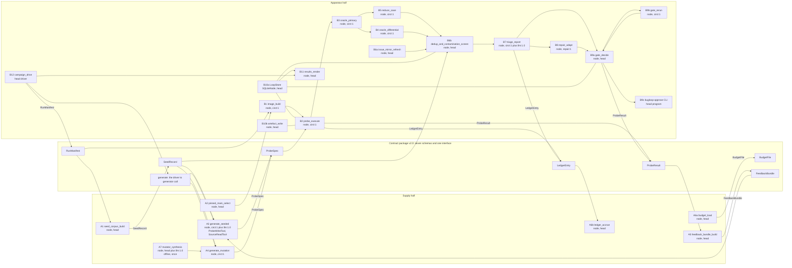
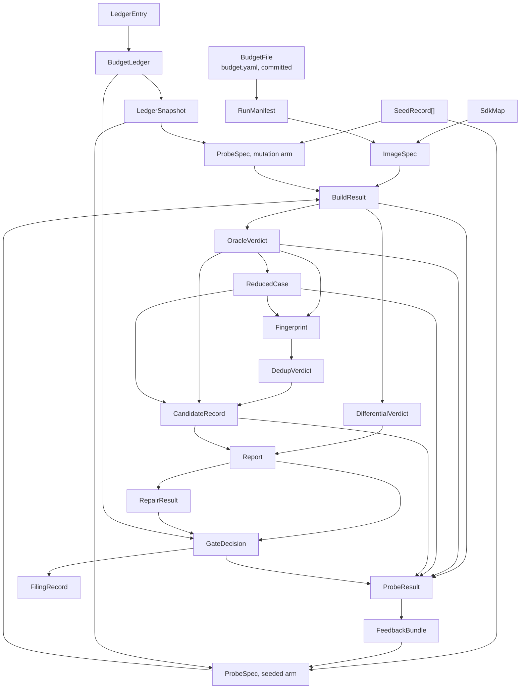

# 02 High-Level Design: the closed CIRCT bug loop

**Status: Draft.** Date: 2026-09-13. Normative for structure; `01-FRD.md` is normative for
behaviour, and where this document contradicts it, `01-FRD.md` wins and the contradiction is a defect
here (`00-README.md`).

Revised 2026-09-13 in answer to `design/reviews/red-team-HLD.md`. All 47 of its findings are
dispositioned in `design/reviews/red-team-HLD-disposition.md`. The errata this revision raises
against `01-FRD.md` are listed in §10 and are carried in that document's own "Errata from the HLD
review" list at the end of its §1.

---

## 0. Reading guide

This document answers the eight questions `01-FRD.md` §10.1 asks of it, in that order, and adds two
sections of its own.

| Section | Question it answers |
|---|---|
| §1 | What are the parts, and what does each do |
| §2 | What crosses the seam, and under what version rule |
| §3 | Where each part runs, for how long, and what happens on a re-run |
| §4 | What the cluster looks like, and how the credential reaches the process that needs it |
| §5 | Which object each stage produces and consumes, and where it is persisted |
| §6 | What each part does when it fails |
| §7 | Which decision shaped which part |
| §8 | Which CHIA files change and which stay byte-identical |
| §9 | What is reused, and why each new thing exists |
| §10 | Which `01-FRD.md` requirements this revision changed |

**One builder.** The user ruled on 2026-09-13 that the architect, working through Opus agents, builds
the whole system. Nothing below is split between people. The seam of §2 survives as a **test
boundary**: the system has two halves, the **supply half** and the **apparatus half**, and each is
tested against the other's recorded fixtures before they are joined (`00-README.md` §2).

Vocabulary is CHIA's. A **node** is a Python function tagged with the resources it needs
(`@ChiaFunction(resources={...})`, `chia:chia/base/ChiaFunction.py:66-96`;
`chia:docs/concepts/overview.rst:19-37`). A **ChiaTool** is an MCP tool server on a worker, whose
registered functions are the agentic edges a model may call
(`chia:chia/base/tools/ChiaTool.py:20-40`). A **logical worker** is a resource-bearing container
**or host process** a node can land on: CHIA maps logical workers onto machines and says
containerisation is optional (`chia:docs/concepts/overview.rst:59-70`, `72-75`), and G-39 says the
same. The word "block" is not used anywhere, because CHIA has no such concept (C-11, G-42).

Every number here comes from `01-FRD.md`, from `analysis/measurements/2026-09-13-frd-followups.md`
where it is marked **measured**, or carries `[DEFAULT]` or `[UNVERIFIED]`. Every CHIA path is cited
as `chia:<path>:<lines>` against `~/.cache/chia-src` at commit `16c35e92`.

**`[ARCHITECT-CHECK]`** marked a choice this revision made because a red-team finding demanded one
and neither `01-FRD.md` nor the review's own disposition determined it; each was the smallest choice
consistent with Ponytail, reuse first, no new dependency, no new knob, and the ten are listed
together in `design/reviews/red-team-HLD-disposition.md` §5. **The architect ruled on all ten on
2026-09-13.** Nine are accepted as the revision made them, and the marker at each point now reads
`[accepted 2026-09-13]`; one is decided the other way and is marked
`[decided against, 2026-09-13]` at its point.

| # | Choice | Ruling |
|---|---|---|
| 1 | Four of the five MCP tools deleted, leaving `ProbeWriteTool` (§1.4) | accepted 2026-09-13; `SourceReadTool` added 2026-09-14 by the LLD review, see §0.1 |
| 2 | The mutation arm takes an empty `FeedbackBundle` through the one `generate` signature and ignores it, asserted on A4's body (§2.1) | accepted 2026-09-13 |
| 3 | `turn_cost` required on both arms, with `turn: null` on the mutation arm (§2.6) | accepted 2026-09-13 |
| 4 | `preexec_fn` calling `resource.setrlimit`, rather than `prlimit` (§9, B2) | **decided against 2026-09-13.** Per-probe limits are applied by `prlimit --as --cpu --nofile -- <argv>`. Python documents `preexec_fn` as unsafe in the presence of threads and a Ray worker is threaded; and the two objections this document recorded against `prlimit` both fail on measurement, `/usr/bin/prlimit` being present in the stock `ubuntu:24.04` base the image is built from, so no dependency is added, and `prlimit(1)` setting the limits in its own process before it `exec`s the tool, so nothing races the child's first allocations. Carried into `01-FRD.md` as an erratum at FR-06.2, listed in that document's §1.6 |
| 5 | The issue mirror fetches no comments (§9, B6a) | accepted 2026-09-13 |
| 6 | `bugloop_llm` declared `{"llm": 1}` on two containers (§4.1) | accepted 2026-09-13 |
| 7 | `LedgerEntry.scope` added to separate the arm window from per-stage occupancy (§2.9) | accepted 2026-09-13 |
| 8 | B5 uses the source-built `circt-reduce`, not the SDK's (§9, B5) | accepted 2026-09-13 |
| 9 | A7 created as a component, charging `shared`, refusing to run after the pre-registration commit (§1.2, §3) | accepted 2026-09-13 |
| 10 | B6a and B9a's poll move to the head rather than keeping a worker-side credential (§4.3) | accepted 2026-09-13 |

**Four further errata against `01-FRD.md`**, raised by
`analysis/measurements/2026-09-13-frd-followups.md` rather than by the red team, land in this
document at four points and are carried in that document's §1.6: the image's lit discovery (§6 and
§9, B1), the slang gap's true size and its second entry point (§6, B1), the per-probe limit mechanism
(§3 and §9, B2) and z3 at build time (§4.1).

### 0.1 Errata from the LLD review

Dated **2026-09-14**. `design/reviews/red-team-LLD.md` reviewed `03-LLD.md` and found five items in
**this** document that no faithful low-level design could satisfy. They are corrected at their own
points, listed here, and dispositioned in `design/reviews/red-team-LLD-disposition.md`. The `01-FRD.md`
errata the same review forced are that document's §1.7.

| Where | Change | Finding |
|---|---|---|
| §1.4 | The `BashTool` is **withdrawn** from stages 1, 2 and 6 and replaced by `SourceReadTool`, a second added `ChiaTool` with three read-only `git` methods. `BashTool` has no read-only mode and sits on a worker whose `PATH` puts the CIRCT build first, so FR-04.4's "shall not be able to reach any tool that computes a measured result" was violated in fact while its tool-list criterion passed. B8's chain keeps CHIA's own `BashTool`, unchanged. | K-review W10 |
| §1.1, §1.2, §1.3, §3 | A1, A2 and B6b move from `{"circt": 1}` to the **head**. All three need 24 months of `main`; a `circt` worker's only tree is a one-commit fetch and no cluster YAML mounts a clone. None of the three runs a CIRCT binary. | K5 |
| §2.1, §2.4 | The contract is **2.0**. `SeedRecord` gains required `diff` and `test_files`, without which neither arm can reach its seed's contents. | K6 |
| §2.1 | FR-16.2's criterion is amended in `01-FRD.md` §1.7 rather than by this document. §2.1 asserted the amendment itself, which `00-README.md` does not permit: "Where 02 or 03 contradicts 01, 01 wins". The design is unchanged; its authority moves. | K11 |
| §4.1 | Every worker type passes `--user $(id -u):$(id -g)`, not only `bugloop_llm`. The artefact bind mount is a host directory the operator owns, and a container running as the image's own user fails FR-17.9's writability check. | W20 |

### 0.2 Errata from the backend decision, 2026-09-14

Dated **2026-09-14**. `design/ADR/ADR-D-03-model-backend.md` gained a superseding section the same
day: the user supplied a Google Cloud API key, Vertex AI express mode accepts it, and the backend for
development, tests and the campaign is CHIA's **`vertex`** backend
(`chia:chia/models/vertex.py:207-266`) with **`gemini-3.8-flash`** at every agent stage, stages 1, 2
and 6 and the offline mutator synthesis A7. The `claude` backend survives only as a named fallback
for a Vertex outage. No `gemini-3.1-pro-preview`, `claude-opus-5` or `claude-sonnet-5` default
remains anywhere in this document; those ids survive only in the historical text of `ADR/`.

| Where | Change |
|---|---|
| §1.4 | Both added `ChiaTool`s are now driven **client-side over MCP by the backend itself**, which is the same transport CHIA's other raw-API backends use. Neither tool changes. |
| §2.5 | `budget.yaml` gains four keys: `model_id`, `campaign_spend_cap_usd`, `price_usd_per_m_input_tokens`, `price_usd_per_m_output_tokens`. |
| §2.9, §2.11 | `LedgerEntry.observed` and `ProbeSpec.turn_cost` are **populated** on the campaign backend rather than null: `tokens_in` is `usage_metadata.prompt_token_count`, `tokens_out` is `candidates_token_count`, and `cost_usd` is computed by the ledger from the two `budget.yaml` prices. No key is added or removed, so the contract stays at **2.0**. |
| §3 | A3, A7 and B7 dispatch their turn through the loop's own `llm_turn` node at `{"llm": 1.0}` rather than through `llm.prompt.options(...)` directly, because `QueryResult` carries no usage field and the backend's counts live on the LLM object. The interlock of §4.3 is checked before any real backend is built. |
| §4.1 | `bugloop_llm` becomes `ghcr.io/ucb-bar/chia:latest`, keeps count 2 `[DEFAULT]` and `{"llm": 1}`, gains `-e GEMINI_API_KEY=${GEMINI_API_KEY}`, and loses the `~/.claude` mount and the two Claude `run_setup_commands`. |
| §4.3 | The backend credential is an **environment variable expanded from the operator's shell at `chia up`**, not a directory mount and not job metadata. NFR-06's grep gains the key's value pattern. |
| §8.2 | The loop's home is the **team repository**, with the CHIA-shaped copy produced by a sync script. |
| §9 | The reuse rows for A3, A6a, A6b, A7 and B7 name the `vertex` backend and its usage metadata. No dependency is added: `google-genai` is already a CHIA dependency (`chia:pyproject.toml:24-35`). |

**Three facts this decision rests on, each executed on 2026-09-14 with no network call, and each
recorded where it bites.**

1. **Express mode needs `project` and `location` to be `None`, and CHIA's constructor makes
   `location` non-null.** `VertexGeminiLLM.__init__` sets
   `self.location = location or os.environ.get("GOOGLE_CLOUD_LOCATION") or "us-central1"`
   (`chia:chia/models/vertex.py:242-247`), and `_run_generate_async` passes both to
   `genai.Client(vertexai=True, project=self.project, location=self.location, **self.client_kwargs)`
   (`chia:chia/models/vertex.py:406-411`). `google-genai` 2.8.0 raises
   `ValueError: Project/location and API key are mutually exclusive in the client initializer.`
   on that combination. **Measured:** constructing `VertexGeminiLLM(model="gemini-3.8-flash",
   project=None, location=None, client_kwargs={"api_key": "<dummy>"})` in `~/.cache/chia-venv`
   left `project=None, location='us-central1'` and the client build raised; setting both attributes
   to `None` after construction built the express client with `project=None, location=None` and the
   key set. The loop's backend constructor therefore nulls both, in two lines, and CHIA is unchanged
   (§4.3).
2. **Token counts do not survive a remote dispatch of `prompt`.** The backend accumulates them into
   `self._last_metadata` on the LLM object (`chia:chia/models/vertex.py:479-482`, `579`) and returns
   a plain `QueryResult`, whose five fields carry no usage (`chia:chia/base/llm_call.py:15-35`;
   `chia:chia/models/vertex.py:586-591`). `chia_remote` dispatches through a Ray trampoline that
   serialises the object (`chia:chia/base/ChiaFunction.py:228-273`), so the mutated copy dies on the
   worker. `AntigravityLLM` escapes this by returning its own `QueryResult` subclass carrying
   `usage` (`chia:chia/models/antigravity.py:213`, `322-331`), which the `vertex` backend does not
   do. §3's `llm_turn` is the fix and it is four lines.
3. **CHIA's repair chain has no `vertex` branch.** `run_issue_remote`'s `_turn` selects
   `antigravity`, `opencode`, else `ClaudeCodeLLM`
   (`chia:examples/circt_issue_solver/issue_task.py:81-123`), so `cfg["backend"] = "vertex"` would
   fall through to the Claude CLI silently. ~~FR-12.1 pins that file byte for byte, so the loop may not
   add the branch. The decision names stages 1, 2, 6 and A7 and does not name stage 7; §3 and §8.2
   record the consequence, `RunManifest.model_ids` spells every value `"<backend>:<model id>"` so the
   difference is visible in one place, and `stages_metered["stage_7"]` is false whenever the two
   backends differ.~~ **Overtaken by §0.3 the same day**: the fact above stands, the consequence drawn
   from it does not. The loop adds the branch, as nineteen additive lines, and FR-12.1's acceptance
   becomes hunk equality rather than a byte comparison.

---

### 0.3 Errata from the image build and the repair-backend decision, 2026-09-14

Dated **2026-09-14**, later the same day than §0.2. `01-FRD.md` §1.9 is the normative list and names
every changed requirement id; this section is what changes here.

**The decision.** Stage 7 runs on the **same `vertex` backend as every other stage**, overruling
§0.2's `--repair-backend claude` default. The mechanism is one **additive** `elif backend == "vertex":`
branch in `chia:examples/circt_issue_solver/issue_task.py`'s `_turn`, nineteen lines, no line of that
file deleted or altered: it constructs a `VertexGeminiLLM` from `cfg["model"]`, `cfg["system_prompt"]`
and `cfg["timeouts"][phase]` with `client_kwargs={"api_key": os.environ["GEMINI_API_KEY"],
"http_options": {"timeout": cfg["timeouts"][phase] * 1000}}`, then sets `llm.project = None` and
`llm.location = None`, which is the express-mode fix §0.2 fact 1 measured. The branch is unreachable
for every existing CHIA caller, `_turn` selecting on a string no CHIA caller sets to `"vertex"`. It
lives in `upstream/issue_task-vertex-branch.patch` and is proposed to CHIA as part of the same pull
request, so §8.3's fifth core change stops being "offered and not depended on" and becomes
**depended on locally, offered upstream**. Verified 2026-09-14: the patch applies to `16c35e92` with
`git apply --check`, the patched file parses, and `git diff` is one hunk, 19 insertions, 0 deletions.

**Why.** Three reasons, in order of weight. The campaign stops depending on the user's Claude
subscription and its observed rate limit. One backend serves all seven stages, so there is one
credential, one model id, one price table and one failure mode rather than two of each. And the
nineteen lines are a contribution CHIA plainly wants, `vertex` being a backend CHIA ships but its own
example cannot select.

| Where | Change |
|---|---|
| §3, stage 7's row | Rewritten: the chain is handed `cfg["backend"] = "vertex"` and `cfg["model"] = "gemini-3.8-flash"`, and `stages_metered["stage_7"]` is **true** by default |
| §8.3, the fifth core change | The `vertex` branch becomes **depended on locally**; the `location` default fix stays offered and worked around in two lines |
| §9 | B8's reuse row names the one additive branch; the dependency list is still unmoved, `google-genai` and `mcp` being CHIA dependencies already |
| §4.1, §4.3 | **`bugloop_repair` now carries the credential too**, `-e GEMINI_API_KEY` and `-e BUGLOOP_ALLOW_LIVE_MODEL`, because stage 7's backend is constructed on that worker by CHIA's `_turn`. The credential is still an environment variable expanded at `chia up` and never job metadata, so NFR-06's rule is unchanged and its grep covers one more container |
| §6 | B8 gains one failure row: the interlock refuses, `LiveModelRefused`, and the run stops **before** the chain is invoked. `repair_adapt` carries the check because CHIA's file cannot (`03-LLD.md` §3.5.1, §3.8) |

**The one thing that does not follow, stated because it would otherwise be assumed.** Stage 7 is on
the metered backend and its **tokens are still not observed**. `_turn` dispatches its turn with
`get(llm.prompt.options(resources={"llm": 1.0}).chia_remote(llm, prompt, tools))`
(`chia:examples/circt_issue_solver/issue_task.py:124`), which serialises the LLM object, and
`VertexGeminiLLM` accumulates its counts into `self._last_metadata` on that object rather than onto
the returned `QueryResult`. That is §0.2 fact 2 exactly, and the loop's fix for its own stages,
`llm_turn`, is a change to the **call site**; line 124 is outside the additive branch and editing it
would falsify the hunk-equality acceptance. CHIA's driver reads `getattr(cli, "usage", None)` and
writes `llm_usage` only where it is truthy (`circt_issue_loop.py:132-136`), so the field is absent for
`vertex`, and the backend's `stream_result` carries no token line to parse instead. Stage 7's
`LedgerEntry.observed` therefore carries **null** tokens and **null** `cost_usd` with `metered` true;
the reason, `unavailable_remote_dispatch`, is carried on the loop's own `RepairResult` and **not**
inside `observed`, whose four declared keys the contract freezes, so §2.9's contract is unchanged and
still at **2.0**; and
the results artefact prints the campaign USD figure as a **lower bound excluding stage 7**.
`stages_metered` answers FR-14.8's question and `observed` answers FR-14.6's; this is the first
revision in which the two disagree, and conflating them would report either that stage 7 is free or
that it is outside the budget, both false.

**The image, built.** `analysis/measurements/2026-09-14-image-build.md` records W-04: the image is
pinned at `eade0de61bc5` with `firtool-1.159.0`, 972 s of build, 1,912,742,097 B in 23 layers,
703,211,208 B of tool binaries, 778 compile commands all carrying `-UNDEBUG`, 536 of 555 `obj.CIRCT`
objects referencing `__assert_fail`, and **zero** failures over CHIA's own lit gate scope with the 62
`REQUIRES: slang` tests running for the first time. Nothing in this document's component structure
changes because of it; `01-FRD.md` §1.9 carries the requirement-level errata and `03-LLD.md` §4.11
carries the seven Dockerfile deviations.

---

## 1. Components

**Twenty-six components**, twenty-five until 2026-09-14 (§0.1). Twenty-one are nodes that do work,
eighteen of them on a worker and three, A1, A2 and B6b, on the head; one is a `SQLiteNode` service;
**two** are `ChiaTool`s, one exposing a file write to an agent and one exposing read-only source
access; two are head-side programs, the campaign driver and the approval CLI. Nothing else exists,
and no component is here that no functional requirement asks for (§9). The count is of rows in the two tables below, not of id
prefixes: A6, B6, B9 and B10 each name more than one component and each component has its own row,
its own placement in §3 and its own failure rows in §6.

The two halves are the test boundary of `00-README.md` §2. The **supply half** is everything that
proposes work; the **apparatus half** is everything that measures. They meet at exactly one seam, §2.

### 1.1 Component diagram



The per-object flow, naming every object of FRD §2.5, is §5.

### 1.2 Supply half

| Id | Component | Purpose, in one line | Implements |
|---|---|---|---|
| A1 | `seed_corpus_build` node, **head** | Mine `llvm/circt` by PIN §2's rule and emit one `SeedRecord` per seed, carrying the seed's diff and its test files' text, plus the `SdkMap`. | F-01 |
| A2 | `pinned_main_select` node, **head** | Walk `main` first-parent to the newest commit whose LLVM pin has a `firtool-*` release, and report the lag. | F-02 |
| A3 | `generate_seeded` node, with `ProbeWriteTool` and `SourceReadTool` | Read one seed's diff and test, state the root-cause class, name sibling sites, and write probing inputs in the seed's own language. | F-04 |
| A4 | `generate_mutation` node | Apply the frozen mutator set to every changed test file of the seed, deterministically, with no model at run time. | F-05 |
| A5 | `feedback_bundle_build` node | Turn the previous iteration's `ProbeResult`s into the bundle the seeded arm reads next, and decide FR-16.6's abandonment. | F-16 |
| A6a | `budget_load` node | Load and validate `budget.yaml`, refuse an uncommitted or later-committed budget, and hand out `LedgerSnapshot`s. | F-14 |
| A6b | `ledger_accrue` node | Append `LedgerEntry` rows and maintain the per-arm and per-stage aggregate. | F-14 |
| A7 | `mutator_synthesis` node | **Offline, once, before the pre-registration commit.** Synthesise the mutator set from the closed `label:bug` issue history, freeze it, and record its SHA. | F-05, ADR-D-05 |

A7 is a component because ADR-D-05 states plainly that the mutation arm has two parts with different
lifetimes, and the earlier draft had only the runner. It runs once, before `budget.yaml` is
committed, so its ordering constraint is real and is drawn in §3: **B6a's mirror is A7's input, so
the mirror is built before the pre-registration commit**, and a second refresh happens inside the
campaign under FR-10.9. A7 is not in the campaign's loop and charges no arm; its cost is recorded as
a `shared` ledger entry against the pre-campaign window. `[accepted 2026-09-13]`

### 1.3 Apparatus half

| Id | Component | Purpose, in one line | Implements |
|---|---|---|---|
| B1 | `image_build` node | Build the assertions-on CIRCT image at a chosen SHA against a chosen SDK tag, bake the whole tool target set, and emit the `ImageSpec` including each tool binary's SHA-256. | F-03 |
| B2 | `probe_execute` node | Verify the tool binaries against the `ImageSpec` hashes, then run one probing input through its tool directly under per-probe limits, and classify the outcome seven ways. | F-06 |
| B3 | `oracle_primary` node | Decide whether the probe crashed, fired a CIRCT assertion or hit `LLVM ERROR:`, symbolise the frames, and emit the reproducing command. | F-07 |
| B4 | `oracle_differential` node, with the two harness generators | Run the same design through arcilator and Verilator from one stimulus and report agreement, divergence, non-applicability or harness failure. | F-08 |
| B5 | `reduce_case` node | Choose a reducer by input language, shrink the firing input under a firing-specific interestingness test, and re-check the verdict. | F-09 |
| B6a | `issue_mirror_refresh` node | Mirror `llvm/circt`'s open and closed issues into `loop.db` once per run, titles, bodies, labels and state only, **no comments**. | F-10 |
| B6b | `dedup_and_contamination_screen` node, **head** | Fingerprint, partition, screen against the mirror, scan post-run-commit commits, and flag contamination at file and symbol level, including the 16 non-exact seeds of FR-15.5. | F-10, F-15 |
| B7 | `triage_report` node | Classify each surviving candidate advisorily and render the issue-shaped report a maintainer would read. | F-11 |
| B8 | `repair_adapt` node | Present a local report to CHIA's unmodified phase chain, record its result, then reset and rebuild the tree it mutated. | F-12 |
| B9a | `gate_decide` node | Ask the four mechanical questions, dispatch question 1's re-run, and record the answers. | F-13 |
| B9b | `gate_rerun` node | Re-run one reproducing command in a fresh process and a newly created directory, preferring a worker other than the one that produced the verdict. | F-13 |
| B9c | `bugloop-approve` CLI | Present one report to a named human who approves it, confirms the patch licence, files, and records the URL. | F-13, F-20 |
| B10a | `LoopStore`, a `SQLiteNode` | Hold every row the run produces, joined to CHIA's `issues.db` by one key. | F-17 |
| B10b | `artefact_write` node | Write the head-authored artefacts (manifest, feedback bundle, results) into the shared artefact tree and mark partials. | F-17 |
| B11 | `results_render` node | Render the results table, the seeded-bug validation table, the failure taxonomy, the divergences list, the contamination columns and every mandatory disclosure. | F-18 |
| B12 | `campaign_drive` head driver | Sequence the run: manifest, image, mirror, then one arm's window and then the other's, with the stop rule and the end-of-run reconciliation. | F-18 |

B11's output is enumerated because FR-18 and three ADRs each add to it, and the earlier draft named
only four of them. B11 renders, and refuses to render without: FR-18.4's five secondaries per arm;
FR-18.5's **separate** seeded-bug validation table; the two qualifiers ADR-D-07 requires on every
table, the mode and the seed set, whose absence FR-18.2 makes a render failure; FR-15.2's
contamination column with the headline printed both with and without contaminated candidates;
FR-15.3's and FR-15.4's two disclosure sentences; ADR-D-10's lag disclosure beside the headline;
FR-18.8's confirmation cut-off date; FR-10.2's collision and false-merge rates; and FR-18.12's
divergences list.

F-15's contamination screen is not a component of its own. It is the second window of B6b's commit
scan: FR-10.4 matches at file level over the lag, FR-15.1 at symbol level over 24 months, and one
scanner serves both because the difference is a bound and a match level, not an algorithm. F-19 and
F-20 are not components either: F-19 is the repository layout of §8, and F-20 is a set of refusals
and recorded fields inside B9c and the `RunManifest`.

### 1.4 The two ChiaTools, and the four that were deleted

**Revised 2026-09-14 (§0.1, LLD review W10): there are two, and the `BashTool` is withdrawn from the
generator and the triage agent.** FR-04.4 gives the generator exactly two capabilities: read-only
source access and a file write into the probe directory. The file write is `ProbeWriteTool`, a plain
`ChiaTool`, unchanged. The read-only source access is now `SourceReadTool`, a second plain `ChiaTool`
with three methods, `read_file`, `grep` and `list_dir`, each one `git` argument vector against the
head's clone at the run's commit, and no shell anywhere.

CHIA's `BashTool` was the earlier occupant of that row and cannot hold it. It has no read-only mode
(`chia:chia/base/tools/BashTool.py:19-31`): `work_dir` is the shell's cwd and nothing more, and the
tool sits on a `circt` worker whose `PATH` puts `/workspace/circt/build/bin` first
(`chia:dockerfiles/ChiaCirctBaseDockerfile:113`), so the agent could run `circt-opt` on its own input,
run `ninja`, and write anywhere in the tree. FR-04.4's **acceptance criterion**, a check on the tool
list, passed; its **requirement text**, "shall not be given, and shall not be able to reach, any tool
that computes a measured result", did not. Prose in the prompt forbidding it is the weakest possible
enforcement and is exactly what NFR-03 exists to avoid. B7's stage-6 turn loses the `BashTool` for the
same reason and gets `SourceReadTool`. B8 is untouched: it runs CHIA's unmodified chain with CHIA's
own `BashTool`, `BuildTool` and `LitTool`, and FR-12.1 forbids changing that.

`SeedReadTool` is not resurrected under another name. It was deleted because it duplicated the
`BashTool` on the same row; with the `BashTool` gone that row has one occupant, and `SourceReadTool`
is it. `03-LLD.md` §3.5 gives its three methods, its three `git` commands and the measurement of each.

The earlier draft also declared `SeedReadTool`, `ProbeRunTool`, `ReduceTool` and `IssueMirrorTool`.
All four are deleted. `SeedReadTool` duplicated the `BashTool` the same section claimed to reuse for
the same job. The other three had **no legal caller**: a `ChiaTool` is "the agentic edges a model may
call", and the only model stages are A3, B7 and B8. FR-04.4 forbids A3 any tool that computes a
measured result; FR-11.1 and NFR-03 make B7 advisory and forbid it computing numbers; B8 runs CHIA's
unmodified chain with CHIA's own `BashTool`, `BuildTool` and `LitTool`. Each deleted tool was a Ray
actor plus a uvicorn server for nothing. FR-19.1's `AsyncJobTool` rule is a conditional, "every added
tool whose work is a build, a lit run, a reduction, a probe execution or a GitHub mirror shall be an
`AsyncJobTool`", and with those tools gone the loop adds no tool in any of the five categories, so
the rule is satisfied vacuously and its acceptance check still runs. The work those tools would have
wrapped is done by B2, B5 and B6a as ordinary nodes, which is where it belongs.
`[accepted 2026-09-13]`

**How the two tools reach the model, 2026-09-14 (§0.2).** Nothing about either tool changes under the
`vertex` backend, and the reason is worth one paragraph because the transport is now visible rather
than hidden inside a CLI. `VertexGeminiLLM` "drives the agentic tool loop client-side, executing each
ChiaTool's MCP server over HTTP, exactly like the Bedrock and Claude API backends"
(`chia:chia/models/vertex.py:1-5`): it opens `http://<tool.hostname>:<tool.port>/<tool.name>/mcp`
for every tool it is handed, lists that server's functions and declares each to Gemini under the
namespaced name `<tool name>__<function name>`, truncated at 64 characters
(`chia:chia/models/vertex.py:422-443`); when a turn comes back with `function_call` parts it calls
them over the same MCP sessions and feeds `function_response` parts back, looping until the model
asks for no more (`chia:chia/models/vertex.py:544-572`). So the placement rules of §3 are what they
were: `ProbeWriteTool` stays on the `circt` worker whose filesystem holds the probe directory,
`SourceReadTool` stays on the head where the clone is, and the model reaches both over HTTP from the
`llm` worker. One consequence is recorded rather than discovered later: the backend strips
`$schema`, `$id`, `$defs`, `definitions`, `additionalProperties` and `title` from every tool's input
schema before declaring it, because Gemini rejects them (`chia:chia/models/vertex.py:593-610`), so
neither tool may rely on a schema key in that list to constrain what the model sends. Both tools
validate their own arguments in their bodies already, which is why this costs nothing.

---

## 2. The seam: the contract package

`00-README.md` allows exactly one seam, and the earlier draft did not hold to it: `SeedRecord` and
`BudgetFile` crossed outside the package, and the driver's call into the generator crossed with no
declared arguments at all. The package is therefore widened to cover everything that actually
crosses, rather than narrowed to a number.

### 2.1 Members and the one interface

The contract package holds **exactly seven schemas and one interface**, and nothing else:

| Member | Direction | Produced by | Read by |
|---|---|---|---|
| `SeedRecord` | supply to both | A1 | A3, A4, B6b, B12 |
| `BudgetFile` | supply to both | committed by a human, loaded by A6a | A6a, A6b, B9c, B12 |
| `ProbeSpec` | down | A3, A4 | B2, B4, B5 |
| `ProbeResult` | up | B2 through B9a | A5, A6b, B11, B12 |
| `FeedbackBundle` | down | A5 | A3 |
| `LedgerEntry` | both | every node in both halves | A6b, B11, B12 |
| `RunManifest` | both | B12 | everything |

The interface, declared in the same module, is the call that starts every iteration:

```python
def generate(seed: SeedRecord,
             feedback: FeedbackBundle,
             remaining: LedgerSnapshot) -> list[ProbeSpec]: ...
```

A3 and A4 both implement it. `LedgerSnapshot` is a read-only view defined in the package, carrying
`arm`, `unit`, `spent` and `cap` and nothing else, so the generator can see how much of its window is
left without reading the ledger or importing `BudgetLedger`. The mutation arm receives a
`FeedbackBundle` whose `entries` list is empty and never reads it: one signature, one code path
(FR-05.4), and A4's implementation ignores the argument, asserted by a test on A4's body rather than
on its signature. `[accepted 2026-09-13]`

**The authority for that last sentence moved on 2026-09-14** (§0.1, LLD review K11). This document
previously claimed it satisfied FR-16.2's "the mutation arm's call signature has no feedback
parameter" by itself, which `00-README.md` does not permit: "Where 02 or 03 contradicts 01, 01 wins
and the contradiction is a defect in 02 or 03." The design is unchanged and is now authorised by an
erratum at FR-16.2 in `01-FRD.md` §1.7, whose criterion reads "the mutation arm's implementation does
not read the feedback argument, asserted by a test on its body".

One version number covers the package, and it is **2.0** (§2.4). A change to any member or to the
interface bumps it, and the bump is one commit.

### 2.2 Version field and compatibility rule, and where it can fire

Every instance of every schema carries the same field:

- `contract_version: str`, required, of the form `MAJOR.MINOR`, for example `2.0`.

**The rule: a consumer accepts an instance whose MAJOR equals the consumer's own MAJOR, and rejects
it otherwise, with a named error naming both versions.** MINOR moves when a member gains an optional
field; MAJOR moves when a required field is added, removed, renamed or retyped. There is no
negotiation, no shim and no tolerance window. A rejection is a hard failure of the stage that read
it, not a warning.

With one builder and one repository, a live run compares a constant to itself, so the rule needs a
place where it can actually fire. **That place is the committed fixture set.** Every fixture carries
the `contract_version` it was recorded at. The half-level test entry points of §2.9 run `validate`
over every committed fixture, and a fixture whose MAJOR differs from `CONTRACT_VERSION` fails the
test rather than being silently re-recorded. A MAJOR bump is therefore a commit that must also
re-record the fixture set, and the failing test is what says so. That is the enforcement point, and
`04-Test-Plan.md` owns the test.

### 2.3 Where the schemas live

`examples/circt_bug_loop/contract/`, a package, holding `schema.py`:

- `CONTRACT_VERSION = "2.0"`, the single source of the version string;
- seven `@dataclass` definitions, one per member, plus the nested `FeedbackEntry`, `RunCommit` and
  `LedgerSnapshot`, with type annotations;
- the `generate` signature as a `typing.Protocol`, which costs one import and no runtime machinery;
- `validate(obj) -> None`, which raises a named error on a MAJOR mismatch, on a missing required
  field, on a required field whose conditional rule (§2.6, §2.7) is unmet, or on a field whose value
  is outside its declared set (for example a `build_status` outside FR-06.9's seven values);
- `to_json(obj) -> str` and `from_json(text, cls)`, both on the standard library's `json` and
  `dataclasses.asdict`.

No serialisation library and no schema library are added. `03-LLD.md` fixes the JSON shape and the
error strings; this section fixes the names, the types, what is required and what every declared
`dict` contains.

### 2.4 `SeedRecord`

Produced by A1, read by A3, A4, B6b and B12. Its fields are FR-01.1's list plus FR-01.2's, FR-01.3's,
FR-01.7's, FR-01.10's and FR-01.12's additions: `contract_version`, `seed_sha`, `parent_sha`,
`subject`, `committed_date_utc`, `source_paths`, `test_paths` (ordered, never collapsed),
`llvm_pin`, `sdk_tag` or null, `sdk_exact`, `bumps_away`, `entry_tool`, `dialect_bucket`,
`dialect_bucket_unmerged`, `run_lines` (the verbatim lines), `argv_template`, `polarity`, `shape`,
`diff`, `test_files`, `corpus_head_sha`. `committed_date_utc` is why this schema is in the package:
FR-15.1's screen needs the seed's commit date and it lives nowhere else.

`diff` and `test_files` arrived at **contract 2.0**, 2026-09-14 (§0.1, LLD review K6). `diff` is the
seed commit's diff of its `source_paths`; `test_files` maps each entry of `test_paths` to that file's
full text at the seed commit. Both are required, which is why the bump is MAJOR. They exist because
A3 and A4 run on worker containers whose only CIRCT tree is a one-commit checkout of the **run's**
commit and whose only bind mount is the artefact root: the seeded arm's prompt substitutes a `$diff`
that had no source, and the mutation arm's "every changed test file of the seed" had paths and no
bytes. With them the record is self-contained, FR-16.5's byte-identical prompt replay is true by
construction, and neither arm needs git, a clone or a network. A1, which now runs on the head, is the
one producer.

### 2.5 `BudgetFile`

The parsed form of the committed `budget.yaml`, produced by A6a. Its keys are exactly FR-14.1's list
and no others, which is what makes the pre-registration mean something. This revision adds three
keys, each an erratum to FR-14.1 (§10): the **arm window** `W` in wall-clock seconds, the **arm
order**, and the issue-mirror **issue cap** that replaces FR-10.9's page cap. `BudgetFile` also
carries `budget_file_sha`, the commit SHA the manifest records, so no consumer has to re-hash the
file.

**Four further keys, 2026-09-14 (§0.2), each an erratum to FR-14.1.** `model_id`, one value for every
agent stage, `gemini-3.8-flash`; `campaign_spend_cap_usd`, `[DEFAULT]` 200, the hard money cap the
driver stops both arms on; and the two prices the ledger turns tokens into money with,
`price_usd_per_m_input_tokens` `[DEFAULT]` 0.75 and `price_usd_per_m_output_tokens` `[DEFAULT]` 3.75,
which are introductory Vertex prices for `gemini-3.8-flash` through 2026-12-31, aggregator-sourced on
2026-09-14 and **`[UNVERIFIED]`** against Google's own pricing page until it is re-read before the
pre-registration commit. They are `budget.yaml` keys and not implementation constants for the reason
FR-14.1 gives: a price that can be edited after the data exists is a free parameter in the headline,
and the money cap is a campaign parameter in exactly the sense the arm window is. The prices are
**both required**, because a ledger holding one of the two would silently value half the spend at
zero.

### 2.6 `ProbeSpec`, direction down

The work the generator proposes. Produced by A3 and A4, consumed by B2, B4 and B5.

| Field | Type | Required |
|---|---|---|
| `contract_version` | str | required |
| `probe_id` | str | required |
| `run_manifest_id` | str | required |
| `seed_sha` | str | required |
| `arm` | str, `seeded` or `mutation` | required |
| `iteration` | int | required |
| `input_filename` | str | required |
| `input_text` | str or null | conditional, see §2.12 |
| `input_path` | str | required |
| `tool` | str | required |
| `argv` | list[str] | required |
| `polarity` | str, `expect_zero` or `expect_nonzero` | required |
| `shape` | str, `plain`, `split_file` or `unsupported` | required |
| `expected_outcome` | str | required |
| `turn_cost` | dict, keys in §2.11 | required |
| `mutator_id` | str or null | conditional |
| `mutator_seed_int` | int or null | conditional |
| `source_test_path` | str or null | conditional |
| `differential` | dict or null, keys in §2.11 | optional |

**The conditionals are enforced, not described.** `validate` requires `mutator_id`,
`mutator_seed_int` and `source_test_path` to be non-null when `arm == "mutation"` and null when
`arm == "seeded"`, which is what makes FR-05.3's acceptance ("re-running a `ProbeSpec`'s mutator with
its recorded seed integer reproduces the input byte for byte") checkable against the schema. The
earlier draft's "required in practice" was not a rule a validator can apply.

`turn_cost` is required on both arms and has a declared shape for each: on the seeded arm it carries
the turn's wall seconds and, where the backend reports them, its tokens and cost; on the mutation arm
it carries wall seconds and nulls, with `turn: null`, because FR-05 forbids a model at run time.
Both arms therefore pass through the same field and the same code path (FR-05.4). `[accepted 2026-09-13]`

`tool` and `argv` come from FR-04.2 and FR-01.10; `polarity` and `shape` are FR-01.10's recorded
normalisation outcomes; `differential` carries FR-08.3's shared stimulus, reset protocol and sampling
point, and is null for a probe the applicability rule of FR-08.1 excludes.

### 2.7 `ProbeResult`, direction up

**One per probe, always produced, whatever the outcome.** This is the object that crosses the seam
upward, and it is the only one. The earlier draft made `CandidateRecord` do both jobs, which made
FR-16.1 unsatisfiable: a candidate is a probing input for which an oracle fired (G-23, ADR-D-06), but
FR-16.1 requires the bundle to carry an entry **per probing input of the previous iteration**, most
of which never fire. Under the earlier schema the bundle failed to build on the first non-firing
probe and every seed's loop ended at iteration 1.

Produced by B2 and completed by whichever stage the probe stopped at, consumed by A5, A6b, B11 and
B12.

| Field | Type | Required |
|---|---|---|
| `contract_version` | str | required |
| `probe_id` | str | required |
| `run_manifest_id` | str | required |
| `seed_sha` | str | required |
| `arm` | str, `seeded` or `mutation` | required |
| `iteration` | int | required |
| `build_status` | str, one of FR-06.9's seven | required |
| `exit_status` | int or null | optional |
| `signal` | str or null | optional |
| `limit_hit` | str or null, `wall`, `cpu`, `address_space` | optional |
| `oracle_fired` | bool | required |
| `oracle_class` | str or null, `assertion`, `fatal_error`, `crash` or `differential` | conditional |
| `assertion_text` | str or null | optional |
| `assertion_site` | str or null | optional |
| `reduced_text` | str or null | conditional, see §2.12 |
| `reduced_path` | str or null | optional |
| `stopping_stage` | str | required |
| `stopping_reason` | str | required |
| `artefact_dir` | str | required |

`oracle_class` is non-null exactly when `oracle_fired` is true. `reduced_text` and `reduced_path` are
present only where a reduction ran and produced output. `stopping_stage` and `stopping_reason` are
always populated: for a probe that exited cleanly they read `stage_4` and `oracle_did_not_fire`,
which is the ordinary case and the one the earlier schema could not express.

A `ProbeResult` carries no candidate count, no gate precision, no bug count and no
apparatus-internal verdict object, which is what FR-16.4's deny-list checks and what keeps the
generator half free of apparatus imports (FR-16.1).

### 2.8 `FeedbackBundle`, direction down

Produced by A5 from the iteration's `ProbeResult`s, consumed by A3.

| Field | Type | Required |
|---|---|---|
| `contract_version` | str | required |
| `run_manifest_id` | str | required |
| `seed_sha` | str | required |
| `arm` | str | required |
| `iteration` | int | required |
| `entries` | list[FeedbackEntry] | required |
| `terminating_condition` | str or null | optional |
| `abandoned` | bool | required |
| `abandon_reason` | str or null | conditional |

`abandoned` and `abandon_reason` are FR-16.6's home: A5 owns the rule, because A5 is the only
component that sees a whole iteration's outcomes and the previous iteration's bundle. It sets
`abandoned=true` when every probing input of this iteration and of the previous one stopped at stage
3 for the same reason, and `abandon_reason` names that reason.

`FeedbackEntry`, a nested dataclass in the same module, one per `ProbeResult`:

| Field | Type | Required |
|---|---|---|
| `probe_id` | str | required |
| `stopped_at_stage` | str | required |
| `reason` | str | required |
| `oracle_class` | str or null | optional |
| `oracle_summary` | str or null | optional |
| `reduced_text` | str or null | conditional, see §2.12 |
| `reduced_from_bytes` | int or null | optional |
| `reduced_to_bytes` | int or null | optional |

`oracle_summary` is the assertion text with its `file:line`, or the top frame names, copied in by the
apparatus.

### 2.9 `LedgerEntry`, direction both, and what one second measures

Produced by every node in both halves, consumed by A6b, B11 and B12.

| Field | Type | Required |
|---|---|---|
| `contract_version` | str | required |
| `entry_id` | str | required |
| `run_manifest_id` | str | required |
| `arm` | str, `seeded`, `mutation` or `shared` | required |
| `scope` | str, `arm_window` or `stage` | required |
| `stage` | str | required |
| `unit` | str, `wall_clock_seconds` | required |
| `amount` | float | required |
| `metered` | bool | required |
| `observed` | dict, keys in §2.11 | required |
| `timestamp_utc` | str | required |
| `stop_reason` | str or null | optional |

**`arm` has three values, not two.** The earlier draft required an arm on every entry while the
vocabulary held only `seeded` and `mutation`, and a third of the producers are not attributable to
an arm at all: B1's image build, B6a's once-per-run mirror, A1's corpus, A2's pin, A7's synthesis,
and the store, the renderer and the driver. `shared` is that third value. FR-14.4's per-arm sums are
over arm-specific entries only, and `shared` spend is reported beside them, never folded in and never
split by an invented rule (erratum, §10).

**`scope` says whether an entry is the budget or an observation of it.** There is exactly one
`arm_window` entry per arm per run, and its `amount` is that arm's spend on the primary unit.
Every other entry has `scope=stage` and is per-stage occupancy, which may sum to more than the window
whenever two stages of one arm overlap, and is reported rather than budgeted. The field is added
rather than inferred, because FR-14.4 requires per-stage accrual and FR-14.5 equalises a per-arm
total, and without it the two readings of the same table differ. `[accepted 2026-09-13]`

**The answer to the review's one question.** The two arms run **sequentially**, each for the same
fixed wall-clock window `W` recorded in `budget.yaml` as a `[DEFAULT]`, on the same fixed-size
cluster, in an order also recorded in `budget.yaml`. **One wall-clock second of `LedgerEntry.amount`
on an `arm_window` entry is one elapsed second of that arm's window, as metered by the campaign
driver on the head.** Nothing else is the budget. Per-stage CPU seconds, tokens and cost are
`observed` and are never `amount`. Sequential arms cost twice the wall clock of concurrent arms
against C-10, and buy the only thing that makes G-48 measurable: an arm's window is not contaminated
by the other arm's load, which is exactly the variable D-04 chose wall-clock to avoid. FR-18.10
becomes: each arm stops when its window expires or one of its safety caps binds, and the results
artefact states both windows (erratum, §10).

`observed` holds tokens, cost and CPU seconds where the backend reports them. **Under the campaign
backend they are populated rather than null** (§0.2): `tokens_in` is the turn's summed
`usage_metadata.prompt_token_count`, `tokens_out` its summed `candidates_token_count`
(`chia:chia/models/vertex.py:479-482`), and `cost_usd` is computed by the ledger, never by the
backend, as `tokens_in / 1e6 * price_usd_per_m_input_tokens + tokens_out / 1e6 *
price_usd_per_m_output_tokens` from the two committed prices of §2.5. The values are null, and
`metered` false, only on the `claude` fallback, which reports no per-phase usage at all (FR-14.8).
The cumulative `cost_usd` over an arm is what FR-18.10's third stop condition reads.

### 2.10 `RunManifest`, direction both

Stamped on every artefact of both halves (FR-17.6), with fields written on both sides. Produced by
B12, consumed by everything.

| Field | Type | Required |
|---|---|---|
| `contract_version` | str | required |
| `run_manifest_id` | str | required |
| `mode` | str, `discovery` or `calibration` | required |
| `seed_set` | str, `187` or `171` | required |
| `run_commit` | list[RunCommit] | required |
| `pin_sha` | str | required |
| `pin_tag` | str | required |
| `tags_sharing_pin` | list[str] | required |
| `lag_commits` | int | required |
| `lag_days` | float | required |
| `current_window_has_release` | bool | required |
| `corpus_head_sha` | str | required |
| `image_spec` | dict, keys in §2.11 | required |
| `assertion_baseline_count` | int | required |
| `budget_unit` | str, `wall_clock_seconds` | required |
| `arm_window_seconds` | float | required |
| `arm_order` | list[str] | required |
| `budget_file_sha` | str | required |
| `cluster_yaml_sha` | str | required |
| `deployment` | str, `single_machine` or `gcp` | required |
| `worker_type` | str | required |
| `apparatus_concurrency` | int | required |
| `llm_concurrency` | int | required |
| `artefact_root` | str | required |
| `backend` | str | required |
| `model_ids` | dict, keys in §2.11 | required |
| `stages_metered` | dict, keys in §2.11 | required |
| `mutator_set_sha` | str | required |
| `x_policy` | str | required |
| `issue_mirror` | dict, keys in §2.11 | required |
| `local_id_range` | list[int] | required |
| `forum_post_url` | str | required |
| `forum_post_date` | str | required |
| `confirmation_cutoff_date` | str | required |
| `differential_driver` | dict, keys in §2.11 | required |
| `calibration_sample` | list[str] or null | optional |
| `sv_seeds_excluded` | list[str] or null | optional |
| `started_utc` | str | required |
| `ended_utc` | str or null | optional |

Eight fields are new in this revision, each because a named FR had no home for it:
`budget_unit` completes FR-14.5's "all four identifying fields", of which the earlier draft carried
three; `arm_window_seconds` and `arm_order` are §2.9's answer; `assertion_baseline_count` is
FR-03.5's 18-object baseline, which §6's B1 row compares against; `x_policy` is FR-08.4's declared
X-initialisation and reset policy, which is campaign-wide and belongs to neither the `ProbeSpec` nor
the `ImageSpec`; `confirmation_cutoff_date` is FR-18.8's cut-off; `llm_concurrency` is §4.1's
declared prompt cap; `artefact_root` is §5's shared path. `mutator_set_sha` becomes **required**: the
mutation arm is a Must (FR-18.1) and FR-05.2 requires the SHA on every run, so it is never
legitimately null.

`RunCommit` is a nested dataclass of `commit: str` required and `seed_sha: str or null` optional. A
discovery manifest has exactly one entry with `seed_sha` null; a calibration manifest has one per
sampled seed (FR-02.7).

### 2.11 The declared dicts

The earlier draft left ten `dict` fields with no key list, several of them load-bearing. Each is now
a closed set of keys, checked by `validate`. `03-LLD.md` fixes their JSON shapes; no key may be added
without a MINOR bump and no key removed without a MAJOR one.

| Dict | Keys |
|---|---|
| `ProbeSpec.turn_cost` | `turn`, `wall_seconds`, `tokens_in`, `tokens_out`, `cost_usd`, `metered` |
| `ProbeSpec.differential` | `stimulus_id`, `reset_protocol`, `sample_point`, `cycles`, `port_list_sha` |
| `LedgerEntry.observed` | `cpu_seconds`, `tokens_in`, `tokens_out`, `cost_usd` |
| `RunManifest.image_spec` | `circt_sha`, `sdk_tag`, `targets`, `flag_string`, `image_digest`, `verilator_version`, `slang_enabled`, `tool_hashes` |
| `RunManifest.model_ids` | one key per model stage: `generate_seeded`, `triage_report`, `repair_adapt`, `mutator_synthesis`, each a model id string |
| `RunManifest.stages_metered` | one key per stage id, each a bool (FR-14.8) |
| `RunManifest.issue_mirror` | `refreshed_utc`, `issues_mirrored`, `issue_cap`, `cap_bound`, `state`, `comments_mirrored` |
| `RunManifest.differential_driver` | `source`, `commit`, `deviation`, `obstacle` |
| `CandidateRecord.dedup_evidence` (§5.3) | `matched_key`, `issue_number`, `issue_url`, `issue_state`, `issue_labels`, `fixing_commit`, `duplicate_of_candidate_id` |
| `CandidateRecord.gate_answers` (§5.3) | `q1_reproduce`, `q1_original_worker`, `q1_rerun_worker`, `q1_original_pid`, `q1_rerun_pid`, `q1_same_worker`, `q2_minimal`, `q2_reason`, `q3_valid`, `q3_validity_basis`, `q3_exit_status`, `q3_stderr_path`, `q4_new`, `q4_reason`, `stopped_at_question` |

`image_spec.tool_hashes` is new: a map from tool name to the SHA-256 of that binary in the published
image. It is what B2 checks before every probe (§3, K2).

**Three of those dicts are re-stated rather than re-shaped, 2026-09-14 (§0.2).** No key is added and
none removed, so the package stays at **2.0**; what changes is what fills them.
`turn_cost.tokens_in` and `observed.tokens_in` are **prompt tokens**, `tokens_out` is **output
tokens**, and `cost_usd` is **US dollars**, computed by the ledger from `budget.yaml`'s two prices
and never taken from the backend, which reports no price. `metered` is true exactly when all three
are non-null. `model_ids`'s four values are each spelled **`"<backend>:<model id>"`**, which is the
spelling the `Assisted-by:` trailer already uses, so a run whose repair stage falls back to a
different backend than its generator stages says so in the manifest rather than in prose.

`dedup_evidence` is also where FR-20.4's prohibition is enforced. Its keys carry an issue's
**number, URL, state and labels** and never its text, and B6a mirrors no comments at all, so no
maintainer's words can reach a prompt through the triage path. B6a and B6b jointly own that
boundary and §6 has a row for it.

### 2.12 Large text, and the artefact cap

`ProbeSpec.input_text`, `ProbeResult.reduced_text` and `FeedbackEntry.reduced_text` are bounded by
FR-17.7's artefact cap `[DEFAULT]`, which is a `budget.yaml` key. The rule, one rule for all three:
**the text field carries the text when it is at or under the cap, and is null otherwise, in which
case the companion path field is the only reference.** `ProbeSpec` therefore always carries
`input_path` and may carry `input_text`; `ProbeResult` always carries `reduced_path` where a
reduction ran and may carry `reduced_text`. This removes the direct conflict between the earlier
contract, which made unbounded `str` fields required, and §5's own persistence rule, which forbids
inlining anything over the cap into a row or a task return value
(`chia:chia/database/sqlite_node.py:35-38`, "Store large artifacts as files and put *paths* in the
DB"). The paths are paths in the shared artefact tree of §5, which every worker and the head can
open.

### 2.13 How fixtures are recorded and replayed

Fixtures live in `examples/circt_bug_loop/contract/fixtures/<schema>/<name>.json`, committed, one
JSON document per file, each a valid instance at the version it records.

**Recording.** Each half's entry point takes `--record-fixtures <dir>`. When it is given, every
instance the half **produces** is written there, named by its id, after `validate` has accepted it.
The supply half records `SeedRecord`, `BudgetFile`, `ProbeSpec` and `FeedbackBundle`; the apparatus
half records `ProbeResult`, `LedgerEntry` and `RunManifest`. A fixture is never hand-written: it is
always the output of a real run, so a fixture that does not validate is a defect in the producer.

**Replaying.** Each half's test entry point takes `--replay-fixtures <dir>`. The supply half replays
the apparatus half's recorded `ProbeResult`, `LedgerEntry` and `RunManifest` through `validate` and
then through its own consumers, A5 and A6b, with no apparatus code present. The apparatus half
replays the supply half's recorded `SeedRecord`, `BudgetFile`, `ProbeSpec` and `FeedbackBundle`
through `validate` and then through B2 and B6b, with no generator code and no model present. **Each
half's fixture set covers all seven members**, not only the ones that flow in its own direction: a
half that never exercises a schema cannot discover that it broke it. The same replay is what enforces
§2.2's compatibility rule, because it validates every fixture at its recorded version.

The join is a substitution, not an integration: each half has already run against the other's
recorded output, and joining means replacing the recorded input with a live one. The `generate`
interface is exercised the same way, by a fixture `SeedRecord`, a fixture `FeedbackBundle` and a
constructed `LedgerSnapshot`.

---

## 3. Per component: worker, image, timeout, retry, idempotency

**Three worker types exist and no more**, and since the LLD review three components that held one hold none: A1, A2 and B6b are head nodes (§0.1). Two of them are CHIA's own resource names. `{"circt": 1}`
is CHIA's tag for a node that touches the CIRCT tree or its binaries
(`chia:chia/chipyard/circt.py:616`, `661`, `698`;
`chia:examples/circt_issue_solver/issue_task.py:38`). `{"llm": 1.0}` is CHIA's tag for one in-flight
prompt, applied at the call site rather than at the node
(`chia:examples/circt_issue_solver/issue_task.py:124`). The third, `{"repair": 1}`, is new and exists
for one reason, given below.

**Where the `llm` tag is applied, corrected 2026-09-14 (§0.2).** CHIA's example writes
`llm.prompt.options(resources={"llm": 1.0}).chia_remote(llm, prompt, tools)`, and the loop keeps the
resource, the count and the placement and changes the callable. The reason is that
`.options(...).chia_remote(...)` dispatches through a Ray trampoline which **serialises the LLM
object** (`chia:chia/base/ChiaFunction.py:228-273`), while the `vertex` backend writes its token
counts onto that object, `self._last_metadata`, and its `QueryResult` carries no usage field
(`chia:chia/models/vertex.py:479-482`, `579`, `586-591`; `chia:chia/base/llm_call.py:15-35`). The
counts would therefore die on the worker and FR-14.6 would be unsatisfiable on the campaign backend,
which is the one thing the superseding decision exists to buy. So A3, A7 and B7 call one loop-owned
node instead:

```python
@ChiaFunction(resources={"llm": 1.0}, max_retries=0)
def llm_turn(llm, user_message: str, tools: list) -> dict:
    """One model turn on an llm worker, with its token counts brought home."""
    cli = llm.prompt(user_message, tools)          # direct call: runs in THIS process
    meta = dict(getattr(llm, "_last_metadata", {}) or {})
    return {"result": cli.result, "stream": cli.stream_result, "stderr": cli.stderr,
            "success": bool(cli.success),
            "usage": {"tokens_in": meta.get("input_tokens", 0),
                      "tokens_out": meta.get("output_tokens", 0),
                      "num_turns": meta.get("num_turns", 0),
                      "model": meta.get("model")}}
```

`llm.prompt(...)` inside it is a direct call of a `@ChiaFunction`, which "just runs in the caller's
own process and isn't a node" (`chia:docs/concepts/overview.rst:36-37`), so the turn runs on the
`llm` worker the node landed on, the MCP tool servers are reached over HTTP exactly as before, and
the metadata is read in the same process that wrote it. `03-LLD.md` §3.5 is normative for it.
Nothing else about the dispatch moves: the resource is `{"llm": 1.0}`, the cap is still the container
count, and `RunManifest.llm_concurrency` still records it.

**Why `repair` is a separate worker type.** B8 runs CHIA's chain, and the chain's verify step calls
`circt_util.circt_ninja_build(cfg["tool_targets"], ...)` **with the agent's diff applied**
(`chia:examples/circt_issue_solver/issue_task.py:216-230`, the build at 223). After that line, the
binaries under `/workspace/circt/build/bin` on that container are patched. `run_issue_remote` returns
without resetting or rebuilding (`issue_task.py:274-286`); the next task's reset is `git reset --hard`
then `git clean -fd`, "NOT ``-x``, so the gitignored ``build/`` tree, the warm incremental build,
survives" (`chia:examples/circt_issue_solver/circt_util.py:52-62`); and `circt_warm_build` returns
early on its sentinel and rebuilds nothing (`chia:chia/chipyard/circt.py:672-680`). So on a shared
worker pool, every oracle verdict, every reduction and every gate re-run after the first repair
attempt would have a one-in-two chance of running against a binary that is not the image's, silently
violating NFR-02 and making `image_digest` a false statement. Two measures, both taken:

1. **B8 runs on its own worker type**, `bugloop_repair`, count 1, same image as `bugloop_circt`. No
   node that produces or checks a verdict ever lands on a worker that has built a patch.
2. **After every repair attempt**, whatever its outcome, B8 calls `circt_git_reset` at the run's
   commit and then `circt_ninja_build` of the `ImageSpec`'s tool targets, and records both results;
   and **every probe execution on every worker first checks the SHA-256 of each tool binary against
   `image_spec.tool_hashes`** and refuses to run on a mismatch. The hash check replaces FR-06.1's
   `--version` check, which cannot detect this at all: a source edit without a reconfigure does not
   change the version string (erratum, §10).

**"Head" is a placement, and it is expressible.** A `@ChiaFunction` called directly "just runs in the
caller's own process and isn't a node" (`chia:docs/concepts/overview.rst:36-37`), while one
dispatched with no resource tag is schedulable on any node with free CPU, including a worker
container. Neither is what the head rows below mean. **A head node is a `@ChiaFunction` dispatched
with `NodeAffinitySchedulingStrategy(node_id=<the head's node id>, soft=False)`**, which is CHIA's
own mechanism for exactly this and is already used twice in the framework
(`chia:chia/base/cache.py:356-357`; `chia:chia/base/bypass.py:226-228`). It is therefore a node,
satisfying FR-19.1, and it lands on the head, where the loop database, the artefact tree and the
GitHub token are. B12 and B9c are not nodes: they are programs, the driver and an interactive CLI.

**Timeouts, and what enforces each one.** The earlier draft gave fourteen timeout values and named no
mechanism; Ray has no per-task timeout and `@ChiaFunction` accepts only the keyword arguments
`ray.remote().options()` accepts (`chia:chia/base/ChiaFunction.py:97-106`). There are exactly three
enforcement points and every row below names which it uses.

- **`subprocess`**, for a node whose work is a child process: the node body passes
  `timeout=<its timeout>` to `communicate()` and SIGKILLs the process group on expiry, which is
  CHIA's own pattern and its own reason (`chia:chia/chipyard/circt.py:617-620`, `628-631`,
  `648-658`). Used by A1, A2, A4, B1, B2, B3, B4, B5, B6b, B9b.
- **`turn`**, for a node whose work is a model turn or an HTTP call: the turn's own per-phase timeout,
  which CHIA already fixes (`chia:examples/circt_issue_solver/circt_issue_loop.py:77`), or the
  `GithubClient`'s constructor `timeout_seconds`. Used by A3, A7, B6a, B7, B8, B9a's poll.
- **`driver`**, for a head node doing pure computation with no child and no network: the driver's own
  `chia_wait(..., timeout=...)`, after which it calls `ray.cancel(ref, force=True)`, which is the
  cancellation `chia_wait` itself performs on its retry path
  (`chia:chia/base/chia_wait.py:125-135`), and records `stage_timeout`. Used by A5, A6a, A6b, B10b,
  B11. The worker-side effect of a forced cancel is a killed task, which for these five is safe
  because none of them writes outside `loop.db`'s own transaction.

Retry policy has three settings and no others.

- **`max_retries=0`**, for every node with a side effect that is not idempotent: any node that writes
  a row, charges the ledger or mutates the CIRCT tree. This is `SQLiteNode`'s own reason for the same
  setting (`chia:chia/database/sqlite_node.py:40-43`): Ray's task replay after a worker death would
  double-apply a committed but unreturned write.
- **`chia_wait` with `pending_timeout` and `retry=True`**, for scheduling stalls only
  (`chia:examples/circt_issue_solver/circt_issue_loop.py:263-273`;
  `chia:chia/base/chia_wait.py:1-13`). It re-dispatches a task that never started; it never
  re-dispatches one that ran. Its stuck test requires the task's resources to be **available**
  (`chia:chia/base/chia_wait.py:69-80`, `241`), so it fires for a wedged raylet and does not fire for
  a probe queued behind a busy slot. That is correct and is not a defect: a full `circt` slot is
  ordinary queuing, and the campaign's bound on it is the arm window `W`, not a retry.
- **In-node bounded retry**, only for a network GET that returned 5xx, which is already inside CHIA's
  client (`chia:chia/github/github_client.py:130-134` retries once on 5xx).

Timeout values below are `[DEFAULT]`s. The five CHIA already fixes are reused verbatim:
`{"assess": 1800, "repro": 1800, "fix": 7200, "regression": 3600, "writeup": 1200}` seconds. The new
stages take their own entries in the same dict. The per-probe limits of FR-06.2 and the reduction
budget of FR-09.4 are not in this dict: they are `budget.yaml` keys, because they are campaign
parameters (FR-14.1).

| Id | Worker and resources | Image | Timeout, and what enforces it | Retry | Idempotency on re-run with the same input |
|---|---|---|---|---|---|
| A1 `seed_corpus_build` | head | n/a | 1800 s `[DEFAULT]`, `subprocess` | `max_retries=0` | **Fully idempotent.** Two runs on a clone reset to the recorded head produce byte-identical output (FR-01.6, FR-01.11). |
| A2 `pinned_main_select` | head | n/a | 600 s `[DEFAULT]`, `subprocess` | `max_retries=0` | **Idempotent given a fixed clone and tag list.** Not idempotent across a `git fetch` that moves head, which is why the result is stamped into the manifest and never recomputed mid-run. |
| A3 `generate_seeded` | `{"circt": 1}`, prompt at `{"llm": 1.0}` via `llm_turn` | assertions-on; prompt on `ghcr.io/ucb-bar/chia:latest` | 2400 s `[DEFAULT]`, `turn` | `max_retries=0`; a failed turn is recorded, charged and skipped (FR-04.8) | **Not idempotent.** A model turn is not deterministic. Replay is by CHIA's bypass from the stored transcript, which is the only mechanism NFR-01 accepts for an agent turn. |
| A4 `generate_mutation` | `{"circt": 1}` | assertions-on | 600 s `[DEFAULT]`, `subprocess` | `max_retries=0` | **Fully idempotent.** Every mutator is a pure function of (input text, seed integer) (FR-05.3). |
| A5 `feedback_bundle_build` | head | n/a | 120 s `[DEFAULT]`, `driver` | `max_retries=0` | **Fully idempotent.** A pure function of the iteration's stored `ProbeResult`s and the previous bundle. |
| A6a `budget_load` | head | n/a | 120 s `[DEFAULT]`, `driver` | `max_retries=0` | **Fully idempotent.** A pure function of the committed file and its commit metadata. |
| A6b `ledger_accrue` | head | n/a | 120 s `[DEFAULT]`, `driver` | `max_retries=0` | **Not idempotent:** it appends, so a replay would double-charge, which is exactly why `max_retries=0` is set. Entries carry `entry_id`, so a duplicate is detectable at reconciliation. |
| A7 `mutator_synthesis` | head, prompt at `{"llm": 1.0}` via `llm_turn` | head env; prompt on `ghcr.io/ucb-bar/chia:latest` | 3600 s `[DEFAULT]`, `turn` | `max_retries=0` | **Not idempotent, and run once.** Its output is frozen, committed and referenced by SHA (FR-05.2), so the campaign never re-runs it. Runs **before** the pre-registration commit. |
| B1 `image_build` | `{"circt": 1}` | builds an image; runs on the base | 10800 s `[DEFAULT]`, `subprocess` | `max_retries=0` | **Idempotent by digest.** A rebuild at the same SHA, tag, target list and flag string is a no-op if the digest already exists; a partial build publishes nothing (FR-03.13). |
| B2 `probe_execute` | `{"circt": 1}` | assertions-on | the per-probe wall-clock limit of FR-06.2 plus a node-level margin `[DEFAULT]`, `subprocess`. The address-space and CPU-time limits are **not** enforced here: they are set by the `prlimit --as --cpu --nofile --` prefix on the probe's own argv, so they belong to the child rather than to the node (FR-06.2, amended 2026-09-13) | `max_retries=0`, because a retried probe would double-charge the ledger and could turn a recorded `oom` into a silent success (FR-06.2, NFR-05) | **Idempotent in verdict, not in timing.** The status, the signal and the stderr are deterministic in the same image and against binaries whose hashes match `image_spec.tool_hashes` (NFR-02); the wall time and peak memory are not, and are recorded as non-deterministic fields. Each run writes to its own per-probe scratch directory (FR-06.8). |
| B3 `oracle_primary` | `{"circt": 1}` | assertions-on | 600 s `[DEFAULT]`, `subprocess` | `max_retries=0` | **Fully idempotent.** A pure function of the stored `BuildResult` plus `llvm-symbolizer` on a fixed binary. |
| B4 `oracle_differential` | `{"circt": 1}` | assertions-on | 1800 s `[DEFAULT]`, `subprocess` | `max_retries=0` | **Idempotent given the pinned Verilator (FR-03.15).** Both harnesses are generated from the port list and one declared stimulus, so a re-run drives the same ports with the same values. |
| B5 `reduce_case` | `{"circt": 1}` | assertions-on | the reduction wall-clock budget of FR-09.4 plus the SIGKILL grace of FR-09.13, `subprocess` | `max_retries=0` | **Idempotent when the reduction reaches a fixpoint; not otherwise.** A budget-truncated reduction carries `fixpoint=false` and `budget_truncated=true`, which is how NFR-02 keeps a non-reproducible row visible. |
| B6a `issue_mirror_refresh` | head | n/a | 1800 s `[DEFAULT]`, `turn` | bounded in-client 5xx retry only | **Idempotent by design and by policy.** Refreshed once per run; a second run in the same campaign reuses it unless the operator asks (FR-10.9). Runs on the head because `GithubIssuesNode` is a "Service-pattern node (head-node only, not a Ray task)" (`chia:chia/github/github_issues_node.py:31`) and because that is where the token is. |
| B6b `dedup_and_contamination_screen` | head | n/a | 900 s `[DEFAULT]`, `subprocess` | `max_retries=0` | **Idempotent in verdict, order-independent in partition.** The duplicate relation is string equality, so the partition does not depend on arrival order (FR-10.2). A second run over the same candidate returns `duplicate_of_candidate` naming the first, which is FR-10.6's requirement rather than a violation of idempotency. Runs on the head because the commit scans of FR-10.4 and FR-15.1 need 24 months of `main`, which only the head's blobless clone holds, and because the issue mirror is a table in `loop.db` (LLD review K5, K7). It runs no CIRCT binary. |
| B7 `triage_report` | `{"circt": 1}`, prompt at `{"llm": 1.0}` via `llm_turn` | assertions-on; prompt on `ghcr.io/ucb-bar/chia:latest` | 1200 s `[DEFAULT]`, `turn` | `max_retries=0`; a failed turn yields `untriaged` and a hold (FR-11.8) | **Not idempotent in prose, fully idempotent in numbers.** Every number in the report is substituted from the record (FR-11.4), so a re-render with a different prose turn changes no number. |
| B8 `repair_adapt` | `{"repair": 1}`; the chain dispatches its own turns at `{"llm": 1.0}` | assertions-on | CHIA's five phase timeouts, unchanged, `turn` | `max_retries=0` | **Not idempotent.** It mutates the CIRCT tree. It resets to the run's commit before starting (FR-12.6), **and resets and rebuilds the tool targets after finishing**, and the loop's row is written before CHIA's (FR-12.10). A re-run is safe and produces a new attempt, not the same one. |
| B9a `gate_decide` | head | n/a | 900 s `[DEFAULT]`, `driver` for its own work, `turn` for the FR-13.16 poll | `max_retries=0` | **Idempotent in the four answers; question 1 re-runs by construction.** Holds **no** `circt` resource, so it can never hold a slot while waiting for one. |
| B9b `gate_rerun` | `{"circt": 1}` | assertions-on | the per-probe wall-clock limit plus a margin `[DEFAULT]`, `subprocess` | `max_retries=0` | **Deliberately not idempotent in placement.** FR-13.2 requires a fresh process and a newly created working directory each time, so the re-run is the point rather than a side effect. |
| B9c `bugloop-approve` CLI | head, interactive | n/a | none; a human's own pace | none | **Idempotent by refusal.** Approval is per report and does not generalise (FR-13.13); a second approval of the same report is refused with the first approval's timestamp. |
| B10a `LoopStore` | head, `pin_to_current_node=True` | n/a | `SQLiteNode`'s own 30 s busy timeout | `max_retries=0` on writes, CHIA's own default | **Idempotent by primary key on writes.** Never on network storage (FR-17.3, `chia:chia/database/sqlite_node.py:29-33`). |
| B10b `artefact_write` | head | n/a | 300 s `[DEFAULT]`, `driver` | `max_retries=0` | **Append-only.** A partial directory keeps its `PARTIAL` marker rather than being deleted (FR-17.8). |
| B11 `results_render` | head | n/a | 600 s `[DEFAULT]`, `driver` | `max_retries=0` | **Fully idempotent.** A pure function of the store, and it renders successfully from an empty confirmation set (FR-18.7). |
| B12 `campaign_drive` | head driver, not a node | n/a | the two arm windows, which it meters | `chia_wait` with `pending_timeout` for stalled dispatches only | **Resumable, not idempotent.** A restart reuses the same `run_manifest_id`, skips iterations whose records are complete, and refuses to continue if the budget file SHA no longer matches (FR-14.7). |
| `ProbeWriteTool` | `{"circt": 1}`, placed by its own `task_options` on the worker running A3 | assertions-on | none; each call is a single file write | none | **Idempotent by path.** A second write of the same probe id overwrites with identical bytes. |
| `SourceReadTool` | **head**, placed by its own `task_options` on the head, where the clone is | n/a | 60 s `[DEFAULT]` per `git` call, `subprocess` | none | **Fully idempotent.** Every method is a pure query against a fixed commit. Added 2026-09-14 (§0.1, §1.4). |

`ProbeWriteTool` gets a row because FRD §10.1 item 3 says "for every component", and a `ChiaTool`'s
placement is a real decision rather than an inherited one: the server is placed by the `task_options`
given at construction, and a registered function can run on a different worker than the server
(`chia:docs/concepts/overview.rst:42-50`). It is placed on the `circt` worker so its writes land in
the same filesystem namespace as the probe directory A3 is filling. It is a plain `ChiaTool`, not an
`AsyncJobTool`, because a file write does not hold the transport for minutes; with the other four
tools deleted (§1.4), `AsyncJobTool._MAX_POLL_SECONDS` and its "one job at a time per tool instance"
rule (`chia:chia/base/tools/AsyncJobTool.py:34-37`, `47`) no longer price anything in this design.

**Stage 7's backend, rewritten 2026-09-14 (§0.3).** B8 runs CHIA's chain with **one additive branch**
and nothing else changed (FR-12.1, as amended). That chain's turn selector knew `antigravity`,
`opencode` and `claude` and nothing else (`chia:examples/circt_issue_solver/issue_task.py:81-123`):
handed `cfg["backend"] = "vertex"` it would have built a `ClaudeCodeLLM` and said nothing. The loop
adds the fourth arm, nineteen lines, unreachable for every existing CHIA caller, carried as
`upstream/issue_task-vertex-branch.patch` and proposed upstream. Four things follow. The adapter
passes `cfg["backend"] = "vertex"` and `cfg["model"] = "gemini-3.8-flash"`, the same pair every other
stage runs on; `RunManifest.model_ids["repair_adapt"]` reads `vertex:gemini-3.8-flash`, equal to
`RunManifest.backend`'s half for the first time; `stages_metered["stage_7"]` is **true** by default,
FR-14.8's rule unchanged and its outcome flipped; and `--repair-backend` with `--repair-model` and
`--no-repair` survive as fallbacks for a Vertex outage, defaulting to `vertex`. What does **not**
follow is token observability: `_turn`'s dispatch at `issue_task.py:124` is remote and
`VertexGeminiLLM` keeps its counts on the LLM object, so stage 7's `LedgerEntry.observed` carries null
tokens and null `cost_usd` with the reason named (§0.3). ~~The campaign may instead be run with the
repair stage disabled, in which case F-12's results rows are empty with the reason stated~~ is
**kept**, `--no-repair` being both the outage fallback and the way to run a campaign whose reported
spend is complete.

**How B12 sequences the campaign.** One manifest, one image, one mirror, then the arms **one after
the other** in `arm_order`, each for `W` seconds metered on the head. Inside an arm, seeds are
dispatched across the two `circt` slots and the loop iterates per seed. The window is the clock: when
it expires, B12 stops dispatching, waits for in-flight probes to return or to hit their own timeouts,
writes the arm's `arm_window` ledger entry, and starts the next arm. A7 and the pre-registration
commit precede all of it.

**How B9a lands question 1 on a different worker, without deadlocking.** Ray has an affinity
primitive and no anti-affinity primitive, so "a different logical worker" cannot be asked for by a
resource tag. B9a enumerates the live `circt` worker node ids from `ray.nodes()`, filtered to
`Alive`, which is CHIA's own way of doing exactly this
(`chia:chia/base/dispatch_proxy.py:85-94`), and dispatches B9b with
`NodeAffinitySchedulingStrategy(node_id=<a node other than the original>, soft=True)`. Two
containers on one host **are** two Ray nodes: `chia up` suffixes the container name per worker index
(`chia:chia/cluster/node_setup.py:622`) and runs `ray start --address=...` inside each
(`chia:examples/circt_issue_solver/cluster.yaml:94-96`; `chia:chia/cluster/node_setup.py:544`).

Two properties matter and both are deliberate. B9a **holds no `circt` resource**, so it cannot
occupy a slot while waiting for one; and the pin is **soft**, so where the preferred node is busy or
gone, Ray schedules the re-run wherever a `circt` slot frees rather than waiting forever. The earlier
draft had a `circt`-holding gate with `soft=False`, which on a two-slot cluster with two gates in
flight is a deadlock that `chia_wait` cannot even detect, because with both slots held
`available/total` is 0 and the stuck test never passes
(`chia:chia/base/chia_wait.py:56-57`, `267-291`). B9b records the truth either way: the original
worker's hostname and Ray node id and pid, the re-run's, and `same_worker` true or false. FR-13.2's
erratum (§10) says the requirement is a different worker **where the scheduler can grant it**,
recorded either way.

---

## 4. Cluster topology

One backend per run, because a backend is a cluster and not a flag (C-20, ADR-D-03). **The backend is
CHIA's `vertex` backend in Vertex AI express mode** (ADR-D-03's superseding section, §0.2). Two
cluster YAML files are named here and written in `03-LLD.md`.

### 4.1 Single machine, the Must (NFR-10, ADR-D-14)

`examples/circt_bug_loop/cluster_single.yaml`. Head plus five worker containers on one host, which is
the shape CHIA's own example already uses (`chia:examples/circt_issue_solver/cluster.yaml:1-19`).

| Worker type | Resources | Count | Image | Why |
|---|---|---|---|---|
| `bugloop_llm` | `{"llm": 1}` | 2 `[DEFAULT]` | `ghcr.io/ucb-bar/chia:latest` | Runs the turn. Under the `vertex` backend there is no CLI to install and no login to mount: the backend is a Python client in the `chia` package, and `ghcr.io/ucb-bar/chia:latest` is "`rayproject/ray:2.54.0-cpu` with the `chia` package pip-installed on top" (`chia:docs/user_guides/docker_images.rst:45-49`), which by `chia:pyproject.toml:24-35` brings `google-genai` and `mcp` with it. One resource unit per container, so the concurrent-prompt cap is exactly the container count, 2, and the manifest records it as `llm_concurrency`. |
| `bugloop_circt` | `{"circt": 1}` | 2 `[DEFAULT]` | `chia-circt-assert:<tag>`, the assertions-on image of B1 | Owns a `/workspace/circt` checkout at the run's commit with the tool targets already built in the image. Two containers on one host cannot share one build path, so each owns its own. |
| `bugloop_repair` | `{"repair": 1}` | 1 `[DEFAULT]` | `chia-circt-assert:<tag>`, the same image | B8 only. Isolates the one stage that patches and rebuilds the tree from every stage that measures (§3). |

CHIA's own example writes `llm:2` on each of two containers and comments that this gives "2
concurrent prompts" (`chia:examples/circt_issue_solver/cluster.yaml:3-4`), which is either wrong or
means something it does not say. This design writes `{"llm": 1}` and states the cap, because the
seeded arm's throughput is bounded by `llm` slots rather than by `circt` slots and FR-14.5 requires
the manifest to name the concurrency. `[accepted 2026-09-13]`

**`run_options` on `bugloop_llm`, rewritten 2026-09-14 (§0.2).** Under the `claude` backend the row
carried `-v ~/.claude:/home/ray/.claude` and two `run_setup_commands` that copied a login file and
set `skipDangerousModePermissionPrompt` inside the container. **All three are withdrawn.** What
replaces them is one line:

```
- "-e GEMINI_API_KEY=${GEMINI_API_KEY}"
```

and nothing else changes on that type: `--ulimit nofile`, `--shm-size`, the SSH agent socket and its
variable, and `--user $(id -u):$(id -g)` stay, and the type still carries no `--cpus` and no
`--memory` because it holds no CIRCT tree. The `${GEMINI_API_KEY}` reference is expanded **by CHIA's
own config loader, from the operator's shell, at `chia up`**: `load_raw_config` runs
`_expand_env_vars` over the whole parsed document, substituting `${VAR}` from `os.environ` and
leaving `$VAR` alone (`chia:chia/cluster/config.py:300-309`, `694-710`, `951-957`). CHIA's own
multi-backend test cluster passes `OPENAI_API_KEY` and `GOOGLE_CLOUD_PROJECT` exactly this way
(`chia:chia/models/tests/cluster/all_models.yaml:143-152`), so the mechanism is CHIA's and not this
design's. The consequence that matters for NFR-06 is §4.3's: the value ends up in the host's
`docker run` command line and in the container's environment, and **never** in `chia job submit`
runtime-env metadata, which is where CHIA's own wrapper warns a secret becomes visible.

`min_workers` and `max_workers` are equal on all three types, so the cluster is fixed-size and
`apparatus_concurrency` in the manifest is exactly the `bugloop_circt` count. **Both arms run from
this one YAML at this one concurrency, one after the other**, which is what makes FR-14.5's
wall-clock equality mean anything (§2.9).

**`run_options` on `bugloop_circt` and `bugloop_repair`** carry, beyond the four CHIA's example
already sets (`--ulimit nofile`, `--shm-size`, the SSH agent socket mount and its environment
variable, `chia:examples/circt_issue_solver/cluster.yaml:55-59`):

- a container CPU limit and a container memory limit, NFR-05's outer level, which protect the worker
  and the machine while the probe's own rlimits classify the probe (FR-06.2);
- **the artefact mount**: `-v <host artefact root>:<the same absolute path>`, read-write. This is how
  a worker-produced file reaches the head's artefact tree, and it is the same `run_options`
  bind-mount mechanism the SSH agent socket already uses. The head driver runs on the host in its own
  conda environment (`chia:examples/circt_issue_solver/cluster.yaml:89-90`), so the host path is the
  head's path, and mounting it at the identical path inside every container makes
  `RunManifest.artefact_root` mean one thing everywhere. See §5.
- **`--user $(id -u):$(id -g)`**, added 2026-09-14 (§0.1, LLD review W20). CHIA's example sets it on
  its LLM container only, and this design's earlier draft copied that asymmetry: the two CIRCT types
  had the artefact mount and not the `--user`, so they would have run as the image's own user and
  written into a host directory the **operator** owns. FR-17.9's pre-flight check, "the artefact root
  is writable on every worker", is the right check and would have failed on the first worker that ran
  it, with no remedy anywhere in the design. Matching uid and gid is the remedy, it is the mechanism
  CHIA already uses, and it costs one line per type.

**The two levels of limit, corrected.** A container-level kill removes the worker, and CHIA does
re-queue tasks from a dead worker onto another one
(`chia:docs/concepts/overview.rst:104-107`). But every probe-bearing node in this design sets
`max_retries=0`, under which Ray does **not** re-queue: the task fails with a worker-died error. So
the hazard is not a silent retry, it is a **task that fails with no probe status at all**, and §6 has
a row for it. The rlimits remain the inner level and remain the only thing that produces an `oom`
record.

**`run_setup_commands`** on both CIRCT types carry CHIA's `/etc/passwd` line and the three
`git config` lines, and **not** the `pip install lit` line: `lit` is baked into the image exactly
once (FR-03.8) at the path CHIA checks, `/home/ray/anaconda3/envs/py_worker/bin/lit`
(`chia:chia/chipyard/circt.py:608`, `680-686`), so a conditional install finds it present and does
nothing. The path is stated because FR-03.8's acceptance (`lit --version` succeeds) does not by
itself imply lit is at that path.

**Two image-level facts the build depends on, both measured, both easy to lose.**

1. **z3 is a build-time need, not only a run-time one** (C-02, amended 2026-09-13 after M2). The
   SDK's `mlir-tblgen` is what generates CIRCT's `.inc` files, so without `libz3.so.4` on the loader
   path the build fails at its **first tablegen edge** with
   `mlir-tblgen: error while loading shared libraries: libz3.so.4`. CHIA's base already gets this
   right by accident of placement: `ENV LD_LIBRARY_PATH=/opt/circt-sdk/lib`
   (`chia:dockerfiles/ChiaCirctBaseDockerfile:77-79`) is image-wide and sits before the cmake and
   ninja layers (92-113). The assertions-on image inherits that `ENV` and **may not narrow it to
   probe execution**, which is the shape a reading of C-02's old "at run time" invited.
2. **The image's configure carries `-DMLIR_SOURCE_DIR=/opt/circt-sdk`** (FR-03.17, new 2026-09-13
   after M3), without which lit cannot discover the `test/` tree at any CIRCT commit after
   2026-07-16. §6's B1 rows and §9's B1 row carry the detail; the cost is one cmake argument.

**Nobody calls `circt_warm_build`, and nobody needs to.** B1 bakes the full `ImageSpec` target list
into the image, so a fresh container starts warm. The earlier draft claimed CHIA's six-target warm
build as reuse while giving no component that calls it; the claim is withdrawn (§9). The published
`chia-circt:latest` image bakes only `circt-opt` (**measured**:
`analysis/measurements/2026-09-13-frd-followups.md` M5, which found `circt-opt`, `circt-tblgen` and
four scripts in `/workspace/circt/build/bin` and nothing else), which is why CHIA needs a run-time
warm-up and this design does not.

**What the image costs, measured.** All figures from
`analysis/measurements/2026-09-13-frd-followups.md`, host `nproc` 20, `-j12`, cold, no ccache, CIRCT
`5056ff0445` against SDK `firtool-1.157.0`:

| Quantity | Measured |
|---|---|
| Build of the five tool targets under `-O3 -UNDEBUG -gline-tables-only` | **582 s**, 1082 ninja edges |
| The same target set under `-O3 -UNDEBUG` | 676 s |
| The same target set under `-O3 -DNDEBUG` | 621 s |
| Build tree size, `-O3 -UNDEBUG -gline-tables-only` | **1.3 GB** |
| Build tree size, `-O3 -UNDEBUG` / `-O3 -DNDEBUG` | 588 MB / 425 MB |
| `circt-opt` binary, the three flag strings | 192 MB / 73 MB / 60 MB |
| Published base image `ghcr.io/ucb-bar/chia-circt:latest` on disk | **4.79 GB**, 17 layers |
| Per-probe cost of `-gline-tables-only`, 4000-op probe | 30,647 us against 29,633 us under `-DNDEBUG`, **+3.4%** |
| Symbolisation under `-gline-tables-only` | the SDK's `llvm-symbolizer` returns `Naming.cpp:47`; the same address on a no-`-g` build returns `??:0:0` |

The last row is what makes FR-07.4's acceptance reachable, and it is B3's whole premise. The image's
own size is **not** measured, because no assertions-on image was built; the base image's 4.79 GB plus
the 1.3 GB build tree less the base's own tree is the bound the LLD should budget against, and D-08's
follow-up still owes a `docker save`.

### 4.2 GCP, the Should (ADR-D-14)

`examples/circt_bug_loop/cluster_gcp.yaml`, written only if the credits are confirmed by the date
`05-Work-Plan.md` names. It carries the **same three worker types, the same resource names and the
same images**, so no loop code changes between the two. The differences are a `gcp_nodes` section
naming the project, the zone, the machine type and the per-type count
(`chia:docs/user_guides/cluster_config_reference.rst:445-460`;
`chia:chia/cluster/gcp_nodes.py:1-30`), and **the artefact tree**. §4.1's bind mount is a
single-machine mechanism: on GCP the workers are other machines, and a host path is not shared.
**The GCP deployment therefore needs a shared bucket mounted at `artefact_root` on every node and on
the head, and it is deferred with GCP under ADR-D-14.** Nothing in the Must depends on it. The
manifest's `deployment` field records which YAML ran, on every run.

### 4.3 Credentials, per NFR-06 and NFR-07

The loop holds **exactly one** GitHub credential and it carries public read scope only (NFR-07).
There is no write-scoped credential anywhere, because under ADR-D-02 the loop performs no write: the
human files in their own browser session and the loop completes the `FilingRecord` with a GET.

**The token never leaves the head machine.** Both components that hold it, B6a's mirror and B9a's
reconciliation poll, are head nodes (§3), which is also where CHIA documents `GithubIssuesNode` as
belonging: "Service-pattern node (head-node only, not a Ray task)"
(`chia:chia/github/github_issues_node.py:31`). The head driver runs on the host in its own conda
environment, not in a container. So:

1. the token lives in one file on the head machine, mode 0600, outside the repository;
2. B6a and B9a read that file and pass the value as `GithubClient(token=...)`, which the client
   accepts as a constructor argument in preference to the environment
   (`chia:chia/github/github_client.py:85`);
3. **no worker container mounts it, and no cluster YAML mentions it.** `[accepted 2026-09-13]`

**The token does not travel through job metadata either.** CHIA's example injects it through the
job's runtime-env `env_vars`, whose own comment records that the value is then stored in the job's
`runtime_env` metadata and is visible in `chia job` output and the dashboard
(`chia:examples/circt_issue_solver/fix_issues_submit.sh:21-24`). The loop's submit wrapper passes no
token in `--runtime-env-json`.

Nothing writes the value to disk, to a prompt, to a log or to a database row, which is what FR-17.5's
grep and NFR-06 check. This also settles the GCP question the earlier draft got wrong: `file_mounts`
is an rsync to each node's **host**, before the container starts
(`chia:docs/user_guides/cluster_config_reference.rst:115-121`, `917-925`), so it would not have
delivered a credential into a container at all. With the credential on the head, GCP needs no
credential mechanism of its own.

**The backend's own credential, rewritten 2026-09-14 (§0.2).** It is no longer a directory mount. The
`vertex` backend in express mode authenticates with one API key, which the loop passes as
`client_kwargs={"api_key": os.environ["GEMINI_API_KEY"]}`
(`chia:chia/models/vertex.py:228`, `250`, `406-411`), so the credential is a **value in one
environment variable on the `llm` worker** and the loop holds a second credential where before it
held one. Five rules contain it, and each is a mechanism rather than a policy.

1. **It lives in one file on the head**, `~/.config/bugloop/gemini.env`, mode 0600, outside every
   repository, holding one `GEMINI_API_KEY=...` line. The operator **sources it before `chia up`**
   and nothing else reads the file.
2. **It reaches the container through `run_options`, expanded at `chia up`.** `-e
   GEMINI_API_KEY=${GEMINI_API_KEY}` is substituted from the operator's shell by
   `chia.cluster.config._expand_env_vars` (`chia:chia/cluster/config.py:300-309`, `708`), so the
   value lives in the host's `docker run` argument list and in the container's environment, and the
   committed YAML holds the reference and not the key.
3. **The submit wrapper forwards no credential.** `bug_loop_submit.sh` keeps
   `--runtime-env-json` for the three non-secret variables of §8.2 and adds no fourth; in particular
   it does **not** forward `GEMINI_API_KEY`, because a `runtime_env` value is stored in the job's
   metadata and is visible in `chia job` output and the dashboard, which CHIA's own wrapper records
   as the reason it is a poor place for a token
   (`chia:examples/circt_issue_solver/fix_issues_submit.sh:21-24`).
4. **Nothing writes it down.** No prompt, transcript, log, database row or artefact carries it, and
   no node passes it as an argument: the backend constructor reads `os.environ` on the worker it is
   already running on. NFR-06's grep of the artefact tree, every prompt file, every transcript, both
   databases and the job metadata is extended to the key's own **value pattern**, `AQ.` or `AIza`
   followed by thirty or more URL-safe characters, which is the pattern the team repository's
   pre-commit scan already uses.
5. **The head holds it too, and only in one process.** A7 runs on the head and its turn is dispatched
   to an `llm` worker like every other, so the head needs the variable only to build the LLM object
   whose `client_kwargs` the worker then uses. That is the one place the value crosses a Ray
   boundary, and it crosses inside an object and not inside job metadata.

**The live-call interlock (§0.2, the user's rule).** No real backend is built unless the environment
variable `BUGLOOP_ALLOW_LIVE_MODEL` is `1`. `03-LLD.md` §3.5 gives the function; what matters here is
that it is a refusal in the **construction** path rather than a flag read at dispatch, so no code
path reaches Vertex without it, and that tiers T0 to T2 of `04-Test-Plan.md` run with the model layer
mocked the way CHIA's own `chia/models/tests/test_vertex.py` mocks it. The pilot is the first run
that sets it.

---

## 5. Data flow

Every object of FRD §2.5 appears below with the stage that produces it, the stages that consume it,
and where it is persisted. Three stores exist: **`loop.db`**, the loop's own `SQLiteNode` pinned to
the head (ADR-D-11); **`issues.db`**, CHIA's own database, unchanged and written only by CHIA's own
code; and the **artefact tree**.

**The artefact tree is one path, visible from the head and from every worker.** Its root is
`RunManifest.artefact_root`, and under it the layout is
`<root>/<run_manifest_id>/seed_<sha>/iter_<n>/probe_<id>/`, which is the shape CHIA already uses
(`chia:examples/circt_issue_solver/circt_issue_loop.py:120-160`). On the single-machine deployment
the root is a host directory bind-mounted into every worker container at the identical absolute path
(§4.1), so a worker that writes a Verilator trace, a multi-megabyte stderr or a reduced case writes
it straight into the tree and the head reads it by path. Small results also travel home in node
return values, as CHIA's own example does for its repro files
(`chia:examples/circt_issue_solver/issue_task.py:264-272`). **On the review's "256 KB return-value
cap":** that number is not a framework limit. It is one line in CHIA's example,
`os.path.getsize(p) <= 256_000` at `issue_task.py:268`, choosing which of its own repro files to
inline in the return dict because "the container's FS is ephemeral". No such cap exists in `chia/`,
and none is claimed here. The loop's cap is FR-17.7's artefact cap, a `budget.yaml` key, applied by
§2.12's one rule.

### 5.1 Diagram



Two corrections to the earlier diagram are visible here. `DifferentialVerdict` feeds the
**informational report** of FR-08.10, not `CandidateRecord`, which is what §5.2's own consumer list
always said. And `Fingerprint` is computed from the **`OracleVerdict`** (the assertion text, or the
frame names) with the structural hash taken from the `ReducedCase`, which is what FR-10.1 requires;
the earlier diagram drew only the reduced case.

### 5.2 Object table

| Object | Produced by | Consumed by | Persisted where |
|---|---|---|---|
| `SeedRecord` | A1 (stage input to 1) | A3, A4, B6b, B12 | contract member; `loop.db` table `seed`, one row per seed; the mined JSON also under `<root>/<run>/corpus/` |
| `SdkMap` | A1 | B1, B12 | `loop.db` table `sdk_map`; the same JSON under `<root>/<run>/corpus/` |
| `ImageSpec` | B1 (stage 3) | B2, B3, B4, B5, B8, B11 | embedded in `RunManifest.image_spec`; `loop.db` table `image` |
| `RunManifest` | B12 | every component | contract member; `loop.db` table `run`, one row; a copy as `<root>/<run>/manifest.json` |
| `ProbeSpec` | A3 and A4 (stage 2) | B2, B4, B5 | contract member; `loop.db` table `probe`; the input text always as `<probe dir>/input.<ext>` and inline only under the cap (§2.12) |
| `BuildResult` | B2 (stage 3) | B3, B4, B5 | apparatus-internal; `loop.db` table `build_result`; stdout and stderr as files under the probe directory, capped by FR-06.4 and referenced by path |
| `OracleVerdict` | B3 (stage 4) | B5, B6b, B7, B8, B9a | apparatus-internal; `loop.db` table `oracle_verdict`; the symbolised frames and the reproducing command as files under the probe directory |
| `DifferentialVerdict` | B4 (stage 4) | B6b, B7, B11 | apparatus-internal; `loop.db` table `differential_verdict`; both raw traces as files under the probe directory |
| `ReducedCase` | B5 (stage 5) | B6b, B7, B8, B9a | apparatus-internal; `loop.db` table `reduced_case`; the reduced input as `reduced.<ext>` under the probe directory |
| `Fingerprint` | B6b (stage 6) | B6b, B9a, B11 | apparatus-internal; `loop.db` table `fingerprint`, queryable across runs (FR-10.6) |
| `DedupVerdict` | B6b (stage 6) | B7, B9a, B11 | apparatus-internal; `loop.db` table `dedup_verdict` with its evidence column |
| `CandidateRecord` | B3 through B9a, completed at the gate | B7, B9a, B11, B12 | **apparatus-internal**, §5.3; `loop.db` table `candidate`, one row per candidate, carrying `artefact_dir` |
| `ProbeResult` | B2, completed by the stage the probe stopped at | A5, A6b, B11, B12 | contract member; `loop.db` table `probe_result`, one row per probe |
| `Report` | B7 (stage 6) | B8, B9a, the human | `<probe dir>/report.md`; `loop.db` table `report` holds the path and the render metadata |
| `RepairResult` | B8 (stage 7) | B9a, B11 | `loop.db` table `repair`, plus CHIA's own row in `issues.db` written by CHIA's unmodified code, plus CHIA's own `issue_<N>/` directory |
| `GateDecision` | B9a | B11, B12, the human | `loop.db` table `gate_decision` with the four answers and the stopping question |
| `FilingRecord` | B9c, completed by FR-13.16's poll | B11 | `loop.db` table `filing`, carrying the approver, the timestamp, the **licence confirmation** of FR-20.5, the issue number and the URL |
| `BudgetFile` | committed by a human before the campaign (F-14), loaded by A6a | A6a, A6b, B9c, B12 | contract member; the repository, at the pre-registration commit; its SHA in the `RunManifest` |
| `BudgetLedger` | A6b, from `LedgerEntry` rows | B9a, B11, B12, and via `LedgerSnapshot` A3 and A4 | `loop.db` table `ledger`, the aggregate being a view over `ledger_entry` |
| `LedgerEntry` | every node in both halves | A6b | contract member; `loop.db` table `ledger_entry`, append only |
| `FeedbackBundle` | A5 (closes 4 and 5 back to 1 and 2) | A3 only (FR-16.2) | contract member; `<root>/<run>/seed_<sha>/iter_<n>/feedback.json`; `loop.db` table `feedback` holds the path |

`FilingRecord` gains the licence confirmation because FR-20.5's acceptance is "the contributor
confirms it at approval time" and the field had no home in the earlier draft. B9c asks for it, with
the patch on screen, before it will record an approval that carries a patch, and ADR-D-12 now lists
it among the things the CLI enforces.

The only join between `loop.db` and `issues.db` is the local integer identifier of FR-12.2, minted
from a declared synthetic range above the tracker's maximum. The loop's row is written first; CHIA's
row follows from CHIA's own code; a loop row whose CHIA counterpart never appears is marked
`repair_row_missing` by B12's end-of-run reconciliation (FR-12.10).

Anything larger than the artefact cap `[DEFAULT]` of FR-17.7 is written to disk and referenced by
path, never inlined into a row or a task return value
(`chia:chia/database/sqlite_node.py:35-38`).

### 5.3 `CandidateRecord`, apparatus-internal

One row per **candidate**, which is a probing input for which an oracle fired (G-23, ADR-D-06), and
nothing else. It does not cross the seam and no supply-half module imports it. It references its
probe by `probe_id` and carries the downstream verdicts; `ProbeResult` carries what the generator is
allowed to see.

| Field | Type | Required |
|---|---|---|
| `candidate_id` | str | required |
| `probe_id` | str | required |
| `run_manifest_id` | str | required |
| `arm` | str | required |
| `run_commit` | str | required |
| `image_digest` | str | required |
| `oracle_class` | str, `assertion`, `fatal_error`, `crash` or `differential` | required |
| `assertion_text` | str or null | conditional |
| `assertion_site` | str or null | conditional |
| `frame_tuple` | list[str] | required |
| `frames_resolved` | int | required |
| `frames_with_location` | int | required |
| `out_of_scope_root` | bool | required |
| `repro_command` | str or null | conditional |
| `reducer` | str, `circt-reduce`, `textual-ddmin` or `none` | conditional |
| `reduced` | bool or null | conditional |
| `fixpoint` | bool or null | conditional |
| `budget_truncated` | bool or null | conditional |
| `reduced_path` | str or null | conditional |
| `size_before_bytes`, `size_after_bytes`, `size_before_ops`, `size_after_ops` | int or null | conditional |
| `fingerprint` | str or null | conditional |
| `structural_hash` | str or null | conditional |
| `dedup_basis` | str or null, `assertion`, `frames` or `insufficient` | conditional |
| `dedup_verdict` | str or null, one of FR-10's five | conditional |
| `dedup_evidence` | dict, keys in §2.11 | conditional |
| `contaminated_symbol` | bool | required |
| `contaminated_file` | bool | required |
| `contamination_lower_bound` | str, `seed_commit` or `run_commit` | required |
| `triage_class` | str, `bug`, `invalid_input`, `known_issue` or `untriaged` | required |
| `gate_answers` | dict, keys in §2.11 | conditional |
| `gate_decision` | str or null, `report`, `report_plus_patch` or `nothing` | conditional |
| `taxonomy_bucket` | str or null, one of FR-18.6's six | conditional |
| `held_reason` | str or null | optional |
| `artefact_dir` | str | required |

**The conditionals are by class, and they are what make a `differential` candidate valid.** A
candidate whose `oracle_class` is `differential` never enters reduction (FR-09.8), dedup (F-10) or
the gate (FR-13.14), so every field those stages produce is null for it, and `validate` requires them
to be null rather than populated with invented sentinels. For every other class those fields are
required. `fingerprint` is null exactly when `dedup_basis` is `insufficient` (FR-10.8).

`contamination_lower_bound` is FR-15.5's home: for the 16 non-exact seeds the screen uses the run's
commit as the lower bound instead of the seed's own commit, and the record says which bound was used,
so a reader can tell the two populations apart. **Measured** context for the column, from
`analysis/measurements/2026-09-13-frd-followups.md` M4: over the 187 seeds the file-level rule flags
96.3% and the symbol-level rule 77.0%, so the two columns carry genuinely different information and
FR-15.1's insistence on reporting both is doing work.

---

## 6. Failure model

For each component: the failure modes FRD §5 names, how each is detected, the status recorded, and
the effect on the iteration and on the run. The default everywhere is **record, charge, continue**:
the only failures that stop a run are a missing or changed budget file, a contract major mismatch, an
exhausted budget, and a precondition that makes the run meaningless (a corpus, an image or a pin the
manifest cannot state).

**Two rows apply to every node and are stated once rather than twenty-one times.**

| Applies to | Failure mode | Detection | Recorded status | Effect on iteration | Effect on run |
|---|---|---|---|---|---|
| every node | The node exceeds its timeout | whichever of §3's three mechanisms the row names: `subprocess` expiry, the turn's own timeout, or the driver's `chia_wait(timeout=...)` followed by `ray.cancel(force=True)` | `stage_timeout` on the stage's row, and `stopping_stage`/`stopping_reason` on the `ProbeResult` | the probe or the seed's iteration ends at that stage | counted in the taxonomy; the arm's window keeps running |
| every node | The worker dies (container OOM kill, host failure) | Ray reports a worker-died error to the caller; with `max_retries=0` there is no re-queue | `worker_died` on the stage's row, with the node id | the probe's `ProbeResult` is completed with `stopping_reason=worker_died` by the driver, never left absent | counted; B12 continues with the remaining workers, and stops the arm if no `circt` worker remains |

The second row is the hazard §4.1 now describes correctly: a container-level kill is not a silent
retry under `max_retries=0`, it is a task failure, and the `ProbeResult` for that probe is written by
the driver rather than lost. Without it, A5's set difference would see a missing record.

| Id | Failure mode | Detection | Recorded status | Effect on iteration | Effect on run |
|---|---|---|---|---|---|
| A1 | Clone lacks the `firtool-*` tags | empty tag list | exit non-zero naming the refspec `refs/tags/firtool-*` and the need to quote it (FR-01.8) | none, the run has not started | **stops the run** before any probe |
| A1 | Clone head differs from the recorded corpus SHA | SHA comparison (FR-01.11) | exit non-zero naming both SHAs | none | **stops the run** |
| A1 | Seed's changed tests hold no `RUN:` line | empty `run_lines` | seed emitted with an empty list and excluded from the seeded draw, counted (FR-01.9) | seed skipped | eligible set shrinks, and the count is reported |
| A1 | `RUN:` line still carries a shell construct after normalisation | step 6 of FR-01.10 | `shape=unsupported`, seed excluded from both arms, counted | seed skipped | count reported beside the corpus |
| A2 | No matching release in 24 months | empty match set | exit non-zero naming the last window examined (FR-02.5) | none | **stops the run**; the selector never widens its search |
| A2 | Several releases share the pin | more than one tag | newest by tag date chosen, all recorded (FR-02.6) | none | none |
| A3 | Turn times out, the backend errors, or the result is empty | the turn's own return | failure recorded with its cause, budget charged (FR-04.8) | iteration ends for that seed | run continues with the next seed; the taxonomy counts it |
| A3 | Sibling site does not resolve to a path and a symbol | resolution check | site counted and rejected (FR-04.1) | the remaining sites stand | rejection count reported |
| A3 | Agent emits more probes than the per-seed cap | count against `budget.yaml` | first N kept in emission order, truncation and discarded count recorded (FR-04.5) | iteration proceeds with N | none |
| A4 | A mutator raises | exception at the call | recorded against the mutator id (FR-05.7) | that mutant is skipped | the arm does not abort; the failure count is attributed to the id |
| A4 | A mutator returns its input unchanged | equality check | counted as a no-op, no input-cap budget consumed (FR-05.6) | none | no-op count reported |
| A5 | A previous-iteration probe has no `ProbeResult` | set difference against the iteration's dispatched probe ids | the missing probe is recorded `stopping_reason=result_missing` and the bundle is built **with** that entry | iteration continues | counted; a persistent absence is a defect, not a stop condition |
| A5 | Every probe of two consecutive iterations stopped at stage 3 for the same reason | comparison against the previous bundle | `abandoned=true` with `abandon_reason` (FR-16.6) | the seed's iterations end | the abandonment is counted and reported |
| A6a | `budget.yaml` absent, uncommitted, or committed after the run start | commit-time comparison (FR-14.2) | exit non-zero naming the offending commit | none | **refuses to start the run** |
| A6a | Budget file SHA changes mid-campaign | comparison against the manifest (FR-14.7) | refusal with that message | current stage refuses | **invalidates the campaign** |
| A6b | A stage cannot be metered on the primary unit | backend reports no usage | stage declared unmetered in the manifest (FR-14.8) | none | reported, never silently omitted |
| A7 | Synthesis produces too few mutators, or the closed `label:bug` set is too small | count against the declared floor | recorded with the count; ADR-D-05's option (d) fallback taken, the 24-month fix-commit set | none, it is pre-campaign | the frozen set's provenance changes and is declared (FR-05.8); **A-21** |
| A7 | Run after the pre-registration commit | commit-time comparison against `budget_file_sha`'s commit | exit non-zero | none | **refuses**; FR-05.2 requires the mutator SHA to predate the pre-registration |
| B1 | SDK pin differs from the source commit's pin | 40-character SHA comparison before `ninja` (FR-03.2) | build exits non-zero before the build starts | n/a | **no image is published**; the run cannot start |
| B1 | A requested target fails to build | ninja return code | the succeeding targets are reported; no partial image is published under the tag (FR-03.13) | n/a | **stops the run** until the image is fixed |
| B1 | Assertion coverage drifts from the recorded baseline | set comparison of non-referencing objects against `assertion_baseline_count`, 18 (FR-03.5) | every difference named object by object | n/a | **blocks publication** of the image |
| B1 | `lit` cannot **discover** the `test/` tree | `lit --show-tests` over `build/test` exiting non-zero, or printing `fatal: unable to parse config file` (FR-03.17) | `lit_discovery_failed`, naming the config file that raised | n/a | **blocks publication** of the image, and the run cannot start. **Measured** (M3): at CIRCT commits after 2026-07-16 an SDK-based configure leaves `config.mlir_src_root` empty, `test/Tools/circt-tblgen/lit.local.cfg` raises during discovery, `--filter-out` is applied only afterwards so CHIA's exclusion cannot reach it, and lit exits 2 having run nothing. `-DMLIR_SOURCE_DIR=/opt/circt-sdk` fixes it; verified, the whole tree then discovers with exit 0 and 1,390 tests. Without it every FR-03.6 comparison and every F-12 verify gate reads an absent suite as a red one (FR-12.8 erratum) |
| B1 | A lit test reddens only under `-UNDEBUG` | set equality of failing names against the `-DNDEBUG` baseline (FR-03.6), **run only once FR-03.17's discovery check has passed**, since two empty failure sets compare equal | the differing tests named in the build report | n/a | **blocks publication** of the image. **Measured**: over the whole `test/` tree at `5056ff0445`, 1,127 discovered, 1,058 passed, **0 failed under either flag string**, so the baseline difference is empty today (M3) |
| B1 | slang front end will not build | build failure inside the timebox | FR-03.14 falls back to excluding the `.sv`-region seeds, recorded in the manifest. **Measured**: the exclusion costs **36** seeds and 62 lit tests, not the 46 D-13 assumed, and it removes `circt-translate --import-verilog` as well as `circt-verilog` (M1) | n/a | corpus shrinks by configuration; the results artefact and the paper say so |
| B2 | A tool binary's SHA-256 differs from `image_spec.tool_hashes` | hash check before the probe runs | `binary_mismatch`, naming the tool and both hashes | the probe does not run | **stops the run** and names the worker: the tree has been mutated and every verdict from that worker is suspect |
| B2 | Probe loops forever | wall-clock limit | `timeout`, with a null signal so it can never be read back as a crash (FR-06.4) | oracle does not fire; iteration ends for that probe | counted separately in the taxonomy |
| B2 | Probe exhausts memory | the child's `RLIMIT_AS`, not the container's (FR-06.2) | `oom`, with `limit_hit=address_space`, **and the worker survives**, asserted by the worker still answering a trivial node | oracle does not fire | counted separately |
| B2 | Probe aborts after an allocation failure | stderr carries `std::bad_alloc`, `out of memory` or `LLVM ERROR: out of memory`, or `limit_hit` is set | `oom`, **never `crash`** (FR-06.7, FR-07.2 erratum) | oracle does not fire | counted as `oom`; this is what keeps memory exhaustion out of the crash count |
| B2 | Tool rejects the input with a diagnostic and a clean non-zero exit | stderr and exit status | `parse_error` (G-49) (FR-06.6) | iteration ends; the reason returns in the bundle | counted; PAPER §2's "does it build" bar |
| B2 | A descendant survives a timeout | process-table check | the whole process group is killed (FR-06.3) | none | none |
| B3 | Root frames lie in LLVM or MLIR, not CIRCT | top resolved frames | `out_of_scope_root`, carried as report-only (FR-07.5) | never reaches B8 | counted; reportable, not repairable |
| B3 | Assertion fires on ordinary CIRCT input | the control run of FR-07.9 | reported as a false-positive rate. **Measured**: 0 firings over 1,058 passing tests at `5056ff0445` (M3), so A-04 now has a number for one commit | none | reported beside the headline |
| B3 | `LLVM ERROR:` abort | the `LLVM ERROR:` line on stderr, and no allocation-failure text | `fatal_error`, its own class, reported in wording that calls it a refusal and never a crash (FR-07.2, FR-07.10) | reaches triage and the gate; never reaches repair (FR-12.4) | counted in its own row |
| B4 | A harness fails to build or run | the harness's own result | `harness_failure` with the failing arm named, never `diverge` (FR-08.8) | no candidate from that probe | counted |
| B4 | Divergence confined to X-undefined signals | the manifest's `x_policy` | `diverge_x_policy`, excluded from the candidate count (FR-08.9) | no candidate | counted separately |
| B4 | Probe's entry tool cannot reach both simulators | FR-08.1's applicability rule, decided before either runs | `not_applicable` with the reason | no differential | counted; the corpus-wide count is **A-19**, `[UNVERIFIED]` |
| B4 | Verilator version differs from the manifest's | version comparison at run start (FR-03.15) | exit non-zero naming both | none | **stops the run**; a changed Verilator starts a new campaign |
| B5 | Reduction makes no progress, or no reducer can run | size comparison, or the selection rule falling through | `reduced=false` with the reason (FR-09.12) | candidate **proceeds** to triage, is persisted and counted, then is refused at gate question 2 | bucketed `not_minimal` |
| B5 | Reduced input fails the re-check | class, text and `file:line` comparison (FR-09.7) | `reduction_changed_failure`; the original input carried forward | candidate proceeds and is refused at question 2 | bucketed `not_minimal` |
| B5 | `circt-reduce` itself aborts on its own assertion | the reducer's own exit signal, distinguished from the interestingness script's | `reducer_aborted` recorded as the reason for `reduced=false`; the last `--keep-best` output is kept if valid | candidate proceeds and is refused at question 2 | counted. The reducer is the **source-built** `circt-reduce` from the image, which has CIRCT's assertions on in its own parsing, so this mode is real |
| B5 | A reduction step hangs | the interestingness script's own `timeout` and rlimits (FR-09.13) | the step is killed, SIGTERM then SIGKILL after the grace period; reduction continues | none | none; `circt-reduce` imposes no limits of its own (C-18) |
| B5 | `--keep-best` output truncated by a kill | post-exit validation of the `-o` file (FR-09.13) | the previous good output is kept | none | none |
| B6a | GitHub rate limit or server error | CHIA's typed `GithubRateLimitError` (`chia:chia/github/github_client.py:33-39`) | the mirror is marked incomplete with the issue count reached | screening proceeds against a partial mirror | flagged in the manifest and reported; candidates screened against it are `dedup_unavailable` only if the mirror is empty |
| B6a | The issue cap binds before the history is exhausted | issue count against the `budget.yaml` cap | `cap_bound=true` with `issues_mirrored` recorded (FR-10.9) | screening proceeds against a partial mirror | the flag is in the manifest and is reported |
| B6a | A maintainer's words would reach a prompt | by construction: the mirror stores number, title, body, labels and state, and `comments_mirrored=false` | n/a | n/a | FR-20.4's boundary; B6a and B6b own it and `dedup_evidence` carries no issue text (§2.11) |
| B6b | Dedup cannot be decided for a candidate | mirror empty or unreachable for that screen | `dedup_unavailable` (FR-10.7) | candidate **fails** gate question 4 rather than passing it | bucketed `undecided` |
| B6b | No assertion text and fewer than N resolvable frames | frame count | `dedup_basis=insufficient`; deduplicated against nothing (FR-10.8) | fails question 4 with that reason | bucketed `undecided` |
| B6b | The candidate's seed is one of the 16 non-exact seeds | `SeedRecord.sdk_exact` is false | screened with the **run's commit** as the lower bound, recorded in `contamination_lower_bound` (FR-15.5) | none | all 187 seeds are screenable; the two populations are distinguishable in the results |
| B7 | Turn fails | the turn's own return | `untriaged` with an empty report (FR-11.8) | the candidate **still receives four mechanical answers**; if it passes it is **held** with `held_reason=no_report` | the hold is a separate field, not a taxonomy bucket |
| B7 | Agent disagrees with a tool verdict | the override rule | a `known_*` or `fixed_post_pin` candidate is classified `known_issue` regardless of the agent's output (FR-11.2) | none | none |
| B8 | Verify leaves the lit gate red | `lit_ok=false` with the failing names | recorded; **no patch is attached** to the report (FR-12.8) | the gate returns `report`, not `report_plus_patch` | counted |
| B8 | The post-attempt reset or rebuild fails | the return of `circt_git_reset` or `circt_ninja_build` | `repair_worker_dirty` naming the worker | none for this candidate | **the `bugloop_repair` worker is not used again** and B8 is disabled for the rest of the run, which costs repair attempts and no verdicts |
| B8 | Chain dies between the loop's row and CHIA's | end-of-run reconciliation (FR-12.10) | `repair_row_missing` on the loop row | none | no join key dangles unmarked |
| B8 | Candidate is `differential`, `fatal_error` or `out_of_scope_root` | class and root check | refused by class with a recorded reason (FR-12.4, FR-12.5) | never invokes the chain | counted |
| B9a | Any question unanswered | null check | the gate **defaults to `nothing`** (FR-13.10) | candidate refused | persisted in full with its failing question (FR-13.11) |
| B9a | The validity check itself fires the primary oracle | the check's own outcome | **pass**, with `validity_basis=checker_failed`, because the component that would judge validity is the failing one (FR-13.15) | candidate proceeds | counted |
| B9a | Candidate matches a `good first issue`-labelled issue | the dedup match's labels, carried in `dedup_evidence` | refused whatever the rest of the gate says, with that label named (FR-13.9) | no filing | recorded; CIRCT's policy honoured (C-05) |
| B9a | FR-13.16's poll finds no issue carrying the fingerprint | the poll window expiring | fallback to the human pasting the URL into the same CLI (FR-13.18) | the `FilingRecord` still completes | the fallback is recorded |
| B9b | No `circt` node other than the original is available | the soft pin falls back, or only one node is live | the re-run happens anyway, on whichever node the scheduler grants, with `same_worker` recorded truthfully (FR-13.2 erratum) | none; question 1 is still answered | the count of same-worker re-runs is reported beside the gate numbers |
| B9b | The re-run's verdict differs from the original's | class, text and `file:line` comparison | question 1 fails | candidate refused | bucketed `unreproducible` |
| B9c | Per-day filing cap reached | UTC-day count before the human is asked (FR-13.8) | candidate held | no filing today | recorded |
| B9c | Pre-filled URL exceeds 6,000 characters `[DEFAULT]` | length measurement (FR-13.17, ADR-D-02) | fallback to the human filing by hand, with the reason recorded | filing still possible | recorded |
| B9c | The human declines to confirm the patch licence | the CLI's own prompt (FR-20.5) | the decision is downgraded to `report`, the patch is not offered, and the decline is recorded | filing still possible without the patch | recorded |
| B9c | The human walks away mid-approval | no record is written until the approval is complete | nothing; the candidate stays `held` with `held_reason=awaiting_approval` | none | the store is unchanged and the next invocation presents the same report; approval is never partially recorded |
| B10a | A stage crashes mid-write | absence of the completion marker | the partial directory is kept with a `PARTIAL` marker, never deleted (FR-17.8) | none | the row is visible as partial |
| B10b | An artefact exceeds the cap | size check | written to disk and referenced by path (FR-17.7, §2.12) | none | none |
| B10b | The shared artefact path is not present on a worker | the write fails with `ENOENT` at the run's first probe | `artefact_root_unmounted` naming the worker and the path | none | **stops the run**: the bind mount of §4.1 is a precondition, and a missing mount silently loses every large artefact |
| B11 | A row cannot be regenerated under NFR-01's definition | the regeneration check of FR-18.11 | the row is **marked** rather than reported | none | the marked count is printed beside the table |
| B11 | A table is missing the mode or the seed set qualifier | the render's own precondition check (ADR-D-07, FR-18.2) | render fails naming the missing qualifier | none | **the results artefact is not produced** until both qualifiers are present |
| B11 | Zero confirmed bugs in either arm | the confirmation set being empty | the artefact renders and states the zero (FR-18.7) | none | zero is a reportable outcome |
| B12 | An arm's window expires, or a safety cap binds | the head's own clock against `arm_window_seconds`, or the ledger | the arm stops; the shortfall and the binding cap are recorded per arm and per unit (FR-18.10) | all of that arm's iterations end | the next arm starts, and the results state **both** windows |
| B12 | A contract instance carries a different MAJOR | `validate` | hard failure of the reading stage, naming both versions (§2.2), which B12 turns into a run stop | iteration ends | **stops the run**; the halves are out of step |
| B12 | A dispatch stalls in `PENDING_NODE_ASSIGNMENT` with its resource free | `chia_wait` with `pending_timeout` | cancelled and resubmitted (`chia:chia/base/chia_wait.py:1-13`) | none | none; a task that ran is never re-dispatched |
| B12 | A dispatch waits because the resource is busy | not a failure; `chia_wait`'s stuck test does not fire (`chia:chia/base/chia_wait.py:69-80`) | none | none | none; the arm window is what bounds it |
| `ProbeWriteTool` | The write fails, the path escapes the probe directory, or the tool server is unreachable | the write's own exception, a path check against the probe directory, or the MCP call's error | the failure is returned to the agent as the tool's result and recorded in the turn's transcript | the agent may retry within its own turn; a turn that ends with no written probe is A3's "empty result" (FR-04.8) | counted as a failed turn; a path outside the probe directory is refused, never written (FR-06.8's discipline applied at the writing end) |

---

## 7. Decision log

Every `D-nn` of FRD §8, the ADR that resolves it, and the component it shapes. Four ADRs were amended
on 2026-09-13 in answer to this review and carry their own revision note.

| Decision | ADR | Component it shapes |
|---|---|---|
| D-01 Which commit the probes run on | `ADR/ADR-D-01-run-commit-and-modes.md` | B12 (the `mode` field and the per-mode `run_commit`), B1 (one image in discovery, up to k in calibration), B9a (records without filing in calibration) |
| D-02 Who files after approval | `ADR/ADR-D-02-filing-path.md` | B9c (URL construction, the 6,000-character `[DEFAULT]` fallback), B9a (the reconciliation poll); §4.3 (one read-only credential, head only) |
| D-03 Which backend and model | `ADR/ADR-D-03-model-backend.md` | §4.1's `bugloop_llm` worker type and its image; A3, A7, B7 and B8's per-stage model ids; A6b (unmetered stages under `claude`) |
| D-04 How equal budget is measured | `ADR/ADR-D-04-budget-unit.md` **(amended)** | A6b (the ledger's unit and `scope`), B12 (the sequential windows and the stop rule), §4.1 (fixed concurrency) |
| D-05 What the mutators are | `ADR/ADR-D-05-mutator-source.md` **(amended)** | A7 (the offline synthesis, now a named component), A4 (the frozen set and its runner), B6a (the mirror is the synthesis input, so it runs before the pre-registration commit) |
| D-06 The five definitions | `ADR/ADR-D-06-core-definitions.md` | B6b (fingerprint and partition), B11 (the headline counted per fingerprint), §2.7 and §5.3 (the `ProbeResult` / `CandidateRecord` split rests on G-23's definition of a candidate) |
| D-07 Which seed set | `ADR/ADR-D-07-seed-set.md` | A1 (both sets from one mined corpus), B12 (set chosen by mode), B11 (two qualifiers on every table, enforced as a render failure) |
| D-08 The image's target set | `ADR/ADR-D-08-image-target-set.md` **(amended)** | B1 (the target list, the flag string and the tool hashes as `ImageSpec` fields), §4.1 (the measured cost) |
| D-09 How Verilator reaches the image | `ADR/ADR-D-09-verilator-install.md` | B1 (the apt line and the recorded version), B4 (one worker, one image, the version in every verdict) |
| D-10 What happens inside a lag window | `ADR/ADR-D-10-lag-window-policy.md` | A2 (the lag fields), B6b (the post-pin scan), B11 (the lag disclosure beside the headline) |
| D-11 Where the rows live | `ADR/ADR-D-11-loop-database.md` | B10a (`loop.db` as a second `SQLiteNode` on the head), B8 and B12 (the write order and the reconciliation) |
| D-12 The approval interface | `ADR/ADR-D-12-approval-interface.md` **(amended)** | B9c (one CLI owning the approval, the licence confirmation and the URL) |
| D-13 How `circt-verilog` reaches the run's commit | `ADR/ADR-D-13-circt-verilog-slang.md` | B1 (the slang build), A1 and B12 (the exclusion as a configuration field) |
| D-14 How far the loop is deployed | `ADR/ADR-D-14-deployment-scope.md` **(amended)** | §4.1 and §4.2 (the two cluster YAMLs, and the shared artefact tree that GCP defers), B12 (the `deployment` field) |

---

## 8. CHIA files touched versus byte-identical

### 8.1 Byte-identical, and checked as such

~~`examples/circt_issue_solver/issue_task.py` is **byte-identical** to CHIA at `16c35e92`, and FR-12.1's
acceptance criterion is a byte comparison of that file.~~ **Corrected 2026-09-14 (§0.3).** That file
is the **one** CHIA file under `examples/` this design changes, and it changes by **addition only**:
one `elif backend == "vertex":` arm in `_turn`, nineteen lines, no deletion and no altered line,
carried as `upstream/issue_task-vertex-branch.patch`. FR-12.1's acceptance is a `git diff` against
`16c35e92` showing exactly that one hunk and nothing else. Everything else in this subsection stands,
and the file belongs in §8.1 rather than §8.2 because nothing CHIA already does behaves differently:
the arm is unreachable for every existing CHIA caller. B8 presents a local report in the shape the
chain already consumes, so `run_issue_remote(issue_md: str, number: int, ...)` needs no change: the
adapter supplies both arguments and constructs a full `GithubIssue`-shaped object carrying the
synthetic integer identifier (FR-12.2). The chain's own post-verify behaviour, which leaves the tree
patched, is not changed either; it is contained by the separate worker type and the post-attempt
reset of §3.

All six prompts are byte-identical and checked by byte comparison (FR-12.9):
`examples/circt_issue_solver/prompts/{system,assess,reproduce,fix,regression,writeup}.md`.

`examples/circt_issue_solver/db.py` and the `issues.db` schema it creates are **not extended**
(ADR-D-11). So are `circt_issue_loop.py`, `circt_util.py`, `triage.py`, `review_loop.py`,
`review_task.py`, `config.py`, `cluster*.yaml`, `env.yml` and `fix_issues_submit.sh`: the loop reuses
them or shadows them with its own files, and changes none.

Governance files are untouched, as FR-19.9 requires: `STEERING_COMMITTEE.md`, `CODE_OF_CONDUCT.md`,
`LICENSE`, `README.md`, `SECURITY.md`, `CONTRIBUTING.md` (`chia:AGENTS.md:82`).

### 8.2 The new example directory, and how its modules reach a worker

**Erratum, 2026-09-14 (§0.2): the loop's home is the team repository, and the CHIA-shaped copy is
produced from it.** This section was written as though the working tree were a CHIA checkout. It is
not. The loop is developed in
`https://github.com/DevAbhinav-23/CHIA_Hackathon_2k26` (cloned at `~/Projects/CHIA_Hackathon_2k26`),
where it lives at **`circt_bug_loop/` at the repository root**, with exactly the internal layout
`03-LLD.md` §1.1 gives; the CHIA-core proposals of §8.3, the Dockerfile, the workflow and the three
generic functions as a patch, live at **`upstream/`**; and `upstream/sync-to-chia.sh` copies
`circt_bug_loop/` into a CHIA checkout as `examples/circt_bug_loop/` and applies the core files, for
the pull request against `ucb-bar/chia` from the clone at `~/Projects/chia-bugloop`, branch
`bugloop`. Everything below that names `examples/circt_bug_loop/` is therefore the **published**
path, which is what the pull request and this design's CHIA citations are about, and
`circt_bug_loop/` is the development path. The two differ in exactly one respect that the code can
see, and §8.2's `_PY_MODULES` list is where it bites: the loop must not derive CHIA's package
directory from its own location. `03-LLD.md` §13.1 is normative and derives it from the **installed
`chia` module** instead, which is correct from both trees.

Everything the loop adds lives under **`examples/circt_bug_loop/`** once published, a sibling of
`examples/circt_issue_solver/`. The name follows CHIA's own convention, one directory per flow named
for what the flow does: `circt_issue_solver`, `riscv_extensions`, `memcpy`, `timing_opt`,
`gem5_align`, `spec_build` and ten more under `examples/` (counted 2026-09-13 at `16c35e92`). It is
separate from `circt_issue_solver` because that directory already holds two flows, the issue flow and
the review flow, both beginning at a GitHub issue or pull request, while this loop begins at a mined
commit and files nothing. Sharing it would also put the loop's files beside the files FR-12.1 and
FR-12.9 pin byte for byte, which makes the pinning harder to check.

| Path under `examples/circt_bug_loop/` | CHIA counterpart | Holds |
|---|---|---|
| `bug_loop.py` | `circt_issue_loop.py` | B12, the head driver |
| `probe_task.py` | `issue_task.py` | B2, B3, B4, B5 as nodes on the `circt` worker |
| `generate_task.py` | (new shape, same pattern) | A3 and A4 as nodes on the `circt` worker |
| `mutator_synth.py` | (new) | A7, run once before the pre-registration commit |
| `triage_task.py` | (new shape, same pattern) | B6a, B6b, B7 |
| `repair_adapter.py` | (new shape, same pattern) | B8, the shim into the unmodified chain |
| `gate.py`, `approve.py` | (new) | B9a and B9b, and B9c's CLI |
| `corpus.py`, `pin_select.py` | (new) | A1, A2 |
| `budget.py`, `ledger.py` | (new) | A6a, A6b |
| `feedback.py` | (new) | A5 |
| `store.py` | `db.py` | B10a, the `LoopStore` subclass of `SQLiteNode`, and B10b |
| `results.py` | (new) | B11 |
| `contract/` (`__init__.py`, `schema.py`, `fixtures/`) | (new) | the seam of §2, a package |
| `mutators/` (`__init__.py`, the frozen set) | (new) | A4's frozen set, committed and versioned, a package |
| `prompts/` | `prompts/` | the four new prompts: seed reading, input writing, report writing, mutator synthesis |
| `cluster_single.yaml`, `cluster_gcp.yaml` | `cluster*.yaml` | §4 |
| `env.yml` | `env.yml` | the head's conda environment |
| `bug_loop_submit.sh` | `fix_issues_submit.sh` | the `chia job submit` wrapper, without the token in `--runtime-env-json` (§4.3) |
| `budget.yaml` | (new) | F-14's pre-registered budget |
| `README.md` | `README.md` | NFR-12's required README, in CHIA's shape |
| `tests/` | the example's own tests | FR-19.5's unit tests for the flow-specific code |

**How the modules reach a worker.** CHIA ships worker modules through the **driver's** `ray.init`,
not through `chia job submit`: `_PY_MODULES = [circt_util.py, issue_task.py, <repo>/chia]` passed as
`runtime_env={"py_modules": ...}` (`chia:examples/circt_issue_solver/circt_issue_loop.py:105-113`,
`204-206`), while the submit wrapper passes only `env_vars`
(`chia:examples/circt_issue_solver/fix_issues_submit.sh:46-50`). `bug_loop.py` does the same and its
list is stated here rather than left to the LLD:

```
_PY_MODULES = [probe_task.py, generate_task.py, triage_task.py, repair_adapter.py,
               gate.py, store.py, corpus.py, pin_select.py, ddmin.py,
               mutators/, contract/,
               <the installed chia package directory>,
               <that package's sibling>/examples/circt_issue_solver/issue_task.py,
               <that package's sibling>/examples/circt_issue_solver/circt_util.py]
```

The last three entries read `<repo>/chia` and `<repo>/examples/...` until 2026-09-14, which was only
correct from a CHIA checkout. They are now derived from the **imported `chia` module's own path**,
never from the flow directory's ancestors, so the same driver runs from the team repository and from
a CHIA checkout with no edit. `03-LLD.md` §13.1 gives the four lines that do it.

`py_modules` takes directories as well as files, which is how `chia` itself ships, so `contract/` and
`mutators/` ship as packages rather than loose files. The last two entries are the sharp one and are
deliberate: **B8 needs CHIA's own `issue_task.py` and `circt_util.py` on the worker's `sys.path`**,
from a different example directory, because FR-12.1 forbids **copying** them and allows only the one
additive branch (§0.3). One example
shipping another's worker modules has no precedent in CHIA's `examples/`, and it is the price of
running the chain as CHIA wrote it. `bug_loop_submit.sh` passes no `py_modules` of its own; the driver
owns the list, as CHIA's does.

`bug_loop.py` also passes `excludes=["**/__pycache__", "**/*.pyc"]`, as CHIA's driver does
(`circt_issue_loop.py:113`).

### 8.3 CHIA core files that must change

Four, all additions, none a modification of an existing line.

1. **`dockerfiles/ChiaCirctAssertDockerfile`, new file.** B1's image. It is a CHIA core file because
   CHIA's documented home for images is `dockerfiles/`
   (`chia:docs/user_guides/docker_images.rst:17-40`), and because it extends
   `dockerfiles/ChiaCirctBaseDockerfile`, whose SDK download and strip (69-75), cmake invocation
   (92-98), ninja bake (109), Python and Ray layers (129-141), permissions (147, 155) and
   `clang-format` line (163-165) it reuses wholesale. What it adds is fetch-by-SHA instead of
   `--branch`, the pin equality check, `-O3 -UNDEBUG -gline-tables-only`, `circt-reduce` as the one
   new target, the whole target list baked rather than `circt-opt` alone, the target list as a
   parameter, the slang front end, Verilator at one pinned version, `openssh-client` and `rsync`
   (which the base omits, C-07), and `lit` baked once at
   `/home/ray/anaconda3/envs/py_worker/bin/lit`. Measured additions (2026-09-13; §6 B1, LLD §1.2 and §4.11 are normative):
   `-DMLIR_SOURCE_DIR=/opt/circt-sdk` so lit discovers `test/Tools/circt-tblgen` under an SDK build
   (FR-03.17); `-DCIRCT_SLANG_FRONTEND_ENABLED=ON` with slang built from source (D-13, measured 841 s
   at -j8, +16.8% CPU); `prlimit` needs no package, `util-linux` is Essential in `ubuntu:24.04`.
2. **`.github/workflows/chia-circt-assert.yml`, new file.** Required because CHIA requires a
   corresponding workflow action for every new Dockerfile (`chia:AGENTS.md:124`; FR-19.5).
3. **`chia/chipyard/circt.py`, appended to.** FR-19.2 requires generic CIRCT capability to be
   proposed for this module, with only flow-specific code in the example directory, following the
   split CHIA documents (`chia:examples/circt_issue_solver/README.md:107-110`, which states that
   `circt_util.py` and the `chia` package ship to workers via `runtime_env` `py_modules` and that the
   general build and test primitives live in `chia.chipyard.circt`). Exactly three functions are
   generic rather than flow-specific and are proposed here: `circt_reduce_run`, a `@ChiaFunction`
   wrapping `circt-reduce` with `--test=` and `-o`; `circt_exec_probe`, a direct `execve` of a CIRCT
   binary with an argument list and per-child rlimits; and `circt_symbolize`, a wrapper over the SDK's
   `llvm-symbolizer`. None of the three knows anything about seeds, arms, budgets or gates. The pull
   request's file list separates them from the example directory, which is FR-19.2's acceptance
   criterion.
4. **`chia/chipyard/test/`, added to.** CHIA requires that "Contributions to ``chia`` should have
   tests in the corresponding ``chia/subfolder/tests`` folder" (`chia:AGENTS.md:122`), which FR-19.5
   restates; the directory as it exists is `chia/chipyard/test`, singular, and this is where the three
   functions of item 3 get their tests. `examples/circt_bug_loop/tests/` covers the flow-specific
   code and does not satisfy this, which is why the earlier count of three was wrong.

**A fifth, 2026-09-14 (§0.2), half of it depended on since §0.3.** Two one-line defects in CHIA's
`vertex` backend were found while folding in the superseding decision. (i) `VertexGeminiLLM.__init__`
defaults `location` to `"us-central1"` (`chia:chia/models/vertex.py:243-247`), which makes express
mode impossible: `google-genai` 2.8.0 raises `ValueError: Project/location and API key are mutually
exclusive in the client initializer.` when a `location` and an `api_key` are both given. (ii)
`run_issue_remote`'s turn selector has no `vertex` branch
(`chia:examples/circt_issue_solver/issue_task.py:81-123`). Both live in `upstream/` as patches and
both are offered to CHIA, and the two are no longer in the same position. **(i) stays offered and not
depended on**: the loop works around it in two lines in its own backend constructor (§4.3), so nothing
waits on a CHIA merge. ~~(ii) is recorded rather than patched, because FR-12.1 pins that file~~ is
**withdrawn 2026-09-14 (§0.3)**: the loop **applies** (ii) locally, as
`upstream/issue_task-vertex-branch.patch`, nineteen additive lines with no deletion, and FR-12.1's
acceptance becomes hunk equality against `16c35e92`. So stage 7 depends on the patch being applied in
the loop's own tree, and still not on it being merged: an unmerged branch costs the upstream pull
request a review comment and costs the campaign nothing, because the file the campaign runs is the
one `sync-to-chia.sh` produced.

Nothing else under `chia/` changes. In particular the node dispatch, the tool base classes, the
database layer, the GitHub layer, the cache and bypass mechanism, the job submission path, the
cluster layer, the metrics logger and the profiler are all reused unchanged (FRD §4.2).

---

## 9. Ponytail check

For each component: what it reuses, and the one-line justification for anything new.

**Dependency list.** CHIA's own dependencies, plus the Python standard library, and nothing else. The
2026-09-14 backend decision adds none: `google-genai` and `mcp`, which the `vertex` backend imports
lazily (`chia:chia/models/vertex.py:401-404`), are already CHIA dependencies
(`chia:pyproject.toml:24-35`, `google-genai>=1.64.0` and `mcp==1.27.1`), so FR-19.8's check is
unmoved.
`sqlite3`, `json`, `dataclasses`, `subprocess`, `signal`, `hashlib`, `re`, `pathlib` and `difflib`
are all standard library. No serialisation library, no schema library, no test framework beyond what
CHIA already uses, and no reducer library. FR-19.8's acceptance is that the dependency list is
unchanged, and it is. ~~"and **no util-linux**"~~ is withdrawn 2026-09-13: B2 now bounds each probe
with `prlimit(1)`, which is a **command in the image**, not a Python dependency, and which the stock
`ubuntu:24.04` base already carries as part of an essential package, so the list this sentence is
about does not move. The `resource` module leaves the list for the same reason, nothing importing it
any more.

| Id | Reuses | New, and why |
|---|---|---|
| A1 | `analysis/pin_window.py` and `pin_window_raw.json`, already written and re-runnable (PIN §7); `git` itself | The `RUN:`-line extraction, the tool classification, the `SeedRecord` and `SdkMap` serialisations. New because CHIA has no supply of work other than a GitHub issue and no corpus of any kind. |
| A2 | The pin-window walk in `analysis/pin_window.py` | The "newest commit with a release" selection and the lag report. New because nothing in CHIA selects a CIRCT commit: `ChiaCirctBaseDockerfile:85-86` clones `--branch "${CIRCT_VER}"` and stops there. |
| A3 | The per-phase turn machinery, timeouts and transcript capture (`chia:examples/circt_issue_solver/issue_task.py:71-136`); **CHIA's `vertex` backend whole, `VertexGeminiLLM` and its client-side MCP tool loop** (`chia:chia/models/vertex.py:207-266`, `386-443`, `544-572`); `Template.safe_substitute` rendering (`issue_task.py:138-141`), which matters because MLIR and shell braces would break `str.format`; ~~**`BashTool` for read-only source access, unchanged**~~ | Two prompts, `ProbeWriteTool`, `SourceReadTool`, the `ProbeSpec` emitter, and **two small pieces of backend glue named in §3 and §4.3**: `llm_turn`, four lines, because `QueryResult` has no usage field and a remote dispatch would drop the token counts; and the express-mode constructor, which nulls `project` and `location` after construction because CHIA's own default makes express mode raise, and which refuses to build a real backend without `BUGLOOP_ALLOW_LIVE_MODEL=1`. New because no CHIA prompt reads a fix diff to propose new inputs, and because CHIA has no read-only source tool: `BashTool` is a shell on a worker whose `PATH` puts the CIRCT build first, so it reaches every measured result FR-04.4 forbids (§0.1, §1.4, 2026-09-14). |
| A4 | The `ProbeSpec` contract and validator; `random.Random(seed)` from the standard library, which is the whole of the determinism | The deterministic mutator runner. New because CHIA has no mutation of any kind. |
| A5 | The stateless-phase pattern of CHIA's chain, where a later phase's context is inlined into its prompt rather than resumed (`chia:examples/circt_issue_solver/issue_task.py:44-48`) | The bundle's own field set and FR-16.6's abandonment rule. New because FR-16.1 requires the generator half to import no apparatus schema, which a shared type would violate. |
| A6a, A6b | Per-phase usage capture already in `verdict.json` (`chia:examples/circt_issue_solver/circt_issue_loop.py:132-136`); **the backend's own token accounting, `usage_metadata.prompt_token_count` and `candidates_token_count` accumulated per turn** (`chia:chia/models/vertex.py:479-482`, `579`); `SQLiteNode` for the ledger; `yaml`, already a CHIA dependency, for the budget file | The accrual, the `scope` split, the stop rule, the equal-window check, and **the price arithmetic**: the backend reports tokens and no price, so the ledger multiplies by the two committed `budget.yaml` prices to get `cost_usd` and stops both arms at `campaign_spend_cap_usd`. New because CHIA has a usage record and no budget. |
| A7 | CHIA's models layer for one offline turn, the same `vertex` backend and the same `llm_turn` node A3 uses; B6a's mirror as the synthesis input | The synthesis prompt and the frozen-set format. New because ADR-D-05 needs a mutator set and none exists; it is a component rather than a footnote because it has an ordering constraint that binds B6a and the pre-registration commit. |
| B1 | The whole of `chia:dockerfiles/ChiaCirctBaseDockerfile`, including its image-wide `ENV LD_LIBRARY_PATH=/opt/circt-sdk/lib` at 77-79, which sits **before** the cmake and ninja layers at 92-113 and is what makes the SDK's `mlir-tblgen` runnable at build time (C-02, amended) | Fetch-by-SHA, the pin equality check, the flag string, `circt-reduce`, slang, Verilator, the two transport packages the base omits, baking the whole target set, the `ImageSpec` record including `tool_hashes`, and **one cmake variable for lit discovery**, `-DMLIR_SOURCE_DIR=/opt/circt-sdk` (FR-03.17, new 2026-09-13). New because CHIA's image compiles CIRCT's assertions out, so the primary oracle would have nothing to detect. The earlier claim that `circt_warm_build` is reuse here is **withdrawn**: nothing calls it, because the image is warm on arrival (§4.1). **The lit variable is a one-line addition that CHIA's own image will need too**, and this is the sharpest piece of reuse-by-correction in the design: at any CIRCT commit after 2026-07-16, `test/Tools/circt-tblgen/lit.local.cfg` raises during lit **discovery** in an SDK-based build because `config.mlir_src_root` is empty, `--filter-out` is applied only after discovery so CHIA's own exclusion cannot reach it, and lit exits 2 with zero tests. The SDK ships `/opt/circt-sdk/include/mlir/IR/OpBase.td`, so the variable satisfies the resolver's first candidate; verified end to end on 2026-09-13, a fresh SDK-based configure carrying it yields `config.mlir_src_root = "<sdk>"` and `lit --show-tests` over the whole `test/` tree exits 0 with 1,390 tests and no discovery error. Nothing else in the image changes, and CHIA's `--filter-out=circt-tblgen` goes back to doing the job it was written for. |
| B2 | The process-group discipline of `circt_ninja_build` (`chia:chia/chipyard/circt.py:628-631`, `648-658`); `@ChiaFunction(resources={"circt": 1})` placement | Direct `execve` with an argument list, per-probe rlimits in the child, the binary-hash check and the seven-way status. New, and deliberately **not** `circt_run_script`: it runs `bash <script>`, under which SIGABRT reaches the caller as exit status 134 rather than as a signal, and its timeout path returns `exit_code: -1`, which collides with the negative return code a signal-terminated child produces (FR-06.1). The limits are applied by **prefixing the probe's own argv with `prlimit --as=<bytes> --cpu=<seconds> --nofile=<n> --`**, so `prlimit(1)` sets all three limits in its own process and then `execvp`s the tool, and the limits are in force from the tool's first instruction. **Not** `preexec_fn` calling `resource.setrlimit`: Python documents `preexec_fn` as unsafe in the presence of threads, because the child can deadlock before `exec`, and a Ray worker is threaded; it also forces CPython off `posix_spawn` onto `fork`, which is the hazard itself (`/usr/lib/python3.14/subprocess.py:1862`, the `and preexec_fn is None` conjunct). ~~The earlier text here, "the limits take FR-06.2's first route ... not `prlimit`, which would be a dependency and which races the child's first allocations",~~ is **withdrawn**: measured on 2026-09-13, `/usr/bin/prlimit` is already present in the stock `ubuntu:24.04` base this image is built from (`chia:dockerfiles/ChiaCirctBaseDockerfile:30`), belonging to `util-linux`, which that image marks `Essential: yes, Priority: required`, so nothing is added; and the race objection was to `resource.prlimit(pid, ...)` on a running child, which `prlimit(1)` is not. util-linux is GPL-2.0-or-later, invoked as a separate process and neither imported nor linked, so FR-19.8's check passes and NFR-11 is untouched. `[decided against, 2026-09-13]` |
| B3 | The SDK's `llvm-symbolizer`, **measured** to resolve `file:line` under FR-03.4's flag string (M2); the exit-status and log capture pattern; CHIA's LLVM and MLIR scope boundary as a rule (`chia:examples/circt_issue_solver/README.md:152-154`) | Assertion-text extraction, frame symbolisation, scope classification and the reproducing-command emitter. New because CHIA has no oracle: its work starts from an issue that already states the failure. |
| B4 | `circt/arc-tests`'s lockstep driver and its `diffvcd.py` differ wherever they drive a generated design, otherwise a recorded deviation (FR-08.11); `arcilator --run --jit-entry=`; Verilator on the image | Both harness generators, the shared stimulus contract, the X policy and the four-way verdict. New because CHIA runs one prebuilt simulator and compares nothing (`chia:chia/chipyard/verilator_run_node.py:27-29`), and the SDK ships no `arcilator-header-cpp.py`. |
| B5 | The **source-built** `circt-reduce` from the image, unmodified, for MLIR text; `firtool --parse-only` and `circt-verilog --ir-moore` as lifts, both **measured** end to end and both reaching `circt-reduce` on the lifted output (M1) | The language-aware selection of FR-09.9, the ddmin reducer of FR-09.10 and the firing-specific interestingness script. The binary is the source-built one, not the SDK's, because FR-06.1 forbids SDK binaries for the measured path and the reduced case must be parsed by the same build that fired; the cost is that its own assertions are on and it can abort mid-reduction, which §6 records. The ddmin reducer is new code and not a dependency because `circt-reduce` cannot parse `.fir` or `.sv` at all (C-17), and ddmin over a list of lines is a short standard-library function. `ReduceTool` is **deleted**: no agent may call it (§1.4). `[accepted 2026-09-13]` |
| B6a | `GithubIssuesNode` with `state="all"`, on the head where CHIA documents it; the typed error classes; `SQLiteNode` for the mirror | The bounded once-per-run mirror. It calls `recent(n, fetch_comments=False)`: the default fetches "one extra paginated request per issue that has comments" (`chia:chia/github/github_issues_node.py:67-71`), which over `llvm/circt`'s thousands of open and closed issues would spend the 5,000/hour budget FR-10.7 only detects, and CHIA's own example passes `False` for exactly this reason (`chia:examples/circt_issue_solver/triage.py:61`). The cost is that a known-issue match existing **only** in a comment is missed, which is recorded as `comments_mirrored=false` in the manifest and disclosed; the benefit is that no maintainer's words can reach a prompt, which is FR-20.4. `IssueMirrorTool` is **deleted**. `[accepted 2026-09-13]` |
| B6b | The mirror; `hashlib`; the head's clone for the commit scan | The primary fingerprint, the if-and-only-if match rule, the post-pin scan and the two-level contamination screen. New because CHIA has **no search call**: `chia/github/github_client.py` has no `/search/` caller, only listing by recency, so screening is a mirror-then-query rather than a query (C-04). |
| B7 | The turn machinery and transcript capture; the writeup phase's honesty requirements as a model (`chia:examples/circt_issue_solver/prompts/writeup.md:19-34`) | The report prompt, the issue-shaped template and the number-substitution rule. New because CHIA's writeup is a pull-request description that requires a `Fixes #<number>` line (`prompts/writeup.md:35`), and an issue report is a different artefact. |
| B8 | The entire chain: `run_issue_remote`, all six prompts byte-identical, `circt_util`, `BuildTool`, `LitTool`, the `verify` determinism, the regression turn; `circt_git_reset` and `circt_ninja_build` for the post-attempt restore, both CHIA's own | The local-report shim, the identifier scheme, the pre-written repro, and the quarantine of §3. New because all four of CHIA's entry points begin at a `GithubIssue` fetched from the tracker (`circt_issue_loop.py:209-245`). **Plus, 2026-09-14 (§0.3), nineteen additive lines in `issue_task.py`**: an `elif backend == "vertex":` arm in `_turn` that no existing CHIA caller can reach. Justification in one line: without it stage 7 is the only stage on a second backend, a second credential and a second model id, and the nineteen lines delete all three at the cost of one hunk that is itself a contribution CHIA is offered. |
| B9a, B9b, B9c | The image and the re-run machinery; `ray.nodes()` filtered to `Alive` and `NodeAffinitySchedulingStrategy`, both CHIA's own (`chia:chia/base/dispatch_proxy.py:85-94`; `chia:chia/base/cache.py:356-357`); Ray's worker and node identity for FR-13.2; the read-only `GithubIssuesNode` for the reconciliation poll | The four-question gate, the mechanical validity check, the approval record, the licence confirmation, the per-day cap, the `good first issue` refusal and the CLI. New because CHIA has no human approval step: "No GitHub writes, both flows only read" (`chia:examples/circt_issue_solver/README.md:8-9`). The CLI is `input()` and `print()`; no framework. |
| B10a, B10b | `SQLiteNode` and its members; the `issue_logs/issue_<N>/` layout and `_persist`; `MetricsLogger`; cache and bypass for **agent-turn replay only** | The probe and candidate schemas, the `RunManifest` id, the large-artefact rule of §2.12, the shared artefact root, and the tool-stage re-execution harness. The harness is new because bypass returns stored data instead of recomputing (`chia:chia/base/bypass.py:3-5`), so it can evidence that a row was stored and never that it reproduces, which is the opposite of what NFR-01 asks. Per-stage counters ride home on each node's return value and are logged by B12 on the head, because `MetricsLogger` is head-node-only and not serialisable (`chia:chia/trace/metrics.py:14-17`). |
| B11 | The artefact store; the ledger; the per-status vocabulary CHIA already uses (`chia:examples/circt_issue_solver/db.py:27`) | The results table, the validation table, the taxonomy, the disclosures and the regeneration check. New because every CHIA example runs one configuration and none compares two arms. |
| B12 | `chia job submit` and its wrapper shape (`chia:examples/circt_issue_solver/fix_issues_submit.sh:46-50`); `runtime_env` `py_modules` from the driver (`circt_issue_loop.py:105-113`, `204-206`); `chia_wait` with `pending_timeout` and `retry=True`; the fan-out and collect pattern of `circt_issue_loop.py` | The sequential two-window sequencing, the metering of the window and the stop rule. New because no CHIA driver runs two arms against one apparatus. |

**Knobs.** Every configuration value in this design resolves to a functional requirement. The
campaign parameters are the `budget.yaml` keys FR-14.1 enumerates and no others, three of them added
by this revision (§2.5); the implementation constants are the `[DEFAULT]`s `03-LLD.md` fixes, of
which this document adds only the timeouts of §3, the container limits of §4.1 and the
6,000-character URL limit of ADR-D-02; the fixture sizes live in `04-Test-Plan.md`. There is no
verbosity flag, no plugin point, no strategy interface and no abstract base class beyond the two CHIA
already supplies.

**Things deliberately not built.** A web service for approval (D-12), a second `verilator` worker
type (ADR-D-09), a Postgres store (ADR-D-11), a per-stage backend selector (C-20, ADR-D-03), a
per-stage model selector (§0.2: one model id, `gemini-3.8-flash`, for every agent stage), a fork or
a vendored copy of `chia/models/vertex.py` (the two workarounds of §4.3 are attribute assignments on
CHIA's own object), a
similarity measure for dedup (FR-10.2 admits one key), four of the five MCP tools the earlier draft
declared (§1.4), a comparison against FLEX, ISSTA-2024, Nüwa or DESIL (FR-18.9 forbids it), and a
GitHub write path of any kind (NFR-04, NFR-07).

---

## 10. Errata raised against `01-FRD.md`

This revision could not be made without changing seventeen requirements, two glossary terms, the list
of data objects and one downstream-document requirement, twenty-one items in all. Each is carried in
`01-FRD.md` itself, at its own ID, with the withdrawn text struck through in place, and all of them
are listed together in that document's §1.5, "Errata from the HLD review". They are named here so a
reader of this document alone knows which normative text moved. Three of the seventeen are new
requirements at the next free number in their feature; the rest are rewrites at existing IDs. No ID
is renumbered and none is reused.

| FRD item | What changed | Driven by |
|---|---|---|
| G-47 | The contract package holds seven schemas and one interface, not five schemas | §2.1 |
| G-48 | The primary budget unit is the arm's fixed wall-clock window `W`, the arms running sequentially | §2.9 |
| §2.5 | `ProbeResult` added to the data objects; `CandidateRecord` is apparatus-internal | §2.7, §5.3 |
| FR-03.16 (new) | The `ImageSpec` records the SHA-256 of each tool binary | §3 |
| FR-06.1 | The binary check is the recorded SHA-256 against the image manifest, not `--version` | §3 |
| FR-06.2 | The memory limit is an address-space limit, `RLIMIT_AS`; `RLIMIT_RSS` is dropped | §6, §9 |
| FR-06.7 | `oom` is recognised by evidence: the limit hit, or an allocation-failure line on stderr | §6 |
| FR-07.2 | An abort carrying allocation-failure evidence classifies `oom`, never `crash` | §6 |
| FR-10.9 | The mirror's cap is an issue count, not a page count, and comments are not mirrored | §6, §9 |
| FR-12.11 (new) | The repair adapter runs on its own worker type and restores the tree after every attempt | §3 |
| FR-13.2 | A different worker **where the scheduler can grant it**, recorded either way | §3 |
| FR-14.1 | Three keys added to `budget.yaml`: the arm window, the arm order, the mirror's issue cap | §2.5 |
| FR-14.4 | Per-arm sums are over arm-specific entries; `shared` is reported separately | §2.9 |
| FR-14.5 | The manifest names the unit as well as the worker type, concurrency and YAML SHA | §2.10 |
| FR-16.1 | The bundle is built from `ProbeResult`s | §2.7, §2.8 |
| FR-17.9 (new) | The artefact tree is reachable at one identical path from the head and every worker | §4.1, §5 |
| FR-18.1 | `arm` may be carried as data below the seam; only branching on it is confined | §2.6, §5.3 |
| FR-18.10 | Each arm stops at its own window or safety cap; the results state both windows | §2.9 |
| FR-19.5 | Core additions are tested under `chia/chipyard/test/`, the directory's real name | §8.3 |
| FR-20.5 | The licence confirmation is a recorded field of the `FilingRecord` | §5.2 |
| §10.1 item 2 | Seam membership restated at seven schemas plus the interface | §2.1 |

**Five further errata, 2026-09-14, from the backend decision (§0.2).** They are carried in
`01-FRD.md` §1.8, "Errata from the backend decision, 2026-09-14", under the same convention.

| FRD item | What changed | Driven by |
|---|---|---|
| D-03 | The status line points at the ADR's **superseding** section rather than at its original decision | §0.2 |
| FR-14.1 | Four keys added to `budget.yaml`: `model_id`, `campaign_spend_cap_usd` and the two per-million-token prices | §2.5 |
| FR-14.6 | Tokens and money are **observable on the campaign backend**, so the criterion's "only `antigravity` and `opencode` report usage" is corrected and the `claude` default it named is withdrawn | §2.9 |
| FR-18.10 | A **third** stop condition: an arm also stops when the campaign's cumulative `cost_usd` reaches `campaign_spend_cap_usd`, and the results state the spend | §2.9 |
| NFR-08 | The criterion names the **USD cap** beside the primary unit and the two safety caps | §2.5, §2.9 |

**Ten further errata, 2026-09-14, from the image build and the repair-backend decision (§0.3).**
They are carried in `01-FRD.md` §1.9, "Errata from the image build and the repair-backend decision,
2026-09-14", under the same convention.

| FRD item | What changed | Driven by |
|---|---|---|
| D-03 | The status line points at the ADR's **addendum** as well as at its superseding section; `gemini-3.8-flash` covers every stage, stage 7 included | §0.3 |
| FR-03.5 | The assertion baseline is re-based on the image: 536 of 555 `obj.CIRCT` objects referencing, the other 19 named | W-04 |
| FR-03.7 | A note fixing this campaign's pin, `eade0de61bc5` with `firtool-1.159.0` | W-04 |
| FR-12.1 | Byte equality becomes **hunk equality**: one additive branch, 19 insertions, 0 deletions | §0.3 |
| FR-14.6 | Stage 7's tokens are **not** observable even on the campaign backend, and the ledger says so | §0.3 |
| FR-14.8 | `stages_metered["stage_7"]` is **true** by default | §0.3 |
| A-03 | Measured at image level for size and time, the flag's own delta excepted | W-04 |
| A-11 | Settled: `LLVMConfig.cmake:173` is the override | W-04 |
| A-16 | Exercised: `circt-bmc` runs against the image's `libz3.so.4` | W-04 |
| A-20 | Half closed: zero failures over CHIA's whole gate scope; the set equality awaits W-04b | W-04 |
